<div align="center">

<picture>
  <source media="(prefers-color-scheme: dark)" srcset="assets/valeria-logo-white.png">
  <source media="(prefers-color-scheme: light)" srcset="assets/valeria-logo.png">
  
</picture>

### 🐈‍⬛ Entiende su lenguaje, practica en casa. Lúa os acompaña

**Formación para madres, padres y cuidadores sobre los trastornos del lenguaje
y el neurodesarrollo en la infancia —y los ejercicios para practicarlos en casa
con sus hijas e hijos.** Hipoacusia, implante coclear, dislalias, dislexia y TEA.
Offline y en el bolsillo.

<br>

<!-- Idiomas -->


<!-- Stack -->


</div>

<div align="center">
  <a href="#-qué-es-valeria"><b>¿Qué es?</b></a> ·
  <a href="#-academy--formación-del-cuidador"><b>Academy</b></a> ·
  <a href="#-bloques-de-ejercicios"><b>Ejercicios</b></a> ·
  <a href="#-idiomas-y-variedades"><b>Idiomas</b></a> ·
  <a href="#-puesta-en-marcha"><b>Puesta en marcha</b></a> ·
  <a href="#-documentación"><b>Documentación</b></a>
</div>

---

## 📑 Índice

<table>
<tr>
<td valign="top" width="50%">

**Producto**
- [¿Qué es Valeria+?](#-qué-es-valeria)
- [Capturas](#-capturas)
- [Bloques de ejercicios](#-bloques-de-ejercicios)
- [Integración Sensorial Auditiva](#-integración-sensorial-auditiva)
- [Academy · formación del cuidador](#-academy--formación-del-cuidador)
- [Lúa · la mascota y la marca](#-lúa--la-mascota-y-la-marca)
- [Panel del Adulto · Carga Comunicativa](#-panel-del-adulto--carga-comunicativa)
- [Idiomas y variedades](#-idiomas-y-variedades)
- [Flujo de pantallas](#-flujo-de-pantallas)

</td>
<td valign="top" width="50%">

**Ingeniería y clínica**
- [Telemetría del piloto clínico](#-telemetría-del-piloto-clínico)
- [Documentación](#-documentación)
- [Puesta en marcha](#-puesta-en-marcha)
- [Builds (EAS)](#-builds-eas)
- [Build iOS en local (Mac + Xcode)](#-build-ios-en-local-mac--xcode)
- [Port nativo iOS (Xcode)](#-port-nativo-ios-xcode)
- [Build automático (GitHub Actions)](#-build-automático-github-actions)
- [Backend opcional (Firebase)](#-backend-opcional-firebase)
- [Privacidad y ficha de Play Store](#️-privacidad-y-ficha-de-play-store)
- [Historial de versiones](#-historial-de-versiones)

</td>
</tr>
</table>

---

## 🐈‍⬛ ¿Qué es Valeria+?

Valeria+ hace dos cosas, y en este orden. **Primero forma**: Academy explica a
madres, padres y cuidadores qué es cada trastorno del lenguaje y del
neurodesarrollo, cómo se manifiesta y cómo acompañarlo, en cápsulas de dos
minutos. **Después facilita la práctica en casa**: diez bloques de ejercicios
para hacer junto al niño, con Lúa de por medio.

Alrededor de esas dos van el **registro del paciente**, una comprobación
auditiva previa (**Test de Ling**) y un **panel de resultados** para seguir la
evolución.

Por eso la app **abre en Academy**, no en la rejilla de ejercicios: entender el
trastorno va antes que ejercitarlo.

Parte de un principio clave: **los padres y cuidadores son el motor de voz y
evaluación**. El reconocimiento de voz ayuda, pero **el adulto siempre es el juez
final** (puede corregir el veredicto con un toque) y, donde no hay micrófono
(Expo Go, web), valora la respuesta con botones. Así los ejercicios funcionan en
cualquier dispositivo y **sin conexión**.

> [!NOTE]
> **Principio de diseño (marco MDR).** La app nunca decide sola: el adulto es el
> juez clínico de cada respuesta y todo funciona **offline**, sin micrófono
> obligatorio y en cualquier dispositivo (Expo Go, web, móvil).


---

## 📸 Capturas

Todas salen de la app corriendo, no de un diseño: las genera
[`docs/capture-screenshots.js`](docs/capture-screenshots.js) recorriendo Expo web
con Playwright, y por eso envejecen con el código en lugar de quedarse atrás.
Están las 54 en [`docs/screenshots/`](docs/screenshots/) y el manual las usa
todas.

La Pizarra Mágica tiene el suyo aparte,
[`docs/capture-pizarra.js`](docs/capture-pizarra.js), porque el recorrido general
no pasa por ella —y por eso se le habían colado cosas que ningún gate ve: una
insignia de letra que se desbordaba y se comía el título, y unos puntos de
control 30 px por encima de su curva—. Captura los 18 trazos uno a uno
**trazándolos por sus propios waypoints**, así que sale con error si alguno deja
de poder aprobarse siguiendo su propia guía: es captura y prueba funcional a la
vez.

<table>
<tr>
<td width="25%" align="center"><a href="docs/screenshots/05-hub-bloques.png">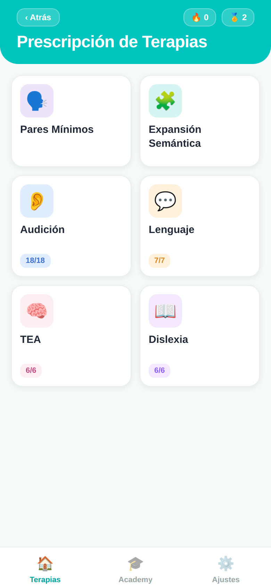</a><br><sub><b>Hub</b><br>Lúa arriba y los diez bloques</sub></td>
<td width="25%" align="center"><a href="docs/screenshots/31-sensorial-lista.png">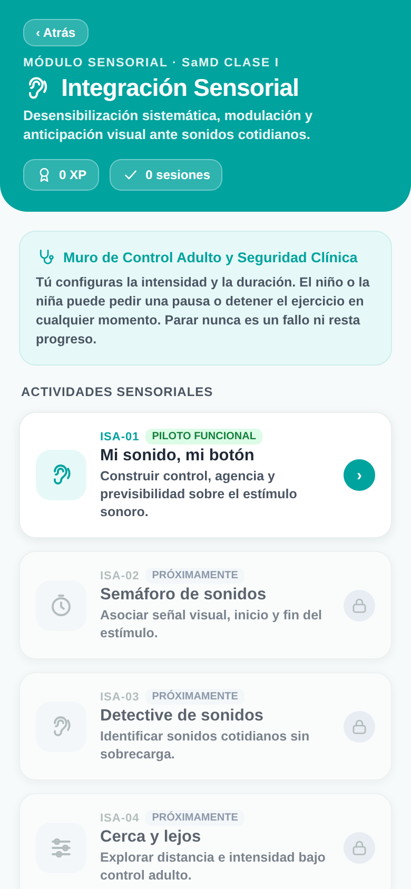</a><br><sub><b>Integración Sensorial</b><br>Muro de control adulto</sub></td>
<td width="25%" align="center"><a href="docs/screenshots/34-sensorial-exposicion.png">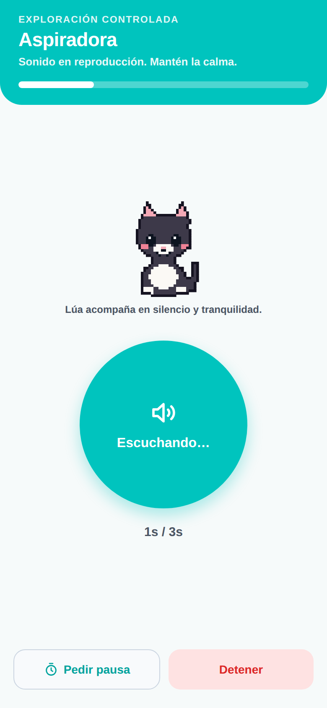</a><br><sub><b>Exposición</b><br>El botón del niño, Lúa muda</sub></td>
<td width="25%" align="center"><a href="docs/screenshots/38-brujula-intro.png">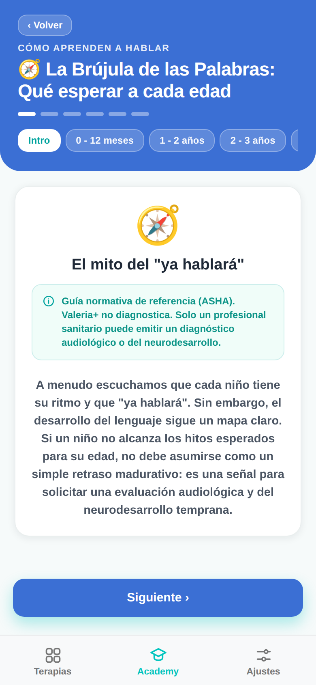</a><br><sub><b>La Brújula</b><br>Hitos ASHA de 0 a 5 años</sub></td>
</tr>
<tr>
<td align="center"><a href="docs/screenshots/08-pares-juego.png">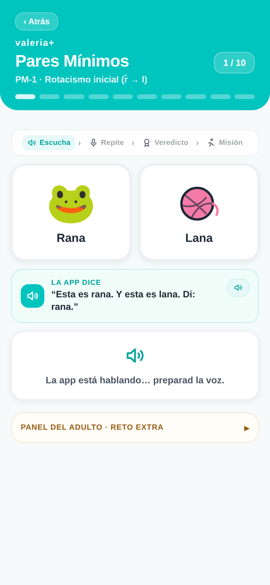</a><br><sub><b>Pares Mínimos</b><br>Dos fichas y la consigna</sub></td>
<td align="center"><a href="docs/screenshots/12-expansion-juego.png">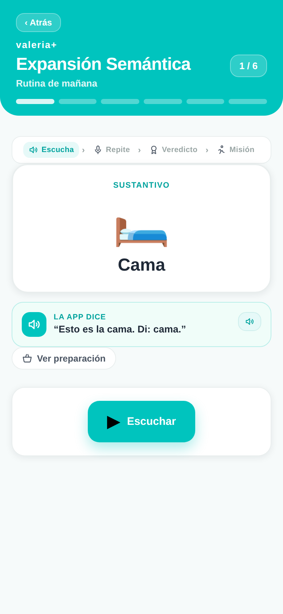</a><br><sub><b>Expansión Semántica</b><br>Imagen, voz y acción física</sub></td>
<td align="center"><a href="docs/screenshots/27-academy-hub.png">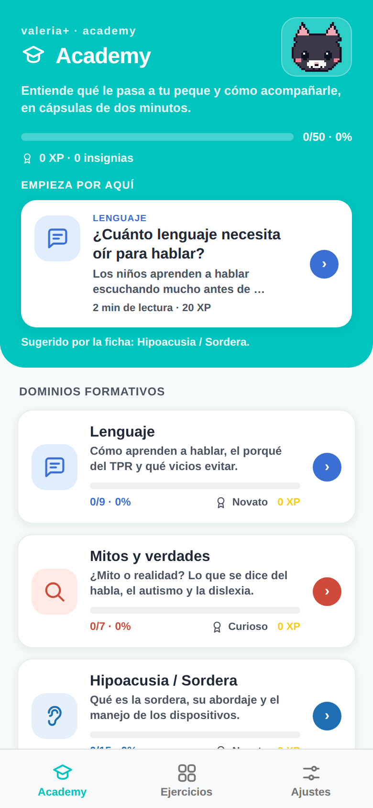</a><br><sub><b>Academy</b><br>Un silo de XP por dominio</sub></td>
<td align="center"><a href="docs/screenshots/20-resultados.png">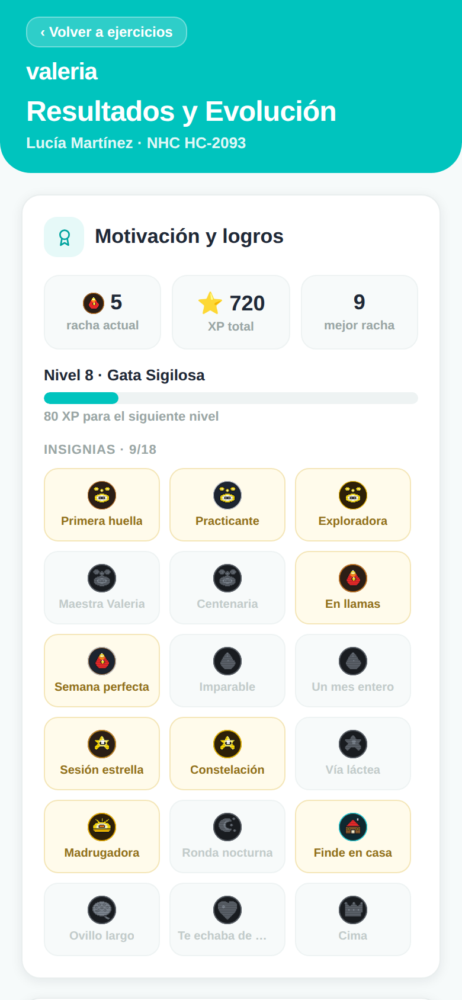</a><br><sub><b>Resultados</b><br>Motivación y adherencia</sub></td>
</tr>
<tr>
<td align="center"><a href="docs/screenshots/15-ling-test.png">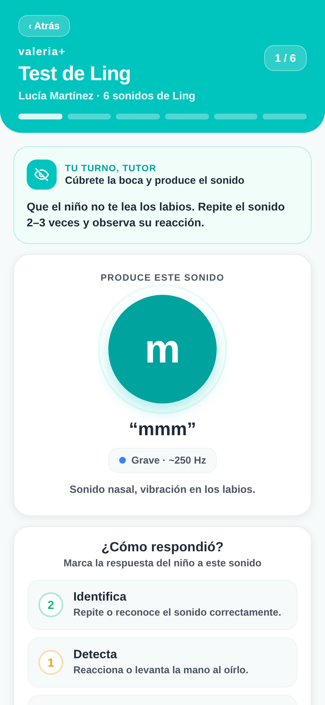</a><br><sub><b>Test de Ling</b><br>Seis sonidos antes de audición</sub></td>
<td align="center"><a href="docs/screenshots/23-panel-adulto.png">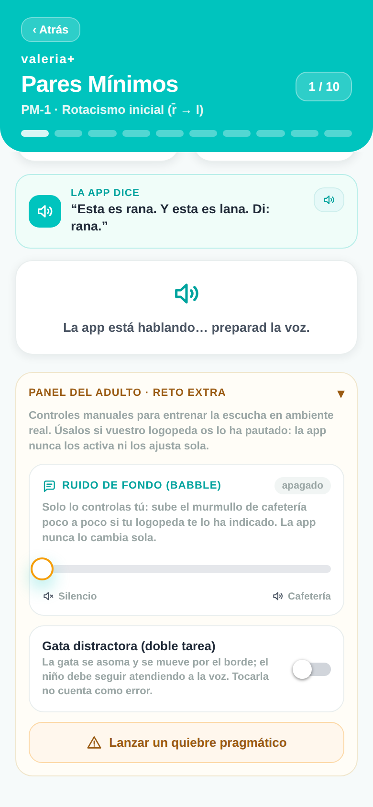</a><br><sub><b>Panel del Adulto</b><br>Estresores siempre manuales</sub></td>
<td align="center"><a href="docs/screenshots/25-premios.png">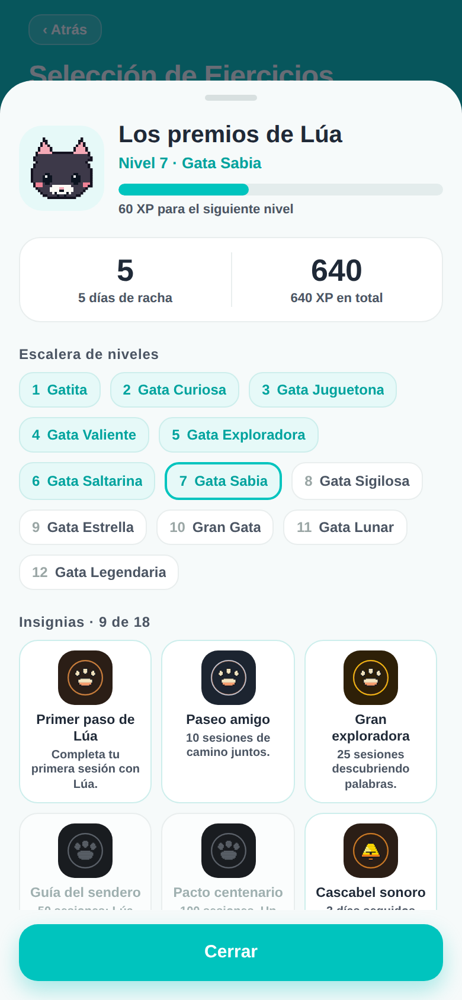</a><br><sub><b>Premios</b><br>Nivel, racha e insignias</sub></td>
<td align="center"><a href="docs/screenshots/armario-lua.png">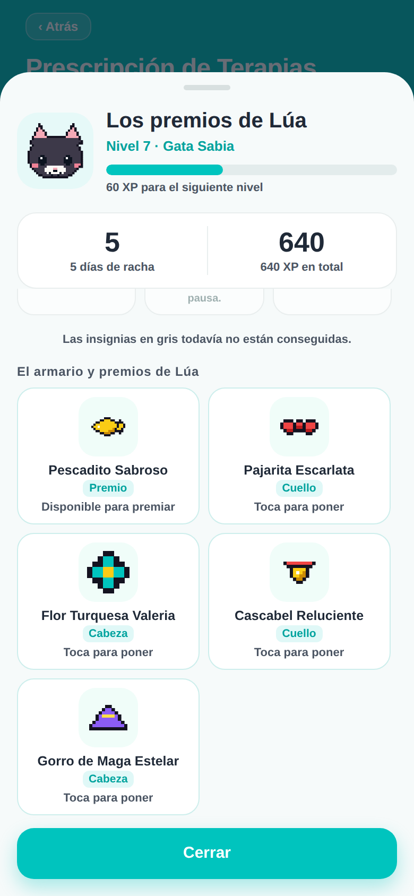</a><br><sub><b>Armario</b><br>Lo que lleva puesto viaja al aparato</sub></td>
</tr>
</table>

> **Cómo se regeneran.** Con la app servida en `localhost:8081`:
> ```bash
> npm install --no-save --legacy-peer-deps \
>   react-native-web@~0.21.0 react-dom@19.1.0 @expo/metro-runtime@~6.1.1 playwright
> BROWSER=none npx expo start --web --port 8081 --clear
> node docs/capture-screenshots.js
> CHROMIUM_PATH=/opt/pw-browsers/chromium-1194/chrome-linux/chrome \
>   OUT_DIR=docs/screenshots node docs/capture-pizarra.js   # los 18 trazos
> ```

---

## 🧩 Bloques de ejercicios

La tabla va **en el mismo orden que el hub**: Integración Sensorial abre la
rejilla y Realidad Aumentada la cierra. No es cosmético: la sensorial es lo que
se prescribe antes de que el niño pueda sostener el resto —si la aspiradora le
desborda, no hay sesión de pares mínimos que aguante— y la RA es la única
tarjeta que puede no aparecer, porque depende del aparato.

| Bloque | Para qué sirve |
| --- | --- |
| 🎧 **Integración Sensorial Auditiva** (6 actividades) | Desensibilización sistemática para sobre-responsividad acústica (SOR). El adulto elige el estímulo, la intensidad relativa (1-5) y la duración (3, 7 o 15 s) **antes** de ceder el aparato; el niño lo dispara con su propio botón y puede pararlo en cualquier momento sin perder progreso. Once estímulos **sintetizados en el repositorio** —ocho aparatos y alertas, y tres ambientes: aula, centro comercial y calle con obras— por `scripts/generate-sensory-assets.js`: ni una grabación de terceros, ni una licencia que revisar. Las seis actividades están abiertas y **cuáles practica la familia lo decide el logopeda con el PIN profesional**, igual que en los demás bloques prescribibles; comparten el muro adulto: cada una llega configurada con su estímulo, su intensidad y su duración de partida (ISA-02 arranca el sonido con la cuenta atrás; ISA-05 y ISA-06 abren en ambiente de aula). Lúa acompaña muda y quieta, en la tableta y en el cristal del aparato. |
| 🐱 **Aventuras con Lúa** (105 actividades) · [captura](docs/screenshots/43-aventuras-lua-ficha.png) | El material de *Lúa y las Palabras* llevado a la app, en tres secciones y seis franjas de edad (0‑2 · 2‑3 · 3‑4 · 4‑5 · 5‑7 · 7‑10): **25 juegos de selección** (memorama, imagen‑palabra, cazador de sonidos, secuencias, clasificación, atención, completar palabra, pistas progresivas), **60 preguntas** del banco por edad, **10 cuentos** universales con comprensión y vocabulario ilustrado ([captura](docs/screenshots/50-aventuras-lua-cuento-ilustrado.png)), y **10 canciones** de ritmo y praxias. El léxico sale de la *Matriz de Contenidos por Edad*: mango, lechosa, chinola, guineo, coco, la palma, el coquí, la tambora. Cada ítem distingue lo que **toca el niño** (opciones con pictograma del banco propio, porque por debajo de 4 años no se lee) de lo que **observa el adulto** (hoja de registro, que no se locuta). Al fallar suena una devolución dirigida al niño, nunca la pauta clínica del terapeuta. Contenido de pantalla y locución **solo en castellano** de momento, y eso incluye la VOZ: en una sesión en galego, euskera, català o inglés el módulo suena con Sharvard (el banco castellano pregenerado), no con la voz de la variedad. Hasta el 4/9/2026 sonaba al revés —Celtia o HiTZ pronunciando palabras castellanas—, que sobre un estímulo clínico de discriminación es fonética equivocada. Lo sujeta `scripts/check-lua-voice-language.js`. |
| 🗣️ **Pares Mínimos** | Dislalias fonológicas (rotacismo, sigmatismo, frontalización velar, f→p). 15 pares casi iguales (rana/lana) en 6 grupos —añade nasales y laterales— con juego de voz, misión física y sello doble padre‑hijo. |
| 🧩 **Expansión Semántica** | Progresión léxica para intervención temprana, en cuatro bloques: 5 **escenarios** diarios, 5 **categorías léxicas** con progresión de dificultad, 9 **progresiones** de campo semántico (concepto → parte → acción → cualidad) y 8 **cápsulas de contraste** con doble vuelta (comprensión por selección de imagen + producción). Cada actividad empieza por una **antesala** con el material necesario. |
| 👂 **Audición** (18 ejercicios) | Protocolo ACOPROS: fonética‑fonología, semántica, morfosintaxis, pragmática y **escucha en ruido** (RA‑1…RA‑5) para audífono, implante coclear o hipoacusia. |
| 💬 **Lenguaje** (7 ejercicios) | Protocolo familiar: atención conjunta, imitación, comprensión, expresión, comunicación funcional, regulación e interacción social. |
| 🧠 **TEA** (6 ejercicios) | PRT + TCC: atención conjunta triangulada (Time Delay + Sello Doble), quiebre pragmático con consentimiento, espejo asimétrico, transición interrumpida, categorización bajo ruido y múltiples señales simultáneas. Todos los estresores son **manuales** (Panel del Adulto). |
| 📖 **Dislexia** (6 ejercicios) | Fonología y acceso léxico: intruso fonológico auditivo puro, rastreo léxico con interferencia, síntesis fonémica rítmica (latencia 500 ms + Juez), criba de pseudopalabras (máx. 5 ensayos), rastreo visual de rotaciones b/d · p/q con mapa de misclicks y denominación rápida (RAN). |
| ✏️ **Grafomotricidad y Escritura** (18 trazos) · [letra](docs/screenshots/40-pizarra-magica.png) · [lazo](docs/screenshots/40b-pizarra-lazo.png) | La **Pizarra Mágica de Lúa**: continuación motora de Dislexia. Trazado guiado sobre lienzo SVG con dedo o lápiz óptico, pauta Montessori regulable y **puntos de control numerados** que fijan el ORDEN del trazo, que es lo que evita la inversión b/d y p/q: en la `b` el palo baja primero y la barriga abre a la derecha; en la `d` el óvalo va antes. Doce letras críticas en seis contrastes cerrados —b↔d, p↔q, m↔n, n↔u, a↔e, s↔z, más la g contra la q: cada letra confundible tiene a su par en el mismo banco—, seis lazos de calentamiento (olas, bucles, picos, puentes, caracol y ocho tumbado, uno por destreza motora) y pizarra libre. La geometría la verifica `scripts/check-writing-bank.js`: que cada punto numerado caiga sobre el trazo y en el sentido en que se escribe es justamente lo que el typecheck no puede ver. El contenido de pantalla está **solo en castellano** de momento; lo que la pizarra PRONUNCIA sí está en las cinco variedades: los tres elogios (`escritura/elogio`) y el nombre de cada una de las 12 letras (`escritura/letra`), que hasta ahora caía a la voz del sistema. |
| 🎯 **Realidad Aumentada** (6 ejercicios · solo Android) | **Gamificación Condicionada**: la cámara frontal deja de grabar y pasa a ser un sensor de conducta motora, y el refuerzo 3D se dispara **solo** por el gesto objetivo, nunca por acierto acústico ni por paso del tiempo. Cinemática orofacial con el **micrófono apagado** (AR‑1), localización del sonido instrumentada —la versión con cronómetro de RA‑5— (AR‑2), selección semántica por fijación de la mirada sin motricidad fina (AR‑3), búsqueda espacial de Lúa (AR‑4), lanzamiento y captura (AR‑5) y espejo mímico (AR‑6). Sobre **ARCore**, con MediaPipe aportando los blendshapes que ARCore no da. Ningún fotograma se graba ni sale del teléfono. La tarjeta solo aparece si el teléfono supera la **Prueba de Aptitud del Dispositivo**. |

El **Test de Ling** (6 sonidos) precede a los ejercicios de audición cuando el
paciente usa audífono o implante, y la **gamificación** (XP, racha 🔥, niveles e
insignias) mantiene la motivación en todos los bloques.

> [!TIP]
> **Rondas y sesiones.** Cada mini‑juego de Audición y Lenguaje rota hasta 3
> contenidos («🔄 Otra ronda») y puede encadenarse en una «🎯 Sesión completa».

Además, cada mini‑juego de Audición y Lenguaje **rota hasta 3 contenidos**
distintos ("🔄 Otra ronda"), encadenables en una **"🎯 Sesión completa"** por
bloque, con pausas activas unificadas entre ejercicios (`ValeriaSessionBreakOverlay`):
alternan la **cápsula TPR clásica** ("escucha y muévete") y la **Ruta de Rutina
TPR 2.0** (morfosintaxis transaccional).

> [!NOTE]
> **Frases portadoras retiradas del flujo (v9.1).** Hasta la v9, la palabra
> objetivo de Pares Mínimos se incrustaba en una frase generada por un motor
> combinatorio. Al resolver **DC‑5**, las logopedas de ACOPROS fijaron otra
> consigna estándar: **presentación del par + repetición del objetivo**
> («rata… lata… dime: rata»). El módulo `valeriaCarrierPhrases` se conserva por
> si se recupera como modo avanzado, pero **no se enumera en el corpus de voz ni
> se locuta**.

---

## 🎧 Integración Sensorial Auditiva

Para el niño que se tapa los oídos con la aspiradora, el secador o el timbre del
colegio: **sobre-responsividad auditiva (SOR)**. El módulo hace
desensibilización sistemática con anticipación visual estricta y agencia del
niño, y su regla clínica es que **parar nunca resta**: pausar o detener suma la
misma XP que terminar.

<table>
<tr>
<td width="25%" align="center"><a href="docs/screenshots/32-sensorial-preparacion.png">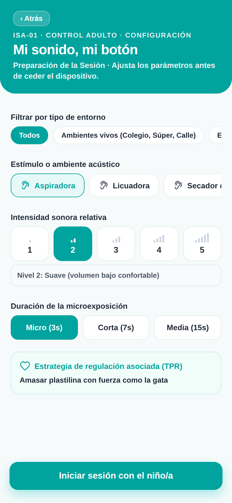</a><br><sub><b>1 · El adulto configura</b><br>Estímulo, intensidad y duración<br><i>antes</i> de ceder el aparato</sub></td>
<td width="25%" align="center"><a href="docs/screenshots/33-sensorial-anticipacion.png">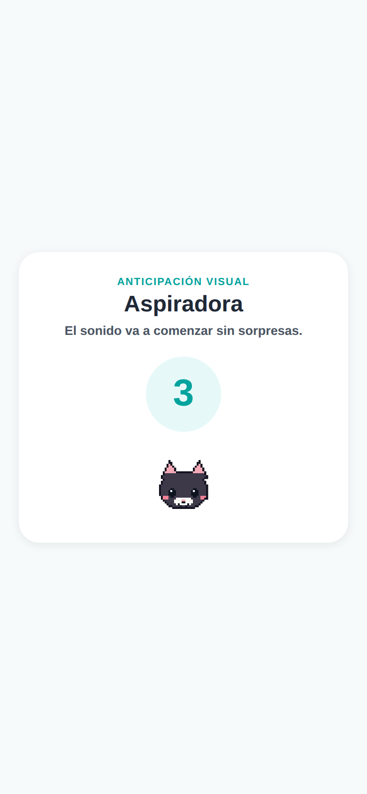</a><br><sub><b>2 · Anticipación</b><br>Cuenta atrás visual:<br>el sonido no sorprende</sub></td>
<td width="25%" align="center"><a href="docs/screenshots/35-sensorial-pausa.png">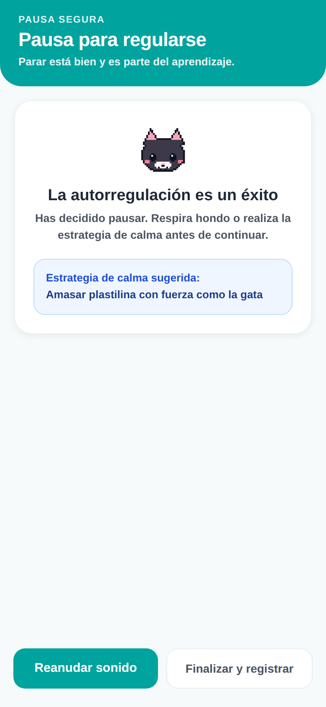</a><br><sub><b>3 · Pausa segura</b><br>Parar es aprendizaje,<br>no un fallo</sub></td>
<td width="25%" align="center"><a href="docs/screenshots/36-sensorial-valoracion.png">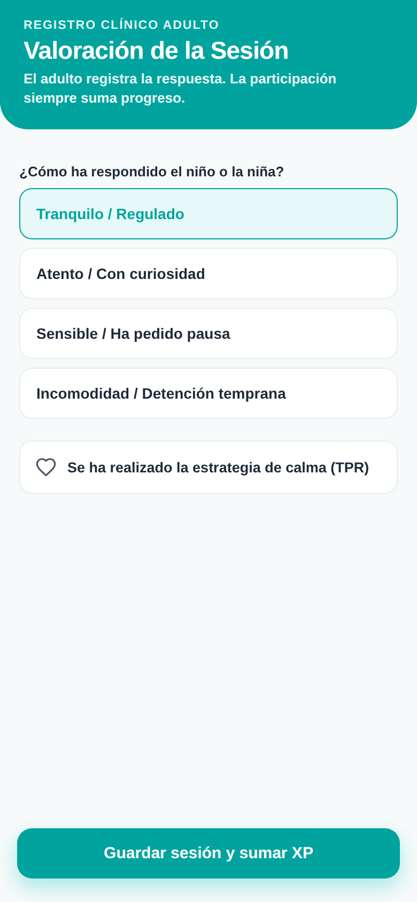</a><br><sub><b>4 · Registro clínico</b><br>El adulto anota la respuesta<br>(cifrado en el dispositivo)</sub></td>
</tr>
</table>

### Los once estímulos están sintetizados, no grabados

No hay ni una grabación de terceros: los genera
[`scripts/generate-sensory-assets.js`](scripts/generate-sensory-assets.js) con
DSP determinista en Node —el mismo motor que el ruido babble de
[`generate-babble.js`](scripts/generate-babble.js)—, y salen mono 16 kHz / 16 bit,
en bucle sin costura, **2,50 MB** los once.

| | Estímulos |
| --- | --- |
| **Aparatos** | Aspiradora · Licuadora · Secador de pelo · Secador de manos |
| **Alertas y naturaleza** | Sirena · Petardos · Timbre escolar · Tormenta |
| **Ambientes vivos** | **Aula de colegio** (la maestra por encima del murmullo, sillas que arrastran, risas de grupo, un libro que cae) · **Centro comercial** (rueda de carrito que chirría, pitidos de caja, megafonía que no se entiende) · **Calle con obras** (martillo neumático, golpes de maza sobre viga, radial y el pitido de marcha atrás de un camión) |

Se sintetizan por tres razones que no son estéticas:

1. **Procedencia.** El expediente técnico MDR tiene que poder decir de dónde
   sale cada estímulo que se le presenta a un niño. De un banco de sonidos no se
   puede; de un script del repositorio, sí.
2. **Licencia.** Cero terceros, cero atribución, cero revisión legal por sonido.
3. **Reproducibilidad.** LCG con semilla por estímulo: el WAV de hoy es el de
   ayer, byte a byte, y CI puede comprobarlo.

Todos salen a **−20 dBFS de RMS** con techo de pico en −6, no solo normalizados
por pico. Es una decisión clínica: si un estímulo viniera 16 dB por encima de
otro, el «nivel 3» que fija el adulto significaría cosas distintas según el
sonido y la jerarquía de desensibilización dejaría de ser una jerarquía.

```bash
npm run build:sensory-assets   # regenerar los once WAV
npm run check:sensory-assets   # el gate que corre CI
node scripts/check-sensory-assets.js --report   # las medidas, una línea por estímulo
```

### El gate que impide que el módulo vuelva a ser mudo

[`scripts/check-sensory-assets.js`](scripts/check-sensory-assets.js) va en
`android.yml` y comprueba, sobre los WAV que entran en el APK: que cada
`audioAssetKey` del catálogo tiene fichero y que no sobra ninguno; formato, RMS
y headroom; la **costura del bucle** —un clic en exposición es un transitorio
nuevo, justo lo que dispara al niño que tratamos—; la **identidad espectral** de
cada sonido, para que un ruido blanco cualquiera no pase por aspiradora; y, en
los tres ambientes, un **contador de sucesos vivos**: al menos 8 transitorios
por vuelta y que el mayor sobresalga 12 dB sobre el lecho. «Ambiente vivo» no es
una etiqueta, es algo que rompe el build.

Lo que el gate **no** puede comprobar, y por eso está escrito en su cabecera: si
a un oído humano le suena a aspiradora. Eso se decide escuchando el WAV.

### Muro de control adulto y muro regulatorio

El adulto fija el estímulo, la **intensidad relativa** (1 a 5) y la duración
(3, 7 o 15 s) antes de darle el aparato al niño; el niño lo dispara con su
propio botón y lo para cuando quiera. En
[`sensoryAudio.ts`](src/ValeriaSensory/sensoryAudio.ts) **no hay medida, ni
adaptación, ni sugerencia de nivel**: la ganancia sale del gesto del adulto y de
nada más, igual que en [`valeriaNoise.ts`](src/valeriaNoise.ts). Automatizarla
convertiría el ejercicio en un procedimiento adaptativo y a la app en otra clase
de producto.

Los niveles **no son decibelios absolutos** y la interfaz no los llama así: el
volumen real depende del aparato y de dónde esté el teléfono. Y si el
dispositivo no puede sacar sonido —Expo web, builds sin el módulo nativo—, la
pantalla **lo dice** en vez de rotular «Sonido en reproducción» sobre el
silencio.

### Lúa acompaña haciendo menos

Es el primer módulo donde la gata tiene que hacer **menos**, no más: el niño
está atendiendo a un sonido que le desborda y una mascota animándose al lado es
una segunda fuente de estimulación. Por eso
[`valeriaLuaSession.ts`](src/valeriaLuaSession.ts) manda `GRANT` **solo visual**
—nunca `LUA_CAP.SOUND`: un aparato que además sonara sería una segunda fuente
sin control de intensidad—, **ni un opcode** durante la exposición, y `RELAX` en
la pausa, que es literalmente el mismo descanso de la regla 20‑20‑20. Sin
opcodes nuevos: el protocolo sigue en la versión 1.

---

## 🎓 Academy · formación del cuidador

En los ejercicios auditivo‑verbales el **adulto es el motor clínico** de cada sesión
(requisito **MDR**: la app nunca decide sola). **Academy** (`src/ValeriaAcademy/`)
capacita a padres y cuidadores para que acompañen como profesionales, mediante
**Cápsulas de Conocimiento** de consumo rápido (≈2 min) con **micro‑quiz** de
validación ágil. Es **la pestaña con la que abre la app** y además se muestra
como una **tarjeta prominente** en el hub de `ExerciseSelection`, con la misma
jerarquía visual que los bloques de ejercicios y una **barra de progreso que se
actualiza en tiempo real**.

Los títulos de las cápsulas son **preguntas** («¿A qué edad se aprende cada
sonido?»), que es como llega la duda de una familia: se buscan por lo que a uno
le preocupa, no por el nombre técnico del concepto.

El hub es **multidominio**: cada dominio mantiene su propio silo de XP, nivel e
insignias, y el progreso nunca se mezcla entre ellos.

### La Brújula de las Palabras · hitos ASHA de 0 a 5 años

La cápsula que abre el dominio de Lenguaje. Recorre los hitos normativos por
tramos de edad —0‑12 meses, 1‑2, 2‑3, 3‑4 y 4‑5 años— separando en cada uno
**lenguaje receptivo** (lo que comprende) de **lenguaje expresivo** (lo que
produce), que es la distinción que un cuidador no suele tener y sin la cual «no
habla» tapa el problema real.

Empieza desmontando el «ya hablará» y lleva el *disclaimer* clínico visible en
la primera pantalla: es **guía normativa de referencia, no un cribado**, y solo
un profesional sanitario emite un diagnóstico. 30 XP al silo de Lenguaje y
micro‑quiz de respuesta razonada.

<table>
<tr>
<td width="50%" align="center"><a href="docs/screenshots/38-brujula-intro.png"></a><br><sub>El mito del «ya hablará», con el disclaimer siempre visible</sub></td>
<td width="50%" align="center"><a href="docs/screenshots/39-brujula-etapa.png">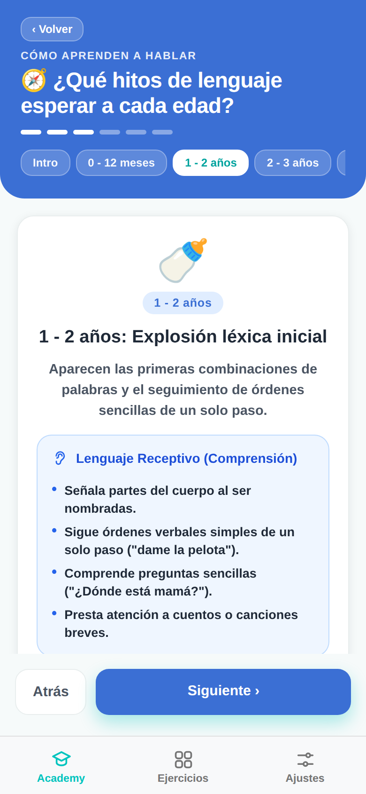</a><br><sub>Cada tramo, con receptivo y expresivo en bloques distintos</sub></td>
</tr>
</table>

| Dominio | Qué enseña |
| --- | --- |
| 💬 **Lenguaje** | El baño de lenguaje (input antes que producción), la conversación por turnos (*serve and return*), por qué el TPR consolida, los vicios a evitar —**remodelar** (*recast*) en vez de corregir y comentar más que preguntar— y **La Brújula de las Palabras**: los hitos ASHA de 0 a 5 años, con lenguaje receptivo y expresivo separados en cada tramo de edad y navegación por etapas. Es guía normativa de referencia, no un cribado: la cápsula lo dice en su primera pantalla. |
| 👂 **Hipoacusia / Sordera** | Qué es la sordera, su abordaje y el manejo de los dispositivos (audífono, implante coclear, osteointegrado) en micro‑guías. |
| 🗣️ **Dislalias** | Puntos de articulación y práctica de los sonidos difíciles. |
| 🔤 **Dislexia** | Conciencia fonológica y apoyo a la lectura emergente. |
| 🧩 **TEA** | Comunicación, anticipación y regulación en el espectro autista. |
| 🤟 **Lengua de Signos (LSE)** | Qué es la LSE y por qué no es mímica, si signar retrasa el habla, de qué está hecho un signo, el **alfabeto dactilológico completo** (27 configuraciones dibujadas, con panel de consulta de una sola pantalla), los primeros signos útiles y dónde se aprende de verdad. |

> [!IMPORTANT]
> **Sobre el módulo de LSE.** Un signo combina configuración de la mano, lugar,
> orientación y **movimiento**, más expresión facial; un dibujo estático captura
> los tres primeros. El módulo enseña lo que sí es enseñable así —el alfabeto
> dactilológico, cuyas configuraciones son posturas fijas— y para el léxico
> signado **remite a fuente signada**: vídeo, curso oficial y, sobre todo,
> personas sordas signantes. Lo dice en pantalla, no solo en el código.
> Contenido y **las 27 configuraciones del abecedario dactilológico**,
> validados por personas sordas signantes: las nueve iniciales por una persona
> sorda signante y las 18 restantes por **la logopeda y las personas sordas de
> ACOPROS**. Esa revisión es insustituible —un chequeo automático comprueba que
> un dibujo exista, nunca que se reconozca como la letra que dice ser—, así que
> toda figura nueva vuelve a pasar por ella. Las cuatro letras con movimiento
> (J, Ñ, X, Z) se marcan con ↻ y remiten a vídeo.

- **Gamificación funcional por dominio**: XP, niveles con nombre propio de cada
  silo (Novato → *Experto en Hipoacusia*, *Experto en LSE*…) e insignias
  (`📘 Primer paso`, `📗 A medio camino`, `🎓 Dominio experto`, `💯 Sin fallos`).
- **Persistencia cifrada offline**: el progreso se guarda con `valeriaCrypto`
  (JSON cifrado en reposo sobre `AsyncStorage`, clave `STORAGE_KEYS.academy`),
  igual que la telemetría del piloto.
- **Lectura O(1) sin re‑renders**: el resumen para el hub se sirve desde una
  capa en memoria con `useSyncExternalStore` (`academyStore`); completar una
  cápsula re‑renderiza **solo** la tarjeta de Academy, nunca el resto del hub ni
  la navegación. El encuadre operativo lo permite: el adulto maneja los menús y
  solo cede la tableta cuando el ejercicio ya ha empezado.

---

## 🐈‍⬛ Lúa · la mascota y la marca

<div align="center">

</div>

**La mascota de Valeria+ es Lúa, una gata negra tipo *smoking*, dibujada en
píxel art.** Es la mascota desde la v12, y lo es en todas partes: hub,
bienvenida, créditos, celebración de sesión, distractor de doble tarea, nombres
de nivel, icono de la app y pantalla de arranque.

| Dónde aparece | Qué se ve |
| --- | --- |
| **Hub** | Lúa entera y **acariciable**, compartiendo tarjeta con el nivel, la barra de XP y la racha. Toca la placa y ronronea; el botón le da un pescadito; y si tiene un premio sin gastar, **lo piensa** en una burbuja. Una sola tarjeta: la mascota y la tira de juego pintaban cada una su gata y se veían dos |
| **Premios** (`ValeriaAwardsSheet`) | «Los premios de Lúa»: 12 niveles, 18 insignias y **el armario**: cinco coleccionables (pescadito, pajarita, flor, cascabel y gorro de maga) que se desbloquean con sesiones, racha y nivel, y se le ponen a la gata |
| **Nombres de nivel** | **Gatita → Gata Curiosa → … → Gata Lunar → Gata Legendaria** (12 niveles) |
| **Doble tarea** (`ValeriaDistractorCat`) | La misma gata como distractor periférico. El Panel del Adulto lo llama **«Gata distractora»** |
| **Calentamiento de Realidad Aumentada** | «mirar a Lúa, seguirla a las esquinas» |
| **Icono, icono adaptativo y splash** | La cara de Lúa (`assets/icon.png`, `adaptive-icon.png`, `splash.png`) |

Las **tarjetas de bloque** del hub llevan el tinte de su acento como **fondo**
—seis tarjetas blancas con un icono de color leían como una lista— y una línea
de qué trabaja el bloque bajo el título. La cifra de ejercicios prescritos va en
**tinta sobre blanco**, no teñida: en el color del bloque no llegaba al mínimo
de contraste AA en ninguno de los seis (2,76 el naranja de Lenguaje). Medido,
no estimado.

### Los gestos y los accesorios salen de la misma rejilla

Las caras (reposo, parpadeo, caricia y boca abierta) y los cinco coleccionables
se dibujan en [`src/components/lua/luaPixelSegments.ts`](src/components/lua/luaPixelSegments.ts)
**sobre las coordenadas de SIT**, la matriz canónica. Dos reglas que costaron una
revisión entera y que conviene no volver a saltarse:

- **Toda fila mide 32.** Una de 33 desplaza los rasgos un píxel y saca el
  contorno de la silueta: se ve un bulto en un solo renglón.
- **Los ojos cerrados se dibujan con color, nunca con `.`** El transparente abre
  un agujero por el que se ve la placa a través de la cabeza.
- Los accesorios de cabeza se centran en el **eje de las orejas (columna 16,5)**,
  no en el de la cabeza: las orejas de SIT van de la columna 8 a la 25 y un
  adorno centrado en la cabeza se apoya en la oreja izquierda.

El mismo dibujo sirve de icono en el armario —recortado a su propia caja, para
que llene la placa— y de capa sobre la gata, expandido a la rejilla completa. No
hay dos versiones que se puedan desincronizar.

**Y desde el 19/8/2026, tampoco una tercera.** Cada accesorio que se lleva puesto
declara además un `device: { row, col }`: su esquina en la rejilla de 32×26 del
periférico, donde la gata se ve solo de cabeza. El dibujo es uno y viaja copiado
—`tools/build-accessories.js` en el repositorio del firmware—; lo único propio de
cada superficie es dónde se ancla, porque en el hub la gata está sentada. Un
anclaje único descolocaría una de las dos poses; dos dibujos las separarían para
siempre.

### Un solo sprite, cero PNG a mano

El dibujo vive en [`src/ValeriaCatPixel.tsx`](src/ValeriaCatPixel.tsx) como una
**rejilla de caracteres** que se pinta como rectángulos de 1×1 en un `viewBox`:
escala a cualquier tamaño sin perder el borde duro, y un mapa de texto **se
revisa en el diff**; un PNG no. Dos poses, elegidas por el propio componente:
**cabeza sola** por debajo de 90 px (a ese tamaño la cara de cuerpo entero se
emborrona) y **cuerpo entero** por encima.

Los cuatro bitmaps de marca se **generan** desde ese mismo sprite:

```bash
npm run build:brand   # → assets/icon.png · adaptive-icon.png · splash.png · docs/lua-mascota.png
```

Si mañana cambia el sprite, se vuelve a correr y los cuatro salen iguales: nadie
redibuja ni exporta a mano. El lado del píxel es **entero** en los tres assets
(20, 16 y 12 px) —con un lado fraccionario el antialias parte las filas del
dibujo—, y el icono adaptativo de Android se dibuja a 512 px dentro del lienzo
de 1024 porque el sistema recorta a círculo o *squircle* y a tamaño completo el
recorte le comía las orejas.

### Copiar a Lúa a otro proyecto (VIA+, o el que venga)

**Lee esto antes de copiar nada.** Lúa es de los dos productos, así que este
repositorio es su fuente. Copiar «lo que parezca la mascota» ya ha salido mal:
lo que hay que llevarse son **tres ficheros y nada más**.

| Llévate | Para qué |
| --- | --- |
| [`src/ValeriaCatPixel.tsx`](src/ValeriaCatPixel.tsx) | **El sprite y el componente.** Es la fuente única: la rejilla, la paleta y las dos poses. Solo necesita `react-native-svg` |
| [`scripts/build-brand-assets.js`](scripts/build-brand-assets.js) | Genera los PNG de marca **desde ese fichero**. Ajusta las rutas de salida a tu proyecto |
| [`scripts/check-brand-consistency.js`](scripts/check-brand-consistency.js) | El gate. Sin él, la copia se desfasa igual que se desfasó aquí |

**Lo que NO debes copiar, y por qué:**

- **Ningún PNG.** Ni `assets/icon.png`, ni el splash, ni el icono de iOS. Son
  **salidas**, no fuentes: se generan con `npm run build:brand`. Copiar el PNG
  es exactamente cómo se propagan las láminas viejas.
- **Nada que se llame como la mascota anterior.** Si al copiar te encuentras un
  identificador, un fichero o un texto con el oso, **no lo lleves**: es un
  defecto de esta casa que estás a punto de exportar.
- **El copy de los ejercicios.** «Gata distractora» y compañía es contenido
  clínico de Valeria+, no marca. VIA+ tiene el suyo.

**Después de copiar, corre el gate en el proyecto destino.** Si pasa, la copia
está bien; si no, te dice qué falta. Es la única forma de saberlo sin depender
de que alguien mire.

### La gata de la app y el aparato Lúa son el mismo personaje

**Lúa** nombra también el **periférico físico** de refuerzo sobre ESP32‑C3
([`docs/plan-integracion-lua.md`](docs/plan-integracion-lua.md), `firmware/lua/`,
`src/valeriaLuaProtocol.ts`). No son dos cosas con el mismo nombre: el panel del
aparato es de **240×240**, o sea que el píxel art es su formato nativo, y **la
cara del aparato sale de la misma rejilla que la de la app**. Un solo dibujo,
dos superficies.

**Y desde el 19/8/2026 el aparato existe de verdad**, no en un plano: la placa
redonda (ESP32‑2424S012 con panel GC9A01) compila, se flashea y pinta el catálogo
entero a **27 fps** en su disco de 32 mm, con los pines confirmados. El informe está
en el `main` del firmware, en `docs/validacion_hardware_v1_esp32c3.md`.
Sigue sin medirse la mitad que importa para esta app —**la latencia p95 de
extremo a extremo por Bluetooth**, que es el criterio del §4 del plan—, porque
aquella sesión gobernó el aparato en local. Y la capa de compañía de aquí abajo
—`MOOD`, `ACCESSORY`— es **posterior**: en el cristal no ha estado nunca.

**Y desde el 14/8/2026 no es solo la cara.** Los **120 pictogramas de ficha y
las 9 insignias** son también el mismo dibujo en los dos sitios: matrices de
píxel art de 24×24 que viven en [`src/ValeriaPixelArt.ts`](src/ValeriaPixelArt.ts)
—la fuente única— y que el firmware **copia**, igual que copia el sprite de la
gata y la tabla de opcodes. Se dibujaron en el repositorio del firmware y
**subieron** aquí; es la única vez que un activo ha ido en esa dirección.

Eran 66 hasta la reforma voxel: los 66 se redibujaron con sombra y luz —la
paleta pasó de 21 colores a 33— y detrás entraron **54 fichas nuevas**, con el
léxico dominicano de la *Matriz de Contenidos por Edad* (*tambora*, *maracas*,
*mango*, *lechosa*, *chinola*, *coco*, *palma*, *bandera*, *coquí*) y seis caras
de emoción. **Los índices de los 66 primeros no se han movido**, que es la
condición que no se puede romper: por el cable viaja la posición, y hay aparatos
ya flasheados.

> [!NOTE]
> **Sincronizadas el 4/9/2026.** Este aviso decía que las nueve insignias
> estaban desincronizadas —el rediseño del 25/8/2026 y luego la reforma voxel se
> quedaron aquí y en el cristal seguían los dibujos viejos—. Ya han bajado, junto
> con los 120 pictogramas y los doce colores nuevos de la paleta, y lo enseña el
> gate del otro repositorio: `make check VALERIA=../Valeria` da
> «✓ el arte del ejercicio es el de Valeria+ · 120 pictogramas, 9×5 insignias» y
> «✓ la paleta de las matrices coincide · 33 colores».
>
> Lo que **sigue siendo verdad** y por eso se queda escrito:
> `check-lua-mascot-mirror.js` **no** vigila los glifos de premio —solo `MOOD` y
> `ACCESSORY`—, así que quien detecta esta divergencia es un gate del repositorio
> del firmware y no uno de aquí. Un rediseño que no se baje volverá a pasar
> desapercibido **desde este lado**. Ver
> [`docs/pizarra-magica-e-insignias.md`](docs/pizarra-magica-e-insignias.md).

Importa porque es la razón de ser del aparato: **el niño mira a la mascota, no a
la tableta**. Un estímulo que se ve de una forma en el cristal y de otra en la
pantalla no es un espejo. Por el cable no viaja el dibujo sino **su índice**
—`PICTO(37)`, nunca «cuchara sucia»—, que es la garantía estructural de Zero‑PHI:
el protocolo no tiene campo de texto.

#### La mascota también, no solo el dibujo (D‑N, 19/8/2026)

Hasta hace nada el espejo era **el dibujo**: la misma gata, los mismos
pictogramas, las mismas insignias. Y aun así las dos mascotas se separaron, sin
que fallara ningún gate: el 18/8/2026 la del hub aprendió a **ronronear** cuando
la acarician, a **comer** el premio y a llevar puesto lo del **armario**, y la del
aparato —que desde la placa V2 responde al dedo en el cristal— no se enteró de
nada. Dos comportamientos distintos con la misma cara. Eso el niño lo nota y una
comparación de píxeles no.

Lo que lo cierra son dos opcodes que no inventan nada: los dos espejan algo que la
tableta ya hacía.

| Opcode | Qué manda | Qué espeja |
| :--- | :--- | :--- |
| `MOOD` `0x0B` | estado de compañía 0‑4 | `LuaAffectState` de la tarjeta del hub: serena · antojo · ronroneo · comiendo · celebrando |
| `ACCESSORY` `0x0C` | índice del ítem + ranura | el armario: lo que el niño le ha puesto en la cabeza y en el cuello |
| `RELAX` `0x0D` | duración en segundos 1‑60 | el descanso visual de la regla 20‑20‑20: la gata se duerme mientras el niño mira lejos (más abajo) |

La capa que los produce es [`src/valeriaLuaMascot.ts`](src/valeriaLuaMascot.ts)
—módulo puro: entra estado y salen tramas, sin React y sin radio— y
`scripts/check-lua-mascot-mirror.js` la vigila en cada build: que ningún estado de
compañía se quede sin código, que los índices del armario **no se reordenen
nunca** (a un aparato ya flasheado le pondrían el gorro del vecino) y que todo lo
que se lleva puesto tenga anclaje también para la pose del aparato.

Del cambio salió además algo visible en la app: **`CRAVING_SNACK` llevaba desde el
primer día en el código sin que nada lo encendiera**. Ahora, con el pescadito
desbloqueado y sin usar, Lúa lo piensa —burbuja sobre su cabeza en el hub, y en la
corona del panel del aparato—. Y es **antojo, no hambre**: la mascota no se
deteriora, no adelgaza y no pone cara triste si nadie la atiende. Un tamagotchi
que se muere de hambre convierte faltar a una sesión en un castigo, y el que falta
suele ser un niño de cuatro años que no decide su agenda.

**Ojo con lo que esto todavía NO es:** el espejo va de la tableta al aparato y
**nadie lo recorre**. Las tramas están definidas y comprobadas, y desde el
19/8/2026 hay quien decide la secuencia y los tiempos
([`src/valeriaLuaSession.ts`](src/valeriaLuaSession.ts)), pero eso es una costura
con un emisor registrable, **no radio**: el puente BLE de verdad (§7 del plan)
sigue sin escribirse, así que hoy no se registra ningún emisor y esto no mueve ni
un píxel en ningún aparato. Y de vuelta no hay camino: un toque en el cristal se
cuenta allí y no llega aquí.

#### El Ancla Visual Lejana · la regla 20‑20‑20 (19/8/2026)

Cada 20 minutos de pantalla cerca, 20 segundos mirando algo lejano. Es una
recomendación **oftalmológica**, no logopédica, y aquí hay dos maneras de meterla
en una app como esta: bloquear la sesión, o decírselo al adulto. Esta app hace lo
segundo, y no por comodidad — **es Clase I porque no interviene**: en el momento en
que la app pausa una sesión clínica por su cuenta, deja de sugerir y empieza a
decidir.

Cómo está montado:

| Pieza | Qué hace |
| :--- | :--- |
| [`src/valeriaActiveTimeMonitor.ts`](src/valeriaActiveTimeMonitor.ts) | cuenta el tiempo de ejercicio activo y, pasados 20 minutos **continuos**, levanta `isVisualBreakRecommended`. Pausa en segundo plano y vuelve a cero si el corte pasa de cinco minutos |
| [`src/ValeriaSessionBreakOverlay.tsx`](src/ValeriaSessionBreakOverlay.tsx) | la tarjeta del adulto, dentro de la pausa activa que ya existía. Sugerencia, cuenta atrás y «Ahora no» |
| [`src/valeriaLuaSession.ts`](src/valeriaLuaSession.ts) | `triggerVisualAnchorBreak(segundos)`: manda `GRANT` y luego `RELAX` —en ese orden, porque conceder despierta la cara— y devuelve a `IDLE` al terminar |

Tres decisiones que conviene no deshacer sin pensarlo:

- **La app no detiene la sesión.** Ni la pausa, ni la bloquea, ni descuenta tiempo.
  Sube una bandera, pinta una tarjeta con un botón y se calla.
- **«Ahora no» reinicia el reloj.** Un aviso que reaparece en el ejercicio
  siguiente deja de ser una sugerencia y pasa a ser insistencia — y lo que se
  ignora no protege a nadie.
- **El contador no se persiste.** Vive en memoria, no entra en `valeriaTelemetry`
  y no se exporta: no hay dato nuevo que declarar en *Seguridad de los datos* ni
  en la política de `site/`.

En el aparato es `RELAX`, y ahí lo importante es lo que **no** hace: no renueva la
concesión, su duración se acota al techo del `GRANT` y **el dedo del niño no
despierta a la gata** —se pinta la onda del toque y nada más—. El caso que hay que
cubrir es el niño de cuatro años al que acaban de decirle que mire por la ventana
y lo primero que hace es tocar el aparato.

#### El sonido: lo dice la tableta, y Lúa se queda con la cara (D‑K, 14/8/2026)

Lúa **puede** sonar —el zumbador pasivo por PWM está autorizado desde la D‑F para
el «tilín» del acierto y la celebración, y sigue **sin implementar**: no hay pin
asignado ni tabla de tonos—. Lo que **no** va a hacer es hablar. Las locuciones
piden un códec I²S, que son tres pines, y el puerto de expansión de la placa son
**dos**; la única placa estudiada que trae códec refresca en 15‑20 s y no puede
animar una cara. Ninguna hace las dos cosas, así que **la voz sale por el altavoz
de la tableta**, que es donde ya está el banco de locuciones. No hay cuarta placa
y no hay opcode de audio.

#### Dibujar y sonar son dos permisos distintos (D‑L, 14/8/2026)

`GRANT` lleva **TTL en el byte bajo y máscara de capacidades en el alto**
(`LUA_CAP_VISUAL`, `LUA_CAP_SOUND`, generadas de `protocol.json`). Una máscara de
`0x00` concede **solo la visual**, que es justo lo que valía un `GRANT` antes de
que el campo existiera, así que ninguna trama de las de ayer cambia de sentido.
**La capacidad sonora nunca es implícita: hay que pedir su bit.**

Y `SAFE` gana `MUTE`, que quita el sonido **dejando la pantalla viva**. Es lo que
permite que la gata acompañe una medición mientras la tableta escucha, algo que
antes era imposible porque `CLINICAL_SILENCE` bloquea el aparato entero. **Ese
silencio clínico no se ha tocado ni suavizado**: sigue siendo el cierre total, y
`MUTE` pega hasta un `UNLOCK` explícito —un `GRANT` posterior no devuelve el
sonido—.

> El **oso sí sigue existiendo como contenido clínico** y eso no es un
> descuido: «oso» es palabra de los bancos léxicos (par mínimo *ocho/oso*, frase
> de lectura «EL OSO COME PAN», orden TPR «camina como un oso»). Es vocabulario,
> no marca.

---

## 🎛️ Panel del Adulto · Carga Comunicativa

Para el piloto clínico, Valeria+ añade un **Panel del Adulto** (`ValeriaAdultChaosPanel`)
—tarjeta colapsable presente en el player— con tres módulos de **carga
comunicativa manual**. La regla innegociable es un **muro regulatorio (MDR)**:
la app **jamás activa, mide ni adapta** nada por su cuenta; todo lo acciona el
adulto de forma explícita. Automatizar el ajuste convertiría la app en un
audiómetro algorítmico (SaMD), y cualquier lógica de ese tipo debe rechazarse.

| Módulo | Qué hace |
| --- | --- |
| 🔊 **Escucha en ruido** (`ValeriaManualNoiseSlider` + `valeriaNoise`) | Reproducción dual: la instrucción TTS sobre una pista de **ruido babble** de cafetería en bucle. El volumen del ruido muta **solo** con el slider manual (0‑10) del adulto; la telemetría se registra al soltar, no por píxel. |
| 🐈‍⬛ **Doble tarea** (`ValeriaDistractorCat`) | **Lúa** se asoma por la periferia y se mueve **sin ser interactiva** (`pointerEvents="none"`): interferencia visual pura para el paradigma de carga cognitiva dual. Animación por el hilo nativo, arrancada tras `InteractionManager`. Es la **misma gata** del hub, no un segundo personaje. |
| 💬 **Quiebre pragmático** (`ValeriaPragmaticBreak`) | "Fallo deliberado": la app calla y es el adulto quien rompe la comunicación a propósito para observar cómo el niño la **repara**. La botonera de acierto se reemplaza por un selector de **estrategias de reparación**. Un modal advierte de la "frustración útil" antes de empezar. |

Los overlays (gata y quiebre) viven en la raíz de la pantalla anfitriona —no
dentro del `ScrollView`— y registran su rectángulo en `ValeriaMisclickBoundary`
para no ensuciar la telemetría de misclicks.

---

## 🌐 Idiomas y variedades

Valeria+ locuta y evalúa el **contenido de los ejercicios** en **seis variedades**,
seleccionables desde la tarjeta **«Voz de la app»** (`ValeriaVoiceUI`). La
variedad activa vive en un único módulo (`src/valeriaLocale.ts`), que desacopla
tres decisiones: qué banco de audio usar, qué locale BCP‑47 pasar al
reconocedor/voz del sistema y si conviene preferir voces latinas.

**El idioma de la interfaz es una decisión aparte de la variedad de los ejercicios**, y
esa separación es deliberada: en un *caseload* bilingüe, la logopeda puede
querer la app en inglés y trabajar en castellano con un niño, o al revés. Vive
en su propio módulo (`src/valeriaUiLang.ts`, `UiLang = 'es' | 'en' | 'ca'`), con
suscripción propia porque cambiar el idioma **repinta** la pantalla, mientras
que la variedad basta con leerla en el momento de hablar.

Lo que un idioma de interfaz **no** puede hacer es caer al castellano en
silencio. Cuando un bloque de contenido de adulto todavía no existe en un
idioma, el hueco se declara en [`src/i18n/uiLangFallback.ts`](src/i18n/uiLangFallback.ts),
la pantalla lo **avisa** y el gate `check-ui-lang-fallback.js` impide volver al
`lang === 'en' ? EN : ES` que dejaba media pantalla en otra lengua sin decirlo.
Hoy solo hay un hueco declarado: las cápsulas formativas de Academy en catalán.

| Variedad | Voz | Reconocimiento (ASR) |
| --- | --- | --- |
| 🇪🇸 **Castellano** (`es`) | Voz neuronal **Sharvard** pregenerada y empaquetada (offline). | Sistema `es-ES`, **pidiendo reconocimiento local** si el paquete de idioma está instalado. |
| **Galego** (`gl`) — *Proxecto Nós* | Voz neuronal **Celtia** pregenerada (Proxecto Nós), empaquetada. Cubre pares mínimos, cápsulas TPR, rutas, Expansión Semántica, Audición, Lenguaje, TEA y Dislexia: todos los bloques tienen banco gallego propio. | Sistema `gl-ES` con recaída a `expo-speech`. |
| 🇩🇴 **Dominicano** (`es-DO`) — *Quisqueya Habla* | Voz **latina del dispositivo** (`es-US`/`es-MX`); sin audio propio pregenerado. | Sistema `es-DO`, priorizando el catálogo latino. |
| **Euskara** (`eu`) — *ILENIA/NEL-GAITU · HiTZ* | Voz neuronal **HiTZ-TTS** pregenerada (UPV/EHU · Aholab), empaquetada. Cubre pares mínimos, expansión semántica, Audición, Lenguaje, TEA, Dislexia y Test de Ling en euskera batua. | Sistema `eu-ES` con recaída a `es-ES` + pliegue vasco (`foldBasque`, ⟨h⟩ muda). |
| 🇺🇸 **US English** (`en-US`) | Voz neuronal **LJSpeech · piper** pregenerada (mismo motor que Sharvard; voz de dominio público con modelo MIT, tras descartar dos candidatas por licencia en EN‑0.1). **614 locuciones** empaquetadas. | Sistema `en-US`, pidiendo reconocimiento local como en castellano. |
| **Català** (`ca`) — *projecte AINA · BSC* | Voz neuronal **Matxa-TTS** del projecte AINA (`projecte-aina/matxa-tts-cat-multiaccent`) pregenerada y empaquetada: **858 locuciones · 52,6 min**. No es Piper: es Matcha-TTS (*flow matching*) con vocóder propio y frontend fonémico (espeak-ng `ca`), así que tiene motor propio en la tubería. Cubre pares mínimos, expansión semántica, Audición, Lenguaje, TEA, Dislexia y Test de Ling. | Sistema `ca-ES` con recaída a `expo-speech`. |

### El catalán tampoco es una traducción: trae contrastes que el castellano no tiene

El banco de pares mínimos catalán no se pudo derivar del castellano, y no por
matices: «perro» es «gos» y el contraste r̄/l desaparece. Pero el motivo de
fondo es mayor — cuatro de sus ocho grupos nombran contrastes **inexistentes en
castellano peninsular**, y son justamente los que fallan en los niños
catalanohablantes: la sonoridad sibilante /s/–/z/ (*caça* / *casa*), las
postalveolares /ʃ/ y /ʒ/ (*peix* / *pes*, *joc* / *xoc*), la abertura vocálica
/ɔ/–/o/ (*os* / *ós*) y la lateral palatal viva /ʎ/–/l/ (*palla* / *pala*).
Por eso el catalán tiene su propia lista de grupos (`PAIR_GROUPS_CA`), como el
inglés: recorrer la castellana habría dejado la pantalla vacía.

Y hay un contraste **descartado a propósito**: /b/–/v/. El catalán central es
betacista, así que puntuarlo mediría distancia respecto del valenciano y el
balear, no lenguaje. Es el mismo criterio que la guía dialectal del `en-US`
aplica al TH-fronting.

**Validación (29/8/2026): ✅ aprobado para producción.** Los cuatro bancos
catalanes los ha validado **Maria**, **logopeda y hablante nativa de
Barcelona** — los dos ejes que el repo siempre pidió por separado (el gallego
lleva «revisión de galego normativo *e* criterio logopédico»; el euskera,
«revisión logopédica de Ulertuz *y* de euskera normativo») los cubre aquí una
sola persona: catalán central normativo **y** criterio clínico.

Eso es lo que sostiene la decisión más discutible del banco de pares —dejar
/b/–/v/ **fuera** por el betacismo del central—, que no era comprobable desde la
fonología de manual: hacía falta alguien de Barcelona que además sepa qué se
puntúa en los ejercicios.

### El inglés no es una traducción: es la quinta variedad, y la primera con interfaz propia

Es el trabajo que rompió el molde de los tres idiomas anteriores, porque exigió
piezas que no existían:

| Pieza | Estado |
| --- | --- |
| **Catálogo de interfaz en inglés** (`src/i18n/strings.en.ts`, ~1 200 líneas) | Es la **primera traducción de la UI** del proyecto. Va **tipado contra el catálogo castellano**: añadir una clave en `strings.es.ts` y olvidarla aquí **rompe el `typecheck`**. Deliberado — una cadena que falta debe romper el build, nunca salir en blanco en la tableta de una familia |
| **Registro estadounidense, no traducción literal** | *caregiver* y no *tutor* (en EE. UU. un *tutor* da clases particulares), *child* y no *kid* en lo que lee un clínico, *sentence case* en los botones, y HIPAA antes que RGPD en la línea de confianza: audiencia US primero |
| **Banco clínico propio** (`valeriaExerciseEn.ts`, `valeriaMinimalPairsEn.ts`, `valeriaSemanticExpansionEn.ts`, `valeriaContentEn.ts`) | Todos los bloques con contenido inglés propio, no calcado del castellano: grupos consonánticos, vocales tensa/laxa y ortografía opaca piden otros ejercicios |
| **Interruptor de seguridad** (`EN_THERAPY_CONTENT_READY`) | Mientras el banco no existía, `en-US` habría mostrado contenido **castellano**, y pedirle al TTS inglés que lea «perro» no produce castellano con acento: produce ruido. Con el banco terminado está en `true` y la variedad se comporta como cualquier otra. Es el conmutador a bajar si algún día se añade una variedad antes que su contenido |
| **Guía dialectal bloqueante** ([`docs/guia-dialectal-en-US.md`](docs/guia-dialectal-en-US.md)) | Qué es rasgo del inglés afroamericano o sureño y qué es error clínico. Espejo exacto de la guía dominicana: un rasgo dialectal **nunca** cuenta como fallo |
| **Revisión clínica** ([`docs/protocolo-evaluacion-clinica-en-US.md`](docs/protocolo-evaluacion-clinica-en-US.md)) | Protocolo EN‑0.9 para la revisora: profesora SLP con licencia (*Howard University*) |
| **Firma** ✅ | La guía dialectal está **firmada desde el 16/8/2026**, y con esa firma queda validado también el dataset `en`. Su práctica con hablantes de AAE es lo que da autoridad sobre los apartados de más riesgo (§4.1, §4.3, §4.4, §4.9). Conviene tenerlo presente: el texto de la tarjeta de voz siguió meses diciendo que los ejercicios estaban «en revisión clínica» cuando ya no era cierto, y lo desmentía el propio código |

> **Reconocimiento local (Fase A).** Desde la migración a `expo-speech-recognition`,
> la app **pide** que el reconocimiento se haga dentro del teléfono
> (`requiresOnDeviceRecognition`, que en Android 13+ enlaza con el reconocedor local del sistema),
> para que el audio del menor no salga del dispositivo. **No es una promesa
> global**: la decisión se toma **por variedad**, porque depende de que el paquete
> de idioma esté descargado. Es razonable que lo esté en castellano; en galego y
> euskera es mucho menos probable, y ahí se sigue usando el reconocedor de red
> como antes. La telemetría registra qué modo tocó en cada escucha
> (`SessionRecord.asr`) precisamente para saberlo con datos y no por suposición.
> Ver [`docs/plan-asr-privacidad-y-motor-local.md`](docs/plan-asr-privacidad-y-motor-local.md).
>
> **Lo que ve el adulto.** La tarjeta «Voz de la app» lleva debajo un bloque que
> dice, para la variedad activa, si se está escuchando **en el teléfono** o con
> el **servicio del sistema**, y *por qué* cuando es lo segundo (el móvil no
> sabe, falta el motor local, o falta el paquete de idioma). Si el único
> impedimento es el paquete, ofrece descargarlo **una vez**
> (`androidTriggerOfflineModelDownload`, Android 13+); si el adulto declina, se
> recuerda y no se vuelve a insistir. Ese bloque es además el diagnóstico rápido
> del nivel 2 en dispositivo: muestra el modo de la última escucha real sin
> tener que exportar la telemetría.
>
> ⚠️ **Pendiente de verificar en dispositivo**: que el audio no salga con red
> activa solo lo demuestra una inspección de tráfico, no el modo avión.

- **Voz neuronal offline.** El audio de las **cinco variedades con banco
  pregenerado** se sintetiza en CI (nunca en el dispositivo) y viaja empaquetado
  en el APK. El corpus enumerado son **4711 locuciones** —1444 `es` · 829 `gl` ·
  814 `en` · 868 `ca` · 756 `eu`—, y cada id se resuelve
  contra `src/valeriaVoiceAssets.ts` (mapa generado). Que estén **todas
  sintetizadas** no se afirma aquí: lo comprueba el gate en cada build, y esa es
  la única fuente fiable — una cifra escrita en un README envejece sola. Una variedad **solo
  reproduce assets de su propia voz**: si falta uno, cae con elegancia a
  `expo-speech`, nunca a la voz de otra lengua (mezclar Celtia y Sharvard en el
  mismo ejercicio se oía como un salto de locutor). `es-DO` queda fuera a
  propósito: suena con la voz latina del dispositivo. El gate
  `check-voice-corpus-coverage.js` impide empaquetar un APK con locuciones sin
  asset, y una variedad nueva entra por `LANGS_PENDING_FIRST_BATCH`: no bloquea
  mientras no tiene ni un asset, y **se arma sola** en cuanto llega el primero.
- **Quisqueya Habla (es‑DO)** es un proyecto **editorial**, no de traducción:
  usa léxico y registro dominicanos y, sobre todo, **no penaliza como trastorno
  los rasgos dialectales normales** del español caribeño (seseo, aspiración de
  /s/, neutralización de líquidas en coda). Esa frontera clínica —qué es rasgo y
  qué es error— está fijada en [`docs/guia-dialectal-es-DO.md`](docs/guia-dialectal-es-DO.md),
  regla bloqueante del piloto.
- **Bancos de pares mínimos por variedad**: castellano
  (`src/valeriaMinimalPairs.ts`), gallego (`src/valeriaMinimalPairsGl.ts`, 7
  pares) y dominicano (`src/valeriaMinimalPairsEsDO.ts`, 8 pares construidos solo
  donde el contraste es estable en RD).

---

## 🗺️ Flujo de pantallas

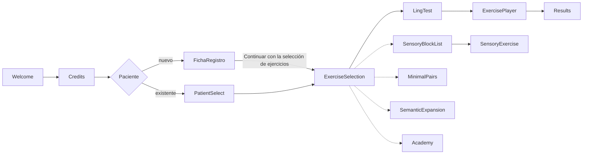

### Interfaz v11 · pestañas inferiores ✅ **activa**

Los testers del piloto reportaron que el uso «se hace muy engorroso y hay mucho
texto». El hub de la v10.2 concentraba cinco tareas en una sola pantalla
—bloques, lista prescribible, recordatorios, calidad de voz y acceso
profesional— con unos **1.490 px de scroll**, dos pantallas y media, para llegar
a los ajustes.

La **v11** reorganiza esa pantalla sin tocar el resto de la app, y es la
interfaz que arranca: `MainTabNavigator` va cableado directo en
[`AppNavigator`](src/AppNavigator.tsx).

> **Sin interruptor.** Durante el desarrollo hubo un `ENABLE_V11_UI` que
> permitía construir la v11 sin tocar producción. Cumplió su papel, pero
> también permitía compilar una versión en la que no se veía ningún cambio, y
> eso costó un build entregado a evaluación externa con la interfaz antigua.
> Se ha retirado junto con `ValeriaExerciseSelectionScreen`: **lo que está en
> `main` es lo que sale al compilar**. Volver atrás es un revert de git, no
> cambiar una constante.

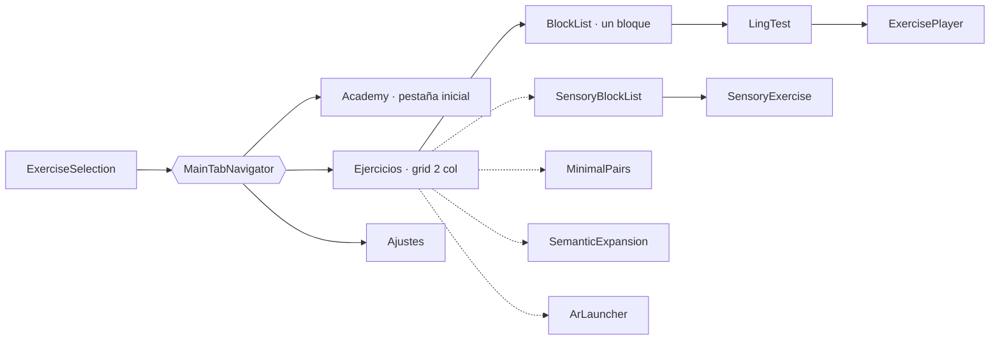

| Qué cambia | Por qué |
| --- | --- |
| Cuadrícula de 2 columnas **sin subtítulos** | Los ~718 caracteres de prosa del hub se reubican al `refCard` del bloque, donde se leen justo antes de usarlo. Ninguna clave i18n se borra: varias llevan carga MDR («Estresores siempre manuales», «Sin grabar nada y con el micrófono apagado»). |
| Recordatorios, voz y acceso profesional → **Ajustes** | Al fondo del hub eran, en la práctica, invisibles. |
| La lista de un bloque pasa a ser **ruta real** (`BlockList`) | En la v10.2 era un `useState`: el botón atrás de Android no volvía al hub, salía de `ExerciseSelection` entera. Como ruta, se arregla solo. |
| El player **no** vive bajo las pestañas | Durante el ejercicio la pantalla es del niño; no puede haber salidas laterales a un toque. |

**Los nombres de ruta no se traducen ni se renombran.** La pestaña se llama
`ExerciseSelection` y solo muestra «Ejercicios» como etiqueta visible: la
telemetría indexa el tiempo por nombre de ruta y rebautizarla partiría la serie
del piloto. La etiqueta pasó de «Terapias» a «Ejercicios» para que concuerde con
el título de la pantalla («Selección de Ejercicios») y con el enfoque del
producto: el tratamiento lo dirige el logopeda; lo que la familia hace en casa son
ejercicios.

**La pestaña inicial es Academy** (`initialRouteName`), porque la app forma
antes de ejercitar. Los botones que prometen un destino concreto —«Volver a
ejercicios» del panel de resultados, «Empezar por la formación» de la ficha— lo
nombran entero (`navigate('ExerciseSelection', { screen: … })`) en vez de
confiar en cuál sea esa pestaña inicial: así el texto del botón y el sitio al
que lleva no pueden separarse.

> [!NOTE]
> **Efecto en la telemetría del piloto.** Cambiar la pestaña inicial no renombra
> ninguna ruta, pero sí mueve dónde se imputa el tiempo: lo que antes caía en
> `ExerciseSelection` nada más entrar ahora cae en `Academy`. Las sesiones
> siguen marcadas como `ui: 'v11'`, así que el tramo se puede separar por dato,
> pero conviene tenerlo en cuenta al comparar series a ambos lados de este
> cambio. Plan completo y muro de contención en
[`docs/plan-evolucion-ux-v11.md`](docs/plan-evolucion-ux-v11.md).

---

## 📊 Telemetría del piloto clínico

Para recabar **evidencia de usabilidad** durante el piloto (validación
regulatoria y académica) sin fricción para las familias, Valeria+ incluye una
capa de telemetría **offline, anónima y no bloqueante**. La restricción
innegociable es que **ni la captura de eventos ni la escritura en disco bloqueen
el hilo principal**: la captura solo muta memoria (O(1)) y programa un volcado
con *debounce* vía `InteractionManager`, de modo que el cifrado y el guardado en
`AsyncStorage` nunca coinciden con las animaciones ni con el audio.

| Qué mide / hace | Cómo |
| --- | --- |
| ⏱️ **Tiempo activo por pantalla** | El navegador anota cada cambio de ruta (`noteScreen`); solo aritmética de timestamps. |
| 👆 **Misclicks** (toques fuera de zonas interactivas) | `ValeriaMisclickBoundary` usa el sistema de *responder* de RN: solo los toques en zonas muertas llegan a la raíz. Cede el gesto al scroll. |
| 🧩 **Abandono intra‑cápsula TPR** | Se cuentan cápsulas mostradas vs. saltadas vs. completadas en el player. |
| 💬 **Evaluación subjetiva (SUS adaptado)** | Modal Likert 1‑5 (`ValeriaSUSModal`) orientado a la **carga de uso real** ("integrar el ejercicio en la rutina de mi hijo/a"). *Rate limiting* para evitar sesgo de fatiga: solo en el **hito de 4 bloques distintos** (umbral desacoplado del total de 6: los módulos TEA/Dislexia ni lo bloquean ni lo fuerzan) y **máx. 1 vez/semana** por dispositivo. |
| 🔒 **Persistencia y correlación** | Telemetría + Likert se guardan en un **JSON cifrado en reposo** (`valeriaCrypto`, keystream SHA‑256 en JS puro) bajo el **mismo id de sesión**. Se **purga solo tras una exportación exitosa**, evitando el desborde de memoria semana a semana. |
| 🗣️ **Uso del recuento del micrófono** | En los ejercicios de frase, `trackPhraseCoverage` suma cuántas palabras reconoció el motor, cuántas tenía la frase y cuántas frases se practicaron. **No es una medida clínica y no tiene finalidad sanitaria**: el recuento es un *apoyo del ejercicio* (el niño ve por dónde va, el adulto ve qué palabra se cayó) y esto mide **cuánto se usa ese apoyo**, igual que los misclicks miden la interfaz. Se llama **una vez por ensayo y con el resultado final**: las láminas se encienden con los parciales del reconocedor, y registrar cada parcial contaría el mismo ensayo diez veces. **Solo números**: ni la frase, ni las palabras, ni lo que el reconocedor entendió. Los objetivos de una sola palabra no entran. |
| 🎛️ **Interfaz de la sesión** (`ui: 'v10' \| 'v11'`) | Sella con qué interfaz se registró cada sesión. Activar las pestañas mueve la línea base de dos métricas: la barra inferior absorbe toques que antes caían en zona muerta (menos *misclicks*, sin que nadie se equivoque menos) y `BlockList` se lleva un tiempo que antes se imputaba a `ExerciseSelection`. Con el sello, los tramos pre/post se separan **por dato** y no por fecha de despliegue —que es aproximada y se pierde al reinstalar—. El resumen exportado incluye `sessionsV11`: si está entre 0 y `sessions`, la muestra mezcla interfaces y los *misclicks* agregados no son una serie homogénea. |

> [!WARNING]
> **Añadir un campo al registro exige tocar `normalizeSession`.** Esa función
> reconstruye la sesión **campo a campo** al releerla del disco, así que todo lo
> que no se nombre ahí se pierde entre el disco y la exportación —sin error, sin
> aviso: se exporta un cero—. Ya pasó con `listen` (ES‑04) y con `asr` (partición
> local/red de la Fase A), que se recogían durante toda la sesión y no llegaban
> nunca al fichero. El gate `check-word-coverage.js` hace el viaje de ida y
> vuelta y lo detecta.

**Exportación dual** (Modo Profesional, PIN `1985` → `ValeriaProExport`; en la
interfaz clásica se entra desde el hub de bloques, en la v11 desde **Ajustes**):

- **Offline puro** → **código QR** con el resumen estadístico comprimido
  (abandonos, misclicks, media Likert), legible por cámaras móviles. El
  codificador QR es **JS puro sin dependencias** (`valeriaQR`, modo byte, nivel
  M), verificado bit a bit contra la librería de referencia `qrcode`.
- **ShareSheet** → `ACTION_SEND` nativo con el **log transaccional completo en
  crudo** (email/WhatsApp) para cuando haya conectividad.

> **Notas para la fase regulatoria.** La telemetría es **anónima** (sin datos
> personales, sin audio, sin el contenido de las respuestas). El recuento del
> micrófono es lo más cerca del habla que llega el registro, y aun así **son
> cifras**: cuántas de cuántas, nunca cuáles. Por decisión de producto es un
> **apoyo del ejercicio sin valor ni finalidad sanitaria** —no mide el lenguaje,
> no evalúa y no entra en ninguna decisión clínica—, y así está rotulado en la
> app, en el panel y en el manual. Mantenerlo fuera de lo clínico es lo que evita
> que un contador de una ayuda de pantalla se lea como una medida de Clase I.
>
> **Dónde está declarado.** Dentro de la fila que ya existía —*telemetría de
> usabilidad del piloto*— como «el uso de las ayudas de pantalla», sin fila
> propia y sin base legal nueva: es una métrica de uso, del mismo orden que los
> misclicks. Lo que **sí** hay que hacer es que el formulario de *Seguridad de
> los datos* de Play Console enumere lo mismo que `site/`, porque Google
> contrasta las dos declaraciones entre sí. El cifrado en
> reposo guarda la clave en `AsyncStorage`; el módulo `valeriaCrypto` está
> aislado para migrarla a `expo-secure-store` (Keystore/Keychain) en producción.
> Al tratarse de un piloto con menores, el **consentimiento informado** de las
> familias debe gestionarse en el protocolo del estudio, fuera de la app.

---

## 📚 Documentación

| Documento | Descripción |
| --- | --- |
| **Manual de uso** (v15) · [HTML](docs/manual-casos-de-uso.html) · [PDF](docs/Valeria-Manual-Casos-de-Uso.pdf) · [Word](docs/Valeria-Manual-Casos-de-Uso.docx) | Manual **orientado a tareas**, no una especificación: cada apartado es algo que el lector quiere hacer, con sus pasos numerados, su bloque «Y si…» y capturas reales (`docs/screenshots/`). Ocho capítulos: qué es la app y quién hace qué · los primeros quince minutos (ficha, voz, Academy, primera sesión) · las tareas de cada día (sesión, Test de Ling, resultados, recordatorios, premios) · los diez bloques con su modo de uso · prescribir, ajustar y exportar (logopeda) · idiomas y voces · privacidad · si algo va mal. Más el anexo del periférico Lúa. El capítulo de RA no lleva capturas a propósito: cualquier captura fiel mostraría la cara de un menor. |
| [`docs/pizarra-magica-e-insignias.md`](docs/pizarra-magica-e-insignias.md) | El rediseño de las insignias de Lúa (y por qué tres glifos hubo que volver a dibujarlos para que se leyeran a 30 px), la limpieza de la vibrante múltiple en las cuatro variedades y las dos trampas de `sanitizePhonetics`, las láminas de frase y la Pizarra Mágica. Incluye lo que queda pendiente en el firmware. |
| [`docs/sprint-integracion-2026-08-21.md`](docs/sprint-integracion-2026-08-21.md) | Cierre del sprint de Integración Sensorial y la Brújula ASHA: qué se decidió, qué faltaba para que el módulo existiera de verdad y qué suena dentro de cada uno de los tres ambientes. |
| [`docs/plan-evolucion-ux-v11.md`](docs/plan-evolucion-ux-v11.md) | Plan de evolución UX/UI v10.2 → v11 en respuesta al feedback del piloto («engorroso», «mucho texto»): diagnóstico medido sobre el código, cuadrícula de 2 columnas, pestañas inferiores y el **muro de contención** que garantiza cero regresiones clínicas y cero pérdida de la serie de telemetría. Implementado y activo; el interruptor `ENABLE_V11_UI` se retiró al cerrar el Sprint 4.6. |
| [`docs/protocolo-pares-minimos.md`](docs/protocolo-pares-minimos.md) | Protocolo de pares mínimos para dislalias fonológicas: 10 pares accionables con flujo TTS→STT, feedback por rama y misiones físicas. Implementado en `src/ValeriaMinimalPairsScreen.tsx` + `src/valeriaMinimalPairs.ts`. |
| [`docs/protocolo-pares-minimos-es-DO.md`](docs/protocolo-pares-minimos-es-DO.md) | Protocolo de pares mínimos en español dominicano (Quisqueya Habla). Implementado en `src/valeriaMinimalPairsEsDO.ts`. |
| [`docs/protocolo-expansion-semantica.md`](docs/protocolo-expansion-semantica.md) | Protocolo de expansión semántica / progresión léxica offline. Implementado en `src/ValeriaSemanticExpansionScreen.tsx` + `src/valeriaSemanticExpansion.ts`. |
| [`docs/protocolo-realidad-aumentada.md`](docs/protocolo-realidad-aumentada.md) | Protocolo clínico del bloque de Realidad Aumentada: consentimiento de cámara, Prueba de Aptitud del Dispositivo, colocación del teléfono y los seis ejercicios (AR‑1 cinemática orofacial, AR‑2 localización instrumentada, AR‑3 selección por fijación, AR‑4 búsqueda espacial, AR‑5 lanzamiento y AR‑6 espejo mímico), con el muro MDR explicado ejercicio a ejercicio. Implementado en `android-native/valeria-ar/` + `src/ValeriaArLauncherScreen.tsx`. |
| [`docs/guia-dialectal-es-DO.md`](docs/guia-dialectal-es-DO.md) | Guía clínica dominicana (QH‑0.2): qué es rasgo dialectal normal y qué es error clínico. Regla **bloqueante** para todo dataset es‑DO. |
| [`docs/plan-integracion-proxecto-nos.md`](docs/plan-integracion-proxecto-nos.md) | Plan por fases de la versión en gallego apoyada en los recursos abiertos del Proxecto Nós (contenido, voz Celtia, ASR). |
| [`docs/plan-integracion-quisqueya-habla.md`](docs/plan-integracion-quisqueya-habla.md) | Plan de la variante dominicana (es‑DO), que reutiliza la infraestructura de variedad del plan gallego. |
| [`docs/plan-integracion-ingles-en-US.md`](docs/plan-integracion-ingles-en-US.md) | Plan por fases para el inglés de Estados Unidos (`en‑US`). **Interfaz, banco clínico y voz ya implementados** — ver [Idiomas y variedades](#-idiomas-y-variedades). Rompió el molde de los tres planes de idioma anteriores: fue el primero que exigió **traducir la interfaz** (hasta entonces las cadenas estaban literales en las 27 pantallas), el primero que abre **mercado nuevo** (COPPA, *Designed for Families*, ficha de tienda y página de eliminación de datos en inglés) y el que más rediseño clínico pide (grupos consonánticos, vocales tensa/laxa, ortografía opaca). Decisiones ya cerradas: **revisión clínica confirmada** (profesora SLP con licencia, *Howard University*), **separación del idioma de interfaz respecto de la variedad de los ejercicios** —para el *caseload* bilingüe español‑inglés— y la regla bloqueante de **diferencia dialectal vs. trastorno** para el inglés afroamericano y el sureño, espejo de la guía dominicana. |
| [`docs/protocolo-evaluacion-clinica-en-US.md`](docs/protocolo-evaluacion-clinica-en-US.md) | Protocolo de la **evaluación clínica estadounidense** (EN‑0.9): cómo se instala la build de prueba en Android, qué debe juzgar la revisora —validez de la mecánica, **diferencia dialectal vs. trastorno**, registro del inglés y usabilidad—, qué queda **fuera de alcance** para que no gaste el informe en ello, y el formato tabulado (*tipo · gravedad · propuesta*) que permite convertir cada observación en una tarea del plan. |
| [`docs/plan-asr-privacidad-y-motor-local.md`](docs/plan-asr-privacidad-y-motor-local.md) | Plan en dos fases para que el audio del turno de habla **no salga del dispositivo**: (A) reconocimiento local con el motor del sistema —**software terminado**, pendiente de verificar en dispositivo— y (B) prueba de concepto medida de un motor local (`sherpa-onnx`), con puerta GO/NO‑GO numérica y banco de medida ya implementado. Contiene dos hallazgos que cambiaron el plan: que `@react-native-voice/voice` descartaba en silencio las claves que no conocía (§2.2), y que **25 de los 35 pares mínimos puntúan como acierto que el niño diga el distractor** (§4.0). Revisa el NO‑GO de [`docs/asr-euskera-ilenia.md`](docs/asr-euskera-ilenia.md). |
| [`docs/plan-mejoras-acopros-logopedas.json`](docs/plan-mejoras-acopros-logopedas.json) | **Fuente de verdad** del plan de mejoras nacido del feedback clínico de ACOPROS: cada observación verificada contra el código, con decisiones clínicas (DC‑1…DC‑5), criterios de aceptación y estado. Incluye el **bloqueo de publicación** del corpus de voz. |
| [`docs/criterio-dificultad-lexica.md`](docs/criterio-dificultad-lexica.md) | Criterio del campo `difficulty` de las categorías léxicas (ES‑08): la progresión la marca la **familiaridad**, no la dificultad de pronunciación. Incluye por qué la frecuencia **no se hereda entre variedades** (en RD el plátano es el de freír; el que se come crudo es el guineo). |
| [`docs/auditoria-pictogramas.md`](docs/auditoria-pictogramas.md) | Inventario de toda la carga visual en uso, clasificada por riesgo (*tofu*, atributo, revisar) con columna de veredicto para ACOPROS. Se **regenera** con `node scripts/audit-pictograms.js --markdown`. |
| [`docs/arquitectura-exportacion-ios.json`](docs/arquitectura-exportacion-ios.json) | **Blueprint replicable** de la exportación a iOS: cómo conviven la app Expo (que no versiona `ios/`) y el port nativo de `ios-native/`, dónde vive la firma para que el Team ID no acabe en el `pbxproj`, los tres modos de `archive.sh`, qué se puede con cuenta gratuita y el catálogo de errores frecuentes. Pensado para **portarlo a otros repositorios**. |
| [`docs/arquitectura-corpus-voz-nos-ilenia.json`](docs/arquitectura-corpus-voz-nos-ilenia.json) | **Blueprint replicable** de la arquitectura de voz neuronal (Proxecto Nós / ILENIA): enumeración del corpus, síntesis en build‑time e integración offline‑first con degradación elegante. |
| [`docs/plan-calidad.md`](docs/plan-calidad.md) | Task list priorizada para reducir regresiones (checklist de humo, pruebas por bloque). |
| [`docs/firebase-setup.md`](docs/firebase-setup.md) | Guía del backend opcional: Firebase Authentication + Cloud Firestore. |

**Regenerar el manual** tras editar [`docs/manual-casos-de-uso.html`](docs/manual-casos-de-uso.html):

```bash
node docs/capture-screenshots.js  # capturas (Playwright sobre expo start --web)
node docs/build-pdf.js            # → PDF
python3 docs/build-docx.py        # → Word (requiere python-docx y lxml)
```

> El HTML es la **única fuente**: los dos generadores lo leen. Hasta la v11,
> `build-docx.py` llevaba el texto del manual duplicado dentro y había que
> editar los dos ficheros a mano; el Word acabó describiendo la v10.3 con la
> mascota antigua mientras el HTML iba por la v12. Ya no puede volver a pasar.
>
> La mascota de la portada (`docs/lua-mascota.png`) sale del mismo sprite que
> la app, con `node scripts/build-brand-assets.js`.
>
> El capítulo de **Realidad Aumentada** (CU‑18 a CU‑22 y CU‑25 a CU‑27) no lleva
> capturas a propósito: esos ejercicios solo funcionan con la cámara abierta en
> un teléfono físico, y cualquier captura fiel mostraría la cara de un niño.

---

## 🚀 Puesta en marcha

> **Requisitos:** Node.js 18+, `npm` y una **build de desarrollo** instalada en
> el dispositivo (o un emulador Android / simulador iOS). Para un vistazo rápido
> también sirve **Expo Go**, con los límites que se explican abajo.

```bash
npm install       # instala dependencias
npm start         # expo start — abre el panel de Metro
npm run typecheck # tsc --noEmit — comprobación de tipos
```

| Comando | Qué hace |
| --- | --- |
| `npm start` | Arranca Metro en modo **dev client**: el QR abre la build de desarrollo instalada. |
| `npm run start:go` | Fuerza `--go`: arranca Metro contra **Expo Go**. |
| `npm run android` | `expo run:android` — compila e instala la build de desarrollo en emulador o dispositivo **Android** (requiere Android SDK). |
| `npm run ios` | `expo run:ios` — compila e instala en el simulador **iOS** (solo macOS). |
| `npm run web` | Abre la versión **web** en el navegador. |
| `npm run typecheck` | Verifica los tipos de TypeScript. |
| `npm run build:ar-models` | Regenera los siete modelos 3D del bloque de Realidad Aumentada (`assets/models/*.glb`). Deterministas: si nada cambia, no producen diff. |
| `npm run fetch:ar-model` | Descarga el modelo de señal facial de MediaPipe desde su revisión fijada y verifica su SHA‑256. Idempotente. |
| `npm run check:ar-models` | Comprueba que los `.glb` y el `.task` están, caben en su presupuesto y **que sus nombres de animación siguen coincidiendo con el enum `ArModel` de Kotlin**. |

> `npm run android` y `npm run ios` **compilan**; no son atajos para abrir Expo
> Go. Para el vistazo rápido sin cadena nativa instalada, usa `npm run start:go`.
> Es `expo prebuild` quien fija esos dos valores: los reescribe a `expo run:*`
> cada vez que se ejecuta, así que no tiene sentido devolverlos a `expo start`.

### 📱 Expo Go vs. build de desarrollo

El proyecto incluye [`expo-dev-client`](https://docs.expo.dev/develop/development-builds/introduction/),
así que `expo start` arranca por defecto apuntando a la **build de desarrollo**.
Es el mismo binario nativo de la app —con sus módulos y sus permisos— pero
cargando el JavaScript desde Metro: recarga en caliente sin recompilar nada.

Importa porque **dos piezas centrales de Valeria+ no existen en Expo Go**:

| Módulo | En Expo Go | En build de desarrollo |
| --- | --- | --- |
| `expo-speech-recognition` (STT) | ❌ no está enlazado: los juegos de voz no reconocen nada | ✅ funciona |
| `expo-notifications` (recordatorios) | ⚠️ sin push remoto y con avisos limitados en iOS | ✅ funciona |

Traducción práctica: Expo Go vale para retocar interfaz, textos o navegación;
en cuanto tocas pares mínimos, expansión semántica o los recordatorios, hay que
usar la build de desarrollo. Basta compilarla **una vez** por dispositivo —
después solo se recarga JavaScript.

---

## 🏗️ Builds (EAS)

```bash
npx eas build -p android --profile apk         # APK directo: solo ARM, ProGuard + shrinkResources
npx eas build -p android --profile production  # App Bundle (.aab) para Google Play
```

El perfil `apk` limita las arquitecturas a `armeabi-v7a` y `arm64-v8a` (los
móviles reales), eliminando las librerías x86 de emulador del binario. Para
publicar en Google Play usa siempre el App Bundle: Play genera un APK optimizado
por dispositivo y la descarga es bastante menor.

### Perfiles de [`eas.json`](eas.json)

| Perfil | Plataforma | Qué produce | Necesita cuenta Apple de pago |
| --- | --- | --- | --- |
| `development` | Android + iOS | Build de desarrollo (`developmentClient`), distribución interna | Sí en iOS (ad hoc: el dispositivo debe estar registrado) |
| `ios-simulator` | iOS | Build de desarrollo para el **simulador** (`.app`) | **No** — el simulador no firma |
| `apk` | Android | `.apk` directo, solo ARM | — |
| `ios-preview` | iOS | `.ipa` en Release, distribución interna | Sí |
| `production` | Android + iOS | `.aab` para Play · `.ipa` en Release para App Store | Sí |

```bash
npx eas build -p ios --profile ios-simulator   # no necesita cuenta de pago
npx eas build -p ios --profile development     # dev client sobre iPad/iPhone real
npx eas build -p ios --profile production      # App Store Connect
```

Los perfiles iOS existen **por si algún día conviene compilar en la nube**; hoy
el camino recomendado es el build local en Mac de la sección siguiente, que no
consume cola de EAS ni exige subir credenciales de firma.

`appVersionSource: "remote"` hace que EAS lleve la cuenta del `versionCode` de
Android y del `buildNumber` de iOS; `autoIncrement` en `production` los sube
solo. No los edites a mano en `app.json`.

---

## 🍏 Build iOS en local (Mac + Xcode)

Esta es la app **React Native** de la raíz. En el repositorio no hay carpeta
`ios/`: está en [`.gitignore`](.gitignore) porque la genera Expo. El flujo
completo, desde un clon limpio:

> **Requisitos:** macOS con **Xcode** (y sus Command Line Tools), **CocoaPods**
> y Node.js 18+. Para el simulador no hace falta ninguna cuenta de Apple; para
> instalar en un iPad o iPhone físico basta una cuenta **gratuita**.

```bash
npm install
npx expo prebuild -p ios     # genera ios/ con Podfile y ejecuta pod install
npm run ios                  # compila y abre el simulador
```

Para un **iPad físico** —el escenario real de uso— conéctalo por USB y:

```bash
npm run ios:device           # elige el dispositivo de la lista y compila en Debug
```

`expo run:ios` compila **una sola vez** e instala la build de desarrollo. A
partir de ahí, para iterar basta con dejar Metro corriendo:

```bash
npm start                    # la app en el iPad recarga en caliente desde Metro
```

Solo hay que repetir el `prebuild` + compilación cuando cambia algo **nativo**:
una dependencia nueva con módulo nativo, un plugin de `app.json`, los permisos
o la versión del SDK. Editar pantallas, textos o corpus no lo requiere.

### Scripts iOS

| Comando | Qué hace |
| --- | --- |
| `npm run prebuild:ios` | Genera `ios/` a partir de `app.json` y ejecuta `pod install`. |
| `npm run prebuild:ios:clean` | Igual, pero **borra** `ios/` antes: el arreglo cuando CocoaPods se atasca. |
| `npm run ios` | Compila e instala en el **simulador**. |
| `npm run ios:device` | Compila en **Debug** sobre un iPad/iPhone conectado. |
| `npm run ios:release` | Compila en **Release** sobre el dispositivo: rendimiento real, sin Metro. |

`expo run:ios` ejecuta el `prebuild` por su cuenta si todavía no existe `ios/`,
así que el paso explícito solo hace falta cuando quieres inspeccionar o firmar
el proyecto en Xcode antes de compilar.

Usa `ios:release` antes de una sesión clínica de verdad: la build de Debug
carga el JavaScript desde Metro y arrastra el *dev menu*, así que no sirve para
medir cómo responde la app en las manos del niño.

### Firma en Xcode

`prebuild` deja el proyecto listo, pero la firma es tuya:

```bash
open ios/Valeria.xcworkspace   # ⚠️ el workspace, no el .xcodeproj — hay CocoaPods
```

En **Signing & Capabilities** elige tu equipo (una cuenta gratuita de Apple
sirve). El *bundle identifier* es `health.earlify.valeria`, declarado en
[`app.json`](app.json).

Con cuenta gratuita hay dos límites que conviene tener presentes: la firma
**caduca a los 7 días** —hay que reinstalar desde el Mac— y no existe TestFlight.
Distribuir a terceros exige el Apple Developer Program.

### Permisos que verás en el dispositivo

Los genera el plugin de `expo-speech-recognition` declarado en `app.json`; no
se editan a mano en el `Info.plist`, porque `prebuild` lo regenera:

| Clave | Para qué |
| --- | --- |
| `NSMicrophoneUsageDescription` | Los juegos de voz de los ejercicios |
| `NSSpeechRecognitionUsageDescription` | Valorar las palabras que dice el niño |

Si cambias lo que la app recoge, actualiza en el mismo cambio la política de
[`site/`](site/) y el formulario de *Seguridad de los datos* de Play Console.

### Problemas habituales

| Síntoma | Causa y arreglo |
| --- | --- |
| `pod install` falla tras cambiar dependencias | `npm run prebuild:ios:clean` regenera `ios/` desde cero |
| La app abre pero no conecta con Metro | Mac e iPad deben estar en la **misma red**; o usa `npx expo start --tunnel` |
| El STT no reconoce nada | Estás en **Expo Go**, no en la build de desarrollo (ver tabla de arriba) |
| El STT falla solo en galego/euskera | Probablemente no hay paquete de idioma local para esa variedad; se usa el reconocedor de red. Ver la nota de reconocimiento local |
| Cambié `app.json` y no se aplica | Los cambios nativos exigen `prebuild` + recompilar |
| Xcode se queja de la firma | Falta el equipo en *Signing & Capabilities*, o caducó la firma de 7 días |

> `ios/` es un artefacto generado: **no lo versiones**. Todo lo que deba
> persistir —permisos, plugins, identificadores— vive en `app.json` y en
> [`plugins/`](plugins/).

---

## 🍎 Port nativo iOS (Xcode)

En [`ios-native/`](ios-native/) vive un **port SwiftUI** del flujo completo,
pensado para evaluar navegación y estética en dispositivo físico. Es un
demostrador: la app clínica —la que validó ACOPROS— es la de React Native de
esta raíz.

> ⚠️ **No confundir con la sección anterior.** Son dos apps distintas:
>
> | | [Build iOS local](#-build-ios-en-local-mac--xcode) | Port nativo (esta sección) |
> | --- | --- | --- |
> | Código | React Native / TypeScript (`src/`) | SwiftUI (`ios-native/`) |
> | Proyecto Xcode | `ios/Valeria.xcworkspace`, **generado** por `prebuild` | `ios-native/Valeria.xcodeproj`, **versionado** |
> | Dependencias | CocoaPods | Swift Package Manager |
> | Estado | App clínica real | Demostrador de estética y navegación |

```bash
cd ios-native
./scripts/preflight.sh     # ¿le falta algo a este clon? (segundos)
open Valeria.xcodeproj     # esquema Valeria · ⌘R
```

**El proyecto de Xcode de este port es `ios-native/Valeria.xcodeproj`**, y es el
único `.xcodeproj` versionado del repositorio. Dependencias por Swift Package
Manager (Firebase), **sin CocoaPods**: no hay `Podfile` ni `pod install` que
ejecutar, y se abre el `.xcodeproj`, no un *workspace*.

El **simulador** no necesita ninguna cuenta de Apple. Con una cuenta **gratuita**
se compila y se ejecuta en tu propio iPhone o iPad (el proyecto no usa ninguna
capacidad de las que exigen cuenta de pago), con dos límites que conviene saber:
la firma **caduca a los 7 días** y no hay forma de distribuir por TestFlight ni
Firebase App Distribution — eso sí requiere el Apple Developer Program.

Todo el detalle —firma, `archive`, exportación del `.ipa`, y en qué se
diferencia de esta app RN— está en [`ios-native/README.md`](ios-native/README.md).

> Para sacar la app **React Native** por Xcode, el camino está documentado en
> [Build iOS en local](#-build-ios-en-local-mac--xcode): `npx expo prebuild -p ios`
> genera la carpeta `ios/` (ignorada en git) **con** CocoaPods, y a partir de ahí
> se abre el `.xcworkspace`.

---

## ⚙️ Build automático (GitHub Actions)

El workflow [`.github/workflows/android.yml`](.github/workflows/android.yml)
compila la app en cada push/fusión a `main` (y en ramas `claude/**`). Con los
secrets de firma configurados genera el APK y el **AAB firmados**; sin secrets
solo compila el APK. El `versionCode` se deriva del número de run.

Antes de compilar corren **30 chequeos** que fallan rápido. No son tests
unitarios: cada uno protege un acuerdo clínico concreto —o, en el caso del ASR,
un dato de salud de un menor— que el typecheck y el diff no ven.

> La cuenta que manda es la del workflow, no la de esta tabla. Cuando llegaron a
> ser 25, aquí seguían escritos 15, y el build 621 murió en uno de los diez que
> faltaban. Para no fiarse de la lista:
> ```bash
> grep -oP '(?<=run: )node scripts/\S+(?: --\S+)?' .github/workflows/android.yml |
>   while read -r cmd; do $cmd >/dev/null 2>&1 || echo "FALLA: $cmd"; done
> ```

| Chequeo | Qué impide |
| --- | --- |
| `check-voice-corpus-coverage.js` | Que se empaquete un APK con texto locutado **sin asset de voz neuronal**. La app no se rompe cuando eso pasa: cae a la voz del sistema en silencio, y así se pierden Celtia (galego), ILENIA (euskera) o Matxa (català). |
| `check-content-rules.js` | Que reaparezcan el `tts_string` redundante (ES‑06), una fase de progresión por onomatopeya (ES‑10) o una cápsula con tres referentes distintos (ES‑13). |
| `check-pictogram-coverage.js` | Que una cápsula de contraste quede **irresoluble**: si las dos vueltas comparten clave de pictograma, el niño ve dos tarjetas idénticas (ES‑12). Y desde el 4/9/2026 tampoco si son claves distintas con el **mismo dibujo** —`sapo` y `coqui` son dos ranas verdes—, que es el mismo fallo sin que las cadenas coincidan. |
| `check-lexical-difficulty.js` | Que un ítem avanzado se cuele entre los iniciales: **el orden de escritura ES el orden de práctica** (ES‑08). |
| `check-reminder-slots.js` | Que apagar una franja de recordatorio deje de reprogramarla pero **no cancele sus avisos ya en cola** (GEN‑01). |
| `check-sign-figures.js` | Que una cápsula de LSE pida una figura **sin dibujo registrado** o que el abecedario dactilológico quede incompleto: `SignFigure` devuelve `null` a propósito, así que el fallo es invisible salvo para este gate (LSE‑01). |
| `check-speech-prosody.js` | Que el troceo por frases vuelva a meterse en la voz del sistema de es‑DO: cada locución encadenada arrastra la latencia de arranque del motor, y el resultado son pausas anchas que rompen el ritmo de la sesión. |
| `check-asr-capture-guard.js` | Que la **captura de corpus de la Fase B del ASR** llegue a producción, o que una grabación acabe versionada. Comprueba que la persistencia de audio viva en un solo archivo, que siga exigiendo `__DEV__` **y** `EXPO_PUBLIC_ASR_CAPTURE`, que ningún archivo versionado encienda la variable, que `corpus-asr/` esté ignorado y que git no rastree ninguna grabación. Es voz de un menor: art. 9 del RGPD (R7 del plan). |
| `check-word-coverage.js` | Que la lámina encendida y la palabra puntuada vuelvan a contarse con reglas distintas. La regla llegó a estar escrita dos veces y no eran iguales: una frase podía encender las cinco láminas y recibir un «casi». Comprueba además que el recuento **sobrevive al viaje por disco** hasta la exportación |
| `check-ui-strings.js` | Que una pantalla pinte texto literal en vez de leerlo del catálogo (EN‑2.8). Ya pasó dos veces con ficheros enteros dentro de pantallas migradas: compilan, el typecheck pasa y la app sale mitad en inglés y mitad en castellano |
| `check-ui-lang-fallback.js` | Que un idioma de interfaz caiga a otra lengua **en silencio**. Hermano del anterior para lo que no es literal de pantalla: los catálogos de ejercicios y de Academy se elegían con `lang === 'en' ? EN : ES`, así que al entrar el catalán el adulto leía castellano bajo una cabecera catalana — sin romper el typecheck, porque el ternario acepta cualquier `UiLang`. O hay rama, o el hueco está declarado en `src/i18n/uiLangFallback.ts` y **la pantalla lo dice** |
| `test-challenger-final-ca-integration.js` | Que el catálogo catalán pierda la paridad 1:1 con el castellano, que el selector deje de mover la variedad de los ejercicios o que alguna de las 223 funciones de interpolación reviente al ejecutarse. Existía desde la primera tanda pero **no lo corría nadie** |
| `check-adult-fields.js` | Que los dos ejes de idioma se contradigan **dentro de un ejercicio**: lo que se le dice al niño va en la variedad de los ejercicios, lo que solo lee el adulto va en el idioma de la interfaz |
| `check-variety-branches.js` | Que una variedad se quede sin su rama en un selector escrito cuando existían menos. Es el patrón exacto que produjo «la voz inglesa lee castellano», y con seis variedades hay seis formas de repetirlo |
| `check-brand-consistency.js` | Que reaparezca la mascota retirada. La migración a Lúa se dio por terminada **tres veces** estando a medias, y la última capa que quedó fue el texto **locutado** |
| `check-lua-mascot-mirror.js` | Que la gata de la tableta y la del aparato se separen en humor o en guardarropa. Vigila `MOOD` y `ACCESSORY`, **no** los glifos de las insignias |
| `verify-aventuras-lua.js` | Que el módulo de Lúa vuelva a los cuatro defectos con que entró: una pregunta que el niño responde tocando y **sin ficha** (por debajo de 4 años no se lee), la pauta clínica del ADULTO locutada al niño al fallar, locuciones fuera del corpus e imprimibles vacíos. El módulo traía su propio verificador y **no estaba enchufado a ningún workflow**, así que no corría |
| `check-lua-voice-language.js` | Que Aventuras con Lúa vuelva a leer su castellano **con la voz de la sesión** —Celtia o HiTZ pronunciando palabras castellanas—. No lo ve ningún gate de texto, porque el texto era el correcto: lo equivocado era la voz. Por eso **ejecuta** la ruta de locución con expo-speech y el reproductor de assets sustituidos por espías, y mira qué sonó |
| `check-writing-bank.js` | Que un trazo de la Pizarra Mágica quede imposible de aprobar. El banco es **geometría**, que es lo único que el typecheck no puede ver: muestrea el path y comprueba que cada punto numerado cae sobre el trazo **y en el sentido en que se escribe** (numerar la `b` de abajo arriba enseña a trazarla al revés, que es justo lo que la pantalla combate), que no se pisan entre sí, que el modelo cabe en el móvil más estrecho, que cada contraste apunta a una letra que existe en el banco y que el nombre de cada letra está en el corpus de voz |
| `check-no-background-audio.js` | Que la app siga sonando con la pantalla apagada o en segundo plano |
| `check-ar-bridge-contract.js` | Que el puente nativo de Realidad Aumentada y su lado JS dejen de hablar el mismo contrato |
| `check-lua-mute.js` | Que el firmware de Lúa gane entrada de audio, micrófono o servos. Un juguete que escucha junto a un menor no entra en una consulta |
| `check-sensory-assets.js` | Que el módulo sensorial vuelva a ser mudo: formato, sonoridad, costura del bucle e identidad de cada estímulo |
| `check-legal-urls.js` | Que las URLs legales declaradas en Play Console dejen de servirse. Existe por el rechazo del 19/8/2026, con el fichero intacto y el despliegue en verde |
| `check-asr-listen-options.js` | Que se abra el micrófono con las opciones equivocadas. El módulo del ASR se carga con `require` perezoso y queda tipado como `any`, así que lo que se le pasa a `start()` no lo ve el typecheck ni el diff: pedir el modelo de lenguaje de **dictado** para escuchar una palabra suelta compila, arranca y deja Pares Mínimos respondiendo «no te escuché bien» en todos los ensayos. Ya pasó. Comprueba el modelo de término suelto (Android) y la pista de tarea corta (iOS), que siga la ventana de escucha de ES‑04, que se pidan parciales, que **nunca** se sesgue el motor con la palabra objetivo (§3.4 del plan) y que se pregunte por los modelos instalados **al mismo reconocedor que escucha** — preguntarle a otro es lo que hacía que un modelo ya descargado se declarase ausente (§3.3‑ter). |
| `build-lua-protocol.js --check` | Que la app y el firmware dejen de compartir la tabla de opcodes. No es un chequeo de estilo: el protocolo no lleva versión negociada, así que un opcode desplazado le enseña al niño la cara de otro estado en un aparato que ya está en su casa |
| `verify-ar-clinical-math.js` | Que la aritmética de los ejercicios de RA se separe de las constantes que la app usa de verdad. Nació pasando 20/20 sin estar cableado a nada mientras AR‑5 registraba 320 ms constantes de tiempo de reacción: por eso ancla sus fórmulas leyendo los fuentes |
| `stress-test-ar-adversarial.js` | Que las defensas de los ejercicios de RA cedan ante la entrada que no se esperaba: cara perdida, teléfono movido, señal fuera de rango |
| `check-ar-concurrency.js` | Que el bloque de RA vuelva a tener carreras entre sus hilos —el bucle de GL de ARCore, el de UI y el worker de audio—. Desde el 31/8/2026 vigila además que la imagen de `acquireCameraImage()` se cierre con `use {}` (el pool de ARCore es finito y agotarlo no da error: deja de entregar frames) y que `onPause` pare el bucle de GL **antes** que la sesión. Es el único chequeo que **lee el Kotlin**: los demás miran contenido, y compilar con Gradle no distingue «compila» de «no tiene carreras». Vigila que ningún punto de entrada de un ejercicio quede fuera de su lock, que el `AudioTrack` lo abra y lo cierre siempre el mismo hilo (liberarlo desde dos mata el proceso, sin excepción que capturar), que los plazos del ensayo se compensen al volver de segundo plano —si no, una notificación a media sesión se registra como veinte segundos de fijación sostenida— y que la ventana de respuesta de AR‑2 abra cuando el tono **sale**, no cuando se pide |
| `check-ar-models.js` | Que el nombre de la animación de un modelo 3D deje de ser el que invoca el código. Si no coincide, la escena compila, carga el modelo y deja al niño **sin refuerzo**, sin error por ninguna parte |

Todos se pueden ejecutar en local: `node scripts/<nombre>.js`.

> `check-ar-models.js` conviene además lanzarlo en local —`npm run
> check:ar-models`— justo después de reexportar un modelo 3D: es lo que evita
> descubrir en un build de veinte minutos lo que aquí se ve en dos segundos.

#### Banco de medida del ASR (Fase B)

[`scripts/asr-bench.js`](scripts/asr-bench.js) compara motores de reconocimiento
sobre el mismo corpus y produce la tabla que decide la puerta GO/NO‑GO del plan.
**No corre en CI**: necesita un corpus grabado, que por definición no vive en el
repositorio.

```bash
npm run asr:audit-pairs        # ¿distingue el matcher clínico cada par mínimo?
npm run asr:bench-selftest     # ¿mide bien el propio banco?
npm run asr:bench -- --corpus corpus-asr/manifiesto.json \
  --hyp corpus-asr/hyp-sistema.json --hyp corpus-asr/hyp-ctc.json --baseline sistema
```

La métrica principal **no es el WER**: es el acierto de veredicto clínico y, sobre
todo, los **falsos positivos de contraste** —los casos en que el niño falló y el
motor «arregló» la palabra—. Para no medir otra app, el banco carga la lógica real
de `valeriaVoice.ts` (compilada con `tsc`, con los módulos nativos sustituidos por
maniquíes) en vez de reimplementar el matcher.

> `--audit-pairs` encontró el primer fallo, y no estaba en ningún motor: **25 de los
> 35 pares mínimos puntuaban como acierto que el niño dijera el distractor**, con
> transcripción perfecta. La tolerancia de una letra de `matchTarget` se comía el
> contraste de todo par que se diferenciase en un solo fonema. **Corregido** — ver
> abajo. Hoy la auditoría da 0 de 35.

#### D7 · el contraste de los pares mínimos

`npm run asr:d7-sim` simuló las salidas posibles y midió cada una, para que la
decisión fuese entre números. La «habla aproximada» sobre la que mide no está
inventada: sale de las **1619 aproximaciones ya validadas clínicamente** en los
`stt_expected_array` de la Expansión Semántica. Informe:
[`docs/d7-simulacion-contraste.md`](docs/d7-simulacion-contraste.md).

**Se eligió O2 · vecino más cercano.** `matchPair` ya no decide por umbral: mide
la distancia de lo oído a las dos palabras del par y gana la más próxima; el
empate devuelve «casi», porque un empate es que el texto no distingue y ahí el
juez es el adulto. `matchTarget` y `matchExpected` **no se tocaron** — los usan el
juego de micrófono, la Expansión Semántica y el Test de Ling, que no tienen
distractor.

| | Antes de D7 | Ahora (O2) |
| --- | --- | --- |
| Contrastes que se detectan | 10 / 35 | **35 / 35** |
| Aproximaciones del objetivo que siguen siendo acierto | 116 / 157 | 59 / 157 |
| Aproximaciones enviadas a la rama de error | 0 | **0** |

El precio son 97 «casi» de más —una estrella y un reintento—, aceptado a cambio de
que el ejercicio detecte el error que existe para detectar. Queda confirmarlo en
sesión real con logopedas: 97 es una estimación sobre habla generada, no observada.

El workflow [`.github/workflows/voice-assets.yml`](.github/workflows/voice-assets.yml)
**sintetiza la voz neuronal** (Sharvard para `es`, Celtia para `gl`) a partir de
[`voice-corpus.json`](voice-corpus.json), masteriza el audio, regenera el mapa
`src/valeriaVoiceAssets.ts` y **commitea los assets** a la rama. Los modelos de
voz corren **solo en CI**, nunca en el dispositivo; el push resultante dispara el
build Android que empaqueta el audio en el binario. La voz gallega usa el
checkpoint *gated* de Celtia, que requiere el secret `HF_TOKEN`.

<details>
<summary><strong>🔐 Secrets de firma necesarios</strong></summary>
<br>

- `ANDROID_RELEASE_KEYSTORE_BASE64`
- `ANDROID_RELEASE_STORE_PASSWORD`
- `ANDROID_RELEASE_KEY_ALIAS`
- `ANDROID_RELEASE_KEY_PASSWORD`

</details>

## 🔥 Backend opcional (Firebase)

Para probar la app con profesionales, Valeria+ incluye un backend **aditivo y
opcional**: **Firebase Authentication** (email/contraseña) + **Cloud Firestore**.
La app sigue funcionando en local sin conexión si no se activa.

- **SDK JS `firebase`** (no `@react-native-firebase`): mismo código en Android,
  iOS y web, sin módulos nativos ni rebuilds.
- La config del SDK se lee de **variables de entorno `EXPO_PUBLIC_*`**; no hay
  claves escritas en el repositorio (copia `.env.example` a `.env`).
- Cada profesional autenticado solo accede a **sus propios datos**, protegidos
  por las Security Rules de [`firestore.rules`](firestore.rules).

Guía completa de configuración y despliegue: [`docs/firebase-setup.md`](docs/firebase-setup.md).

---

## 🛡️ Privacidad y ficha de Play Store

Google Play exige una **política de privacidad accesible en una URL pública**
para toda app que solicite permisos sensibles (Valeria+ pide micrófono,
reconocimiento de voz y —desde el bloque de Realidad Aumentada— **cámara**) o
que esté dirigida a menores. Esa política se sirve
desde **GitHub Pages**, publicada por el workflow
[`.github/workflows/pages.yml`](.github/workflows/pages.yml) a partir de la
carpeta [`site/`](site/) — y **solo** de esa carpeta: el código, las docs
internas y el corpus de voz no se publican.

| Campo de Play Console | URL |
| --- | --- |
| **Política de Privacidad** (Ficha de Play Store y Contenido de la app) | `https://frankbetances.github.io/Valeria/privacidad.html` |
| Privacy Policy (inglés, para la ficha localizada en `en-US`) | `https://frankbetances.github.io/Valeria/privacy.html` |
| **Eliminación de datos** (obligatoria al declarar cuentas de usuario) | `https://frankbetances.github.io/Valeria/eliminacion-de-datos.html` |

#### Reconocimiento de voz en *Seguridad de los datos* (tras la Fase A)

La política de `site/` ya está redactada con la Fase A dentro (4 de agosto de
2026): la app **pide** reconocimiento local y lo declara **por variedad**, no
como promesa global. El formulario de Play tiene que decir lo mismo, porque
Google contrasta ambas declaraciones:

| Pregunta del formulario | Respuesta y por qué |
| --- | --- |
| ¿Se recopila o comparte **Audio → Grabaciones de voz o sonido**? | **Sí, se comparte** (no se recopila: Valeria+ no guarda ni sube ningún archivo). El destinatario es el servicio de reconocimiento del sistema |
| Finalidad | *Funcionalidad de la app*. Nunca analítica, publicidad ni personalización |
| ¿Es opcional para el usuario? | **Sí**: sin permiso de micrófono el resto de la app funciona y el adulto puntúa a mano |
| ¿Los datos se cifran en tránsito? | Sí, lo gestiona el servicio del sistema |
| ¿Se pueden solicitar la eliminación? | El audio es efímero: no hay nada almacenado que borrar |

> ⚠️ **No marques «los datos no salen del dispositivo».** Sería falso mientras
> exista un solo dispositivo o una sola variedad que caiga al reconocedor de red
> —y galego y euskera van a caer casi siempre—. La declaración correcta sigue
> siendo «se comparte», con la matización de la política. Solo podría revisarse
> si algún día **todas** las variedades del piloto resolvieran en local y la
> verificación de tráfico (§3.5 del plan) lo confirmara en dispositivo.

**Activación (una sola vez, manual e inevitable — ya hecha):** *Settings →
Pages → Build and deployment → Source: **GitHub Actions***. El `GITHUB_TOKEN`
de Actions puede publicar en un sitio de Pages existente, pero **no puede
crearlo** —eso exige permisos de administración del repositorio—, así que
`enablement: true` falla con *«Create Pages site failed: Resource not
accessible by integration»*. Hecha esa activación, cada push a `main` que
toque `site/` republica el sitio; también puede lanzarse desde *Actions*.

> Si la fuente vuelve a *«Deploy from a branch»*, el despliegue falla **antes
> de arrancar**: un par de segundos, sin runner, sin pasos y sin logs. Ese
> fallo mudo —y la aparición de runs de *«pages build and deployment»*— es la
> firma de que la fuente ya no es «GitHub Actions».

> Al cambiar lo que la app recoge —un permiso nuevo, un campo nuevo en la ficha
> del paciente, un SDK de terceros— hay que actualizar en el mismo PR la
> política de `site/` **y** el formulario de *Seguridad de los datos* de Play
> Console: son declaraciones que Google contrasta entre sí.

---

## 🕑 Historial de versiones

<details open>
<summary><strong>V14</strong> — la pizarra triplica y Lúa deja de hablar con el acento equivocado</summary>

**Lo que se ve al abrir la app:** la Pizarra Mágica pasa de **6 trazos a 18** —el
hub lo dice en su tarjeta—, con contador «Trazo 9 de 12» y vuelta al trazo
anterior. **Lo que se OYE** es el otro cambio, y no se ve en ninguna captura: en
una sesión en galego, euskera, català o inglés, Aventuras con Lúa ya no suena
con la voz de esa lengua leyendo palabras castellanas.

| Qué | Cambio |
| --- | --- |
| **12 letras críticas** | Seis contrastes **cerrados** —b↔d, p↔q, m↔n, n↔u, a↔e, s↔z, y la g contra la q—: cada `contrastWith` apunta a una letra que también está en el banco, así que el par confundible se puede entrenar entero. Antes la `p` decía «me confundo con la q» y la q no existía. |
| **6 lazos** | Uno por destreza motora distinta: ondulación (olas), giro continuo (bucles), inversión angular (picos), arcada con retorno (puentes), rotación de radio decreciente (caracol) y **cruce de la línea media** del cuerpo (ocho tumbado). |
| **Navegación de la serie** | Con series de 12 y 6 en vez de 4 y 2, «Siguiente trazo» ya no basta: contador y vuelta atrás. Repetir la letra que acaba de salir mal obligaba a dar la vuelta entera. |
| **La voz de Aventuras con Lúa** | Dos causas independientes. El asset neuronal se buscaba con el idioma de la **sesión**, y las 553 locuciones del módulo solo están en el corpus `es`: no resolvía ninguna y todas caían al motor del sistema **teniendo su audio de Sharvard ya empaquetado**. Y ahí `speakChain` seguía fijando la voz de la variedad activa, que en Android **manda sobre `language`**. Resultado: acento de una lengua sobre el léxico de otra, sobre estímulo clínico. Ahora `speakToChildIn` resuelve el asset del idioma donde el texto está horneado y `pinVoice` no impone la voz de la sesión cuando el llamante fija `language`. gl, eu, ca y en-US pasan de voz del sistema a **Sharvard neuronal, sin sintetizar un audio nuevo**. |
| **«Oír la letra» en el corpus** | El botón que sostiene el ejercicio anti-inversión nunca estuvo enumerado: lo locutaba el motor del sistema. Entran **48 locuciones** (`escritura/letra`, 12 letras × 5 variedades menos las que ya venían de Pares Mínimos). Corpus 4663 → **4711**. |
| **Dos gates nuevos** | `check-writing-bank.js` muestrea el path y comprueba que cada punto numerado cae sobre el trazo **y en el sentido en que se escribe** — encontró 17 problemas a la primera, **tres ya en producción**: las olas se salían del lienzo en 320 dp y sus waypoints de cresta estaban 30 px por encima de su curva, con 32 de tolerancia. `check-lua-voice-language.js` **ejecuta** la ruta de locución con espías, porque el fallo de voz no lo ve ningún gate de texto: el texto era correcto. |
| **Lo que enseñó la captura** | Y ningún gate podía ver: las letras redondas cabían en 70×70 px con círculos de 32 y eran ilegibles (a, e, g, q y s rehechas); en un lazo, la insignia de **letra** escribía «Caracol» y se comía el título (ya pasaba con «Olas»); y «Oír la letra» se ofrecía en los lazos y pronunciaba «olas». |
| **Captura propia de la pizarra** | `docs/capture-pizarra.js`: el recorrido general no pasaba por esta pantalla, que es exactamente por qué se le habían colado esas tres cosas. Traza los 18 por sus waypoints, así que es captura **y** prueba funcional. |

> ⚠️ **No verificado en Android real**: todo lo visual está mirado en Expo web a
> 390 px, no en dispositivo.

</details>

<details open>
<summary><strong>V13</strong> — el octavo bloque suena: Integración Sensorial Auditiva</summary>

**Lo que se ve al abrir la app:** el hub arranca por una tarjeta nueva,
**Integración Sensorial**, y Realidad Aumentada pasa a cerrar la rejilla. Dentro,
un módulo de desensibilización para sobre‑responsividad auditiva con **once
estímulos que suenan de verdad**, sintetizados en el propio repositorio. En
Academy, una cápsula nueva: **La Brújula de las Palabras**.

| Qué | Cambio |
| --- | --- |
| **Integración Sensorial** | Octavo bloque, primero en el hub. Muro de control adulto (estímulo, intensidad 1‑5 y duración 3/7/15 s antes de ceder el aparato), anticipación visual, botón de agencia del niño, pausa segura que **suma** XP y registro clínico del adulto cifrado en el dispositivo. Ver [Integración Sensorial Auditiva](#-integración-sensorial-auditiva). |
| **Once estímulos sintetizados** | `scripts/generate-sensory-assets.js`: ocho aparatos y alertas + tres ambientes vivos (aula, centro comercial, calle con obras). Ni una grabación de terceros. 2,50 MB, mono 16 kHz, bucle sin costura, −20 dBFS RMS comunes. |
| **Gate de audio** | `scripts/check-sensory-assets.js` en `android.yml`: formato, sonoridad, costura del bucle, identidad espectral por sonido y **contador de sucesos vivos** en los ambientes. Nació porque la primera versión del módulo tenía vúmetro, el rótulo «Sonido en reproducción» y cero audio. |
| **Lúa en el turno sensorial** | `GRANT` solo visual —nunca `LUA_CAP.SOUND`—, silencio de tramas durante la exposición y `RELAX` en la pausa, el mismo descanso de la regla 20‑20‑20. Sin opcodes nuevos: el protocolo sigue en la versión 1. |
| **La Brújula de las Palabras** | Cápsula de Academy con los hitos ASHA de 0 a 5 años, receptivo y expresivo separados por tramo de edad y *disclaimer* clínico visible. Abre el dominio de Lenguaje, que pasa a nueve cápsulas. |
| **Barra inferior** | Alturas, borde y tintes revisados; sin sombra y con el turquesa de marca en la pestaña activa. |
| **Ficha de Registro** | El botón que abre el hub decía «Continuar a Prescripción» y llevaba a `ExerciseSelection`: ahora dice **«Continuar con la selección de ejercicios»**, y nombra la pantalla a la que va. Misma cadena en el catálogo i18n (es · en), en la vista SwiftUI del port iOS, en el guion de capturas y en el manual. |
| **Privacidad** | El registro de sesiones sensoriales —respuesta observada, estrategia de calma y notas del adulto— se declara en `site/privacidad.html` y `site/privacy.html`, y se guarda cifrado. |

</details>

<details open>
<summary><strong>V12</strong> — la mascota es Lúa, la gata (y por fin también el icono)</summary>

**Lo que se ve al abrir la app: ya no hay ningún oso.** La mascota pasa a ser
**Lúa**, una gata negra tipo *smoking* en píxel art, y el cambio recorre todas
las superficies de marca. Los detalles del sprite, cómo se generan los assets y
qué queda pendiente están en [Lúa · la mascota y la marca](#-lúa--la-mascota-y-la-marca).

| Qué | Cambio |
| --- | --- |
| **Mascota** | `ValeriaCatPixel` pasa a ser la mascota en hub, bienvenida, créditos y celebración de sesión. Rejilla de 32 de lado y **dos poses** (cabeza sola por debajo de 90 px, cuerpo entero por encima): a 52 px la cara de cuerpo entero medía 26 px de alto y los rasgos se emborronaban |
| **Niveles** | Los doce niveles pasan a **Gatita → Gata Legendaria**, en `valeriaGamification` y en el catálogo i18n |
| **Doble tarea** | El distractor periférico es la misma gata: fichero y componente pasan a **`ValeriaDistractorCat`**, y el copy de los ejercicios de dislexia (es · gl · eu) se alinea con el interruptor del Panel del Adulto, que ya decía «Gata distractora». Ese texto va **locutado**, así que llevó corpus de voz nuevo |
| **Icono y arranque** | `assets/icon.png`, `adaptive-icon.png` y `splash.png` se **generan** desde el mismo sprite con `npm run build:brand`. Hasta este cambio seguían siendo el oso: quien instalaba la app veía un oso antes de abrirla y una gata al entrar |
| **Portada del manual** | `docs/lua-mascota.png` sale del mismo script, así que manual y app no pueden divergir |

> El historial saltaba de la V10.3 a aquí. El **rediseño de interfaz v11**
> (cuadrícula de 2 columnas, pestañas inferiores, muro de contención) está
> documentado en [Interfaz v11](#interfaz-v11--pestañas-inferiores--activa) y en
> [`docs/plan-evolucion-ux-v11.md`](docs/plan-evolucion-ux-v11.md); el set de
> **iconografía propia** ([`src/ValeriaBlockIcons.tsx`](src/ValeriaBlockIcons.tsx))
> y **Academy** con siete dominios, en sus secciones y en el manual v12.

</details>

<details>
<summary><strong>V10.3</strong> — el micrófono vuelve a escuchar, y Lenguaje dice qué material hace falta</summary>

Dos cosas que llegaron juntas: el reconocimiento de voz había dejado de
funcionar, y las logopedas de ACOPROS mandaron una segunda tanda de feedback.

### El micrófono repetía siempre que no oía nada

Tres defectos que se suman en el mismo síntoma, los tres entrados con la Fase A.

**Faltaba un código en la traducción de errores, y era el que más importa.** La
librería anterior devolvía números y aquí se miraban dos: `6` (SPEECH_TIMEOUT) y
`7` (NO_MATCH). La migración tradujo ese **par** a un solo código, `'no-speech'`,
afirmando en el comentario que era «el equivalente exacto». No lo es:
`'no-speech'` es el 7, y el 6 se llama **`'speech-timeout'`**. Y el 6 es justo el
caso que ES‑04 existe para cubrir —el niño que tarda en arrancar y al que el
motor le cierra la ventana antes de que diga nada—, así que se contaba como fallo
**del niño**: mensaje seco, Expansión Semántica saltando al juicio del adulto en
vez de re‑modelar, y el contador de `noMatch` sin registrar nada. Con lo cual el
propio umbral de la Fase A se estaba midiendo sobre una cifra incompleta.

El plan lo tenía escrito como riesgo **R9** y dejaba la verificación pendiente.
Nadie la hizo, y el riesgo se materializó.

> La lección, para la próxima tabla de traducción: no basta con enumerar los
> códigos de **origen**; hay que enumerar los de **destino** y comprobar que la
> aplicación es exhaustiva en ambos sentidos.

**Faltaba la salida cuando el reconocedor local no arranca** (paso 7 de §3.3 del
plan, nuevo). Los pasos 1‑3 le preguntan al sistema; el sistema puede contestar
que sí y el motor local no servir en ese aparato. Sin salida, cada escucha volvía
a pedir local, volvía a fallar y la variedad quedaba **atascada para siempre** —
ese era el «siempre dice lo mismo». Ahora se reintenta la misma escucha con el
reconocedor de red y la variedad se degrada el resto de la sesión, y el Panel del
Adulto lo dice con esas palabras. Solo se reintenta si el micrófono **no llegó a
abrirse**: así no se le pide al niño que repita una palabra que ya dijo.

**Un turno de habla podía producir dos veredictos.** El módulo nativo emite
`nomatch` **y** `error` para el mismo `ERROR_NO_MATCH`, y `abort()` emitía un
error propio que llegaba a la pantalla como si fuera del motor.

Además: tope de 4 s a `getSupportedLocales`, que por dentro es un callback del
`SpeechRecognizer` y puede no contestar nunca —dejando la pantalla en
«Escuchando…» sin haber abierto siquiera el micrófono—.

### Segunda ronda de ACOPROS

**Lo primero fue comprobar qué seguía roto.** Buena parte del correo describía
una build anterior al 26 de julio: citaba literalmente una consigna que ya no
existe en el código, y que sobrevive solo como comentario documentando cómo era
antes. Verificados uno por uno, los seis puntos de Expansión Semántica que daban
por pendientes estaban resueltos. La única excepción real era la sensibilidad del
micrófono, que es el defecto de arriba.

Lo que sí era nuevo:

| Bloque | Cambio |
| --- | --- |
| **Lenguaje** | Los **siete** ejercicios declaran su material antes de empezar. Se pedía en cinco de siete y no lo tenía ninguno: el campo existía desde RA‑5, pero solo lo usaban tres ejercicios de Audición. En Comunicación Funcional la lista es **abierta**: lo que hace funcionar el ejercicio es la *situación* —algo que le guste y no pueda conseguir solo—, no un objeto concreto |
| **M‑1 · Atención Conjunta** | Cinco **formas alternativas** de hacer la misma actividad. Repetida siempre igual, el niño anticipa la respuesta y la ejecuta en automático, con lo que deja de medir lo que dice medir |
| **M‑2 · Imitación** | Los tres niveles pasan a ser una progresión real: gesto sin voz → sílaba repetida y la palabra corta que empieza igual («pa‑pa» → «pato») → gesto + palabra nueva. La sílaba suelta ya no es el techo |
| **M‑6 · Regulación Conductual** | «Ficha» pasa a **recompensa acordada con el niño**, y se explica cómo montar la **agenda visual** que el nivel avanzado daba por hecha. Va en la tarjeta de material porque es lo único que se enseña *antes* de empezar |
| **SE‑2 · Adivinanza** | El texto se **muestra**, no solo se locuta |
| **RA‑2 · Lectura labiofacial** | Chuleta plegada **«solo para el adulto»**. Antes, saber qué palabra decir sin voz exigía pulsar «oír la palabra» delante del niño — que es exactamente lo que invalida el ejercicio |
| **RA‑1 · Escucha en ruido** | La app locuta **solo la palabra objetivo** («vaca»), no la orden entera, y la consigna del adulto cambia con ella |
| **Pares Mínimos** | «Padre» → «el adulto» en la pantalla y en las 25 misiones físicas de los bancos es/gl; en euskera, de «aitak» a «aitak edo amak». Y el **Sello Doble** explica para qué sirve: la mecánica estaba explicada, faltaba el motivo |
| **Toda la sesión** | La app **anuncia el siguiente ejercicio** antes de que puntúes. ACOPROS lo pidió sobre M‑6, pero el salto seco al puntuar es el mismo problema en cualquier bloque |

**66 locuciones resintetizadas** (38 es, 16 gl, 12 eu) con Sharvard/piper, Celtia
y AhoTTS/HiTZ. Cobertura del corpus de vuelta en 2438/2438.

> ⚠️ **Reserva clínica sobre RA‑1.** La frase portadora tiene una función real en
> identificación en ruido: **avisa de que el objetivo viene**. Al quitarla, el
> niño pierde ese aviso. Se ha hecho porque ACOPROS lo pidió explícitamente y son
> las expertas; si al probarlo ven que cuesta más, la salida no es volver a la
> orden completa sino un **portador corto y fijo**.

Pendiente de personas: provocar a mano los dos casos de `noMatch` en dispositivo
(R9 sigue sin verificarse: el arreglo sale de leer el fuente de la librería),
escuchar las 66 locuciones nuevas, y decidir si «el adulto» le vale a ACOPROS.
Y **45 de las 70 palabras de Pares Mínimos siguen cayendo a emoji** por no tener
pictograma propio — medido, con desglose por banco, en el plan.

</details>

<details>
<summary><strong>V10.2</strong> — los pares mínimos vuelven a detectar la sustitución</summary>

Al construir el banco de medida de la Fase B, lo primero que se midió no fue
ningún motor: fue **el propio árbitro**. Y salió mal.

`matchPair` preguntaba «¿se parece bastante a la palabra pedida?», y
`matchTarget` concede el acierto con **hasta una letra de diferencia** por
palabra. Como los pares mínimos se construyen justamente para diferenciarse en
**un solo fonema**, en *rana/lana*, *cubo/tubo*, *boca/bota* o *miel/piel* decir
el distractor puntuaba como **acierto**, y la rama del distractor no se alcanzaba
nunca. Afectaba a **25 de los 35 pares** de los cuatro bancos, con transcripción
perfecta y sin motor de por medio: el ejercicio no podía detectar el error que
existe para detectar. *perro/pelo* funcionaba por accidente, porque «rr» se
escribe con dos letras.

**No se arregló por intuición.** Se simularon las salidas posibles y se midió
cada una sobre las **1619 aproximaciones ya validadas clínicamente** en los
`stt_expected_array` de la Expansión Semántica
([`docs/d7-simulacion-contraste.md`](docs/d7-simulacion-contraste.md)). Con esas
cifras delante se eligió el **vecino más cercano**: la app ya no decide por
umbral, sino comparando lo oído con **las dos palabras del par** y quedándose con
la más próxima. El empate no se resuelve a favor de nadie —devuelve «casi»—,
porque un empate es literalmente que el texto no distingue, y ahí el juez es el
adulto.

| | Antes | Ahora |
| --- | --- | --- |
| Contrastes que se detectan | 10 / 35 | **35 / 35** |
| Aproximaciones del objetivo que siguen siendo acierto | 116 / 157 | 59 / 157 |
| Aproximaciones enviadas a la rama de error | 0 | **0** |

El precio son 97 «casi» de más —una estrella y un reintento—, aceptado a cambio
de que el ejercicio mida lo que dice medir. **Ninguna aproximación se envía a la
rama de error**: nunca se le dice a un niño que dijo la otra palabra por haber
articulado de forma aproximada. `matchTarget` y `matchExpected` **no se tocaron**:
los usan el juego de micrófono, la Expansión Semántica y el Test de Ling, que no
tienen distractor.

Queda confirmar el precio en sesión real con logopedas: 97 es una estimación
sobre habla generada, no observada.

</details>

<details>
<summary><strong>V10.1</strong> — el audio del turno de habla deja de salir del teléfono (Fase A)</summary>

Hasta aquí, el reconocimiento del habla del menor lo hacía el servicio del
sistema —en Android, normalmente el de Google—, que **puede procesar el audio en
sus servidores**. La política de privacidad ya lo declaraba con honestidad. Era
la única vía por la que material biométrico de un menor salía del dispositivo, y
para una app de salud pediátrica bajo RGPD art. 9 era el punto débil del
argumento de privacidad del proyecto.

**El obstáculo no era el que parecía.** La idea inicial era añadir
`EXTRA_PREFER_OFFLINE` a las opciones de escucha. Al leer el código de
`@react-native-voice/voice@3.2.4` resultó que **no habría hecho nada**: el módulo
Android filtraba las opciones con un `switch` de seis claves y **sin rama
`default`**, así que cualquier clave desconocida se descartaba en silencio, sin
error y sin log. La mejora se habría dado por hecha, habría pasado revisión y el
audio habría seguido saliendo igual. Y en iOS la librería nunca tocaba
`requiresOnDeviceRecognition`, de modo que allí no había camino on-device.

**Lo que se hizo.** Migrar a `expo-speech-recognition`, que sí expone las cuatro
piezas necesarias: `requiresOnDeviceRecognition` (garantía condicionada, no
pista), `supportsOnDeviceRecognition()` y `getSupportedLocales()` **sin fijar
paquete de servicio**, para que la pregunta por el modelo descargado vaya al mismo
reconocedor que después escucha.

**La decisión es por variedad, no global.** Depende de que el paquete de idioma
esté descargado: razonable en castellano, poco probable en galego y euskera. Se
consulta por locale y, si no lo hay, se sigue con el reconocedor de red **sin
romper el ejercicio** — la app es una herramienta de rehabilitación antes que un
manifiesto de privacidad. La telemetría particiona ahora la tasa de fallo del
reconocedor por modo y por variedad, porque la cifra agregada mezclaba ambos
casos y no permitía decidir nada.

**Lo que NO cambió, por ser materia clínica:** la ventana de escucha larga de
ES-04, la distinción entre «no captó el motor» y «lo dijo mal el niño» (que evita
gastarle un intento al niño por un tropiezo del reconocedor), el pliegue dialectal
dominicano y vasco, y el contrato de las pantallas de ejercicios, que no se
tocaron. **El adulto sigue siendo el juez final.**

**Y se le cuenta al adulto.** Debajo de «Voz de la app» hay ahora un bloque que
dice, para la variedad activa, si se escucha en el teléfono o con el servicio del
sistema, y por qué cuando es lo segundo. Si lo único que falta es el paquete de
idioma, ofrece descargarlo **una vez**; si el adulto dice que no, se recuerda y
no se insiste. La política de privacidad (ES y EN) se reescribió en el mismo
sentido: **por variedad y sin promesa global**, porque escribir «el
reconocimiento se hace siempre en el dispositivo» sería falso ante Play y ante
las familias.

De regalo: desapareció la vulnerabilidad crítica `xmldom` que
[`SECURITY.md`](SECURITY.md) daba por riesgo aceptado, porque entraba por la
cadena de la librería retirada. También se retiraron dos config plugins que solo
existían por ella (`withJetifier`, `withSpeechRecognitionQueries`).

> ⚠️ **Verificación pendiente en dispositivo.** Que el audio no salga con red
> activa solo lo demuestra una inspección de tráfico; el modo avión prueba
> capacidad, no política. Hasta entonces, esto es lo que la app **pide**, no lo
> que está confirmado que **consigue**. El plan completo, con sus puertas y
> umbrales, en [`docs/plan-asr-privacidad-y-motor-local.md`](docs/plan-asr-privacidad-y-motor-local.md).

</details>

<details>
<summary><strong>V10</strong> — séptimo bloque: Realidad Aumentada</summary>

La cámara frontal deja de ser un grabador y pasa a ser un **sensor de conducta
motora**. Es el primer bloque con host **nativo Android** (Kotlin), y el primero
en el que el refuerzo **no depende de que el niño acierte al hablar**.

**El principio, que es clínico antes que técnico.** En los seis bloques
anteriores la estrella llega cuando el reconocedor valida la palabra. Eso tiene
un coste conocido en dislalia funcional: el niño se oye fallar y se frustra
**antes** de haber consolidado el gesto motor. Aquí el refuerzo visual 3D se
condiciona **solo** a la conducta motora objetivo —postura labial, giro
cefálico, fijación sostenida, puntería, praxia imitada— y en cinco de los seis
ejercicios **el micrófono está apagado a propósito**.

- **AR‑1 · Cinemática Orofacial**: el coche acelera de forma *proporcional*
  mientras sostiene el redondeo labial, con histéresis y **decaimiento en vez de
  reinicio** (volver a cero en un niño de cuatro años garantiza que no lo
  consiga nunca). Control de simetría para no premiar una mueca compensatoria.
- **AR‑2 · Localización del Sonido Instrumentada**: la versión con cronómetro de
  **RA‑5**, con ensayos trampa (~20 %), postura armada y latencia medida entre
  `AudioTrack.getTimestamp()` y la marca de captura del sensor. Sin montaje de
  altavoces se juega igual y registra `latencyMs: null` **con el motivo**: un
  dato ausente y etiquetado es honesto; uno presente y sesgado, no.
- **AR‑3 · Selección Semántica por Fijación**: comprensión léxica sin que la
  motricidad fina contamine el resultado. Dianas colocadas **en grados**
  resueltos en caliente, no en píxeles.
- **AR‑4 · Búsqueda Espacial de Lúa**: amplitud cervical y rastreo visual. Lúa se
  esconde a ±22° y el radar se dibuja a la escala real del aparato, anclado al
  borde mientras la diana queda fuera de pantalla: el borde ES la pista.
- **AR‑5 · Lanzamiento del pez a Lúa**: puntería y latencia de iniciación motora.
  El gatillo es **el dedo del niño** —velocidad real del arrastre, desviación
  angular respecto a la recta dedo→Lúa—, y un ensayo sin lanzamiento se **anula**
  en vez de rellenarse. No se cronometra a Lúa atrapando: eso mediría el reloj de
  la app, no al niño.
- **AR‑6 · Espejo Mímico con Lúa**: praxias fonoarticulatorias con línea base de
  reposo individual por ensayo y control de simetría bilateral, con el inflado de
  mejillas exento porque ahí la asimetría es fisiológica.
- **Prueba de Aptitud del Dispositivo**: en un despliegue BYOD el teléfono es
  desconocido por diseño, así que la app **lo mide** (90 s presentados como
  juego de calentamiento) y decide qué ofrece. En nivel D el bloque no aparece;
  los otros seis funcionan igual.
- **Muro MDR**: el módulo registra magnitudes físicas —milisegundos, grados,
  ratios— y **ningún veredicto**. Sin puntuación automática, sin comparación
  normativa y sin dificultad adaptativa: es el argumento que sostiene la
  clasificación **SaMD Clase I**.
- **Privacidad**: ningún fotograma se graba, se almacena ni sale del teléfono, y
  no hay identificación biométrica. Las tres afirmaciones son restricciones de
  arquitectura, no promesas, y están en `site/privacidad.html` y `privacy.html`
  con su base jurídica.
- **Assets propios**: los siete modelos 3D los genera un script (obra propia,
  **CC0**, 139 KB los siete, cero errores en el validador de Khronos) y el modelo
  de señal facial se fija por **SHA‑256**.
- **Motor 3D: Filament directo, no SceneView.** SceneView se compila con
  Kotlin ≥ 2.3 y Expo SDK 54 fija 2.1.20; además arrastraba un `compose-bom` que
  habría subido Compose en toda la app. Filament es la capa que hay debajo y no
  tiene ninguno de los dos problemas.
- **Cámara: ARCore, desde el 31/8/2026.** El módulo montaba su propia tubería
  con CameraX —proveedor, `ImageAnalysis`, executor, contrapresión, espejo por
  bitmap— y esa tubería **se colgaba en un Pixel real**. ARCore se lleva las
  tres capas donde vivían los cuelgues (sesión de cámara, contexto GL y ciclo de
  vida) y con ellas la mitad de la lista de defectos que el módulo arrastraba.
  El espejo pasa a dibujarse desde una textura `GL_TEXTURE_EXTERNAL_OES`: se
  ahorran los dos bitmaps de 1,2 MB por frame (~72 MB/s) que cruzaban el hilo de
  UI. **MediaPipe se queda** porque ARCore no expone blendshapes —comprobado en
  su sample `augmented_faces_java`: solo `getCenterPose`, `getRegionPose` y la
  malla `MESH3D`— y AR‑1 y AR‑6 viven de los 52 coeficientes ARKit. ARCore se
  declara como capacidad **opcional**: la app se sigue instalando en teléfonos
  sin ARCore y los otros seis bloques no se enteran.
- **Y no, ARCore no permite las dos cámaras a la vez.** Obliga a elegir
  dirección en la sesión (`CameraConfigFilter.setFacingDirection`), igual que
  CameraX: la restricción nunca fue de CameraX, es del teléfono. Un ejercicio de
  AR de mundo real con la cámara trasera sería un ejercicio **distinto** —y
  mediría la pose del móvil, brazo y tronco, no la del cuello.
- **Radio de explosión cero**: `newArchEnabled` sigue en `false`, los seis
  bloques no se tocan y, si el host nativo no está, la tarjeta **no se
  renderiza**.

Documentación: [`docs/protocolo-realidad-aumentada.md`](docs/protocolo-realidad-aumentada.md)
· plan técnico en [`docs/plan-integracion-rehabilitacion-ar.md`](docs/plan-integracion-rehabilitacion-ar.md).

> **Estado honesto (31/8/2026).** Ya **se ejecutó en un teléfono**, y ese es el
> hecho que cambió el rumbo del módulo: **se colgaba**. La versión de CameraX
> compilaba, empaquetaba y no servía. De ahí la reescritura sobre ARCore.
>
> Lo que hay verificado hoy, y con qué:
>
> | Afirmación | Evidencia |
> | --- | --- |
> | El módulo sobre ARCore compila, pasa R8 y firma el APK | Builds **627** y **628** de `android.yml`, paso `assembleRelease` en verde |
> | Los 25 gates y el typecheck | Verdes en CI, pasos 6‑31 del mismo run |
>
> Lo que **no** está verificado es todo lo que ocurre en el teléfono con la
> versión nueva: que ARCore abra la cámara, que el espejo se vea, que MediaPipe
> reciba los frames, los fps sostenidos, y **si los cuelgues se acabaron**. Que
> compile no dice nada de eso — es justo la lección que costó esta reescritura.
>
> Sospechosa conocida si algo falla: **Filament sigue en su propio `TextureView`
> sin integrarse con el contexto GL de ARCore**. En teoría compone bien sobre el
> `GLSurfaceView`; en la práctica no se ha mirado.
>
> Y la **Fase 0** del plan —banco de referencia y censo de móviles prestados
> para calibrar los umbrales de las sondas— sigue pendiente.

</details>

<details>
<summary><strong>V9.2</strong> — el galego, en todos los bloques (aprobado para producción)</summary>

Hasta esta versión el gallego solo estaba completo en **Pares Mínimos**: la
Expansión Semántica y los ejercicios de Audición y Lenguaje compartían el banco
castellano, así que una sesión en galego se locutaba en castellano y, cuando el
texto sí era gallego sin asset propio, sonaba con la voz del sistema en acento
castellano. **Aprobado por la revisora logopeda gallegohablante (jul 2026).**

- **Banco gallego propio en todos los bloques**: Expansión Semántica
  (`valeriaSemanticExpansionGl.ts` — 5 escenarios, 5 categorías léxicas, 9
  progresiones y 8 cápsulas de contraste) y Audición, Lenguaje, TEA y Dislexia
  (`valeriaExerciseGl.ts` — 37 ejercicios reautorizados, con plural de
  determinante gallego, emociones, veredictos de micro y pistas propias).
- **Corpus de voz gallego de 112 → 816 locuciones**, sintetizadas con **Celtia**
  (Proxecto Nós) en CI y empaquetadas en el APK.
- **Sin saltos de voz**: cada variedad reproduce solo assets de su propia voz. El
  respaldo que hacía sonar el asset castellano cuando faltaba el gallego era un
  apaño del banco compartido y mezclaba Celtia y Sharvard dentro del mismo
  ejercicio.
- **Intruso Fonológico (DX-1)**: las fichas llevan su número desde el principio y
  la revelación se anuncia como la solución de la serie. Se leía como un fallo de
  pintado («no se ve nada y al tocar aparece todo»). El protocolo auditivo puro
  no cambia.
- **Audición y Lenguaje, bloques independientes**: cada uno se abre desde su
  tarjeta del hub, como TEA y Dislexia. Antes compartían una barra de pestañas
  dentro de la lista y se percibían como una sola pantalla.
- **Academy · LSE**: alfabeto dactilológico **completo** (27 configuraciones
  dibujadas, **validadas por la logopeda y las personas sordas de ACOPROS**) con
  panel de consulta en una sola pantalla y muestra visible al entrar en el
  dominio. Las letras con movimiento (J, Ñ, X, Z) se marcan con ↻ y remiten a
  fuente signada.
- **Sexto chequeo de contenido en CI** (`check-sign-figures.js`) y los gates de
  contenido, pictogramas y dificultad léxica cubren ya el banco gallego.

</details>

<details>
<summary><strong>V9.1</strong> — mejoras clínicas de las logopedas de ACOPROS, vocabulario por categorías y Lengua de Signos</summary>

Ciclo nacido de una revisión clínica de las logopedas de ACOPROS sobre la app en
uso. Cada observación se verificó contra el código antes de tocar nada; la
trazabilidad completa está en
[`docs/plan-mejoras-acopros-logopedas.json`](docs/plan-mejoras-acopros-logopedas.json).

- **Categorías léxicas** (nuevo bloque de Expansión Semántica): 5 categorías de
  6 palabras con **progresión de dificultad**, y tope de nivel fijado por el
  logopeda desde el PIN. La progresión la marca la **familiaridad**, no la
  dificultad de pronunciación —eso es asunto de Pares Mínimos—. La frecuencia no
  se hereda entre variedades: el nivel 1 dominicano es **guineo**, no plátano.
- **Doble vuelta real en los contrastes**: la primera vuelta evalúa
  **comprensión** (el niño toca la imagen correcta entre dos) y la segunda
  **producción**. El historial y el informe al logopeda las separan, porque un
  promedio único escondía el caso más frecuente en clínica: entiende el par pero
  todavía no lo dice.
- **Pictogramas propios** (66 matrices de píxel art de 24×24, compartidas con el
  aparato Lúa; antes eran 46 dibujos SVG): se descartaron los bancos externos
  por licencia, pero lo decisivo fue otro motivo —ninguno trae «cuchara sucia» y
  «cuchara limpia» como par sobre el **mismo objeto**, que es justo lo que la
  vuelta de comprensión necesita—. Riesgo de *tofu* (emoji que se pintan como
  cuadro vacío) cerrado al 100 %.
- **Antesala de preparación**: ninguna actividad locuta su primera consigna
  antes de que el adulto confirme que tiene el material. Antes, «prepara dos
  peluches» aparecía con la consigna ya sonando.
- **Escucha más tolerante** sin tocar el umbral fonético: ventana de tres
  segundos, rescate del mejor resultado parcial y —lo importante— **un fallo del
  reconocedor deja de costarle un intento y una estrella al niño**.
- **Recordatorios configurables**: cuatro franjas elegibles de verdad, y apagar
  una **cancela sus avisos ya en cola**. Antes la tarjeta prometía «hasta 4 al
  día» describiendo un límite del sistema como si fuera una opción.
- **Consignas más cortas** (el objetivo se nombra una sola vez), **objetivo
  clínico visible** por bloque y **progresiones por campo semántico**
  (concepto → parte → acción → cualidad) en vez de la escalera de onomatopeyas.
- **Academy · Lengua de Signos Española**: sexto dominio, validado por persona
  sorda signante, configuraciones de mano incluidas.
- **Cinco chequeos de contenido en CI** que protegen todo lo anterior de
  reaparecer por inercia.

</details>

<details>
<summary><strong>V9</strong> — dos bloques nuevos, protocolos ampliados, euskera y Academy multidominio</summary>

- **Bloque TEA** (`TEA_META`, 6 ejercicios · PRT + TCC): atención conjunta
  triangulada, quiebre pragmático (con consentimiento informado), espejo
  asimétrico, transición interrumpida, categorización bajo carga sensorial y
  múltiples señales simultáneas. Todos los estresores son **manuales**.
- **Bloque Dislexia** (`DISLEXIA_META`, 6 ejercicios): conciencia fonológica y
  acceso léxico —intruso fonológico, rastreo léxico con interferencia, síntesis
  fonémica rítmica, criba de pseudopalabras, rotaciones b/d · p/q y denominación
  rápida (RAN)—; el ritmo lo marca la persecución dactilar del adulto, sin
  cronómetro automático.
- **Audición ampliada** a **18 ejercicios**: nueva categoría **«Escucha en ruido»**
  (RA‑1…RA‑5) sobre el deslizador manual de ruido babble del Panel del Adulto.
- **Pares Mínimos a 15 pares** (`valeriaMinimalPairs.ts`) con dos grupos nuevos
  (nasales y laterales); Expansión Semántica sube a 9 progresiones y 8
  contrastes. Entonces todo entraba en el motor de frases portadoras, retirado
  del flujo en la v9.1 al resolver DC‑5.
- **Cuarta variedad: Euskera** (`eu`, batua · proyecto ILENIA/NEL‑GAITU): voz
  neuronal **HiTZ‑TTS** pregenerada (UPV/EHU · Aholab) empaquetada y offline; ASR
  `eu‑ES` con recaída `es‑ES` + pliegue de la ⟨h⟩ muda (`foldBasque`).
- **Academy multidominio** (`src/ValeriaAcademy/`): cinco dominios (Lenguaje,
  Hipoacusia, Dislalias, Dislexia y TEA), cada uno con su escala de niveles e
  insignias, más una tarjeta de **siguiente paso** —una sola cápsula, la que toca
  ahora— según la patología de la ficha, y micro‑guías de hardware
  (audífono/implante/osteointegrado) en Hipoacusia.
- **Manual de casos de uso v9**: HTML, DOCX y PDF actualizados a los seis
  bloques, las cuatro variedades y Academy multidominio.

</details>

<details>
<summary><strong>V8.2</strong> — Academy: formación gamificada del cuidador</summary>

- **Nuevo módulo Academy** (`src/ValeriaAcademy/`): sistema de capacitación
  gamificado para padres y cuidadores —el motor clínico de la app bajo el marco
  MDR—, con **Cápsulas de Conocimiento** de consumo rápido y **micro‑quiz** de
  validación ágil sobre cómo aprenden a hablar los niños, el porqué de las
  dinámicas TPR y qué vicios evitar al acompañar (no corregir sino
  remodelar, comentar más que preguntar).
- **Tarjeta en el hub** (`AcademyHubCard`): prominente en `ExerciseSelection`,
  con la misma jerarquía visual que los bloques de ejercicios y una **barra de
  progreso en tiempo real** (nivel, XP e insignias).
- **Persistencia cifrada offline**: el progreso se guarda con `valeriaCrypto`
  sobre `AsyncStorage` (`STORAGE_KEYS.academy`), coherente con la telemetría.
- **Lectura O(1) sin re‑renders**: `academyStore` expone el resumen vía
  `useSyncExternalStore`; completar una cápsula re‑renderiza solo la tarjeta, no
  el hub ni la navegación.

</details>

<details>
<summary><strong>V8.1</strong> — arreglos de registro, resultados y voz gallega</summary>

- **Bienvenida**: el botón «Ya tengo un paciente registrado» pasa de enlace de
  texto a **botón perfilado de tamaño completo**, más visible y fácil de pulsar.
- **Resultados y Test de Ling con el paciente real**: la cabecera y el informe
  compartido mostraban un dato de muestra («Lucía M. · NHC HC‑204815»); ahora
  leen la **ficha del paciente activo** (nombre y NHC reales), con un rótulo
  neutro si aún no hay ficha guardada.
- **La voz gallega siempre arranca**: la Expansión Semántica y los ejercicios de
  Audición y Lenguaje comparten el texto castellano y aún no tienen asset de
  Celtia; en gallego la app reproduce ahora el **asset neuronal castellano**
  (Sharvard) en vez de quedar en silencio esperando una voz `gl-ES` que el
  dispositivo no suele tener. Cuando la CI sintetice esos bancos con Celtia,
  sus assets tendrán prioridad automáticamente.
- **Corpus ampliado**: el banco empaquetado crece a **1174 locuciones**
  (versión `es-sharvard+gl-celtia-2026-07-19`), incorporando la Expansión
  Semántica y Audición/Lenguaje en castellano y el contenido gallego GL‑2.x.

</details>

<details>
<summary><strong>V8</strong> — variedades lingüísticas (Galego · Dominicano) y voz neuronal offline</summary>

- **Infraestructura de variedad** (`src/valeriaLocale.ts`): una fuente única de
  la variedad activa (`es` · `gl` · `es-DO`) que decide, por separado, el banco
  de audio, el locale BCP‑47 del sistema y la preferencia de voz latina. Migra la
  antigua clave «idioma de voz» (`es`|`gl`) sin perder la selección previa.
- **Galego · Proxecto Nós**: contenido clínico en gallego cableado a las
  pantallas y **voz neuronal Celtia** pregenerada (banco de pares gallego en
  `src/valeriaMinimalPairsGl.ts`). Promovido de beta a **producción**.
- **Dominicano · Quisqueya Habla (es‑DO)**: variante editorial con léxico
  caribeño y evaluación que **no penaliza rasgos dialectales normales** (guía
  clínica `docs/guia-dialectal-es-DO.md`, regla bloqueante). Usa la voz y el
  micrófono **del sistema** en español latino. También en producción.
- **Voz neuronal offline empaquetada**: 703 locuciones (`assets/voice/`, versión
  `es-sharvard+gl-celtia-2026-07-18`) mapeadas en `src/valeriaVoiceAssets.ts`
  (generado). Nueva tubería CI `voice-assets.yml`: sintetiza, masteriza y
  commitea el audio; los modelos corren solo en CI, con recaída a `expo-speech`
  para lo no cubierto.
- **Selector de variedad** en la tarjeta «Voz de la app» (`ValeriaVoiceUI`) con
  las tres variedades aprobadas y ayuda contextual según la voz disponible.

</details>

<details>
<summary><strong>V7</strong> — piloto clínico: carga comunicativa manual, telemetría y exportación dual</summary>

- **Reingeniería del piloto · Carga Comunicativa manual**: Panel del Adulto
  (`ValeriaAdultChaosPanel`) con escucha en ruido babble (`valeriaNoise` +
  `ValeriaManualNoiseSlider`), distractor de doble tarea (`ValeriaDistractorCat`)
  y quiebre pragmático con estrategias de reparación (`ValeriaPragmaticBreak`),
  todo bajo el muro MDR (manual, nunca automático). Frases portadoras
  combinatorias (`valeriaCarrierPhrases`) y pausa de sesión unificada
  (`ValeriaSessionBreakOverlay`). Telemetría V2.
- **Telemetría no bloqueante**: captura de tiempo activo por pantalla, misclicks
  y abandono intra‑cápsula TPR sin bloquear el hilo principal (captura en memoria
  + volcado con *debounce* vía `InteractionManager`). Módulo `valeriaTelemetry`.
- **Evaluación subjetiva SUS adaptada**: modal Likert 1‑5 (`ValeriaSUSModal`)
  centrado en la carga de uso real, con *rate limiting* (hito de 4 bloques y máx.
  1 vez/semana por dispositivo) para evitar el sesgo de fatiga.
- **Persistencia cifrada y correlación**: telemetría + Likert en un JSON cifrado
  en reposo (`valeriaCrypto`) bajo el mismo id de sesión; purga automática solo
  tras exportación exitosa.
- **Exportación dual** (Modo Profesional, PIN `1985`): QR offline con el resumen
  estadístico comprimido (`valeriaQR` + `ValeriaQRCode`, codificador JS puro sin
  dependencias, verificado contra `qrcode`) + ShareSheet `ACTION_SEND` con el log
  completo en crudo (`ValeriaProExport`).

</details>

<details>
<summary><strong>V6</strong> — voz humana, rondas variadas, sesión completa y backend opcional</summary>

- **Motor de voz más humano**: prioriza voces neuronales/enhanced (Google
  neural/WaveNet, iOS Enhanced/Siri) y penaliza los motores metálicos heredados
  (eloquence, compact, eSpeak, Pico). Reintentos con espera creciente, prosodia
  natural (troceo por frases, entonación en preguntas/exclamaciones) y bancos de
  frases rotativas.
- **Ejercicios con rondas variadas**: cada mini‑juego de Audición y Lenguaje rota
  hasta 3 contenidos distintos con **"🔄 Otra ronda"**. Flujo numerado
  **PASO 1→4** (consigna → juego → movimiento → evaluación), feedback hablado y
  cabecera con el nombre real del paciente.
- **Sesión completa**: botón **"🎯 Sesión completa"** por bloque que encadena
  todos los ejercicios prescritos en una sola sesión (pasando por el Test de Ling
  si procede).
- **Fase de turno visible**: `TurnPhaseStrip` (Escucha → Repite → Veredicto →
  Misión) en Pares Mínimos y Expansión Semántica, con doble vuelta evaluada. Más
  contenido: 5 escenarios, 7 progresiones y 6 cápsulas en Expansión Semántica.
- **Fichas sin imágenes rotas**: pictogramas propios de alto contraste
  (`src/ValeriaPixelArt.ts`, dibujados con `FichaVisual`) con fallback a emoji.
  Eran SVG hasta la v12; desde el 14/8/2026 son píxel art de 24×24 y **el mismo
  dibujo que enseña el aparato**.
- **Marca animada**: bienvenida y créditos animados; iconos y splash regenerados.
- **Backend opcional Firebase**: Auth email/contraseña + Firestore (ver arriba).
- **Build firmado en CI**: APK y AAB firmados en cada push/fusión a `main`.

</details>

<details>
<summary><strong>V5</strong> — Expo SDK 54, voz natural y PIN profesional compartido</summary>

- **Expo SDK 54 / React Native 0.81**: todas las librerías actualizadas
  (incluido `expo-speech` 14).
- **Voz más natural**: al arrancar busca entre las voces españolas instaladas y
  elige la de mayor calidad ("enhanced"/neuronal), priorizando las offline.
- **PIN profesional en todos los bloques**: componente compartido
  `src/ValeriaProPin.tsx`; el Modo Familia solo practica lo prescrito.
- **Instalación más ligera**: ProGuard + shrinkResources y perfil EAS `apk` con
  solo las arquitecturas ARM reales.

</details>

<details>
<summary><strong>V4</strong> — fichas ilustradas, escala EPT‑3, movimiento y gamificación</summary>

- **PIN profesional corregido**: validación SHA‑256 también en Hermes (Android).
  PIN de demostración: `1985`.
- **Fichas ilustradas**: imágenes emoji grandes; toca cualquiera para ampliarla.
- **Escala EPT‑3**: valoración unificada de tres niveles (1★ / 2★ / 3★).
- **Juego con movimiento**: "versión en movimiento" y pausas activas entre
  ejercicios.
- **Recordatorios diarios**: notificaciones locales (máx. 4/día) con
  `expo-notifications`.
- **Gamificación estilo Duolingo**: XP, racha 🔥, niveles con nombre propio e insignias.

</details>

---

<div align="center">

### 🤝 Contribuir · 🔒 Seguridad · 📄 Licencia

[**Guía de contribución**](CONTRIBUTING.md) ·
[**Política de seguridad**](SECURITY.md) ·
[**Licencia**](LICENSE)

<br>

Hecho con 🐈‍⬛ por **Dr. Frank Alberto Betances Reinoso**

<sub>Valeria+ · formación y ejercicios de lenguaje · offline · multivariedad</sub>

</div>
