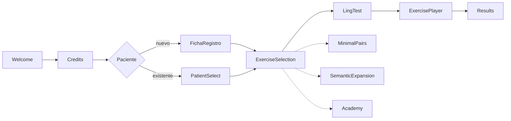
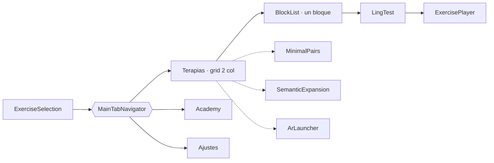

<div align="center">

<picture>
  <source media="(prefers-color-scheme: dark)" srcset="assets/valeria-logo-white.png">
  <source media="(prefers-color-scheme: light)" srcset="assets/valeria-logo.png">
  
</picture>

### 🐈‍⬛ Terapia auditivo‑verbal y del lenguaje, offline y en tu bolsillo

**App móvil para niñas y niños con hipoacusia, implante coclear, dislalias o
dificultades del lenguaje.**

<br>

<!-- Idiomas -->


<!-- Stack -->


</div>

<div align="center">
  <a href="#-qué-es-valeria"><b>¿Qué es?</b></a> ·
  <a href="#-bloques-de-terapia"><b>Terapia</b></a> ·
  <a href="#-academy--formación-del-cuidador"><b>Academy</b></a> ·
  <a href="#-idiomas-y-variedades"><b>Idiomas</b></a> ·
  <a href="#-puesta-en-marcha"><b>Puesta en marcha</b></a> ·
  <a href="#-documentación"><b>Documentación</b></a>
</div>

---

## 📑 Índice

<table>
<tr>
<td valign="top" width="50%">

**Producto**
- [¿Qué es Valeria+?](#-qué-es-valeria)
- [Bloques de terapia](#-bloques-de-terapia)
- [Academy · formación del cuidador](#-academy--formación-del-cuidador)
- [Lúa · la mascota y la marca](#-lúa--la-mascota-y-la-marca)
- [Panel del Adulto · Carga Comunicativa](#-panel-del-adulto--carga-comunicativa)
- [Idiomas y variedades](#-idiomas-y-variedades)
- [Flujo de pantallas](#-flujo-de-pantallas)

</td>
<td valign="top" width="50%">

**Ingeniería y clínica**
- [Telemetría del piloto clínico](#-telemetría-del-piloto-clínico)
- [Documentación](#-documentación)
- [Puesta en marcha](#-puesta-en-marcha)
- [Builds (EAS)](#-builds-eas)
- [Build iOS en local (Mac + Xcode)](#-build-ios-en-local-mac--xcode)
- [Port nativo iOS (Xcode)](#-port-nativo-ios-xcode)
- [Build automático (GitHub Actions)](#-build-automático-github-actions)
- [Backend opcional (Firebase)](#-backend-opcional-firebase)
- [Privacidad y ficha de Play Store](#️-privacidad-y-ficha-de-play-store)
- [Historial de versiones](#-historial-de-versiones)

</td>
</tr>
</table>

---

## 🐈‍⬛ ¿Qué es Valeria+?

Valeria+ reúne en un solo lugar el **registro del paciente**, una comprobación
auditiva previa (**Test de Ling**), **siete bloques de terapia**, un módulo de
**formación del cuidador** (**Academy**) y un **panel de resultados** para seguir
la evolución.

Parte de un principio clave: **los padres y cuidadores son el motor de voz y
evaluación**. El reconocimiento de voz ayuda, pero **el adulto siempre es el juez
final** (puede corregir el veredicto con un toque) y, donde no hay micrófono
(Expo Go, web), valora la respuesta con botones. Así la terapia funciona en
cualquier dispositivo y **sin conexión**.

> [!NOTE]
> **Principio de diseño (marco MDR).** La app nunca decide sola: el adulto es el
> juez clínico de cada respuesta y todo funciona **offline**, sin micrófono
> obligatorio y en cualquier dispositivo (Expo Go, web, móvil).

---

## 🧩 Bloques de terapia

| Bloque | Para qué sirve |
| --- | --- |
| 🗣️ **Pares Mínimos** | Dislalias fonológicas (rotacismo, sigmatismo, frontalización velar, f→p). 15 pares casi iguales (rana/lana) en 6 grupos —añade nasales y laterales— con juego de voz, misión física y sello doble padre‑hijo. |
| 🧩 **Expansión Semántica** | Progresión léxica para intervención temprana, en cuatro bloques: 5 **escenarios** diarios, 5 **categorías léxicas** con progresión de dificultad, 9 **progresiones** de campo semántico (concepto → parte → acción → cualidad) y 8 **cápsulas de contraste** con doble vuelta (comprensión por selección de imagen + producción). Cada actividad empieza por una **antesala** con el material necesario. |
| 👂 **Audición** (18 terapias) | Protocolo ACOPROS: fonética‑fonología, semántica, morfosintaxis, pragmática y **escucha en ruido** (RA‑1…RA‑5) para audífono, implante coclear o hipoacusia. |
| 💬 **Lenguaje** (7 terapias) | Protocolo familiar: atención conjunta, imitación, comprensión, expresión, comunicación funcional, regulación e interacción social. |
| 🧠 **TEA** (6 terapias) | PRT + TCC: atención conjunta triangulada (Time Delay + Sello Doble), quiebre pragmático con consentimiento, espejo asimétrico, transición interrumpida, categorización bajo ruido y múltiples señales simultáneas. Todos los estresores son **manuales** (Panel del Adulto). |
| 📖 **Dislexia** (6 terapias) | Fonología y acceso léxico: intruso fonológico auditivo puro, rastreo léxico con interferencia, síntesis fonémica rítmica (latencia 500 ms + Juez), criba de pseudopalabras (máx. 5 ensayos), rastreo visual de rotaciones b/d · p/q con mapa de misclicks y denominación rápida (RAN). |
| 🎯 **Realidad Aumentada** (3 terapias · solo Android) | **Gamificación Condicionada**: la cámara frontal deja de grabar y pasa a ser un sensor de conducta motora, y el refuerzo 3D se dispara **solo** por el gesto objetivo, nunca por acierto acústico ni por paso del tiempo. Cinemática orofacial con el **micrófono apagado** (AR‑1), localización del sonido instrumentada —la versión con cronómetro de RA‑5— (AR‑2) y selección semántica por fijación de la mirada, sin motricidad fina (AR‑3). Ningún fotograma se graba ni sale del teléfono. La tarjeta solo aparece si el teléfono supera la **Prueba de Aptitud del Dispositivo**. |

El **Test de Ling** (6 sonidos) precede a los ejercicios de audición cuando el
paciente usa audífono o implante, y la **gamificación** (XP, racha 🔥, niveles e
insignias) mantiene la motivación en todos los bloques.

> [!TIP]
> **Rondas y sesiones.** Cada mini‑juego de Audición y Lenguaje rota hasta 3
> contenidos («🔄 Otra ronda») y puede encadenarse en una «🎯 Sesión completa».

Además, cada mini‑juego de Audición y Lenguaje **rota hasta 3 contenidos**
distintos ("🔄 Otra ronda"), encadenables en una **"🎯 Sesión completa"** por
bloque, con pausas activas unificadas entre ejercicios (`ValeriaSessionBreakOverlay`):
alternan la **cápsula TPR clásica** ("escucha y muévete") y la **Ruta de Rutina
TPR 2.0** (morfosintaxis transaccional).

> [!NOTE]
> **Frases portadoras retiradas del flujo (v9.1).** Hasta la v9, la palabra
> objetivo de Pares Mínimos se incrustaba en una frase generada por un motor
> combinatorio. Al resolver **DC‑5**, las logopedas de ACOPROS fijaron otra
> consigna estándar: **presentación del par + repetición del objetivo**
> («rata… lata… dime: rata»). El módulo `valeriaCarrierPhrases` se conserva por
> si se recupera como modo avanzado, pero **no se enumera en el corpus de voz ni
> se locuta**.

---

## 🎓 Academy · formación del cuidador

En la terapia auditivo‑verbal el **adulto es el motor clínico** de cada sesión
(requisito **MDR**: la app nunca decide sola). **Academy** (`src/ValeriaAcademy/`)
capacita a padres y cuidadores para que acompañen como profesionales, mediante
**Cápsulas de Conocimiento** de consumo rápido (≈2 min) con **micro‑quiz** de
validación ágil. Se muestra como una **tarjeta prominente** en el hub de
`ExerciseSelection`, con la misma jerarquía visual que los bloques de terapia y
una **barra de progreso que se actualiza en tiempo real**.

El hub es **multidominio**: cada dominio mantiene su propio silo de XP, nivel e
insignias, y el progreso nunca se mezcla entre ellos.

| Dominio | Qué enseña |
| --- | --- |
| 💬 **Lenguaje** | El baño de lenguaje (input antes que producción), la conversación por turnos (*serve and return*), por qué el TPR consolida, y los vicios a evitar: **remodelar** (*recast*) en vez de corregir y comentar más que preguntar. |
| 👂 **Hipoacusia / Sordera** | Qué es la sordera, su abordaje y el manejo de los dispositivos (audífono, implante coclear, osteointegrado) en micro‑guías. |
| 🗣️ **Dislalias** | Puntos de articulación y práctica de los sonidos difíciles. |
| 🔤 **Dislexia** | Conciencia fonológica y apoyo a la lectura emergente. |
| 🧩 **TEA** | Comunicación, anticipación y regulación en el espectro autista. |
| 🤟 **Lengua de Signos (LSE)** | Qué es la LSE y por qué no es mímica, si signar retrasa el habla, de qué está hecho un signo, el **alfabeto dactilológico completo** (27 configuraciones dibujadas, con panel de consulta de una sola pantalla), los primeros signos útiles y dónde se aprende de verdad. |

> [!IMPORTANT]
> **Sobre el módulo de LSE.** Un signo combina configuración de la mano, lugar,
> orientación y **movimiento**, más expresión facial; un dibujo estático captura
> los tres primeros. El módulo enseña lo que sí es enseñable así —el alfabeto
> dactilológico, cuyas configuraciones son posturas fijas— y para el léxico
> signado **remite a fuente signada**: vídeo, curso oficial y, sobre todo,
> personas sordas signantes. Lo dice en pantalla, no solo en el código.
> Contenido y **las 27 configuraciones del abecedario dactilológico**,
> validados por personas sordas signantes: las nueve iniciales por una persona
> sorda signante y las 18 restantes por **la logopeda y las personas sordas de
> ACOPROS**. Esa revisión es insustituible —un chequeo automático comprueba que
> un dibujo exista, nunca que se reconozca como la letra que dice ser—, así que
> toda figura nueva vuelve a pasar por ella. Las cuatro letras con movimiento
> (J, Ñ, X, Z) se marcan con ↻ y remiten a vídeo.

- **Gamificación funcional por dominio**: XP, niveles con nombre propio de cada
  silo (Novato → *Experto en Hipoacusia*, *Experto en LSE*…) e insignias
  (`📘 Primer paso`, `📗 A medio camino`, `🎓 Dominio experto`, `💯 Sin fallos`).
- **Persistencia cifrada offline**: el progreso se guarda con `valeriaCrypto`
  (JSON cifrado en reposo sobre `AsyncStorage`, clave `STORAGE_KEYS.academy`),
  igual que la telemetría del piloto.
- **Lectura O(1) sin re‑renders**: el resumen para el hub se sirve desde una
  capa en memoria con `useSyncExternalStore` (`academyStore`); completar una
  cápsula re‑renderiza **solo** la tarjeta de Academy, nunca el resto del hub ni
  la navegación. El encuadre operativo lo permite: el adulto maneja los menús y
  solo cede la tableta cuando el ejercicio ya ha empezado.

---

## 🐈‍⬛ Lúa · la mascota y la marca

<div align="center">

</div>

**La mascota de Valeria+ es Lúa, una gata negra tipo *smoking*, dibujada en
píxel art.** Es la mascota desde la v12, y lo es en todas partes: hub,
bienvenida, créditos, celebración de sesión, distractor de doble tarea, nombres
de nivel, icono de la app y pantalla de arranque.

| Dónde aparece | Qué se ve |
| --- | --- |
| **Hub** | Lúa en la tira de juego, con nivel y XP |
| **Premios** (`ValeriaAwardsSheet`) | «Los premios de Lúa»: 12 niveles y 18 insignias |
| **Nombres de nivel** | **Gatita → Gata Curiosa → … → Gata Lunar → Gata Legendaria** (12 niveles) |
| **Doble tarea** (`ValeriaDistractorCat`) | La misma gata como distractor periférico. El Panel del Adulto lo llama **«Gata distractora»** |
| **Calentamiento de Realidad Aumentada** | «mirar a Lúa, seguirla a las esquinas» |
| **Icono, icono adaptativo y splash** | La cara de Lúa (`assets/icon.png`, `adaptive-icon.png`, `splash.png`) |

### Un solo sprite, cero PNG a mano

El dibujo vive en [`src/ValeriaCatPixel.tsx`](src/ValeriaCatPixel.tsx) como una
**rejilla de caracteres** que se pinta como rectángulos de 1×1 en un `viewBox`:
escala a cualquier tamaño sin perder el borde duro, y un mapa de texto **se
revisa en el diff**; un PNG no. Dos poses, elegidas por el propio componente:
**cabeza sola** por debajo de 90 px (a ese tamaño la cara de cuerpo entero se
emborrona) y **cuerpo entero** por encima.

Los cuatro bitmaps de marca se **generan** desde ese mismo sprite:

```bash
npm run build:brand   # → assets/icon.png · adaptive-icon.png · splash.png · docs/lua-mascota.png
```

Si mañana cambia el sprite, se vuelve a correr y los cuatro salen iguales: nadie
redibuja ni exporta a mano. El lado del píxel es **entero** en los tres assets
(20, 16 y 12 px) —con un lado fraccionario el antialias parte las filas del
dibujo—, y el icono adaptativo de Android se dibuja a 512 px dentro del lienzo
de 1024 porque el sistema recorta a círculo o *squircle* y a tamaño completo el
recorte le comía las orejas.

### La gata de la app y el aparato Lúa son el mismo personaje

**Lúa** nombra también el **periférico físico** de refuerzo sobre ESP32‑C3
([`docs/plan-integracion-lua.md`](docs/plan-integracion-lua.md), `firmware/lua/`,
`src/valeriaLuaProtocol.ts`). No son dos cosas con el mismo nombre: el panel del
aparato es de **240×240**, o sea que el píxel art es su formato nativo, y **la
cara del aparato sale de la misma rejilla que la de la app**. Un solo dibujo,
dos superficies.

> El **oso sí sigue existiendo como contenido terapéutico** y eso no es un
> descuido: «oso» es palabra de los bancos léxicos (par mínimo *ocho/oso*, frase
> de lectura «EL OSO COME PAN», orden TPR «camina como un oso»). Es vocabulario,
> no marca.

---

## 🎛️ Panel del Adulto · Carga Comunicativa

Para el piloto clínico, Valeria+ añade un **Panel del Adulto** (`ValeriaAdultChaosPanel`)
—tarjeta colapsable presente en el player— con tres módulos de **carga
comunicativa manual**. La regla innegociable es un **muro regulatorio (MDR)**:
la app **jamás activa, mide ni adapta** nada por su cuenta; todo lo acciona el
adulto de forma explícita. Automatizar el ajuste convertiría la app en un
audiómetro algorítmico (SaMD), y cualquier lógica de ese tipo debe rechazarse.

| Módulo | Qué hace |
| --- | --- |
| 🔊 **Escucha en ruido** (`ValeriaManualNoiseSlider` + `valeriaNoise`) | Reproducción dual: la instrucción TTS sobre una pista de **ruido babble** de cafetería en bucle. El volumen del ruido muta **solo** con el slider manual (0‑10) del adulto; la telemetría se registra al soltar, no por píxel. |
| 🐈‍⬛ **Doble tarea** (`ValeriaDistractorCat`) | **Lúa** se asoma por la periferia y se mueve **sin ser interactiva** (`pointerEvents="none"`): interferencia visual pura para el paradigma de carga cognitiva dual. Animación por el hilo nativo, arrancada tras `InteractionManager`. Es la **misma gata** del hub, no un segundo personaje. |
| 💬 **Quiebre pragmático** (`ValeriaPragmaticBreak`) | "Fallo deliberado": la app calla y es el adulto quien rompe la comunicación a propósito para observar cómo el niño la **repara**. La botonera de acierto se reemplaza por un selector de **estrategias de reparación**. Un modal advierte de la "frustración útil" antes de empezar. |

Los overlays (gata y quiebre) viven en la raíz de la pantalla anfitriona —no
dentro del `ScrollView`— y registran su rectángulo en `ValeriaMisclickBoundary`
para no ensuciar la telemetría de misclicks.

---

## 🌐 Idiomas y variedades

Valeria+ locuta y evalúa el **contenido terapéutico** en **cinco variedades**,
seleccionables desde la tarjeta **«Voz de la app»** (`ValeriaVoiceUI`). La
variedad activa vive en un único módulo (`src/valeriaLocale.ts`), que desacopla
tres decisiones: qué banco de audio usar, qué locale BCP‑47 pasar al
reconocedor/voz del sistema y si conviene preferir voces latinas.

**El idioma de la interfaz es una decisión aparte de la variedad de terapia**, y
esa separación es deliberada: en un *caseload* bilingüe, la logopeda puede
querer la app en inglés y trabajar en castellano con un niño, o al revés. Vive
en su propio módulo (`src/valeriaUiLang.ts`, `UiLang = 'es' | 'en'`), con
suscripción propia porque cambiar el idioma **repinta** la pantalla, mientras
que la variedad basta con leerla en el momento de hablar.

| Variedad | Voz | Reconocimiento (ASR) |
| --- | --- | --- |
| 🇪🇸 **Castellano** (`es`) | Voz neuronal **Sharvard** pregenerada y empaquetada (offline). | Sistema `es-ES`, **pidiendo reconocimiento local** si el paquete de idioma está instalado. |
| **Galego** (`gl`) — *Proxecto Nós* | Voz neuronal **Celtia** pregenerada (Proxecto Nós), empaquetada. Cubre pares mínimos, cápsulas TPR, rutas, Expansión Semántica, Audición, Lenguaje, TEA y Dislexia: todos los bloques tienen banco gallego propio. | Sistema `gl-ES` con recaída a `expo-speech`. |
| 🇩🇴 **Dominicano** (`es-DO`) — *Quisqueya Habla* | Voz **latina del dispositivo** (`es-US`/`es-MX`); sin audio propio pregenerado. | Sistema `es-DO`, priorizando el catálogo latino. |
| **Euskara** (`eu`) — *ILENIA/NEL-GAITU · HiTZ* | Voz neuronal **HiTZ-TTS** pregenerada (UPV/EHU · Aholab), empaquetada. Cubre pares mínimos, expansión semántica, Audición, Lenguaje, TEA, Dislexia y Test de Ling en euskera batua. | Sistema `eu-ES` con recaída a `es-ES` + pliegue vasco (`foldBasque`, ⟨h⟩ muda). |
| 🇺🇸 **US English** (`en-US`) | Voz neuronal **LJSpeech · piper** pregenerada (mismo motor que Sharvard; voz de dominio público con modelo MIT, tras descartar dos candidatas por licencia en EN‑0.1). **614 locuciones** empaquetadas. | Sistema `en-US`, pidiendo reconocimiento local como en castellano. |

### El inglés no es una traducción: es la quinta variedad, y la primera con interfaz propia

Es el trabajo que rompió el molde de los tres idiomas anteriores, porque exigió
piezas que no existían:

| Pieza | Estado |
| --- | --- |
| **Catálogo de interfaz en inglés** (`src/i18n/strings.en.ts`, ~1 200 líneas) | Es la **primera traducción de la UI** del proyecto. Va **tipado contra el catálogo castellano**: añadir una clave en `strings.es.ts` y olvidarla aquí **rompe el `typecheck`**. Deliberado — una cadena que falta debe romper el build, nunca salir en blanco en la tableta de una familia |
| **Registro estadounidense, no traducción literal** | *caregiver* y no *tutor* (en EE. UU. un *tutor* da clases particulares), *child* y no *kid* en lo que lee un clínico, *sentence case* en los botones, y HIPAA antes que RGPD en la línea de confianza: audiencia US primero |
| **Banco clínico propio** (`valeriaExerciseEn.ts`, `valeriaMinimalPairsEn.ts`, `valeriaSemanticExpansionEn.ts`, `valeriaContentEn.ts`) | Todos los bloques con contenido inglés propio, no calcado del castellano: grupos consonánticos, vocales tensa/laxa y ortografía opaca piden otros ejercicios |
| **Interruptor de seguridad** (`EN_THERAPY_CONTENT_READY`) | Mientras el banco no existía, `en-US` habría mostrado contenido **castellano**, y pedirle al TTS inglés que lea «perro» no produce castellano con acento: produce ruido. Con el banco terminado está en `true` y la variedad se comporta como cualquier otra. Es el conmutador a bajar si algún día se añade una variedad antes que su contenido |
| **Guía dialectal bloqueante** ([`docs/guia-dialectal-en-US.md`](docs/guia-dialectal-en-US.md)) | Qué es rasgo del inglés afroamericano o sureño y qué es error terapéutico. Espejo exacto de la guía dominicana: un rasgo dialectal **nunca** cuenta como fallo |
| **Revisión clínica** ([`docs/protocolo-evaluacion-clinica-en-US.md`](docs/protocolo-evaluacion-clinica-en-US.md)) | Protocolo EN‑0.9 para la revisora: profesora SLP con licencia (*Howard University*) |

> **Reconocimiento local (Fase A).** Desde la migración a `expo-speech-recognition`,
> la app **pide** que el reconocimiento se haga dentro del teléfono
> (`requiresOnDeviceRecognition`, que en Android 13+ enlaza con el reconocedor local del sistema),
> para que el audio del menor no salga del dispositivo. **No es una promesa
> global**: la decisión se toma **por variedad**, porque depende de que el paquete
> de idioma esté descargado. Es razonable que lo esté en castellano; en galego y
> euskera es mucho menos probable, y ahí se sigue usando el reconocedor de red
> como antes. La telemetría registra qué modo tocó en cada escucha
> (`SessionRecord.asr`) precisamente para saberlo con datos y no por suposición.
> Ver [`docs/plan-asr-privacidad-y-motor-local.md`](docs/plan-asr-privacidad-y-motor-local.md).
>
> **Lo que ve el adulto.** La tarjeta «Voz de la app» lleva debajo un bloque que
> dice, para la variedad activa, si se está escuchando **en el teléfono** o con
> el **servicio del sistema**, y *por qué* cuando es lo segundo (el móvil no
> sabe, falta el motor local, o falta el paquete de idioma). Si el único
> impedimento es el paquete, ofrece descargarlo **una vez**
> (`androidTriggerOfflineModelDownload`, Android 13+); si el adulto declina, se
> recuerda y no se vuelve a insistir. Ese bloque es además el diagnóstico rápido
> del nivel 2 en dispositivo: muestra el modo de la última escucha real sin
> tener que exportar la telemetría.
>
> ⚠️ **Pendiente de verificar en dispositivo**: que el audio no salga con red
> activa solo lo demuestra una inspección de tráfico, no el modo avión.

- **Voz neuronal offline.** El audio de castellano, gallego y euskera se
  sintetiza en CI (nunca en el dispositivo) y viaja empaquetado en el APK. El
  corpus enumerado son **2438 locuciones** (878 `es` · 816 `gl` · 744 `eu`), y
  cada id se resuelve contra `src/valeriaVoiceAssets.ts` (mapa generado). Una
  variedad **solo reproduce assets de su propia voz**: si falta uno, cae con
  elegancia a `expo-speech`, nunca a la voz de otra lengua (mezclar Celtia y
  Sharvard en el mismo ejercicio se oía como un salto de locutor). El gate
  `check-voice-corpus-coverage.js` impide empaquetar un APK con locuciones sin
  asset en `es`/`gl`/`eu`.
- **Quisqueya Habla (es‑DO)** es un proyecto **editorial**, no de traducción:
  usa léxico y registro dominicanos y, sobre todo, **no penaliza como trastorno
  los rasgos dialectales normales** del español caribeño (seseo, aspiración de
  /s/, neutralización de líquidas en coda). Esa frontera clínica —qué es rasgo y
  qué es error— está fijada en [`docs/guia-dialectal-es-DO.md`](docs/guia-dialectal-es-DO.md),
  regla bloqueante del piloto.
- **Bancos de pares mínimos por variedad**: castellano
  (`src/valeriaMinimalPairs.ts`), gallego (`src/valeriaMinimalPairsGl.ts`, 7
  pares) y dominicano (`src/valeriaMinimalPairsEsDO.ts`, 8 pares construidos solo
  donde el contraste es estable en RD).

---

## 🗺️ Flujo de pantallas



### Interfaz v11 · pestañas inferiores ✅ **activa**

Los testers del piloto reportaron que el uso «se hace muy engorroso y hay mucho
texto». El hub de la v10.2 concentraba cinco tareas en una sola pantalla
—bloques, lista prescribible, recordatorios, calidad de voz y acceso
profesional— con unos **1.490 px de scroll**, dos pantallas y media, para llegar
a los ajustes.

La **v11** reorganiza esa pantalla sin tocar el resto de la app, y es la
interfaz que arranca: `MainTabNavigator` va cableado directo en
[`AppNavigator`](src/AppNavigator.tsx).

> **Sin interruptor.** Durante el desarrollo hubo un `ENABLE_V11_UI` que
> permitía construir la v11 sin tocar producción. Cumplió su papel, pero
> también permitía compilar una versión en la que no se veía ningún cambio, y
> eso costó un build entregado a evaluación externa con la interfaz antigua.
> Se ha retirado junto con `ValeriaExerciseSelectionScreen`: **lo que está en
> `main` es lo que sale al compilar**. Volver atrás es un revert de git, no
> cambiar una constante.



| Qué cambia | Por qué |
| --- | --- |
| Cuadrícula de 2 columnas **sin subtítulos** | Los ~718 caracteres de prosa del hub se reubican al `refCard` del bloque, donde se leen justo antes de usarlo. Ninguna clave i18n se borra: varias llevan carga MDR («Estresores siempre manuales», «Sin grabar nada y con el micrófono apagado»). |
| Recordatorios, voz y acceso profesional → **Ajustes** | Al fondo del hub eran, en la práctica, invisibles. |
| La lista de un bloque pasa a ser **ruta real** (`BlockList`) | En la v10.2 era un `useState`: el botón atrás de Android no volvía al hub, salía de `ExerciseSelection` entera. Como ruta, se arregla solo. |
| El player **no** vive bajo las pestañas | Durante el ejercicio la pantalla es del niño; no puede haber salidas laterales a un toque. |

**Los nombres de ruta no se traducen ni se renombran.** La pestaña se llama
`ExerciseSelection` y solo muestra «Terapias» como etiqueta visible: la
telemetría indexa el tiempo por nombre de ruta y rebautizarla partiría la serie
del piloto. Plan completo y muro de contención en
[`docs/plan-evolucion-ux-v11.md`](docs/plan-evolucion-ux-v11.md).

---

## 📊 Telemetría del piloto clínico

Para recabar **evidencia de usabilidad** durante el piloto (validación
regulatoria y académica) sin fricción para las familias, Valeria+ incluye una
capa de telemetría **offline, anónima y no bloqueante**. La restricción
innegociable es que **ni la captura de eventos ni la escritura en disco bloqueen
el hilo principal**: la captura solo muta memoria (O(1)) y programa un volcado
con *debounce* vía `InteractionManager`, de modo que el cifrado y el guardado en
`AsyncStorage` nunca coinciden con las animaciones ni con el audio.

| Qué mide / hace | Cómo |
| --- | --- |
| ⏱️ **Tiempo activo por pantalla** | El navegador anota cada cambio de ruta (`noteScreen`); solo aritmética de timestamps. |
| 👆 **Misclicks** (toques fuera de zonas interactivas) | `ValeriaMisclickBoundary` usa el sistema de *responder* de RN: solo los toques en zonas muertas llegan a la raíz. Cede el gesto al scroll. |
| 🧩 **Abandono intra‑cápsula TPR** | Se cuentan cápsulas mostradas vs. saltadas vs. completadas en el player. |
| 💬 **Evaluación subjetiva (SUS adaptado)** | Modal Likert 1‑5 (`ValeriaSUSModal`) orientado a la **carga de uso real** ("integrar el ejercicio en la rutina de mi hijo/a"). *Rate limiting* para evitar sesgo de fatiga: solo en el **hito de 4 bloques distintos** (umbral desacoplado del total de 6: los módulos TEA/Dislexia ni lo bloquean ni lo fuerzan) y **máx. 1 vez/semana** por dispositivo. |
| 🔒 **Persistencia y correlación** | Telemetría + Likert se guardan en un **JSON cifrado en reposo** (`valeriaCrypto`, keystream SHA‑256 en JS puro) bajo el **mismo id de sesión**. Se **purga solo tras una exportación exitosa**, evitando el desborde de memoria semana a semana. |
| 🎛️ **Interfaz de la sesión** (`ui: 'v10' \| 'v11'`) | Sella con qué interfaz se registró cada sesión. Activar las pestañas mueve la línea base de dos métricas: la barra inferior absorbe toques que antes caían en zona muerta (menos *misclicks*, sin que nadie se equivoque menos) y `BlockList` se lleva un tiempo que antes se imputaba a `ExerciseSelection`. Con el sello, los tramos pre/post se separan **por dato** y no por fecha de despliegue —que es aproximada y se pierde al reinstalar—. El resumen exportado incluye `sessionsV11`: si está entre 0 y `sessions`, la muestra mezcla interfaces y los *misclicks* agregados no son una serie homogénea. |

**Exportación dual** (Modo Profesional, PIN `1985` → `ValeriaProExport`; en la
interfaz clásica se entra desde el hub de bloques, en la v11 desde **Ajustes**):

- **Offline puro** → **código QR** con el resumen estadístico comprimido
  (abandonos, misclicks, media Likert), legible por cámaras móviles. El
  codificador QR es **JS puro sin dependencias** (`valeriaQR`, modo byte, nivel
  M), verificado bit a bit contra la librería de referencia `qrcode`.
- **ShareSheet** → `ACTION_SEND` nativo con el **log transaccional completo en
  crudo** (email/WhatsApp) para cuando haya conectividad.

> **Notas para la fase regulatoria.** La telemetría es **anónima** (sin datos
> personales, sin audio, sin el contenido de las respuestas). El cifrado en
> reposo guarda la clave en `AsyncStorage`; el módulo `valeriaCrypto` está
> aislado para migrarla a `expo-secure-store` (Keystore/Keychain) en producción.
> Al tratarse de un piloto con menores, el **consentimiento informado** de las
> familias debe gestionarse en el protocolo del estudio, fuera de la app.

---

## 📚 Documentación

| Documento | Descripción |
| --- | --- |
| **Manual de usuario con casos de uso** (v12) · [HTML](docs/manual-casos-de-uso.html) · [PDF](docs/Valeria-Manual-Casos-de-Uso.pdf) · [Word](docs/Valeria-Manual-Casos-de-Uso.docx) | **22 casos de uso** paso a paso ilustrados con capturas reales (`docs/screenshots/`): **Academy · hub de formación multidominio (CU‑03)**, los **siete bloques** (Pares Mínimos, Expansión Semántica, Audición, Lenguaje, TEA, Dislexia y **Realidad Aumentada**), el hub, la gráfica de sustitución por fonema, la telemetría del piloto (CU‑14), la variedad lingüística —Castellano, Galego, Dominicano y Euskera— (CU‑15), el Panel del Adulto / carga comunicativa (CU‑16), el **módulo de Lengua de Signos Española (CU‑17)** y el **bloque de Realidad Aumentada completo (CU‑18 a CU‑22)**: permiso de cámara y prueba de aptitud, los tres ejercicios y los umbrales clínicos. Cubre las novedades v6 → v12: la mascota **Lúa** y la colección de **premios** con doce niveles y dieciocho insignias (CU‑11), Academy con **siete dominios** (CU‑03), la iconografía propia de la v12 y el **Anexo C** sobre el periférico físico. Todas las capturas están tomadas sobre la v12. |
| [`docs/plan-evolucion-ux-v11.md`](docs/plan-evolucion-ux-v11.md) | Plan de evolución UX/UI v10.2 → v11 en respuesta al feedback del piloto («engorroso», «mucho texto»): diagnóstico medido sobre el código, cuadrícula de 2 columnas, pestañas inferiores y el **muro de contención** que garantiza cero regresiones clínicas y cero pérdida de la serie de telemetría. Implementado y activo; el interruptor `ENABLE_V11_UI` se retiró al cerrar el Sprint 4.6. |
| [`docs/protocolo-pares-minimos.md`](docs/protocolo-pares-minimos.md) | Protocolo de pares mínimos para dislalias fonológicas: 10 pares accionables con flujo TTS→STT, feedback por rama y misiones físicas. Implementado en `src/ValeriaMinimalPairsScreen.tsx` + `src/valeriaMinimalPairs.ts`. |
| [`docs/protocolo-pares-minimos-es-DO.md`](docs/protocolo-pares-minimos-es-DO.md) | Protocolo de pares mínimos en español dominicano (Quisqueya Habla). Implementado en `src/valeriaMinimalPairsEsDO.ts`. |
| [`docs/protocolo-expansion-semantica.md`](docs/protocolo-expansion-semantica.md) | Protocolo de expansión semántica / progresión léxica offline. Implementado en `src/ValeriaSemanticExpansionScreen.tsx` + `src/valeriaSemanticExpansion.ts`. |
| [`docs/protocolo-realidad-aumentada.md`](docs/protocolo-realidad-aumentada.md) | Protocolo clínico del bloque de Realidad Aumentada: consentimiento de cámara, Prueba de Aptitud del Dispositivo, colocación del teléfono y los tres ejercicios (AR‑1 cinemática orofacial, AR‑2 localización instrumentada, AR‑3 selección por fijación), con el muro MDR explicado ejercicio a ejercicio. Implementado en `android-native/valeria-ar/` + `src/ValeriaArLauncherScreen.tsx`. |
| [`docs/guia-dialectal-es-DO.md`](docs/guia-dialectal-es-DO.md) | Guía clínica dominicana (QH‑0.2): qué es rasgo dialectal normal y qué es error terapéutico. Regla **bloqueante** para todo dataset es‑DO. |
| [`docs/plan-integracion-proxecto-nos.md`](docs/plan-integracion-proxecto-nos.md) | Plan por fases de la versión en gallego apoyada en los recursos abiertos del Proxecto Nós (contenido, voz Celtia, ASR). |
| [`docs/plan-integracion-quisqueya-habla.md`](docs/plan-integracion-quisqueya-habla.md) | Plan de la variante dominicana (es‑DO), que reutiliza la infraestructura de variedad del plan gallego. |
| [`docs/plan-integracion-ingles-en-US.md`](docs/plan-integracion-ingles-en-US.md) | Plan por fases para el inglés de Estados Unidos (`en‑US`). **Interfaz, banco clínico y voz ya implementados** — ver [Idiomas y variedades](#-idiomas-y-variedades). Rompió el molde de los tres planes de idioma anteriores: fue el primero que exigió **traducir la interfaz** (hasta entonces las cadenas estaban literales en las 27 pantallas), el primero que abre **mercado nuevo** (COPPA, *Designed for Families*, ficha de tienda y página de eliminación de datos en inglés) y el que más rediseño clínico pide (grupos consonánticos, vocales tensa/laxa, ortografía opaca). Decisiones ya cerradas: **revisión clínica confirmada** (profesora SLP con licencia, *Howard University*), **separación del idioma de interfaz respecto de la variedad de terapia** —para el *caseload* bilingüe español‑inglés— y la regla bloqueante de **diferencia dialectal vs. trastorno** para el inglés afroamericano y el sureño, espejo de la guía dominicana. |
| [`docs/protocolo-evaluacion-clinica-en-US.md`](docs/protocolo-evaluacion-clinica-en-US.md) | Protocolo de la **evaluación clínica estadounidense** (EN‑0.9): cómo se instala la build de prueba en Android, qué debe juzgar la revisora —validez de la mecánica, **diferencia dialectal vs. trastorno**, registro del inglés y usabilidad—, qué queda **fuera de alcance** para que no gaste el informe en ello, y el formato tabulado (*tipo · gravedad · propuesta*) que permite convertir cada observación en una tarea del plan. |
| [`docs/plan-asr-privacidad-y-motor-local.md`](docs/plan-asr-privacidad-y-motor-local.md) | Plan en dos fases para que el audio del turno de habla **no salga del dispositivo**: (A) reconocimiento local con el motor del sistema —**software terminado**, pendiente de verificar en dispositivo— y (B) prueba de concepto medida de un motor local (`sherpa-onnx`), con puerta GO/NO‑GO numérica y banco de medida ya implementado. Contiene dos hallazgos que cambiaron el plan: que `@react-native-voice/voice` descartaba en silencio las claves que no conocía (§2.2), y que **25 de los 35 pares mínimos puntúan como acierto que el niño diga el distractor** (§4.0). Revisa el NO‑GO de [`docs/asr-euskera-ilenia.md`](docs/asr-euskera-ilenia.md). |
| [`docs/plan-mejoras-acopros-logopedas.json`](docs/plan-mejoras-acopros-logopedas.json) | **Fuente de verdad** del plan de mejoras nacido del feedback clínico de ACOPROS: cada observación verificada contra el código, con decisiones clínicas (DC‑1…DC‑5), criterios de aceptación y estado. Incluye el **bloqueo de publicación** del corpus de voz. |
| [`docs/criterio-dificultad-lexica.md`](docs/criterio-dificultad-lexica.md) | Criterio del campo `difficulty` de las categorías léxicas (ES‑08): la progresión la marca la **familiaridad**, no la dificultad de pronunciación. Incluye por qué la frecuencia **no se hereda entre variedades** (en RD el plátano es el de freír; el que se come crudo es el guineo). |
| [`docs/auditoria-pictogramas.md`](docs/auditoria-pictogramas.md) | Inventario de toda la carga visual en uso, clasificada por riesgo (*tofu*, atributo, revisar) con columna de veredicto para ACOPROS. Se **regenera** con `node scripts/audit-pictograms.js --markdown`. |
| [`docs/arquitectura-exportacion-ios.json`](docs/arquitectura-exportacion-ios.json) | **Blueprint replicable** de la exportación a iOS: cómo conviven la app Expo (que no versiona `ios/`) y el port nativo de `ios-native/`, dónde vive la firma para que el Team ID no acabe en el `pbxproj`, los tres modos de `archive.sh`, qué se puede con cuenta gratuita y el catálogo de errores frecuentes. Pensado para **portarlo a otros repositorios**. |
| [`docs/arquitectura-corpus-voz-nos-ilenia.json`](docs/arquitectura-corpus-voz-nos-ilenia.json) | **Blueprint replicable** de la arquitectura de voz neuronal (Proxecto Nós / ILENIA): enumeración del corpus, síntesis en build‑time e integración offline‑first con degradación elegante. |
| [`docs/plan-calidad.md`](docs/plan-calidad.md) | Task list priorizada para reducir regresiones (checklist de humo, pruebas por bloque). |
| [`docs/firebase-setup.md`](docs/firebase-setup.md) | Guía del backend opcional: Firebase Authentication + Cloud Firestore. |

**Regenerar el manual** tras editar [`docs/manual-casos-de-uso.html`](docs/manual-casos-de-uso.html):

```bash
node docs/capture-screenshots.js  # capturas (Playwright sobre expo start --web)
node docs/build-pdf.js            # → PDF
python3 docs/build-docx.py        # → Word (requiere python-docx y lxml)
```

> El HTML es la **única fuente**: los dos generadores lo leen. Hasta la v11,
> `build-docx.py` llevaba el texto del manual duplicado dentro y había que
> editar los dos ficheros a mano; el Word acabó describiendo la v10.3 con la
> mascota antigua mientras el HTML iba por la v12. Ya no puede volver a pasar.
>
> La mascota de la portada (`docs/lua-mascota.png`) sale del mismo sprite que
> la app, con `node scripts/build-brand-assets.js`.
>
> El capítulo de **Realidad Aumentada** (CU‑18 a CU‑22) no lleva capturas a
> propósito: esos ejercicios solo funcionan con la cámara abierta en un teléfono
> físico, y cualquier captura fiel mostraría la cara de un niño.

---

## 🚀 Puesta en marcha

> **Requisitos:** Node.js 18+, `npm` y una **build de desarrollo** instalada en
> el dispositivo (o un emulador Android / simulador iOS). Para un vistazo rápido
> también sirve **Expo Go**, con los límites que se explican abajo.

```bash
npm install       # instala dependencias
npm start         # expo start — abre el panel de Metro
npm run typecheck # tsc --noEmit — comprobación de tipos
```

| Comando | Qué hace |
| --- | --- |
| `npm start` | Arranca Metro en modo **dev client**: el QR abre la build de desarrollo instalada. |
| `npm run start:go` | Fuerza `--go`: arranca Metro contra **Expo Go**. |
| `npm run android` | `expo run:android` — compila e instala la build de desarrollo en emulador o dispositivo **Android** (requiere Android SDK). |
| `npm run ios` | `expo run:ios` — compila e instala en el simulador **iOS** (solo macOS). |
| `npm run web` | Abre la versión **web** en el navegador. |
| `npm run typecheck` | Verifica los tipos de TypeScript. |
| `npm run build:ar-models` | Regenera los cinco modelos 3D del bloque de Realidad Aumentada (`assets/models/*.glb`). Deterministas: si nada cambia, no producen diff. |
| `npm run fetch:ar-model` | Descarga el modelo de señal facial de MediaPipe desde su revisión fijada y verifica su SHA‑256. Idempotente. |
| `npm run check:ar-models` | Comprueba que los `.glb` y el `.task` están, caben en su presupuesto y **que sus nombres de animación siguen coincidiendo con el enum `ArModel` de Kotlin**. |

> `npm run android` y `npm run ios` **compilan**; no son atajos para abrir Expo
> Go. Para el vistazo rápido sin cadena nativa instalada, usa `npm run start:go`.
> Es `expo prebuild` quien fija esos dos valores: los reescribe a `expo run:*`
> cada vez que se ejecuta, así que no tiene sentido devolverlos a `expo start`.

### 📱 Expo Go vs. build de desarrollo

El proyecto incluye [`expo-dev-client`](https://docs.expo.dev/develop/development-builds/introduction/),
así que `expo start` arranca por defecto apuntando a la **build de desarrollo**.
Es el mismo binario nativo de la app —con sus módulos y sus permisos— pero
cargando el JavaScript desde Metro: recarga en caliente sin recompilar nada.

Importa porque **dos piezas centrales de Valeria+ no existen en Expo Go**:

| Módulo | En Expo Go | En build de desarrollo |
| --- | --- | --- |
| `expo-speech-recognition` (STT) | ❌ no está enlazado: los juegos de voz no reconocen nada | ✅ funciona |
| `expo-notifications` (recordatorios) | ⚠️ sin push remoto y con avisos limitados en iOS | ✅ funciona |

Traducción práctica: Expo Go vale para retocar interfaz, textos o navegación;
en cuanto tocas pares mínimos, expansión semántica o los recordatorios, hay que
usar la build de desarrollo. Basta compilarla **una vez** por dispositivo —
después solo se recarga JavaScript.

---

## 🏗️ Builds (EAS)

```bash
npx eas build -p android --profile apk         # APK directo: solo ARM, ProGuard + shrinkResources
npx eas build -p android --profile production  # App Bundle (.aab) para Google Play
```

El perfil `apk` limita las arquitecturas a `armeabi-v7a` y `arm64-v8a` (los
móviles reales), eliminando las librerías x86 de emulador del binario. Para
publicar en Google Play usa siempre el App Bundle: Play genera un APK optimizado
por dispositivo y la descarga es bastante menor.

### Perfiles de [`eas.json`](eas.json)

| Perfil | Plataforma | Qué produce | Necesita cuenta Apple de pago |
| --- | --- | --- | --- |
| `development` | Android + iOS | Build de desarrollo (`developmentClient`), distribución interna | Sí en iOS (ad hoc: el dispositivo debe estar registrado) |
| `ios-simulator` | iOS | Build de desarrollo para el **simulador** (`.app`) | **No** — el simulador no firma |
| `apk` | Android | `.apk` directo, solo ARM | — |
| `ios-preview` | iOS | `.ipa` en Release, distribución interna | Sí |
| `production` | Android + iOS | `.aab` para Play · `.ipa` en Release para App Store | Sí |

```bash
npx eas build -p ios --profile ios-simulator   # no necesita cuenta de pago
npx eas build -p ios --profile development     # dev client sobre iPad/iPhone real
npx eas build -p ios --profile production      # App Store Connect
```

Los perfiles iOS existen **por si algún día conviene compilar en la nube**; hoy
el camino recomendado es el build local en Mac de la sección siguiente, que no
consume cola de EAS ni exige subir credenciales de firma.

`appVersionSource: "remote"` hace que EAS lleve la cuenta del `versionCode` de
Android y del `buildNumber` de iOS; `autoIncrement` en `production` los sube
solo. No los edites a mano en `app.json`.

---

## 🍏 Build iOS en local (Mac + Xcode)

Esta es la app **React Native** de la raíz. En el repositorio no hay carpeta
`ios/`: está en [`.gitignore`](.gitignore) porque la genera Expo. El flujo
completo, desde un clon limpio:

> **Requisitos:** macOS con **Xcode** (y sus Command Line Tools), **CocoaPods**
> y Node.js 18+. Para el simulador no hace falta ninguna cuenta de Apple; para
> instalar en un iPad o iPhone físico basta una cuenta **gratuita**.

```bash
npm install
npx expo prebuild -p ios     # genera ios/ con Podfile y ejecuta pod install
npm run ios                  # compila y abre el simulador
```

Para un **iPad físico** —el escenario real de la terapia— conéctalo por USB y:

```bash
npm run ios:device           # elige el dispositivo de la lista y compila en Debug
```

`expo run:ios` compila **una sola vez** e instala la build de desarrollo. A
partir de ahí, para iterar basta con dejar Metro corriendo:

```bash
npm start                    # la app en el iPad recarga en caliente desde Metro
```

Solo hay que repetir el `prebuild` + compilación cuando cambia algo **nativo**:
una dependencia nueva con módulo nativo, un plugin de `app.json`, los permisos
o la versión del SDK. Editar pantallas, textos o corpus no lo requiere.

### Scripts iOS

| Comando | Qué hace |
| --- | --- |
| `npm run prebuild:ios` | Genera `ios/` a partir de `app.json` y ejecuta `pod install`. |
| `npm run prebuild:ios:clean` | Igual, pero **borra** `ios/` antes: el arreglo cuando CocoaPods se atasca. |
| `npm run ios` | Compila e instala en el **simulador**. |
| `npm run ios:device` | Compila en **Debug** sobre un iPad/iPhone conectado. |
| `npm run ios:release` | Compila en **Release** sobre el dispositivo: rendimiento real, sin Metro. |

`expo run:ios` ejecuta el `prebuild` por su cuenta si todavía no existe `ios/`,
así que el paso explícito solo hace falta cuando quieres inspeccionar o firmar
el proyecto en Xcode antes de compilar.

Usa `ios:release` antes de una sesión clínica de verdad: la build de Debug
carga el JavaScript desde Metro y arrastra el *dev menu*, así que no sirve para
medir cómo responde la app en las manos del niño.

### Firma en Xcode

`prebuild` deja el proyecto listo, pero la firma es tuya:

```bash
open ios/Valeria.xcworkspace   # ⚠️ el workspace, no el .xcodeproj — hay CocoaPods
```

En **Signing & Capabilities** elige tu equipo (una cuenta gratuita de Apple
sirve). El *bundle identifier* es `health.earlify.valeria`, declarado en
[`app.json`](app.json).

Con cuenta gratuita hay dos límites que conviene tener presentes: la firma
**caduca a los 7 días** —hay que reinstalar desde el Mac— y no existe TestFlight.
Distribuir a terceros exige el Apple Developer Program.

### Permisos que verás en el dispositivo

Los genera el plugin de `expo-speech-recognition` declarado en `app.json`; no
se editan a mano en el `Info.plist`, porque `prebuild` lo regenera:

| Clave | Para qué |
| --- | --- |
| `NSMicrophoneUsageDescription` | Los juegos de voz de los ejercicios |
| `NSSpeechRecognitionUsageDescription` | Valorar las palabras que dice el niño |

Si cambias lo que la app recoge, actualiza en el mismo cambio la política de
[`site/`](site/) y el formulario de *Seguridad de los datos* de Play Console.

### Problemas habituales

| Síntoma | Causa y arreglo |
| --- | --- |
| `pod install` falla tras cambiar dependencias | `npm run prebuild:ios:clean` regenera `ios/` desde cero |
| La app abre pero no conecta con Metro | Mac e iPad deben estar en la **misma red**; o usa `npx expo start --tunnel` |
| El STT no reconoce nada | Estás en **Expo Go**, no en la build de desarrollo (ver tabla de arriba) |
| El STT falla solo en galego/euskera | Probablemente no hay paquete de idioma local para esa variedad; se usa el reconocedor de red. Ver la nota de reconocimiento local |
| Cambié `app.json` y no se aplica | Los cambios nativos exigen `prebuild` + recompilar |
| Xcode se queja de la firma | Falta el equipo en *Signing & Capabilities*, o caducó la firma de 7 días |

> `ios/` es un artefacto generado: **no lo versiones**. Todo lo que deba
> persistir —permisos, plugins, identificadores— vive en `app.json` y en
> [`plugins/`](plugins/).

---

## 🍎 Port nativo iOS (Xcode)

En [`ios-native/`](ios-native/) vive un **port SwiftUI** del flujo completo,
pensado para evaluar navegación y estética en dispositivo físico. Es un
demostrador: la app clínica —la que validó ACOPROS— es la de React Native de
esta raíz.

> ⚠️ **No confundir con la sección anterior.** Son dos apps distintas:
>
> | | [Build iOS local](#-build-ios-en-local-mac--xcode) | Port nativo (esta sección) |
> | --- | --- | --- |
> | Código | React Native / TypeScript (`src/`) | SwiftUI (`ios-native/`) |
> | Proyecto Xcode | `ios/Valeria.xcworkspace`, **generado** por `prebuild` | `ios-native/Valeria.xcodeproj`, **versionado** |
> | Dependencias | CocoaPods | Swift Package Manager |
> | Estado | App clínica real | Demostrador de estética y navegación |

```bash
cd ios-native
./scripts/preflight.sh     # ¿le falta algo a este clon? (segundos)
open Valeria.xcodeproj     # esquema Valeria · ⌘R
```

**El proyecto de Xcode de este port es `ios-native/Valeria.xcodeproj`**, y es el
único `.xcodeproj` versionado del repositorio. Dependencias por Swift Package
Manager (Firebase), **sin CocoaPods**: no hay `Podfile` ni `pod install` que
ejecutar, y se abre el `.xcodeproj`, no un *workspace*.

El **simulador** no necesita ninguna cuenta de Apple. Con una cuenta **gratuita**
se compila y se ejecuta en tu propio iPhone o iPad (el proyecto no usa ninguna
capacidad de las que exigen cuenta de pago), con dos límites que conviene saber:
la firma **caduca a los 7 días** y no hay forma de distribuir por TestFlight ni
Firebase App Distribution — eso sí requiere el Apple Developer Program.

Todo el detalle —firma, `archive`, exportación del `.ipa`, y en qué se
diferencia de esta app RN— está en [`ios-native/README.md`](ios-native/README.md).

> Para sacar la app **React Native** por Xcode, el camino está documentado en
> [Build iOS en local](#-build-ios-en-local-mac--xcode): `npx expo prebuild -p ios`
> genera la carpeta `ios/` (ignorada en git) **con** CocoaPods, y a partir de ahí
> se abre el `.xcworkspace`.

---

## ⚙️ Build automático (GitHub Actions)

El workflow [`.github/workflows/android.yml`](.github/workflows/android.yml)
compila la app en cada push/fusión a `main` (y en ramas `claude/**`). Con los
secrets de firma configurados genera el APK y el **AAB firmados**; sin secrets
solo compila el APK. El `versionCode` se deriva del número de run.

Antes de compilar corren **ocho chequeos** que fallan rápido. No son tests
unitarios: cada uno protege un acuerdo clínico concreto —o, en el último caso,
un dato de salud de un menor— que el typecheck y el diff no ven.

| Chequeo | Qué impide |
| --- | --- |
| `check-voice-corpus-coverage.js` | Que se empaquete un APK con texto locutado **sin asset de voz neuronal**. La app no se rompe cuando eso pasa: cae a la voz del sistema en silencio, y en galego y euskera se pierden Celtia e ILENIA. |
| `check-content-rules.js` | Que reaparezcan el `tts_string` redundante (ES‑06), una fase de progresión por onomatopeya (ES‑10) o una cápsula con tres referentes distintos (ES‑13). |
| `check-pictogram-coverage.js` | Que una cápsula de contraste quede **irresoluble**: si las dos vueltas comparten clave de pictograma, el niño ve dos tarjetas idénticas (ES‑12). |
| `check-lexical-difficulty.js` | Que un ítem avanzado se cuele entre los iniciales: **el orden de escritura ES el orden de práctica** (ES‑08). |
| `check-reminder-slots.js` | Que apagar una franja de recordatorio deje de reprogramarla pero **no cancele sus avisos ya en cola** (GEN‑01). |
| `check-sign-figures.js` | Que una cápsula de LSE pida una figura **sin dibujo registrado** o que el abecedario dactilológico quede incompleto: `SignFigure` devuelve `null` a propósito, así que el fallo es invisible salvo para este gate (LSE‑01). |
| `check-speech-prosody.js` | Que el troceo por frases vuelva a meterse en la voz del sistema de es‑DO: cada locución encadenada arrastra la latencia de arranque del motor, y el resultado son pausas anchas que rompen el ritmo de la sesión. |
| `check-asr-capture-guard.js` | Que la **captura de corpus de la Fase B del ASR** llegue a producción, o que una grabación acabe versionada. Comprueba que la persistencia de audio viva en un solo archivo, que siga exigiendo `__DEV__` **y** `EXPO_PUBLIC_ASR_CAPTURE`, que ningún archivo versionado encienda la variable, que `corpus-asr/` esté ignorado y que git no rastree ninguna grabación. Es voz de un menor: art. 9 del RGPD (R7 del plan). |

| `check-asr-listen-options.js` | Que se abra el micrófono con las opciones equivocadas. El módulo del ASR se carga con `require` perezoso y queda tipado como `any`, así que lo que se le pasa a `start()` no lo ve el typecheck ni el diff: pedir el modelo de lenguaje de **dictado** para escuchar una palabra suelta compila, arranca y deja Pares Mínimos respondiendo «no te escuché bien» en todos los ensayos. Ya pasó. Comprueba el modelo de término suelto (Android) y la pista de tarea corta (iOS), que siga la ventana de escucha de ES‑04, que se pidan parciales, que **nunca** se sesgue el motor con la palabra objetivo (§3.4 del plan) y que se pregunte por los modelos instalados **al mismo reconocedor que escucha** — preguntarle a otro es lo que hacía que un modelo ya descargado se declarase ausente (§3.3‑ter). |

Todos se pueden ejecutar en local: `node scripts/<nombre>.js`.

> `check-ar-models.js` **no** está en esa lista y no corre en CI: vive como
> `npm run check:ar-models` y hay que lanzarlo a mano tras reexportar un modelo
> 3D. Comprueba que el nombre de la animación siga siendo el que invoca el
> código; si no coincide, la escena compila, carga el modelo y deja al niño
> **sin refuerzo**, sin error por ninguna parte.

#### Banco de medida del ASR (Fase B)

[`scripts/asr-bench.js`](scripts/asr-bench.js) compara motores de reconocimiento
sobre el mismo corpus y produce la tabla que decide la puerta GO/NO‑GO del plan.
**No corre en CI**: necesita un corpus grabado, que por definición no vive en el
repositorio.

```bash
npm run asr:audit-pairs        # ¿distingue el matcher clínico cada par mínimo?
npm run asr:bench-selftest     # ¿mide bien el propio banco?
npm run asr:bench -- --corpus corpus-asr/manifiesto.json \
  --hyp corpus-asr/hyp-sistema.json --hyp corpus-asr/hyp-ctc.json --baseline sistema
```

La métrica principal **no es el WER**: es el acierto de veredicto clínico y, sobre
todo, los **falsos positivos de contraste** —los casos en que el niño falló y el
motor «arregló» la palabra—. Para no medir otra app, el banco carga la lógica real
de `valeriaVoice.ts` (compilada con `tsc`, con los módulos nativos sustituidos por
maniquíes) en vez de reimplementar el matcher.

> `--audit-pairs` encontró el primer fallo, y no estaba en ningún motor: **25 de los
> 35 pares mínimos puntuaban como acierto que el niño dijera el distractor**, con
> transcripción perfecta. La tolerancia de una letra de `matchTarget` se comía el
> contraste de todo par que se diferenciase en un solo fonema. **Corregido** — ver
> abajo. Hoy la auditoría da 0 de 35.

#### D7 · el contraste de los pares mínimos

`npm run asr:d7-sim` simuló las salidas posibles y midió cada una, para que la
decisión fuese entre números. La «habla aproximada» sobre la que mide no está
inventada: sale de las **1619 aproximaciones ya validadas clínicamente** en los
`stt_expected_array` de la Expansión Semántica. Informe:
[`docs/d7-simulacion-contraste.md`](docs/d7-simulacion-contraste.md).

**Se eligió O2 · vecino más cercano.** `matchPair` ya no decide por umbral: mide
la distancia de lo oído a las dos palabras del par y gana la más próxima; el
empate devuelve «casi», porque un empate es que el texto no distingue y ahí el
juez es el adulto. `matchTarget` y `matchExpected` **no se tocaron** — los usan el
juego de micrófono, la Expansión Semántica y el Test de Ling, que no tienen
distractor.

| | Antes de D7 | Ahora (O2) |
| --- | --- | --- |
| Contrastes que se detectan | 10 / 35 | **35 / 35** |
| Aproximaciones del objetivo que siguen siendo acierto | 116 / 157 | 59 / 157 |
| Aproximaciones enviadas a la rama de error | 0 | **0** |

El precio son 97 «casi» de más —una estrella y un reintento—, aceptado a cambio de
que el ejercicio detecte el error que existe para detectar. Queda confirmarlo en
sesión real con logopedas: 97 es una estimación sobre habla generada, no observada.

El workflow [`.github/workflows/voice-assets.yml`](.github/workflows/voice-assets.yml)
**sintetiza la voz neuronal** (Sharvard para `es`, Celtia para `gl`) a partir de
[`voice-corpus.json`](voice-corpus.json), masteriza el audio, regenera el mapa
`src/valeriaVoiceAssets.ts` y **commitea los assets** a la rama. Los modelos de
voz corren **solo en CI**, nunca en el dispositivo; el push resultante dispara el
build Android que empaqueta el audio en el binario. La voz gallega usa el
checkpoint *gated* de Celtia, que requiere el secret `HF_TOKEN`.

<details>
<summary><strong>🔐 Secrets de firma necesarios</strong></summary>
<br>

- `ANDROID_RELEASE_KEYSTORE_BASE64`
- `ANDROID_RELEASE_STORE_PASSWORD`
- `ANDROID_RELEASE_KEY_ALIAS`
- `ANDROID_RELEASE_KEY_PASSWORD`

</details>

## 🔥 Backend opcional (Firebase)

Para probar la app con profesionales, Valeria+ incluye un backend **aditivo y
opcional**: **Firebase Authentication** (email/contraseña) + **Cloud Firestore**.
La app sigue funcionando en local sin conexión si no se activa.

- **SDK JS `firebase`** (no `@react-native-firebase`): mismo código en Android,
  iOS y web, sin módulos nativos ni rebuilds.
- La config del SDK se lee de **variables de entorno `EXPO_PUBLIC_*`**; no hay
  claves escritas en el repositorio (copia `.env.example` a `.env`).
- Cada profesional autenticado solo accede a **sus propios datos**, protegidos
  por las Security Rules de [`firestore.rules`](firestore.rules).

Guía completa de configuración y despliegue: [`docs/firebase-setup.md`](docs/firebase-setup.md).

---

## 🛡️ Privacidad y ficha de Play Store

Google Play exige una **política de privacidad accesible en una URL pública**
para toda app que solicite permisos sensibles (Valeria+ pide micrófono,
reconocimiento de voz y —desde el bloque de Realidad Aumentada— **cámara**) o
que esté dirigida a menores. Esa política se sirve
desde **GitHub Pages**, publicada por el workflow
[`.github/workflows/pages.yml`](.github/workflows/pages.yml) a partir de la
carpeta [`site/`](site/) — y **solo** de esa carpeta: el código, las docs
internas y el corpus de voz no se publican.

| Campo de Play Console | URL |
| --- | --- |
| **Política de Privacidad** (Ficha de Play Store y Contenido de la app) | `https://frankbetances.github.io/Valeria/privacidad.html` |
| Privacy Policy (inglés, para la ficha localizada en `en-US`) | `https://frankbetances.github.io/Valeria/privacy.html` |
| **Eliminación de datos** (obligatoria al declarar cuentas de usuario) | `https://frankbetances.github.io/Valeria/eliminacion-de-datos.html` |

#### Reconocimiento de voz en *Seguridad de los datos* (tras la Fase A)

La política de `site/` ya está redactada con la Fase A dentro (4 de agosto de
2026): la app **pide** reconocimiento local y lo declara **por variedad**, no
como promesa global. El formulario de Play tiene que decir lo mismo, porque
Google contrasta ambas declaraciones:

| Pregunta del formulario | Respuesta y por qué |
| --- | --- |
| ¿Se recopila o comparte **Audio → Grabaciones de voz o sonido**? | **Sí, se comparte** (no se recopila: Valeria+ no guarda ni sube ningún archivo). El destinatario es el servicio de reconocimiento del sistema |
| Finalidad | *Funcionalidad de la app*. Nunca analítica, publicidad ni personalización |
| ¿Es opcional para el usuario? | **Sí**: sin permiso de micrófono el resto de la app funciona y el adulto puntúa a mano |
| ¿Los datos se cifran en tránsito? | Sí, lo gestiona el servicio del sistema |
| ¿Se pueden solicitar la eliminación? | El audio es efímero: no hay nada almacenado que borrar |

> ⚠️ **No marques «los datos no salen del dispositivo».** Sería falso mientras
> exista un solo dispositivo o una sola variedad que caiga al reconocedor de red
> —y galego y euskera van a caer casi siempre—. La declaración correcta sigue
> siendo «se comparte», con la matización de la política. Solo podría revisarse
> si algún día **todas** las variedades del piloto resolvieran en local y la
> verificación de tráfico (§3.5 del plan) lo confirmara en dispositivo.

**Activación (una sola vez, manual e inevitable — ya hecha):** *Settings →
Pages → Build and deployment → Source: **GitHub Actions***. El `GITHUB_TOKEN`
de Actions puede publicar en un sitio de Pages existente, pero **no puede
crearlo** —eso exige permisos de administración del repositorio—, así que
`enablement: true` falla con *«Create Pages site failed: Resource not
accessible by integration»*. Hecha esa activación, cada push a `main` que
toque `site/` republica el sitio; también puede lanzarse desde *Actions*.

> Si la fuente vuelve a *«Deploy from a branch»*, el despliegue falla **antes
> de arrancar**: un par de segundos, sin runner, sin pasos y sin logs. Ese
> fallo mudo —y la aparición de runs de *«pages build and deployment»*— es la
> firma de que la fuente ya no es «GitHub Actions».

> Al cambiar lo que la app recoge —un permiso nuevo, un campo nuevo en la ficha
> del paciente, un SDK de terceros— hay que actualizar en el mismo PR la
> política de `site/` **y** el formulario de *Seguridad de los datos* de Play
> Console: son declaraciones que Google contrasta entre sí.

---

## 🕑 Historial de versiones

<details open>
<summary><strong>V12</strong> — la mascota es Lúa, la gata (y por fin también el icono)</summary>

**Lo que se ve al abrir la app: ya no hay ningún oso.** La mascota pasa a ser
**Lúa**, una gata negra tipo *smoking* en píxel art, y el cambio recorre todas
las superficies de marca. Los detalles del sprite, cómo se generan los assets y
qué queda pendiente están en [Lúa · la mascota y la marca](#-lúa--la-mascota-y-la-marca).

| Qué | Cambio |
| --- | --- |
| **Mascota** | `ValeriaCatPixel` pasa a ser la mascota en hub, bienvenida, créditos y celebración de sesión. Rejilla de 32 de lado y **dos poses** (cabeza sola por debajo de 90 px, cuerpo entero por encima): a 52 px la cara de cuerpo entero medía 26 px de alto y los rasgos se emborronaban |
| **Niveles** | Los doce niveles pasan a **Gatita → Gata Legendaria**, en `valeriaGamification` y en el catálogo i18n |
| **Doble tarea** | El distractor periférico es la misma gata: fichero y componente pasan a **`ValeriaDistractorCat`**, y el copy de los ejercicios de dislexia (es · gl · eu) se alinea con el interruptor del Panel del Adulto, que ya decía «Gata distractora». Ese texto va **locutado**, así que llevó corpus de voz nuevo |
| **Icono y arranque** | `assets/icon.png`, `adaptive-icon.png` y `splash.png` se **generan** desde el mismo sprite con `npm run build:brand`. Hasta este cambio seguían siendo el oso: quien instalaba la app veía un oso antes de abrirla y una gata al entrar |
| **Portada del manual** | `docs/lua-mascota.png` sale del mismo script, así que manual y app no pueden divergir |

> El historial saltaba de la V10.3 a aquí. El **rediseño de interfaz v11**
> (cuadrícula de 2 columnas, pestañas inferiores, muro de contención) está
> documentado en [Interfaz v11](#interfaz-v11--pestañas-inferiores--activa) y en
> [`docs/plan-evolucion-ux-v11.md`](docs/plan-evolucion-ux-v11.md); el set de
> **iconografía propia** ([`src/ValeriaBlockIcons.tsx`](src/ValeriaBlockIcons.tsx))
> y **Academy** con siete dominios, en sus secciones y en el manual v12.

</details>

<details>
<summary><strong>V10.3</strong> — el micrófono vuelve a escuchar, y Lenguaje dice qué material hace falta</summary>

Dos cosas que llegaron juntas: el reconocimiento de voz había dejado de
funcionar, y las logopedas de ACOPROS mandaron una segunda tanda de feedback.

### El micrófono repetía siempre que no oía nada

Tres defectos que se suman en el mismo síntoma, los tres entrados con la Fase A.

**Faltaba un código en la traducción de errores, y era el que más importa.** La
librería anterior devolvía números y aquí se miraban dos: `6` (SPEECH_TIMEOUT) y
`7` (NO_MATCH). La migración tradujo ese **par** a un solo código, `'no-speech'`,
afirmando en el comentario que era «el equivalente exacto». No lo es:
`'no-speech'` es el 7, y el 6 se llama **`'speech-timeout'`**. Y el 6 es justo el
caso que ES‑04 existe para cubrir —el niño que tarda en arrancar y al que el
motor le cierra la ventana antes de que diga nada—, así que se contaba como fallo
**del niño**: mensaje seco, Expansión Semántica saltando al juicio del adulto en
vez de re‑modelar, y el contador de `noMatch` sin registrar nada. Con lo cual el
propio umbral de la Fase A se estaba midiendo sobre una cifra incompleta.

El plan lo tenía escrito como riesgo **R9** y dejaba la verificación pendiente.
Nadie la hizo, y el riesgo se materializó.

> La lección, para la próxima tabla de traducción: no basta con enumerar los
> códigos de **origen**; hay que enumerar los de **destino** y comprobar que la
> aplicación es exhaustiva en ambos sentidos.

**Faltaba la salida cuando el reconocedor local no arranca** (paso 7 de §3.3 del
plan, nuevo). Los pasos 1‑3 le preguntan al sistema; el sistema puede contestar
que sí y el motor local no servir en ese aparato. Sin salida, cada escucha volvía
a pedir local, volvía a fallar y la variedad quedaba **atascada para siempre** —
ese era el «siempre dice lo mismo». Ahora se reintenta la misma escucha con el
reconocedor de red y la variedad se degrada el resto de la sesión, y el Panel del
Adulto lo dice con esas palabras. Solo se reintenta si el micrófono **no llegó a
abrirse**: así no se le pide al niño que repita una palabra que ya dijo.

**Un turno de habla podía producir dos veredictos.** El módulo nativo emite
`nomatch` **y** `error` para el mismo `ERROR_NO_MATCH`, y `abort()` emitía un
error propio que llegaba a la pantalla como si fuera del motor.

Además: tope de 4 s a `getSupportedLocales`, que por dentro es un callback del
`SpeechRecognizer` y puede no contestar nunca —dejando la pantalla en
«Escuchando…» sin haber abierto siquiera el micrófono—.

### Segunda ronda de ACOPROS

**Lo primero fue comprobar qué seguía roto.** Buena parte del correo describía
una build anterior al 26 de julio: citaba literalmente una consigna que ya no
existe en el código, y que sobrevive solo como comentario documentando cómo era
antes. Verificados uno por uno, los seis puntos de Expansión Semántica que daban
por pendientes estaban resueltos. La única excepción real era la sensibilidad del
micrófono, que es el defecto de arriba.

Lo que sí era nuevo:

| Bloque | Cambio |
| --- | --- |
| **Lenguaje** | Los **siete** ejercicios declaran su material antes de empezar. Se pedía en cinco de siete y no lo tenía ninguno: el campo existía desde RA‑5, pero solo lo usaban tres ejercicios de Audición. En Comunicación Funcional la lista es **abierta**: lo que hace funcionar el ejercicio es la *situación* —algo que le guste y no pueda conseguir solo—, no un objeto concreto |
| **M‑1 · Atención Conjunta** | Cinco **formas alternativas** de hacer la misma actividad. Repetida siempre igual, el niño anticipa la respuesta y la ejecuta en automático, con lo que deja de medir lo que dice medir |
| **M‑2 · Imitación** | Los tres niveles pasan a ser una progresión real: gesto sin voz → sílaba repetida y la palabra corta que empieza igual («pa‑pa» → «pato») → gesto + palabra nueva. La sílaba suelta ya no es el techo |
| **M‑6 · Regulación Conductual** | «Ficha» pasa a **recompensa acordada con el niño**, y se explica cómo montar la **agenda visual** que el nivel avanzado daba por hecha. Va en la tarjeta de material porque es lo único que se enseña *antes* de empezar |
| **SE‑2 · Adivinanza** | El texto se **muestra**, no solo se locuta |
| **RA‑2 · Lectura labiofacial** | Chuleta plegada **«solo para el adulto»**. Antes, saber qué palabra decir sin voz exigía pulsar «oír la palabra» delante del niño — que es exactamente lo que invalida el ejercicio |
| **RA‑1 · Escucha en ruido** | La app locuta **solo la palabra objetivo** («vaca»), no la orden entera, y la consigna del adulto cambia con ella |
| **Pares Mínimos** | «Padre» → «el adulto» en la pantalla y en las 25 misiones físicas de los bancos es/gl; en euskera, de «aitak» a «aitak edo amak». Y el **Sello Doble** explica para qué sirve: la mecánica estaba explicada, faltaba el motivo |
| **Toda la sesión** | La app **anuncia el siguiente ejercicio** antes de que puntúes. ACOPROS lo pidió sobre M‑6, pero el salto seco al puntuar es el mismo problema en cualquier bloque |

**66 locuciones resintetizadas** (38 es, 16 gl, 12 eu) con Sharvard/piper, Celtia
y AhoTTS/HiTZ. Cobertura del corpus de vuelta en 2438/2438.

> ⚠️ **Reserva clínica sobre RA‑1.** La frase portadora tiene una función real en
> identificación en ruido: **avisa de que el objetivo viene**. Al quitarla, el
> niño pierde ese aviso. Se ha hecho porque ACOPROS lo pidió explícitamente y son
> las expertas; si al probarlo ven que cuesta más, la salida no es volver a la
> orden completa sino un **portador corto y fijo**.

Pendiente de personas: provocar a mano los dos casos de `noMatch` en dispositivo
(R9 sigue sin verificarse: el arreglo sale de leer el fuente de la librería),
escuchar las 66 locuciones nuevas, y decidir si «el adulto» le vale a ACOPROS.
Y **45 de las 70 palabras de Pares Mínimos siguen cayendo a emoji** por no tener
pictograma propio — medido, con desglose por banco, en el plan.

</details>

<details>
<summary><strong>V10.2</strong> — los pares mínimos vuelven a detectar la sustitución</summary>

Al construir el banco de medida de la Fase B, lo primero que se midió no fue
ningún motor: fue **el propio árbitro**. Y salió mal.

`matchPair` preguntaba «¿se parece bastante a la palabra pedida?», y
`matchTarget` concede el acierto con **hasta una letra de diferencia** por
palabra. Como los pares mínimos se construyen justamente para diferenciarse en
**un solo fonema**, en *rana/lana*, *cubo/tubo*, *boca/bota* o *miel/piel* decir
el distractor puntuaba como **acierto**, y la rama del distractor no se alcanzaba
nunca. Afectaba a **25 de los 35 pares** de los cuatro bancos, con transcripción
perfecta y sin motor de por medio: el ejercicio no podía detectar el error que
existe para detectar. *perro/pelo* funcionaba por accidente, porque «rr» se
escribe con dos letras.

**No se arregló por intuición.** Se simularon las salidas posibles y se midió
cada una sobre las **1619 aproximaciones ya validadas clínicamente** en los
`stt_expected_array` de la Expansión Semántica
([`docs/d7-simulacion-contraste.md`](docs/d7-simulacion-contraste.md)). Con esas
cifras delante se eligió el **vecino más cercano**: la app ya no decide por
umbral, sino comparando lo oído con **las dos palabras del par** y quedándose con
la más próxima. El empate no se resuelve a favor de nadie —devuelve «casi»—,
porque un empate es literalmente que el texto no distingue, y ahí el juez es el
adulto.

| | Antes | Ahora |
| --- | --- | --- |
| Contrastes que se detectan | 10 / 35 | **35 / 35** |
| Aproximaciones del objetivo que siguen siendo acierto | 116 / 157 | 59 / 157 |
| Aproximaciones enviadas a la rama de error | 0 | **0** |

El precio son 97 «casi» de más —una estrella y un reintento—, aceptado a cambio
de que el ejercicio mida lo que dice medir. **Ninguna aproximación se envía a la
rama de error**: nunca se le dice a un niño que dijo la otra palabra por haber
articulado de forma aproximada. `matchTarget` y `matchExpected` **no se tocaron**:
los usan el juego de micrófono, la Expansión Semántica y el Test de Ling, que no
tienen distractor.

Queda confirmar el precio en sesión real con logopedas: 97 es una estimación
sobre habla generada, no observada.

</details>

<details>
<summary><strong>V10.1</strong> — el audio del turno de habla deja de salir del teléfono (Fase A)</summary>

Hasta aquí, el reconocimiento del habla del menor lo hacía el servicio del
sistema —en Android, normalmente el de Google—, que **puede procesar el audio en
sus servidores**. La política de privacidad ya lo declaraba con honestidad. Era
la única vía por la que material biométrico de un menor salía del dispositivo, y
para una app de salud pediátrica bajo RGPD art. 9 era el punto débil del
argumento de privacidad del proyecto.

**El obstáculo no era el que parecía.** La idea inicial era añadir
`EXTRA_PREFER_OFFLINE` a las opciones de escucha. Al leer el código de
`@react-native-voice/voice@3.2.4` resultó que **no habría hecho nada**: el módulo
Android filtraba las opciones con un `switch` de seis claves y **sin rama
`default`**, así que cualquier clave desconocida se descartaba en silencio, sin
error y sin log. La mejora se habría dado por hecha, habría pasado revisión y el
audio habría seguido saliendo igual. Y en iOS la librería nunca tocaba
`requiresOnDeviceRecognition`, de modo que allí no había camino on-device.

**Lo que se hizo.** Migrar a `expo-speech-recognition`, que sí expone las cuatro
piezas necesarias: `requiresOnDeviceRecognition` (garantía condicionada, no
pista), `supportsOnDeviceRecognition()` y `getSupportedLocales()` **sin fijar
paquete de servicio**, para que la pregunta por el modelo descargado vaya al mismo
reconocedor que después escucha.

**La decisión es por variedad, no global.** Depende de que el paquete de idioma
esté descargado: razonable en castellano, poco probable en galego y euskera. Se
consulta por locale y, si no lo hay, se sigue con el reconocedor de red **sin
romper el ejercicio** — la app es una herramienta de rehabilitación antes que un
manifiesto de privacidad. La telemetría particiona ahora la tasa de fallo del
reconocedor por modo y por variedad, porque la cifra agregada mezclaba ambos
casos y no permitía decidir nada.

**Lo que NO cambió, por ser materia clínica:** la ventana de escucha larga de
ES-04, la distinción entre «no captó el motor» y «lo dijo mal el niño» (que evita
gastarle un intento al niño por un tropiezo del reconocedor), el pliegue dialectal
dominicano y vasco, y el contrato de las pantallas de ejercicios, que no se
tocaron. **El adulto sigue siendo el juez final.**

**Y se le cuenta al adulto.** Debajo de «Voz de la app» hay ahora un bloque que
dice, para la variedad activa, si se escucha en el teléfono o con el servicio del
sistema, y por qué cuando es lo segundo. Si lo único que falta es el paquete de
idioma, ofrece descargarlo **una vez**; si el adulto dice que no, se recuerda y
no se insiste. La política de privacidad (ES y EN) se reescribió en el mismo
sentido: **por variedad y sin promesa global**, porque escribir «el
reconocimiento se hace siempre en el dispositivo» sería falso ante Play y ante
las familias.

De regalo: desapareció la vulnerabilidad crítica `xmldom` que
[`SECURITY.md`](SECURITY.md) daba por riesgo aceptado, porque entraba por la
cadena de la librería retirada. También se retiraron dos config plugins que solo
existían por ella (`withJetifier`, `withSpeechRecognitionQueries`).

> ⚠️ **Verificación pendiente en dispositivo.** Que el audio no salga con red
> activa solo lo demuestra una inspección de tráfico; el modo avión prueba
> capacidad, no política. Hasta entonces, esto es lo que la app **pide**, no lo
> que está confirmado que **consigue**. El plan completo, con sus puertas y
> umbrales, en [`docs/plan-asr-privacidad-y-motor-local.md`](docs/plan-asr-privacidad-y-motor-local.md).

</details>

<details>
<summary><strong>V10</strong> — séptimo bloque: Realidad Aumentada</summary>

La cámara frontal deja de ser un grabador y pasa a ser un **sensor de conducta
motora**. Es el primer bloque con host **nativo Android** (Kotlin), y el primero
en el que el refuerzo **no depende de que el niño acierte al hablar**.

**El principio, que es clínico antes que técnico.** En los seis bloques
anteriores la estrella llega cuando el reconocedor valida la palabra. Eso tiene
un coste conocido en dislalia funcional: el niño se oye fallar y se frustra
**antes** de haber consolidado el gesto motor. Aquí el refuerzo visual 3D se
condiciona **solo** a la conducta motora objetivo —postura labial, giro
cefálico, fijación sostenida— y en dos de los tres ejercicios **el micrófono
está apagado a propósito**.

- **AR‑1 · Cinemática Orofacial**: el coche acelera de forma *proporcional*
  mientras sostiene el redondeo labial, con histéresis y **decaimiento en vez de
  reinicio** (volver a cero en un niño de cuatro años garantiza que no lo
  consiga nunca). Control de simetría para no premiar una mueca compensatoria.
- **AR‑2 · Localización del Sonido Instrumentada**: la versión con cronómetro de
  **RA‑5**, con ensayos trampa (~20 %), postura armada y latencia medida entre
  `AudioTrack.getTimestamp()` y la marca de captura del sensor. Sin montaje de
  altavoces se juega igual y registra `latencyMs: null` **con el motivo**: un
  dato ausente y etiquetado es honesto; uno presente y sesgado, no.
- **AR‑3 · Selección Semántica por Fijación**: comprensión léxica sin que la
  motricidad fina contamine el resultado. Dianas colocadas **en grados**
  resueltos en caliente, no en píxeles.
- **Prueba de Aptitud del Dispositivo**: en un despliegue BYOD el teléfono es
  desconocido por diseño, así que la app **lo mide** (90 s presentados como
  juego de calentamiento) y decide qué ofrece. En nivel D el bloque no aparece;
  los otros seis funcionan igual.
- **Muro MDR**: el módulo registra magnitudes físicas —milisegundos, grados,
  ratios— y **ningún veredicto**. Sin puntuación automática, sin comparación
  normativa y sin dificultad adaptativa: es el argumento que sostiene la
  clasificación **SaMD Clase I**.
- **Privacidad**: ningún fotograma se graba, se almacena ni sale del teléfono, y
  no hay identificación biométrica. Las tres afirmaciones son restricciones de
  arquitectura, no promesas, y están en `site/privacidad.html` y `privacy.html`
  con su base jurídica.
- **Assets propios**: los cinco modelos 3D los genera un script (obra propia,
  **CC0**, 74 KB los cinco, cero errores en el validador de Khronos) y el modelo
  de señal facial se fija por **SHA‑256**.
- **Motor 3D: Filament directo, no SceneView.** SceneView se compila con
  Kotlin ≥ 2.3 y Expo SDK 54 fija 2.1.20; además arrastraba un `compose-bom` que
  habría subido Compose en toda la app. Filament es la capa que hay debajo y no
  tiene ninguno de los dos problemas.
- **Radio de explosión cero**: `newArchEnabled` sigue en `false`, los seis
  bloques no se tocan y, si el host nativo no está, la tarjeta **no se
  renderiza**.

Documentación: [`docs/protocolo-realidad-aumentada.md`](docs/protocolo-realidad-aumentada.md)
· plan técnico en [`docs/plan-integracion-rehabilitacion-ar.md`](docs/plan-integracion-rehabilitacion-ar.md).

> **Estado honesto.** El módulo **compila y empaqueta el APK de release en CI**,
> pero **todavía no se ha ejecutado en un teléfono**: que compile no dice nada
> sobre si la cámara enfoca o si los fps aguantan. Y la **Fase 0** del plan
> —banco de referencia y censo de móviles prestados para calibrar los umbrales
> de las sondas— sigue pendiente.

</details>

<details>
<summary><strong>V9.2</strong> — el galego, en todos los bloques (aprobado para producción)</summary>

Hasta esta versión el gallego solo estaba completo en **Pares Mínimos**: la
Expansión Semántica y los ejercicios de Audición y Lenguaje compartían el banco
castellano, así que una sesión en galego se locutaba en castellano y, cuando el
texto sí era gallego sin asset propio, sonaba con la voz del sistema en acento
castellano. **Aprobado por la revisora logopeda gallegohablante (jul 2026).**

- **Banco gallego propio en todos los bloques**: Expansión Semántica
  (`valeriaSemanticExpansionGl.ts` — 5 escenarios, 5 categorías léxicas, 9
  progresiones y 8 cápsulas de contraste) y Audición, Lenguaje, TEA y Dislexia
  (`valeriaExerciseGl.ts` — 37 ejercicios reautorizados, con plural de
  determinante gallego, emociones, veredictos de micro y pistas propias).
- **Corpus de voz gallego de 112 → 816 locuciones**, sintetizadas con **Celtia**
  (Proxecto Nós) en CI y empaquetadas en el APK.
- **Sin saltos de voz**: cada variedad reproduce solo assets de su propia voz. El
  respaldo que hacía sonar el asset castellano cuando faltaba el gallego era un
  apaño del banco compartido y mezclaba Celtia y Sharvard dentro del mismo
  ejercicio.
- **Intruso Fonológico (DX-1)**: las fichas llevan su número desde el principio y
  la revelación se anuncia como la solución de la serie. Se leía como un fallo de
  pintado («no se ve nada y al tocar aparece todo»). El protocolo auditivo puro
  no cambia.
- **Audición y Lenguaje, bloques independientes**: cada uno se abre desde su
  tarjeta del hub, como TEA y Dislexia. Antes compartían una barra de pestañas
  dentro de la lista y se percibían como una sola pantalla.
- **Academy · LSE**: alfabeto dactilológico **completo** (27 configuraciones
  dibujadas, **validadas por la logopeda y las personas sordas de ACOPROS**) con
  panel de consulta en una sola pantalla y muestra visible al entrar en el
  dominio. Las letras con movimiento (J, Ñ, X, Z) se marcan con ↻ y remiten a
  fuente signada.
- **Sexto chequeo de contenido en CI** (`check-sign-figures.js`) y los gates de
  contenido, pictogramas y dificultad léxica cubren ya el banco gallego.

</details>

<details>
<summary><strong>V9.1</strong> — mejoras clínicas de las logopedas de ACOPROS, vocabulario por categorías y Lengua de Signos</summary>

Ciclo nacido de una revisión clínica de las logopedas de ACOPROS sobre la app en
uso. Cada observación se verificó contra el código antes de tocar nada; la
trazabilidad completa está en
[`docs/plan-mejoras-acopros-logopedas.json`](docs/plan-mejoras-acopros-logopedas.json).

- **Categorías léxicas** (nuevo bloque de Expansión Semántica): 5 categorías de
  6 palabras con **progresión de dificultad**, y tope de nivel fijado por el
  logopeda desde el PIN. La progresión la marca la **familiaridad**, no la
  dificultad de pronunciación —eso es asunto de Pares Mínimos—. La frecuencia no
  se hereda entre variedades: el nivel 1 dominicano es **guineo**, no plátano.
- **Doble vuelta real en los contrastes**: la primera vuelta evalúa
  **comprensión** (el niño toca la imagen correcta entre dos) y la segunda
  **producción**. El historial y el informe al logopeda las separan, porque un
  promedio único escondía el caso más frecuente en clínica: entiende el par pero
  todavía no lo dice.
- **Pictogramas propios** (46 dibujos SVG): se descartaron los bancos externos
  por licencia, pero lo decisivo fue otro motivo —ninguno trae «cuchara sucia» y
  «cuchara limpia» como par sobre el **mismo objeto**, que es justo lo que la
  vuelta de comprensión necesita—. Riesgo de *tofu* (emoji que se pintan como
  cuadro vacío) cerrado al 100 %.
- **Antesala de preparación**: ninguna actividad locuta su primera consigna
  antes de que el adulto confirme que tiene el material. Antes, «prepara dos
  peluches» aparecía con la consigna ya sonando.
- **Escucha más tolerante** sin tocar el umbral fonético: ventana de tres
  segundos, rescate del mejor resultado parcial y —lo importante— **un fallo del
  reconocedor deja de costarle un intento y una estrella al niño**.
- **Recordatorios configurables**: cuatro franjas elegibles de verdad, y apagar
  una **cancela sus avisos ya en cola**. Antes la tarjeta prometía «hasta 4 al
  día» describiendo un límite del sistema como si fuera una opción.
- **Consignas más cortas** (el objetivo se nombra una sola vez), **objetivo
  terapéutico visible** por bloque y **progresiones por campo semántico**
  (concepto → parte → acción → cualidad) en vez de la escalera de onomatopeyas.
- **Academy · Lengua de Signos Española**: sexto dominio, validado por persona
  sorda signante, configuraciones de mano incluidas.
- **Cinco chequeos de contenido en CI** que protegen todo lo anterior de
  reaparecer por inercia.

</details>

<details>
<summary><strong>V9</strong> — dos bloques nuevos, protocolos ampliados, euskera y Academy multidominio</summary>

- **Bloque TEA** (`TEA_META`, 6 terapias · PRT + TCC): atención conjunta
  triangulada, quiebre pragmático (con consentimiento informado), espejo
  asimétrico, transición interrumpida, categorización bajo carga sensorial y
  múltiples señales simultáneas. Todos los estresores son **manuales**.
- **Bloque Dislexia** (`DISLEXIA_META`, 6 terapias): conciencia fonológica y
  acceso léxico —intruso fonológico, rastreo léxico con interferencia, síntesis
  fonémica rítmica, criba de pseudopalabras, rotaciones b/d · p/q y denominación
  rápida (RAN)—; el ritmo lo marca la persecución dactilar del adulto, sin
  cronómetro automático.
- **Audición ampliada** a **18 terapias**: nueva categoría **«Escucha en ruido»**
  (RA‑1…RA‑5) sobre el deslizador manual de ruido babble del Panel del Adulto.
- **Pares Mínimos a 15 pares** (`valeriaMinimalPairs.ts`) con dos grupos nuevos
  (nasales y laterales); Expansión Semántica sube a 9 progresiones y 8
  contrastes. Entonces todo entraba en el motor de frases portadoras, retirado
  del flujo en la v9.1 al resolver DC‑5.
- **Cuarta variedad: Euskera** (`eu`, batua · proyecto ILENIA/NEL‑GAITU): voz
  neuronal **HiTZ‑TTS** pregenerada (UPV/EHU · Aholab) empaquetada y offline; ASR
  `eu‑ES` con recaída `es‑ES` + pliegue de la ⟨h⟩ muda (`foldBasque`).
- **Academy multidominio** (`src/ValeriaAcademy/`): cinco dominios (Lenguaje,
  Hipoacusia, Dislalias, Dislexia y TEA), cada uno con su escala de niveles e
  insignias, más un **feed de prioridad** según la patología de la ficha y
  micro‑guías de hardware (audífono/implante/osteointegrado) en Hipoacusia.
- **Manual de casos de uso v9**: HTML, DOCX y PDF actualizados a los seis
  bloques, las cuatro variedades y Academy multidominio.

</details>

<details>
<summary><strong>V8.2</strong> — Academy: formación gamificada del cuidador</summary>

- **Nuevo módulo Academy** (`src/ValeriaAcademy/`): sistema de capacitación
  gamificado para padres y cuidadores —el motor clínico de la app bajo el marco
  MDR—, con **Cápsulas de Conocimiento** de consumo rápido y **micro‑quiz** de
  validación ágil sobre cómo aprenden a hablar los niños, el porqué de las
  dinámicas TPR y qué vicios evitar en la terapia mediada (no corregir sino
  remodelar, comentar más que preguntar).
- **Tarjeta en el hub** (`AcademyHubCard`): prominente en `ExerciseSelection`,
  con la misma jerarquía visual que los bloques de terapia y una **barra de
  progreso en tiempo real** (nivel, XP e insignias).
- **Persistencia cifrada offline**: el progreso se guarda con `valeriaCrypto`
  sobre `AsyncStorage` (`STORAGE_KEYS.academy`), coherente con la telemetría.
- **Lectura O(1) sin re‑renders**: `academyStore` expone el resumen vía
  `useSyncExternalStore`; completar una cápsula re‑renderiza solo la tarjeta, no
  el hub ni la navegación.

</details>

<details>
<summary><strong>V8.1</strong> — arreglos de registro, resultados y voz gallega</summary>

- **Bienvenida**: el botón «Ya tengo un paciente registrado» pasa de enlace de
  texto a **botón perfilado de tamaño completo**, más visible y fácil de pulsar.
- **Resultados y Test de Ling con el paciente real**: la cabecera y el informe
  compartido mostraban un dato de muestra («Lucía M. · NHC HC‑204815»); ahora
  leen la **ficha del paciente activo** (nombre y NHC reales), con un rótulo
  neutro si aún no hay ficha guardada.
- **La voz gallega siempre arranca**: la Expansión Semántica y los ejercicios de
  Audición y Lenguaje comparten el texto castellano y aún no tienen asset de
  Celtia; en gallego la app reproduce ahora el **asset neuronal castellano**
  (Sharvard) en vez de quedar en silencio esperando una voz `gl-ES` que el
  dispositivo no suele tener. Cuando la CI sintetice esos bancos con Celtia,
  sus assets tendrán prioridad automáticamente.
- **Corpus ampliado**: el banco empaquetado crece a **1174 locuciones**
  (versión `es-sharvard+gl-celtia-2026-07-19`), incorporando la Expansión
  Semántica y Audición/Lenguaje en castellano y el contenido gallego GL‑2.x.

</details>

<details>
<summary><strong>V8</strong> — variedades lingüísticas (Galego · Dominicano) y voz neuronal offline</summary>

- **Infraestructura de variedad** (`src/valeriaLocale.ts`): una fuente única de
  la variedad activa (`es` · `gl` · `es-DO`) que decide, por separado, el banco
  de audio, el locale BCP‑47 del sistema y la preferencia de voz latina. Migra la
  antigua clave «idioma de voz» (`es`|`gl`) sin perder la selección previa.
- **Galego · Proxecto Nós**: contenido terapéutico en gallego cableado a las
  pantallas y **voz neuronal Celtia** pregenerada (banco de pares gallego en
  `src/valeriaMinimalPairsGl.ts`). Promovido de beta a **producción**.
- **Dominicano · Quisqueya Habla (es‑DO)**: variante editorial con léxico
  caribeño y evaluación que **no penaliza rasgos dialectales normales** (guía
  clínica `docs/guia-dialectal-es-DO.md`, regla bloqueante). Usa la voz y el
  micrófono **del sistema** en español latino. También en producción.
- **Voz neuronal offline empaquetada**: 703 locuciones (`assets/voice/`, versión
  `es-sharvard+gl-celtia-2026-07-18`) mapeadas en `src/valeriaVoiceAssets.ts`
  (generado). Nueva tubería CI `voice-assets.yml`: sintetiza, masteriza y
  commitea el audio; los modelos corren solo en CI, con recaída a `expo-speech`
  para lo no cubierto.
- **Selector de variedad** en la tarjeta «Voz de la app» (`ValeriaVoiceUI`) con
  las tres variedades aprobadas y ayuda contextual según la voz disponible.

</details>

<details>
<summary><strong>V7</strong> — piloto clínico: carga comunicativa manual, telemetría y exportación dual</summary>

- **Reingeniería del piloto · Carga Comunicativa manual**: Panel del Adulto
  (`ValeriaAdultChaosPanel`) con escucha en ruido babble (`valeriaNoise` +
  `ValeriaManualNoiseSlider`), distractor de doble tarea (`ValeriaDistractorCat`)
  y quiebre pragmático con estrategias de reparación (`ValeriaPragmaticBreak`),
  todo bajo el muro MDR (manual, nunca automático). Frases portadoras
  combinatorias (`valeriaCarrierPhrases`) y pausa de sesión unificada
  (`ValeriaSessionBreakOverlay`). Telemetría V2.
- **Telemetría no bloqueante**: captura de tiempo activo por pantalla, misclicks
  y abandono intra‑cápsula TPR sin bloquear el hilo principal (captura en memoria
  + volcado con *debounce* vía `InteractionManager`). Módulo `valeriaTelemetry`.
- **Evaluación subjetiva SUS adaptada**: modal Likert 1‑5 (`ValeriaSUSModal`)
  centrado en la carga de uso real, con *rate limiting* (hito de 4 bloques y máx.
  1 vez/semana por dispositivo) para evitar el sesgo de fatiga.
- **Persistencia cifrada y correlación**: telemetría + Likert en un JSON cifrado
  en reposo (`valeriaCrypto`) bajo el mismo id de sesión; purga automática solo
  tras exportación exitosa.
- **Exportación dual** (Modo Profesional, PIN `1985`): QR offline con el resumen
  estadístico comprimido (`valeriaQR` + `ValeriaQRCode`, codificador JS puro sin
  dependencias, verificado contra `qrcode`) + ShareSheet `ACTION_SEND` con el log
  completo en crudo (`ValeriaProExport`).

</details>

<details>
<summary><strong>V6</strong> — voz humana, rondas variadas, sesión completa y backend opcional</summary>

- **Motor de voz más humano**: prioriza voces neuronales/enhanced (Google
  neural/WaveNet, iOS Enhanced/Siri) y penaliza los motores metálicos heredados
  (eloquence, compact, eSpeak, Pico). Reintentos con espera creciente, prosodia
  natural (troceo por frases, entonación en preguntas/exclamaciones) y bancos de
  frases rotativas.
- **Ejercicios con rondas variadas**: cada mini‑juego de Audición y Lenguaje rota
  hasta 3 contenidos distintos con **"🔄 Otra ronda"**. Flujo numerado
  **PASO 1→4** (consigna → juego → movimiento → evaluación), feedback hablado y
  cabecera con el nombre real del paciente.
- **Sesión completa**: botón **"🎯 Sesión completa"** por bloque que encadena
  todos los ejercicios prescritos en una sola sesión (pasando por el Test de Ling
  si procede).
- **Fase de turno visible**: `TurnPhaseStrip` (Escucha → Repite → Veredicto →
  Misión) en Pares Mínimos y Expansión Semántica, con doble vuelta evaluada. Más
  contenido: 5 escenarios, 7 progresiones y 6 cápsulas en Expansión Semántica.
- **Fichas sin imágenes rotas**: pictogramas SVG de alto contraste
  (`src/ValeriaPictograms.tsx`) con fallback a emoji.
- **Marca animada**: bienvenida y créditos animados; iconos y splash regenerados.
- **Backend opcional Firebase**: Auth email/contraseña + Firestore (ver arriba).
- **Build firmado en CI**: APK y AAB firmados en cada push/fusión a `main`.

</details>

<details>
<summary><strong>V5</strong> — Expo SDK 54, voz natural y PIN profesional compartido</summary>

- **Expo SDK 54 / React Native 0.81**: todas las librerías actualizadas
  (incluido `expo-speech` 14).
- **Voz más natural**: al arrancar busca entre las voces españolas instaladas y
  elige la de mayor calidad ("enhanced"/neuronal), priorizando las offline.
- **PIN profesional en todos los bloques**: componente compartido
  `src/ValeriaProPin.tsx`; el Modo Familia solo practica lo prescrito.
- **Instalación más ligera**: ProGuard + shrinkResources y perfil EAS `apk` con
  solo las arquitecturas ARM reales.

</details>

<details>
<summary><strong>V4</strong> — fichas ilustradas, escala EPT‑3, movimiento y gamificación</summary>

- **PIN profesional corregido**: validación SHA‑256 también en Hermes (Android).
  PIN de demostración: `1985`.
- **Fichas ilustradas**: imágenes emoji grandes; toca cualquiera para ampliarla.
- **Escala EPT‑3**: valoración unificada de tres niveles (1★ / 2★ / 3★).
- **Juego con movimiento**: "versión en movimiento" y pausas activas entre
  ejercicios.
- **Recordatorios diarios**: notificaciones locales (máx. 4/día) con
  `expo-notifications`.
- **Gamificación estilo Duolingo**: XP, racha 🔥, niveles con nombre propio e insignias.

</details>

---

<div align="center">

### 🤝 Contribuir · 🔒 Seguridad · 📄 Licencia

[**Guía de contribución**](CONTRIBUTING.md) ·
[**Política de seguridad**](SECURITY.md) ·
[**Licencia**](LICENSE)

<br>

Hecho con 🐈‍⬛ por **Dr. Frank Alberto Betances Reinoso**

<sub>Valeria+ · terapia auditivo‑verbal y del lenguaje · offline · multivariedad</sub>

</div>
