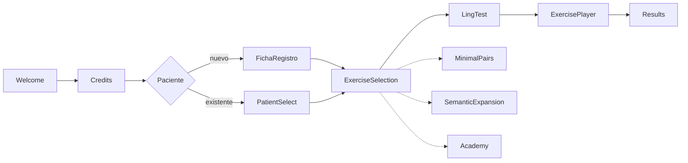

<div align="center">

<picture>
  <source media="(prefers-color-scheme: dark)" srcset="assets/valeria-logo-white.png">
  <source media="(prefers-color-scheme: light)" srcset="assets/valeria-logo.png">
  
</picture>

### 🐻 Terapia auditivo‑verbal y del lenguaje, offline y en tu bolsillo

**App móvil para niñas y niños con hipoacusia, implante coclear, dislalias o
dificultades del lenguaje.**

<br>

<!-- Idiomas -->


<!-- Stack -->


</div>

<div align="center">
  <a href="#-qué-es-valeria"><b>¿Qué es?</b></a> ·
  <a href="#-bloques-de-terapia"><b>Terapia</b></a> ·
  <a href="#-academy--formación-del-cuidador"><b>Academy</b></a> ·
  <a href="#-idiomas-y-variedades"><b>Idiomas</b></a> ·
  <a href="#-puesta-en-marcha"><b>Puesta en marcha</b></a> ·
  <a href="#-documentación"><b>Documentación</b></a>
</div>

---

## 📑 Índice

<table>
<tr>
<td valign="top" width="50%">

**Producto**
- [¿Qué es Valeria+?](#-qué-es-valeria)
- [Bloques de terapia](#-bloques-de-terapia)
- [Academy · formación del cuidador](#-academy--formación-del-cuidador)
- [Panel del Adulto · Carga Comunicativa](#-panel-del-adulto--carga-comunicativa)
- [Idiomas y variedades](#-idiomas-y-variedades)
- [Flujo de pantallas](#-flujo-de-pantallas)

</td>
<td valign="top" width="50%">

**Ingeniería y clínica**
- [Telemetría del piloto clínico](#-telemetría-del-piloto-clínico)
- [Documentación](#-documentación)
- [Puesta en marcha](#-puesta-en-marcha)
- [Builds (EAS)](#-builds-eas)
- [Build automático (GitHub Actions)](#-build-automático-github-actions)
- [Backend opcional (Firebase)](#-backend-opcional-firebase)
- [Privacidad y ficha de Play Store](#️-privacidad-y-ficha-de-play-store)
- [Historial de versiones](#-historial-de-versiones)

</td>
</tr>
</table>

---

## 🐻 ¿Qué es Valeria+?

Valeria+ reúne en un solo lugar el **registro del paciente**, una comprobación
auditiva previa (**Test de Ling**), **seis bloques de terapia**, un módulo de
**formación del cuidador** (**Academy**) y un **panel de resultados** para seguir
la evolución.

Parte de un principio clave: **los padres y cuidadores son el motor de voz y
evaluación**. El reconocimiento de voz ayuda, pero **el adulto siempre es el juez
final** (puede corregir el veredicto con un toque) y, donde no hay micrófono
(Expo Go, web), valora la respuesta con botones. Así la terapia funciona en
cualquier dispositivo y **sin conexión**.

> [!NOTE]
> **Principio de diseño (marco MDR).** La app nunca decide sola: el adulto es el
> juez clínico de cada respuesta y todo funciona **offline**, sin micrófono
> obligatorio y en cualquier dispositivo (Expo Go, web, móvil).

---

## 🧩 Bloques de terapia

| Bloque | Para qué sirve |
| --- | --- |
| 🗣️ **Pares Mínimos** | Dislalias fonológicas (rotacismo, sigmatismo, frontalización velar, f→p). 15 pares casi iguales (rana/lana) en 6 grupos —añade nasales y laterales— con juego de voz, misión física y sello doble padre‑hijo. |
| 🧩 **Expansión Semántica** | Progresión léxica para intervención temprana, en cuatro bloques: 5 **escenarios** diarios, 5 **categorías léxicas** con progresión de dificultad, 9 **progresiones** de campo semántico (concepto → parte → acción → cualidad) y 8 **cápsulas de contraste** con doble vuelta (comprensión por selección de imagen + producción). Cada actividad empieza por una **antesala** con el material necesario. |
| 👂 **Audición** (18 terapias) | Protocolo ACOPROS: fonética‑fonología, semántica, morfosintaxis, pragmática y **escucha en ruido** (RA‑1…RA‑5) para audífono, implante coclear o hipoacusia. |
| 💬 **Lenguaje** (7 terapias) | Protocolo familiar: atención conjunta, imitación, comprensión, expresión, comunicación funcional, regulación e interacción social. |
| 🧠 **TEA** (6 terapias) | PRT + TCC: atención conjunta triangulada (Time Delay + Sello Doble), quiebre pragmático con consentimiento, espejo asimétrico, transición interrumpida, categorización bajo ruido y múltiples señales simultáneas. Todos los estresores son **manuales** (Panel del Adulto). |
| 📖 **Dislexia** (6 terapias) | Fonología y acceso léxico: intruso fonológico auditivo puro, rastreo léxico con interferencia, síntesis fonémica rítmica (latencia 500 ms + Juez), criba de pseudopalabras (máx. 5 ensayos), rastreo visual de rotaciones b/d · p/q con mapa de misclicks y denominación rápida (RAN). |

El **Test de Ling** (6 sonidos) precede a los ejercicios de audición cuando el
paciente usa audífono o implante, y la **gamificación** (XP, racha 🔥, niveles e
insignias) mantiene la motivación en todos los bloques.

> [!TIP]
> **Rondas y sesiones.** Cada mini‑juego de Audición y Lenguaje rota hasta 3
> contenidos («🔄 Otra ronda») y puede encadenarse en una «🎯 Sesión completa».

Además, cada mini‑juego de Audición y Lenguaje **rota hasta 3 contenidos**
distintos ("🔄 Otra ronda"), encadenables en una **"🎯 Sesión completa"** por
bloque, con pausas activas unificadas entre ejercicios (`ValeriaSessionBreakOverlay`):
alternan la **cápsula TPR clásica** ("escucha y muévete") y la **Ruta de Rutina
TPR 2.0** (morfosintaxis transaccional).

> [!NOTE]
> **Frases portadoras retiradas del flujo (v9.1).** Hasta la v9, la palabra
> objetivo de Pares Mínimos se incrustaba en una frase generada por un motor
> combinatorio. Al resolver **DC‑5**, las logopedas de ACOPROS fijaron otra
> consigna estándar: **presentación del par + repetición del objetivo**
> («rata… lata… dime: rata»). El módulo `valeriaCarrierPhrases` se conserva por
> si se recupera como modo avanzado, pero **no se enumera en el corpus de voz ni
> se locuta**.

---

## 🎓 Academy · formación del cuidador

En la terapia auditivo‑verbal el **adulto es el motor clínico** de cada sesión
(requisito **MDR**: la app nunca decide sola). **Academy** (`src/ValeriaAcademy/`)
capacita a padres y cuidadores para que acompañen como profesionales, mediante
**Cápsulas de Conocimiento** de consumo rápido (≈2 min) con **micro‑quiz** de
validación ágil. Se muestra como una **tarjeta prominente** en el hub de
`ExerciseSelection`, con la misma jerarquía visual que los bloques de terapia y
una **barra de progreso que se actualiza en tiempo real**.

El hub es **multidominio**: cada dominio mantiene su propio silo de XP, nivel e
insignias, y el progreso nunca se mezcla entre ellos.

| Dominio | Qué enseña |
| --- | --- |
| 💬 **Lenguaje** | El baño de lenguaje (input antes que producción), la conversación por turnos (*serve and return*), por qué el TPR consolida, y los vicios a evitar: **remodelar** (*recast*) en vez de corregir y comentar más que preguntar. |
| 👂 **Hipoacusia / Sordera** | Qué es la sordera, su abordaje y el manejo de los dispositivos (audífono, implante coclear, osteointegrado) en micro‑guías. |
| 🗣️ **Dislalias** | Puntos de articulación y práctica de los sonidos difíciles. |
| 🔤 **Dislexia** | Conciencia fonológica y apoyo a la lectura emergente. |
| 🧩 **TEA** | Comunicación, anticipación y regulación en el espectro autista. |
| 🤟 **Lengua de Signos (LSE)** | Qué es la LSE y por qué no es mímica, si signar retrasa el habla, de qué está hecho un signo, el **alfabeto dactilológico completo** (27 configuraciones dibujadas, con panel de consulta de una sola pantalla), los primeros signos útiles y dónde se aprende de verdad. |

> [!IMPORTANT]
> **Sobre el módulo de LSE.** Un signo combina configuración de la mano, lugar,
> orientación y **movimiento**, más expresión facial; un dibujo estático captura
> los tres primeros. El módulo enseña lo que sí es enseñable así —el alfabeto
> dactilológico, cuyas configuraciones son posturas fijas— y para el léxico
> signado **remite a fuente signada**: vídeo, curso oficial y, sobre todo,
> personas sordas signantes. Lo dice en pantalla, no solo en el código.
> Contenido y **las 27 configuraciones del abecedario dactilológico**,
> validados por personas sordas signantes: las nueve iniciales por una persona
> sorda signante y las 18 restantes por **la logopeda y las personas sordas de
> ACOPROS**. Esa revisión es insustituible —un chequeo automático comprueba que
> un dibujo exista, nunca que se reconozca como la letra que dice ser—, así que
> toda figura nueva vuelve a pasar por ella. Las cuatro letras con movimiento
> (J, Ñ, X, Z) se marcan con ↻ y remiten a vídeo.

- **Gamificación funcional por dominio**: XP, niveles con nombre propio de cada
  silo (Novato → *Experto en Hipoacusia*, *Experto en LSE*…) e insignias
  (`📘 Primer paso`, `📗 A medio camino`, `🎓 Dominio experto`, `💯 Sin fallos`).
- **Persistencia cifrada offline**: el progreso se guarda con `valeriaCrypto`
  (JSON cifrado en reposo sobre `AsyncStorage`, clave `STORAGE_KEYS.academy`),
  igual que la telemetría del piloto.
- **Lectura O(1) sin re‑renders**: el resumen para el hub se sirve desde una
  capa en memoria con `useSyncExternalStore` (`academyStore`); completar una
  cápsula re‑renderiza **solo** la tarjeta de Academy, nunca el resto del hub ni
  la navegación. El encuadre operativo lo permite: el adulto maneja los menús y
  solo cede la tableta cuando el ejercicio ya ha empezado.

---

## 🎛️ Panel del Adulto · Carga Comunicativa

Para el piloto clínico, Valeria+ añade un **Panel del Adulto** (`ValeriaAdultChaosPanel`)
—tarjeta colapsable presente en el player— con tres módulos de **carga
comunicativa manual**. La regla innegociable es un **muro regulatorio (MDR)**:
la app **jamás activa, mide ni adapta** nada por su cuenta; todo lo acciona el
adulto de forma explícita. Automatizar el ajuste convertiría la app en un
audiómetro algorítmico (SaMD), y cualquier lógica de ese tipo debe rechazarse.

| Módulo | Qué hace |
| --- | --- |
| 🔊 **Escucha en ruido** (`ValeriaManualNoiseSlider` + `valeriaNoise`) | Reproducción dual: la instrucción TTS sobre una pista de **ruido babble** de cafetería en bucle. El volumen del ruido muta **solo** con el slider manual (0‑10) del adulto; la telemetría se registra al soltar, no por píxel. |
| 🐻 **Doble tarea** (`ValeriaDistractorBear`) | Un oso distractor se asoma por la periferia y se mueve **sin ser interactivo** (`pointerEvents="none"`): interferencia visual pura para el paradigma de carga cognitiva dual. Animación por el hilo nativo, arrancada tras `InteractionManager`. |
| 💬 **Quiebre pragmático** (`ValeriaPragmaticBreak`) | "Fallo deliberado": la app calla y es el adulto quien rompe la comunicación a propósito para observar cómo el niño la **repara**. La botonera de acierto se reemplaza por un selector de **estrategias de reparación**. Un modal advierte de la "frustración útil" antes de empezar. |

Los overlays (oso y quiebre) viven en la raíz de la pantalla anfitriona —no
dentro del `ScrollView`— y registran su rectángulo en `ValeriaMisclickBoundary`
para no ensuciar la telemetría de misclicks.

---

## 🌐 Idiomas y variedades

Valeria+ locuta y evalúa el **contenido terapéutico** en cuatro variedades,
seleccionables desde la tarjeta **«Voz de la app»** (`ValeriaVoiceUI`). La
interfaz sigue en castellano; lo que cambia es lo que se dice, se muestra y se
evalúa. La variedad activa vive en un único módulo (`src/valeriaLocale.ts`), que
desacopla tres decisiones: qué banco de audio usar, qué locale BCP‑47 pasar al
reconocedor/voz del sistema y si conviene preferir voces latinas.

| Variedad | Voz | Reconocimiento (ASR) |
| --- | --- | --- |
| 🇪🇸 **Castellano** (`es`) | Voz neuronal **Sharvard** pregenerada y empaquetada (offline). | Voz del sistema `es-ES`. |
| **Galego** (`gl`) — *Proxecto Nós* | Voz neuronal **Celtia** pregenerada (Proxecto Nós), empaquetada. Cubre pares mínimos, cápsulas TPR, rutas, Expansión Semántica, Audición, Lenguaje, TEA y Dislexia: todos los bloques tienen banco gallego propio. | Sistema `gl-ES` con recaída a `expo-speech`. |
| 🇩🇴 **Dominicano** (`es-DO`) — *Quisqueya Habla* | Voz **latina del dispositivo** (`es-US`/`es-MX`); sin audio propio pregenerado. | Sistema `es-DO`, priorizando el catálogo latino. |
| **Euskara** (`eu`) — *ILENIA/NEL-GAITU · HiTZ* | Voz neuronal **HiTZ-TTS** pregenerada (UPV/EHU · Aholab), empaquetada. Cubre pares mínimos, expansión semántica, Audición, Lenguaje, TEA, Dislexia y Test de Ling en euskera batua. | Sistema `eu-ES` con recaída a `es-ES` + pliegue vasco (`foldBasque`, ⟨h⟩ muda). |

- **Voz neuronal offline.** El audio de castellano, gallego y euskera se
  sintetiza en CI (nunca en el dispositivo) y viaja empaquetado en el APK. El
  corpus enumerado son **2438 locuciones** (878 `es` · 816 `gl` · 744 `eu`), y
  cada id se resuelve contra `src/valeriaVoiceAssets.ts` (mapa generado). Una
  variedad **solo reproduce assets de su propia voz**: si falta uno, cae con
  elegancia a `expo-speech`, nunca a la voz de otra lengua (mezclar Celtia y
  Sharvard en el mismo ejercicio se oía como un salto de locutor). El gate
  `check-voice-corpus-coverage.js` impide empaquetar un APK con locuciones sin
  asset en `es`/`gl`/`eu`.
- **Quisqueya Habla (es‑DO)** es un proyecto **editorial**, no de traducción:
  usa léxico y registro dominicanos y, sobre todo, **no penaliza como trastorno
  los rasgos dialectales normales** del español caribeño (seseo, aspiración de
  /s/, neutralización de líquidas en coda). Esa frontera clínica —qué es rasgo y
  qué es error— está fijada en [`docs/guia-dialectal-es-DO.md`](docs/guia-dialectal-es-DO.md),
  regla bloqueante del piloto.
- **Bancos de pares mínimos por variedad**: castellano
  (`src/valeriaMinimalPairs.ts`), gallego (`src/valeriaMinimalPairsGl.ts`, 7
  pares) y dominicano (`src/valeriaMinimalPairsEsDO.ts`, 8 pares construidos solo
  donde el contraste es estable en RD).

---

## 🗺️ Flujo de pantallas



---

## 📊 Telemetría del piloto clínico

Para recabar **evidencia de usabilidad** durante el piloto (validación
regulatoria y académica) sin fricción para las familias, Valeria+ incluye una
capa de telemetría **offline, anónima y no bloqueante**. La restricción
innegociable es que **ni la captura de eventos ni la escritura en disco bloqueen
el hilo principal**: la captura solo muta memoria (O(1)) y programa un volcado
con *debounce* vía `InteractionManager`, de modo que el cifrado y el guardado en
`AsyncStorage` nunca coinciden con las animaciones ni con el audio.

| Qué mide / hace | Cómo |
| --- | --- |
| ⏱️ **Tiempo activo por pantalla** | El navegador anota cada cambio de ruta (`noteScreen`); solo aritmética de timestamps. |
| 👆 **Misclicks** (toques fuera de zonas interactivas) | `ValeriaMisclickBoundary` usa el sistema de *responder* de RN: solo los toques en zonas muertas llegan a la raíz. Cede el gesto al scroll. |
| 🧩 **Abandono intra‑cápsula TPR** | Se cuentan cápsulas mostradas vs. saltadas vs. completadas en el player. |
| 💬 **Evaluación subjetiva (SUS adaptado)** | Modal Likert 1‑5 (`ValeriaSUSModal`) orientado a la **carga de uso real** ("integrar el ejercicio en la rutina de mi hijo/a"). *Rate limiting* para evitar sesgo de fatiga: solo en el **hito de 4 bloques distintos** (umbral desacoplado del total de 6: los módulos TEA/Dislexia ni lo bloquean ni lo fuerzan) y **máx. 1 vez/semana** por dispositivo. |
| 🔒 **Persistencia y correlación** | Telemetría + Likert se guardan en un **JSON cifrado en reposo** (`valeriaCrypto`, keystream SHA‑256 en JS puro) bajo el **mismo id de sesión**. Se **purga solo tras una exportación exitosa**, evitando el desborde de memoria semana a semana. |

**Exportación dual** (Modo Profesional, PIN `1985` desde el hub de bloques →
`ValeriaProExport`):

- **Offline puro** → **código QR** con el resumen estadístico comprimido
  (abandonos, misclicks, media Likert), legible por cámaras móviles. El
  codificador QR es **JS puro sin dependencias** (`valeriaQR`, modo byte, nivel
  M), verificado bit a bit contra la librería de referencia `qrcode`.
- **ShareSheet** → `ACTION_SEND` nativo con el **log transaccional completo en
  crudo** (email/WhatsApp) para cuando haya conectividad.

> **Notas para la fase regulatoria.** La telemetría es **anónima** (sin datos
> personales, sin audio, sin el contenido de las respuestas). El cifrado en
> reposo guarda la clave en `AsyncStorage`; el módulo `valeriaCrypto` está
> aislado para migrarla a `expo-secure-store` (Keystore/Keychain) en producción.
> Al tratarse de un piloto con menores, el **consentimiento informado** de las
> familias debe gestionarse en el protocolo del estudio, fuera de la app.

---

## 📚 Documentación

| Documento | Descripción |
| --- | --- |
| **Manual de usuario con casos de uso** (v9.1) · [HTML](docs/manual-casos-de-uso.html) · [PDF](docs/Valeria-Manual-Casos-de-Uso.pdf) · [Word](docs/Valeria-Manual-Casos-de-Uso.docx) | 17 casos de uso paso a paso ilustrados con capturas reales (`docs/screenshots/`): **Academy · hub de formación multidominio (CU‑03, uno de los primeros casos)**, los seis bloques (Pares Mínimos, Expansión Semántica, Audición, Lenguaje, TEA y Dislexia), el hub, la gráfica de sustitución por fonema, la telemetría del piloto (CU‑14), la variedad lingüística —Castellano, Galego, Dominicano y Euskera— (CU‑15), el Panel del Adulto / carga comunicativa (CU‑16), el **módulo de Lengua de Signos Española (CU‑17)** y las novedades v6/v7/v8/v8.1/v8.2/v9/v9.1. |
| [`docs/protocolo-pares-minimos.md`](docs/protocolo-pares-minimos.md) | Protocolo de pares mínimos para dislalias fonológicas: 10 pares accionables con flujo TTS→STT, feedback por rama y misiones físicas. Implementado en `src/ValeriaMinimalPairsScreen.tsx` + `src/valeriaMinimalPairs.ts`. |
| [`docs/protocolo-pares-minimos-es-DO.md`](docs/protocolo-pares-minimos-es-DO.md) | Protocolo de pares mínimos en español dominicano (Quisqueya Habla). Implementado en `src/valeriaMinimalPairsEsDO.ts`. |
| [`docs/protocolo-expansion-semantica.md`](docs/protocolo-expansion-semantica.md) | Protocolo de expansión semántica / progresión léxica offline. Implementado en `src/ValeriaSemanticExpansionScreen.tsx` + `src/valeriaSemanticExpansion.ts`. |
| [`docs/guia-dialectal-es-DO.md`](docs/guia-dialectal-es-DO.md) | Guía clínica dominicana (QH‑0.2): qué es rasgo dialectal normal y qué es error terapéutico. Regla **bloqueante** para todo dataset es‑DO. |
| [`docs/plan-integracion-proxecto-nos.md`](docs/plan-integracion-proxecto-nos.md) | Plan por fases de la versión en gallego apoyada en los recursos abiertos del Proxecto Nós (contenido, voz Celtia, ASR). |
| [`docs/plan-integracion-quisqueya-habla.md`](docs/plan-integracion-quisqueya-habla.md) | Plan de la variante dominicana (es‑DO), que reutiliza la infraestructura de variedad del plan gallego. |
| [`docs/plan-mejoras-acopros-logopedas.json`](docs/plan-mejoras-acopros-logopedas.json) | **Fuente de verdad** del plan de mejoras nacido del feedback clínico de ACOPROS: cada observación verificada contra el código, con decisiones clínicas (DC‑1…DC‑5), criterios de aceptación y estado. Incluye el **bloqueo de publicación** del corpus de voz. |
| [`docs/criterio-dificultad-lexica.md`](docs/criterio-dificultad-lexica.md) | Criterio del campo `difficulty` de las categorías léxicas (ES‑08): la progresión la marca la **familiaridad**, no la dificultad de pronunciación. Incluye por qué la frecuencia **no se hereda entre variedades** (en RD el plátano es el de freír; el que se come crudo es el guineo). |
| [`docs/auditoria-pictogramas.md`](docs/auditoria-pictogramas.md) | Inventario de toda la carga visual en uso, clasificada por riesgo (*tofu*, atributo, revisar) con columna de veredicto para ACOPROS. Se **regenera** con `node scripts/audit-pictograms.js --markdown`. |
| [`docs/plan-calidad.md`](docs/plan-calidad.md) | Task list priorizada para reducir regresiones (checklist de humo, pruebas por bloque). |
| [`docs/firebase-setup.md`](docs/firebase-setup.md) | Guía del backend opcional: Firebase Authentication + Cloud Firestore. |

**Regenerar el manual** tras editar [`docs/manual-casos-de-uso.html`](docs/manual-casos-de-uso.html):

```bash
python3 docs/build-docx.py        # → Word (requiere python-docx)
node docs/capture-screenshots.js  # regenera las capturas (Playwright sobre expo start --web)
# → PDF: imprimir el HTML con Chromium headless
chromium --headless --no-pdf-header-footer \
  --print-to-pdf=docs/Valeria-Manual-Casos-de-Uso.pdf docs/manual-casos-de-uso.html
```

> El DOCX se construye con un script propio (`build-docx.py`) que **replica** el
> contenido del HTML: al cambiar el manual hay que editar ambos.

---

## 🚀 Puesta en marcha

> **Requisitos:** Node.js 18+, `npm` y la app **Expo Go** en el móvil (o un
> emulador Android/iOS). No hace falta configurar nada más para probarla en local.

```bash
npm install       # instala dependencias
npm start         # expo start — abre el panel de Metro (escanea el QR con Expo Go)
npm run typecheck # tsc --noEmit — comprobación de tipos
```

| Comando | Qué hace |
| --- | --- |
| `npm start` | Arranca Metro; escanea el QR con **Expo Go**. |
| `npm run android` | Abre en emulador o dispositivo **Android**. |
| `npm run ios` | Abre en simulador **iOS** (solo macOS). |
| `npm run web` | Abre la versión **web** en el navegador. |
| `npm run typecheck` | Verifica los tipos de TypeScript. |

---

## 🏗️ Builds (EAS)

```bash
npx eas build -p android --profile apk         # APK directo: solo ARM, ProGuard + shrinkResources
npx eas build -p android --profile production  # App Bundle (.aab) para Google Play
```

El perfil `apk` limita las arquitecturas a `armeabi-v7a` y `arm64-v8a` (los
móviles reales), eliminando las librerías x86 de emulador del binario. Para
publicar en Google Play usa siempre el App Bundle: Play genera un APK optimizado
por dispositivo y la descarga es bastante menor.

---

## ⚙️ Build automático (GitHub Actions)

El workflow [`.github/workflows/android.yml`](.github/workflows/android.yml)
compila la app en cada push/fusión a `main` (y en ramas `claude/**`). Con los
secrets de firma configurados genera el APK y el **AAB firmados**; sin secrets
solo compila el APK. El `versionCode` se deriva del número de run.

Antes de compilar corren **seis chequeos de contenido** que fallan rápido. No
son tests unitarios: cada uno protege un acuerdo clínico concreto que el
typecheck y el diff no ven.

| Chequeo | Qué impide |
| --- | --- |
| `check-voice-corpus-coverage.js` | Que se empaquete un APK con texto locutado **sin asset de voz neuronal**. La app no se rompe cuando eso pasa: cae a la voz del sistema en silencio, y en galego y euskera se pierden Celtia e ILENIA. |
| `check-content-rules.js` | Que reaparezcan el `tts_string` redundante (ES‑06), una fase de progresión por onomatopeya (ES‑10) o una cápsula con tres referentes distintos (ES‑13). |
| `check-pictogram-coverage.js` | Que una cápsula de contraste quede **irresoluble**: si las dos vueltas comparten clave de pictograma, el niño ve dos tarjetas idénticas (ES‑12). |
| `check-lexical-difficulty.js` | Que un ítem avanzado se cuele entre los iniciales: **el orden de escritura ES el orden de práctica** (ES‑08). |
| `check-reminder-slots.js` | Que apagar una franja de recordatorio deje de reprogramarla pero **no cancele sus avisos ya en cola** (GEN‑01). |
| `check-sign-figures.js` | Que una cápsula de LSE pida una figura **sin dibujo registrado** o que el abecedario dactilológico quede incompleto: `SignFigure` devuelve `null` a propósito, así que el fallo es invisible salvo para este gate (LSE‑01). |

Todos se pueden ejecutar en local: `node scripts/<nombre>.js`.

El workflow [`.github/workflows/voice-assets.yml`](.github/workflows/voice-assets.yml)
**sintetiza la voz neuronal** (Sharvard para `es`, Celtia para `gl`) a partir de
[`voice-corpus.json`](voice-corpus.json), masteriza el audio, regenera el mapa
`src/valeriaVoiceAssets.ts` y **commitea los assets** a la rama. Los modelos de
voz corren **solo en CI**, nunca en el dispositivo; el push resultante dispara el
build Android que empaqueta el audio en el binario. La voz gallega usa el
checkpoint *gated* de Celtia, que requiere el secret `HF_TOKEN`.

<details>
<summary><strong>🔐 Secrets de firma necesarios</strong></summary>
<br>

- `ANDROID_RELEASE_KEYSTORE_BASE64`
- `ANDROID_RELEASE_STORE_PASSWORD`
- `ANDROID_RELEASE_KEY_ALIAS`
- `ANDROID_RELEASE_KEY_PASSWORD`

</details>

## 🔥 Backend opcional (Firebase)

Para probar la app con profesionales, Valeria+ incluye un backend **aditivo y
opcional**: **Firebase Authentication** (email/contraseña) + **Cloud Firestore**.
La app sigue funcionando en local sin conexión si no se activa.

- **SDK JS `firebase`** (no `@react-native-firebase`): mismo código en Android,
  iOS y web, sin módulos nativos ni rebuilds.
- La config del SDK se lee de **variables de entorno `EXPO_PUBLIC_*`**; no hay
  claves escritas en el repositorio (copia `.env.example` a `.env`).
- Cada profesional autenticado solo accede a **sus propios datos**, protegidos
  por las Security Rules de [`firestore.rules`](firestore.rules).

Guía completa de configuración y despliegue: [`docs/firebase-setup.md`](docs/firebase-setup.md).

---

## 🛡️ Privacidad y ficha de Play Store

Google Play exige una **política de privacidad accesible en una URL pública**
para toda app que solicite permisos sensibles (Valeria+ pide micrófono y
reconocimiento de voz) o que esté dirigida a menores. Esa política se sirve
desde **GitHub Pages**, publicada por el workflow
[`.github/workflows/pages.yml`](.github/workflows/pages.yml) a partir de la
carpeta [`site/`](site/) — y **solo** de esa carpeta: el código, las docs
internas y el corpus de voz no se publican.

| Campo de Play Console | URL |
| --- | --- |
| **Política de Privacidad** (Ficha de Play Store y Contenido de la app) | `https://frankbetances.github.io/Valeria/privacidad.html` |
| Privacy Policy (inglés, para la ficha localizada en `en-US`) | `https://frankbetances.github.io/Valeria/privacy.html` |
| **Eliminación de datos** (obligatoria al declarar cuentas de usuario) | `https://frankbetances.github.io/Valeria/eliminacion-de-datos.html` |

El workflow da de alta el sitio de Pages por sí mismo (`enablement: true`), así
que no hace falta configurar nada a mano: cada push a `main` que toque `site/`
republica el sitio, y también puede lanzarse desde la pestaña *Actions*. Si el
alta por API estuviera restringida, la acción falla con *«Get Pages site
failed»*; en ese caso, actívalo una vez en *Settings → Pages → Build and
deployment → Source: **GitHub Actions***.

> Al cambiar lo que la app recoge —un permiso nuevo, un campo nuevo en la ficha
> del paciente, un SDK de terceros— hay que actualizar en el mismo PR la
> política de `site/` **y** el formulario de *Seguridad de los datos* de Play
> Console: son declaraciones que Google contrasta entre sí.

---

## 🕑 Historial de versiones

<details open>
<summary><strong>V9.2</strong> — el galego, en todos los bloques (aprobado para producción)</summary>

Hasta esta versión el gallego solo estaba completo en **Pares Mínimos**: la
Expansión Semántica y los ejercicios de Audición y Lenguaje compartían el banco
castellano, así que una sesión en galego se locutaba en castellano y, cuando el
texto sí era gallego sin asset propio, sonaba con la voz del sistema en acento
castellano. **Aprobado por la revisora logopeda gallegohablante (jul 2026).**

- **Banco gallego propio en todos los bloques**: Expansión Semántica
  (`valeriaSemanticExpansionGl.ts` — 5 escenarios, 5 categorías léxicas, 9
  progresiones y 8 cápsulas de contraste) y Audición, Lenguaje, TEA y Dislexia
  (`valeriaExerciseGl.ts` — 37 ejercicios reautorizados, con plural de
  determinante gallego, emociones, veredictos de micro y pistas propias).
- **Corpus de voz gallego de 112 → 816 locuciones**, sintetizadas con **Celtia**
  (Proxecto Nós) en CI y empaquetadas en el APK.
- **Sin saltos de voz**: cada variedad reproduce solo assets de su propia voz. El
  respaldo que hacía sonar el asset castellano cuando faltaba el gallego era un
  apaño del banco compartido y mezclaba Celtia y Sharvard dentro del mismo
  ejercicio.
- **Intruso Fonológico (DX-1)**: las fichas llevan su número desde el principio y
  la revelación se anuncia como la solución de la serie. Se leía como un fallo de
  pintado («no se ve nada y al tocar aparece todo»). El protocolo auditivo puro
  no cambia.
- **Audición y Lenguaje, bloques independientes**: cada uno se abre desde su
  tarjeta del hub, como TEA y Dislexia. Antes compartían una barra de pestañas
  dentro de la lista y se percibían como una sola pantalla.
- **Academy · LSE**: alfabeto dactilológico **completo** (27 configuraciones
  dibujadas, **validadas por la logopeda y las personas sordas de ACOPROS**) con
  panel de consulta en una sola pantalla y muestra visible al entrar en el
  dominio. Las letras con movimiento (J, Ñ, X, Z) se marcan con ↻ y remiten a
  fuente signada.
- **Sexto chequeo de contenido en CI** (`check-sign-figures.js`) y los gates de
  contenido, pictogramas y dificultad léxica cubren ya el banco gallego.

</details>

<details>
<summary><strong>V9.1</strong> — mejoras clínicas de las logopedas de ACOPROS, vocabulario por categorías y Lengua de Signos</summary>

Ciclo nacido de una revisión clínica de las logopedas de ACOPROS sobre la app en
uso. Cada observación se verificó contra el código antes de tocar nada; la
trazabilidad completa está en
[`docs/plan-mejoras-acopros-logopedas.json`](docs/plan-mejoras-acopros-logopedas.json).

- **Categorías léxicas** (nuevo bloque de Expansión Semántica): 5 categorías de
  6 palabras con **progresión de dificultad**, y tope de nivel fijado por el
  logopeda desde el PIN. La progresión la marca la **familiaridad**, no la
  dificultad de pronunciación —eso es asunto de Pares Mínimos—. La frecuencia no
  se hereda entre variedades: el nivel 1 dominicano es **guineo**, no plátano.
- **Doble vuelta real en los contrastes**: la primera vuelta evalúa
  **comprensión** (el niño toca la imagen correcta entre dos) y la segunda
  **producción**. El historial y el informe al logopeda las separan, porque un
  promedio único escondía el caso más frecuente en clínica: entiende el par pero
  todavía no lo dice.
- **Pictogramas propios** (46 dibujos SVG): se descartaron los bancos externos
  por licencia, pero lo decisivo fue otro motivo —ninguno trae «cuchara sucia» y
  «cuchara limpia» como par sobre el **mismo objeto**, que es justo lo que la
  vuelta de comprensión necesita—. Riesgo de *tofu* (emoji que se pintan como
  cuadro vacío) cerrado al 100 %.
- **Antesala de preparación**: ninguna actividad locuta su primera consigna
  antes de que el adulto confirme que tiene el material. Antes, «prepara dos
  peluches» aparecía con la consigna ya sonando.
- **Escucha más tolerante** sin tocar el umbral fonético: ventana de tres
  segundos, rescate del mejor resultado parcial y —lo importante— **un fallo del
  reconocedor deja de costarle un intento y una estrella al niño**.
- **Recordatorios configurables**: cuatro franjas elegibles de verdad, y apagar
  una **cancela sus avisos ya en cola**. Antes la tarjeta prometía «hasta 4 al
  día» describiendo un límite del sistema como si fuera una opción.
- **Consignas más cortas** (el objetivo se nombra una sola vez), **objetivo
  terapéutico visible** por bloque y **progresiones por campo semántico**
  (concepto → parte → acción → cualidad) en vez de la escalera de onomatopeyas.
- **Academy · Lengua de Signos Española**: sexto dominio, validado por persona
  sorda signante, configuraciones de mano incluidas.
- **Cinco chequeos de contenido en CI** que protegen todo lo anterior de
  reaparecer por inercia.

</details>

<details>
<summary><strong>V9</strong> — dos bloques nuevos, protocolos ampliados, euskera y Academy multidominio</summary>

- **Bloque TEA** (`TEA_META`, 6 terapias · PRT + TCC): atención conjunta
  triangulada, quiebre pragmático (con consentimiento informado), espejo
  asimétrico, transición interrumpida, categorización bajo carga sensorial y
  múltiples señales simultáneas. Todos los estresores son **manuales**.
- **Bloque Dislexia** (`DISLEXIA_META`, 6 terapias): conciencia fonológica y
  acceso léxico —intruso fonológico, rastreo léxico con interferencia, síntesis
  fonémica rítmica, criba de pseudopalabras, rotaciones b/d · p/q y denominación
  rápida (RAN)—; el ritmo lo marca la persecución dactilar del adulto, sin
  cronómetro automático.
- **Audición ampliada** a **18 terapias**: nueva categoría **«Escucha en ruido»**
  (RA‑1…RA‑5) sobre el deslizador manual de ruido babble del Panel del Adulto.
- **Pares Mínimos a 15 pares** (`valeriaMinimalPairs.ts`) con dos grupos nuevos
  (nasales y laterales); Expansión Semántica sube a 9 progresiones y 8
  contrastes. Entonces todo entraba en el motor de frases portadoras, retirado
  del flujo en la v9.1 al resolver DC‑5.
- **Cuarta variedad: Euskera** (`eu`, batua · proyecto ILENIA/NEL‑GAITU): voz
  neuronal **HiTZ‑TTS** pregenerada (UPV/EHU · Aholab) empaquetada y offline; ASR
  `eu‑ES` con recaída `es‑ES` + pliegue de la ⟨h⟩ muda (`foldBasque`).
- **Academy multidominio** (`src/ValeriaAcademy/`): cinco dominios (Lenguaje,
  Hipoacusia, Dislalias, Dislexia y TEA), cada uno con su escala de niveles e
  insignias, más un **feed de prioridad** según la patología de la ficha y
  micro‑guías de hardware (audífono/implante/osteointegrado) en Hipoacusia.
- **Manual de casos de uso v9**: HTML, DOCX y PDF actualizados a los seis
  bloques, las cuatro variedades y Academy multidominio.

</details>

<details>
<summary><strong>V8.2</strong> — Academy: formación gamificada del cuidador</summary>

- **Nuevo módulo Academy** (`src/ValeriaAcademy/`): sistema de capacitación
  gamificado para padres y cuidadores —el motor clínico de la app bajo el marco
  MDR—, con **Cápsulas de Conocimiento** de consumo rápido y **micro‑quiz** de
  validación ágil sobre cómo aprenden a hablar los niños, el porqué de las
  dinámicas TPR y qué vicios evitar en la terapia mediada (no corregir sino
  remodelar, comentar más que preguntar).
- **Tarjeta en el hub** (`AcademyHubCard`): prominente en `ExerciseSelection`,
  con la misma jerarquía visual que los bloques de terapia y una **barra de
  progreso en tiempo real** (nivel, XP e insignias).
- **Persistencia cifrada offline**: el progreso se guarda con `valeriaCrypto`
  sobre `AsyncStorage` (`STORAGE_KEYS.academy`), coherente con la telemetría.
- **Lectura O(1) sin re‑renders**: `academyStore` expone el resumen vía
  `useSyncExternalStore`; completar una cápsula re‑renderiza solo la tarjeta, no
  el hub ni la navegación.

</details>

<details>
<summary><strong>V8.1</strong> — arreglos de registro, resultados y voz gallega</summary>

- **Bienvenida**: el botón «Ya tengo un paciente registrado» pasa de enlace de
  texto a **botón perfilado de tamaño completo**, más visible y fácil de pulsar.
- **Resultados y Test de Ling con el paciente real**: la cabecera y el informe
  compartido mostraban un dato de muestra («Lucía M. · NHC HC‑204815»); ahora
  leen la **ficha del paciente activo** (nombre y NHC reales), con un rótulo
  neutro si aún no hay ficha guardada.
- **La voz gallega siempre arranca**: la Expansión Semántica y los ejercicios de
  Audición y Lenguaje comparten el texto castellano y aún no tienen asset de
  Celtia; en gallego la app reproduce ahora el **asset neuronal castellano**
  (Sharvard) en vez de quedar en silencio esperando una voz `gl-ES` que el
  dispositivo no suele tener. Cuando la CI sintetice esos bancos con Celtia,
  sus assets tendrán prioridad automáticamente.
- **Corpus ampliado**: el banco empaquetado crece a **1174 locuciones**
  (versión `es-sharvard+gl-celtia-2026-07-19`), incorporando la Expansión
  Semántica y Audición/Lenguaje en castellano y el contenido gallego GL‑2.x.

</details>

<details>
<summary><strong>V8</strong> — variedades lingüísticas (Galego · Dominicano) y voz neuronal offline</summary>

- **Infraestructura de variedad** (`src/valeriaLocale.ts`): una fuente única de
  la variedad activa (`es` · `gl` · `es-DO`) que decide, por separado, el banco
  de audio, el locale BCP‑47 del sistema y la preferencia de voz latina. Migra la
  antigua clave «idioma de voz» (`es`|`gl`) sin perder la selección previa.
- **Galego · Proxecto Nós**: contenido terapéutico en gallego cableado a las
  pantallas y **voz neuronal Celtia** pregenerada (banco de pares gallego en
  `src/valeriaMinimalPairsGl.ts`). Promovido de beta a **producción**.
- **Dominicano · Quisqueya Habla (es‑DO)**: variante editorial con léxico
  caribeño y evaluación que **no penaliza rasgos dialectales normales** (guía
  clínica `docs/guia-dialectal-es-DO.md`, regla bloqueante). Usa la voz y el
  micrófono **del sistema** en español latino. También en producción.
- **Voz neuronal offline empaquetada**: 703 locuciones (`assets/voice/`, versión
  `es-sharvard+gl-celtia-2026-07-18`) mapeadas en `src/valeriaVoiceAssets.ts`
  (generado). Nueva tubería CI `voice-assets.yml`: sintetiza, masteriza y
  commitea el audio; los modelos corren solo en CI, con recaída a `expo-speech`
  para lo no cubierto.
- **Selector de variedad** en la tarjeta «Voz de la app» (`ValeriaVoiceUI`) con
  las tres variedades aprobadas y ayuda contextual según la voz disponible.

</details>

<details>
<summary><strong>V7</strong> — piloto clínico: carga comunicativa manual, telemetría y exportación dual</summary>

- **Reingeniería del piloto · Carga Comunicativa manual**: Panel del Adulto
  (`ValeriaAdultChaosPanel`) con escucha en ruido babble (`valeriaNoise` +
  `ValeriaManualNoiseSlider`), oso distractor de doble tarea (`ValeriaDistractorBear`)
  y quiebre pragmático con estrategias de reparación (`ValeriaPragmaticBreak`),
  todo bajo el muro MDR (manual, nunca automático). Frases portadoras
  combinatorias (`valeriaCarrierPhrases`) y pausa de sesión unificada
  (`ValeriaSessionBreakOverlay`). Telemetría V2.
- **Telemetría no bloqueante**: captura de tiempo activo por pantalla, misclicks
  y abandono intra‑cápsula TPR sin bloquear el hilo principal (captura en memoria
  + volcado con *debounce* vía `InteractionManager`). Módulo `valeriaTelemetry`.
- **Evaluación subjetiva SUS adaptada**: modal Likert 1‑5 (`ValeriaSUSModal`)
  centrado en la carga de uso real, con *rate limiting* (hito de 4 bloques y máx.
  1 vez/semana por dispositivo) para evitar el sesgo de fatiga.
- **Persistencia cifrada y correlación**: telemetría + Likert en un JSON cifrado
  en reposo (`valeriaCrypto`) bajo el mismo id de sesión; purga automática solo
  tras exportación exitosa.
- **Exportación dual** (Modo Profesional, PIN `1985`): QR offline con el resumen
  estadístico comprimido (`valeriaQR` + `ValeriaQRCode`, codificador JS puro sin
  dependencias, verificado contra `qrcode`) + ShareSheet `ACTION_SEND` con el log
  completo en crudo (`ValeriaProExport`).

</details>

<details>
<summary><strong>V6</strong> — voz humana, rondas variadas, sesión completa y backend opcional</summary>

- **Motor de voz más humano**: prioriza voces neuronales/enhanced (Google
  neural/WaveNet, iOS Enhanced/Siri) y penaliza los motores metálicos heredados
  (eloquence, compact, eSpeak, Pico). Reintentos con espera creciente, prosodia
  natural (troceo por frases, entonación en preguntas/exclamaciones) y bancos de
  frases rotativas.
- **Ejercicios con rondas variadas**: cada mini‑juego de Audición y Lenguaje rota
  hasta 3 contenidos distintos con **"🔄 Otra ronda"**. Flujo numerado
  **PASO 1→4** (consigna → juego → movimiento → evaluación), feedback hablado y
  cabecera con el nombre real del paciente.
- **Sesión completa**: botón **"🎯 Sesión completa"** por bloque que encadena
  todos los ejercicios prescritos en una sola sesión (pasando por el Test de Ling
  si procede).
- **Fase de turno visible**: `TurnPhaseStrip` (Escucha → Repite → Veredicto →
  Misión) en Pares Mínimos y Expansión Semántica, con doble vuelta evaluada. Más
  contenido: 5 escenarios, 7 progresiones y 6 cápsulas en Expansión Semántica.
- **Fichas sin imágenes rotas**: pictogramas SVG de alto contraste
  (`src/ValeriaPictograms.tsx`) con fallback a emoji.
- **Marca con oso pardo animado**: la mascota `BearMark` estrena variante `brown`;
  bienvenida y créditos animados; iconos y splash regenerados.
- **Backend opcional Firebase**: Auth email/contraseña + Firestore (ver arriba).
- **Build firmado en CI**: APK y AAB firmados en cada push/fusión a `main`.

</details>

<details>
<summary><strong>V5</strong> — Expo SDK 54, voz natural y PIN profesional compartido</summary>

- **Expo SDK 54 / React Native 0.81**: todas las librerías actualizadas
  (incluido `expo-speech` 14).
- **Voz más natural**: al arrancar busca entre las voces españolas instaladas y
  elige la de mayor calidad ("enhanced"/neuronal), priorizando las offline.
- **PIN profesional en todos los bloques**: componente compartido
  `src/ValeriaProPin.tsx`; el Modo Familia solo practica lo prescrito.
- **Instalación más ligera**: ProGuard + shrinkResources y perfil EAS `apk` con
  solo las arquitecturas ARM reales.

</details>

<details>
<summary><strong>V4</strong> — fichas ilustradas, escala EPT‑3, movimiento y gamificación</summary>

- **PIN profesional corregido**: validación SHA‑256 también en Hermes (Android).
  PIN de demostración: `1985`.
- **Fichas ilustradas**: imágenes emoji grandes; toca cualquiera para ampliarla.
- **Escala EPT‑3**: valoración unificada de tres niveles (1★ / 2★ / 3★).
- **Juego con movimiento**: "versión en movimiento" y pausas activas entre
  ejercicios.
- **Recordatorios diarios**: notificaciones locales (máx. 4/día) con
  `expo-notifications`.
- **Gamificación estilo Duolingo**: XP, racha 🔥, niveles (Osezno → Oso
  Legendario) e insignias.

</details>

---

<div align="center">

### 🤝 Contribuir · 🔒 Seguridad · 📄 Licencia

[**Guía de contribución**](CONTRIBUTING.md) ·
[**Política de seguridad**](SECURITY.md) ·
[**Licencia**](LICENSE)

<br>

Hecho con 🐻 por **Dr. Frank Alberto Betances Reinoso**

<sub>Valeria+ · terapia auditivo‑verbal y del lenguaje · offline · multivariedad</sub>

</div>
