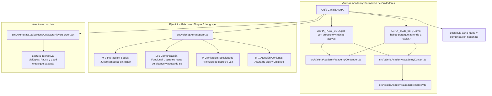

# Plan Integral: Integración de la Guía ASHA y Técnicas de Juego con Propósito en Valeria+

## Descripción del Objetivo
Integrar de manera profunda y holística el documento clínico **«Cómo estimular el habla y el lenguaje en casa: Guía completa de técnicas para el día a día»** (adaptado de la American Speech-Language-Hearing Association, ASHA) dentro del ecosistema de **Valeria+ v14**.

El documento contiene dos grandes pilares clínicos que deben vivir en sus lugares correspondientes dentro de la app:
1. **Pilar Formativo (Modelado Verbal y Rutinas)**: Técnicas de habla (autoconversación, habla paralela, expansión, extensión, recast, ratio comentarios/preguntas).
2. **Pilar Lúdico y Vivencial (Ideas de Juego con Propósito)**: Técnicas de juego mediado (altura de los ojos, juego dirigido por el niño, ingeniería ambiental / sabotaje comunicativo, escalera de imitación en 4 niveles, retención cuidadosa con pausa de 5 segundos, lectura interactiva dialógica y rutinas cotidianas).

Para maximizar el impacto clínico sin saturar al cuidador en una sola pantalla larga, el plan articula la integración en **dos niveles**:
- **Nivel Formativo (Valeria Academy)**: Dos cápsulas insignia modulares de 2 minutos (`ASHA_TALK_01` y `ASHA_PLAY_01`) con micro-quizzes no punitivos y otorgamiento de XP en el silo de *Lenguaje*.
- **Nivel Práctico y Vivencial (Ejercicios de Lenguaje M-1 a M-7 y Cuentos de Lúa)**: Enriquecimiento de las consignas para el tutor, materiales y variantes lúdicas de los ejercicios prácticos existentes en `valeriaExerciseBank.ts` y pautas para la lectura interactiva de *Aventuras con Lúa*.

---

## Decisiones de Diseño Clínico y Técnico

> [!NOTE]
> **Marco MDR (SaMD Clase I) y Filosofía Zero-Backend:**
> - El adulto es el motor clínico y el facilitador del juego; la app guía, inspira y estructura las condiciones lúdicas en el hogar sin imponer pantallas al niño.
> - Cero analíticas, cero backend, almacenamiento 100% offline cifrado (`academyStore` con AsyncStorage + valeriaCrypto).
> - Se preserva la paridad estricta entre Español (`es`) e Inglés (`en-US`), con compatibilidad completa para los 30 CI gates de Valeria.

---

## Estructura de la Integración

---

## Propuesta Detallada de Contenido

### 1. Las 2 Cápsulas de Academy en el Silo de Lenguaje

1. **`ASHA_TALK_01` · "¿Cómo hablar para que aprenda a hablar?" (Track: *desarrollo*)**:
   - Diapositivas:
     1. *La ventana de 0 a 3 años*: Neuroplasticidad y baño de lenguaje (*input*).
     2. *Autoconversación y Habla paralela*: Narrar lo que tú haces (*self-talk*) y lo que el niño hace (*parallel talk*).
     3. *Expandir y Extender*: Cómo añadir forma y contenido sin recurrir a la corrección punitiva (*recast*).
     4. *El tiempo de espera de 5 segundos*: Contar mentalmente hasta 5 para ceder el turno de respuesta.
     5. *Comentar más que preguntar*: La regla de 3 comentarios por cada pregunta formulada.
     6. *Micro-quiz de afianzamiento formativo* (2 preguntas, 25 XP).

2. **`ASHA_PLAY_01` · "Jugar con propósito: el juego como motor del lenguaje" (Track: *mediada*)**:
   - Diapositivas:
     1. *Ponerse a la altura de sus ojos*: Contacto visual natural, lectura labiofacial y complicidad postural.
     2. *Seguir su interés*: Unirse al juego que el niño elija en lugar de dirigirlo o redirigirlo (*child-led play*).
     3. *Ingeniería ambiental*: Juguetes a la vista pero fuera de su alcance para generar la necesidad natural de pedir.
     4. *La escalera de imitación en 4 niveles*:
        - Nivel 1: Gestos motores puros (aplausos, señalar).
        - Nivel 2: Gestos con sonido (chocar las manos: «¡pam!»).
        - Nivel 3: Sonidos y onomatopeyas divertidas («¡brrr!», «¡pum!»).
        - Nivel 4: Palabras con significado («coche», «más»).
     5. *La retención cuidadosa*: Sostener el objeto unos segundos antes de entregarlo para motivar la petición espontánea, ayudando con cariño si surge frustración.
     6. *Lectura interactiva y rutinas*: Pausar en los cuentos («¿qué crees que pasará?») y convertir el baño, comida y canciones en momentos hablados.
     7. *Micro-quiz de afianzamiento lúdico* (2 preguntas, 25 XP).

---

## Impacto en los Ejercicios Prácticos de Lenguaje (`valeriaExerciseBank.ts`)

Las **ideas de juego** del documento se transfieren directamente a las consignas y niveles de los ejercicios clínicos:

1. **`M-1` (Atención Conjunta)**:
   - Reforzar en `read` y `proposals`: colocarse estrictamente a la altura de los ojos del niño y sumarse a lo que él ya esté mirando antes de introducir el estímulo (burbujas/globo).
2. **`M-2` (Imitación Motora/Verbal)**:
   - Sincronizar los 3 niveles con la **escalera de 4 niveles de ASHA**:
     - *Nivel Inicial*: Gesto motor puro (aplaudir, chocar manos).
     - *Nivel Intermedio*: Gesto con sonido + onomatopeya divertida («¡pam!», «¡brrr!»).
     - *Nivel Avanzado*: Palabras cortas vinculadas al juego («pato», «salta»).
3. **`M-5` (Comunicación Funcional)**:
   - Formalizar en `materials` y `read` la técnica de **ingeniería ambiental** (juguete a la vista pero fuera de alcance) y la **retención cuidadosa** (esperar 5 segundos sosteniendo el objeto con una sonrisa antes de modelar «más» o «ayuda»).
4. **`M-7` (Interacción Social)**:
   - Destacar en el juego simbólico la consigna de *seguir la iniciativa del niño*: dejar que él elija a qué jugar y adoptar el rol complementario sin imponer las reglas del adulto.

---

## Cambios Propuestos por Componente

### Componente 1: Documentación Clínica (`docs/`)
- `docs/guia-asha-juego-y-comunicacion-hogar.md`:
  - Marco conceptual (0-3 años, plasticidad, input).
  - Protocolo de modelado verbal para el hogar.
  - Manual de técnicas de juego con propósito (ingeniería ambiental, escalera de imitación, retención cuidadosa).
  - Pautas para rutinas diarias y lectura dialógica interactiva.
  - Errores comunes y criterios de derivación clínica a logopeda / SLP.
  - Citación formal APA de ASHA.

### Componente 2: Cápsulas de Valeria Academy (`src/ValeriaAcademy/`)
- `src/ValeriaAcademy/capsulas/valeriaAcademyAshaTecnicas.ts`:
  - `academyAshaTalkEs` y `academyAshaTalkEn` (`ASHA_TALK_01` · 25 XP).
  - `academyAshaPlayEs` y `academyAshaPlayEn` (`ASHA_PLAY_01` · 25 XP).
- `src/ValeriaAcademy/academyContent.ts`:
  - Importar e integrar `academyAshaTalkEs` y `academyAshaPlayEs`.
- `src/ValeriaAcademy/academyContent.en.ts`:
  - Importar e integrar `academyAshaTalkEn` y `academyAshaPlayEn` manteniendo paridad 1:1.

### Componente 3: Banco de Ejercicios Clínicos (`src/`)
- `src/valeriaExerciseBank.ts`:
  - Enriquecer `M-1`, `M-2`, `M-5` y `M-7` incorporando los principios literales de ASHA.

---

## Plan de Verificación

### Pruebas Automatizadas
1. `npm run typecheck`: 0 errores de TypeScript.
2. `node scripts/check-ui-strings.js`: 0 errores en cadenas de UI.
3. `node scripts/check-ui-lang-fallback.js`: 0 errores de sincronización multilingüe.
4. `node scripts/check-content-rules.js`: Coherencia de reglas de contenido.
5. Verificación de cálculo automático en `academyRegistry.ts` (`DOMAIN_TOTALS.lenguaje` +2).

### Verificación Manual
1. Pantalla de Academy → Silo Lenguaje: Comprobar visualización y funcionamiento de ambas cápsulas.
2. Bloque Lenguaje (`M-1`, `M-2`, `M-5`, `M-7`): Comprobar enriquecimiento de consignas y escalera de imitación.
