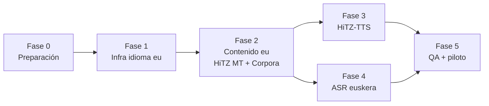

# Plan de integración · ILENIA/NEL-GAITU (HiTZ · Aholab) → Valeria+ (versión en euskera)

> **Documento de planificación y plan de trabajo.** Define cómo incorporar los
> recursos abiertos del centro **HiTZ** (proyecto **NEL-GAITU** del consorcio
> [ILENIA](https://proyectoilenia.es), UPV/EHU · laboratorio **Aholab**) para
> crear una versión en **euskera** de los ejercicios de Valeria+, avanzando por
> **fases modulares e independientes**: cada fase deja la app funcional y
> publicable. Es el hermano vasco del
> [plan Proxecto Nós (gallego)](./plan-integracion-proxecto-nos.md) y reutiliza
> exactamente la misma infraestructura de variedad que ya sostiene el gallego y
> el dominicano.
>
> Estado: 📋 planificación · Rama de trabajo: `claude/euskera-implementation-plan-p0pg7m`

---

## Índice

- [1. Objetivo y alcance](#1-objetivo-y-alcance)
- [2. Recursos de HiTZ/ILENIA a integrar](#2-recursos-de-hitzilenia-a-integrar)
- [3. Principios de diseño](#3-principios-de-diseño)
- [4. Arquitectura objetivo](#4-arquitectura-objetivo)
- [5. Plan de trabajo por fases](#5-plan-de-trabajo-por-fases)
  - [Fase 0 · Preparación y decisiones](#fase-0--preparación-y-decisiones)
  - [Fase 1 · Infraestructura de idioma](#fase-1--infraestructura-de-idioma)
  - [Fase 2 · Contenido en euskera](#fase-2--contenido-en-euskera-hitz-mt--corpora)
  - [Fase 3 · Voces HiTZ-TTS](#fase-3--voces-hitz-tts)
  - [Fase 4 · ASR en euskera](#fase-4--asr-en-euskera)
  - [Fase 5 · QA, piloto y cierre](#fase-5--qa-piloto-y-cierre)
- [6. Roadmap resumido](#6-roadmap-resumido)
- [7. Riesgos y mitigaciones](#7-riesgos-y-mitigaciones)
- [8. Seguimiento](#8-seguimiento)

---

## 1. Objetivo y alcance

Crear una **versión en euskera de los bloques de terapia** de Valeria+ (Pares
Mínimos, Expansión Semántica, Audición y Lenguaje, Test de Ling) apoyándose en
los recursos abiertos de HiTZ/Aholab (proyecto NEL-GAITU dentro de ILENIA), sin
romper la experiencia castellana/gallega/dominicana actual ni el principio
offline-first de la app.

La infraestructura de variedad ya existe y está en producción: `valeriaLocale.ts`
generaliza el idioma de terapia (`es` · `gl` · `es-DO`) y la tubería de voz
neuronal (corpus enumerable → síntesis en CI → assets empaquetados) ya soporta
múltiples lenguas por diseño. **Añadir euskera es, en lo esencial, añadir una
cuarta variedad `'eu'` a piezas que ya están parametrizadas por idioma**, no
reconstruir el sistema. Este plan aprovecha ese trabajo previo.

**Dentro del alcance**

- Alta de la variedad `eu` en `valeriaLocale.ts` (asset bank, locale BCP-47
  `eu-ES`, selector de «Voz de la app» y refinamiento por paciente).
- Contenido de ejercicios en euskera: banco de pares mínimos vasco **diseñado
  ad hoc** (no traducido), expansión semántica, consignas de Audición/Lenguaje
  y Test de Ling, con la misma interfaz TypeScript que los módulos `*Gl`.
- Locución en euskera con las voces neuronales **HiTZ-TTS** (audio
  pre-generado en CI y empaquetado como assets, igual que Sharvard/Celtia).
- Reconocimiento de voz en euskera (nativo del sistema donde exista `eu-ES`;
  modelos **Whisper/Wav2Vec2 de HiTZ** como vía avanzada on-device).
- Uso de la **MT es↔eu de HiTZ** (o **Itzuli**) como acelerador de traducción
  del texto narrativo, siempre con revisión humana.
- Uso de **corpora abiertos** (Common Voice eu, ZT Corpusa, Euskorpus) como
  material de apoyo y validación léxica.

**Fuera del alcance (por ahora)**

- Interfaz de la app (menús, botones) en euskera: la UI sigue en castellano;
  solo el **contenido terapéutico** (lo que se locuta, muestra y evalúa) pasa a
  euskera. La i18n de la UI se puede abordar después como fase propia.
- Otras lenguas del consorcio (catalán/valenciano vía AINA/VIVES): la
  arquitectura las deja preparadas, pero no se implementan aquí.

## 2. Recursos de HiTZ/ILENIA a integrar

| Recurso | Qué es | Uso en Valeria+ | Licencia |
| --- | --- | --- | --- |
| **HiTZ-TTS / Aholab** (voces VITS en [Hugging Face](https://huggingface.co/HiTZ): `HiTZ/TTS-eu_antton` masculina y su homóloga femenina **Maider**) | Síntesis de voz neuronal en euskera | Generar en build-time (CI) los audios de todas las consignas vascas y empaquetarlos como assets | Abiertas (ver ficha de cada modelo en HF) |
| **ASR euskera de HiTZ** (`HiTZ/whisper-large-v3-eu` y modelos Wav2Vec2/bilingüe eu-es en Hugging Face) | Reconocimiento de voz en euskera | Juegos de micrófono cuando el reconocedor del sistema no soporte `eu-ES` | Abierta |
| **MT es↔eu de HiTZ** / **Itzuli** (traductor del Gobierno Vasco) | Traducción automática neural | Primera pasada de traducción de consignas, misiones y cápsulas TPR; siempre con revisión humana | Abierta / servicio público |
| **Corpora abiertos** ([Common Voice eu](https://commonvoice.mozilla.org/eu), ZT Corpusa, Euskorpus, Euskal Wikipedia) | Corpus de texto y voz en euskera | Referencia léxica para redactar contenido nuevo y validar frecuencia/naturalidad de las palabras elegidas | CC / CC0 según fuente |

El consorcio **ILENIA** coordina BSC-CNS (AINA · catalán), CENID (VIVES ·
valenciano), USC (Nós · gallego) y **HiTZ/UPV-EHU (NEL-GAITU · euskera)**. Todas
las licencias objetivo son compatibles con el uso en Valeria+. La Fase 0 incluye
documentar los créditos exigidos por cada modelo (atribución de la voz vasca
utilizada) en `ValeriaCreditsScreen`, junto a Sharvard (es) y Celtia (gl).

## 3. Principios de diseño

1. **Offline-first se mantiene.** Ningún ejercicio depende de un servidor en
   tiempo de sesión. Los modelos de HiTZ (Python/servidor) se usan en
   **build-time** (síntesis de audio en CI, traducción) o se portan a on-device;
   nunca como dependencia en vivo, salvo módulos opcionales degradables.
2. **El adulto sigue siendo el juez final.** Igual que hoy: si el ASR vasco no
   está disponible, la pantalla oculta el juego de micrófono y el adulto valora
   con botones. Ninguna fase puede romper esta degradación.
3. **Traducir no es adaptar.** El material clínico (pares mínimos,
   aproximaciones fonéticas de `stt_expected`) se **rediseña** para la fonología
   vasca; la MT solo acelera el texto narrativo. Toda salida de MT pasa por
   revisión de una persona logopeda euskaldun antes de entrar en `main`.
4. **Modularidad real.** Cada fase termina con la app compilando, las cuatro
   variedades (`es`/`gl`/`es-DO`/`eu`) funcionando y un entregable demostrable.
   Se puede pausar el proyecto al final de cualquier fase.
5. **Fuente única por idioma.** El contenido vive en ficheros de datos paralelos
   con la **misma interfaz TypeScript** (patrón `valeriaContentGl.ts` /
   `valeriaMinimalPairsGl.ts`); las pantallas no saben en qué idioma trabajan,
   solo consumen lo que les inyecta la capa de variedad.

### 3.1 La fonología vasca: por qué el banco NO se traduce

El sistema de sibilantes del euskera es el corazón terapéutico de esta versión y
**no tiene equivalente en castellano ni en gallego**, así que abre contrastes
clínicos que las otras variedades no pueden ofrecer:

- **Tres fricativas sordas** que contrastan: `s` = /s̺/ apicoalveolar · `z` =
  /s̻/ laminoalveolar · `x` = /ʃ/ postalveolar.
- **Tres africadas paralelas**: `ts` /t̺s̺/ · `tz` /t̻s̻/ · `tx` /t͡ʃ/.
- **Palatales** productivas: `ñ`·`in` /ɲ/, `ll`·`il` /ʎ/, `tt`/`dd` /c ɟ/.
- **Vibrante múltiple** `rr` frente a simple `r` (rotacismo, común también al
  castellano/gallego) y ausencia de /θ/ (la `z` vasca es /s̻/, no interdental).

Candidatos de pares mínimos (fonología del euskera batua, a validar en EU-2.2):

| Par | Contraste | Error detectado |
| --- | --- | --- |
| **su** 🔥 / **zu** 🫵 | /s̺/ vs /s̻/ (s vs z) | Fusión apical↔laminal de sibilantes |
| **sagu** 🐭 / **xagu** | /s̺/ vs /ʃ/ (s vs x) | Palatalización / despalatalización |
| **atso** / **atzo** 📅 | /t̺s̺/ vs /t̻s̻/ (ts vs tz) | Fusión de africadas |
| **hartz** 🐻 / **hars…** | africada /t̻s̻/ final | Simplificación de africada (mascota oso) |
| **erre** 🔥 / **ele** | /r̄/ vs /l/ | Rotacismo inicial (transfiere de gl/es) |
| **katu** 🐱 / **tatu** | /k/ vs /t/ | Frontalización velar (universal infantil) |

Como en gallego, el principio detector se mantiene: **el error de sustitución
habitual del niño produce exactamente la otra palabra del par**. El banco final
lo cierra la persona logopeda euskaldun (EU-2.2), no la traducción automática.

## 4. Arquitectura objetivo

El grueso de la infraestructura **ya existe** (la construyeron los planes Nós y
Quisqueya Habla). Añadir euskera toca sobre todo puntos de extensión ya
previstos, marcados abajo con ◆ (extender) frente a ✚ (crear nuevo):

```
src/
  valeriaLocale.ts            ◆ Locale += 'eu'; assetLang('eu')='eu';
                                 speechLocale('eu')='eu-ES'; ALL_LOCALES
  valeriaVoiceCorpus.ts       ◆ VoiceLang += 'eu'; buildVoiceCorpus() enumera
                                 el bloque euskera (espejo del bloque gl)
  valeriaCarrierPhrases.ts    ◆ CarrierLang += 'eu'; BANKS.eu (sujetos, verbos,
                                 colas y elicitación en euskera)
  valeriaMinimalPairsEu.ts    ✚ banco de pares vasco ad hoc (interfaz MinimalPair)
  valeriaContentEu.ts         ✚ TPR, Rutas de Rutina, bancos de refuerzo,
                                 frases fijas y builders (espejo de …Gl.ts)
  valeriaSemanticExpansionEu.ts ✚ escenarios/progresiones (patrón es-DO/gl)
  valeriaLingContentEu.ts     ✚ consignas del Test de Ling en euskera
assets/voice/…                ✚ .m4a euskera generados en CI (HiTZ-TTS)
voice-assets-manifest.eu.json ✚ manifiesto id→asset de la variedad eu
scripts/
  generate-voice-assets.py    ◆ VOICES['eu'] = { engine:'coqui',
                                 name:'maider', repo HF de HiTZ } y --lang eu
  export-voice-corpus.js       (sin cambios: exporta el corpus completo)
  build-voice-asset-map.js     (sin cambios: regenera valeriaVoiceAssets.ts)
.github/workflows/voice-assets.yml ◆ matriz de idioma += eu
```

Decisiones de arquitectura clave (heredadas y confirmadas):

- **Variedad por selector global + refinamiento por paciente**, ya implementado
  en `valeriaLocale.ts`. `eu` entra como un valor más del tipo `Locale`.
- **Audio pregenerado antes que TTS on-device**, igual que es/gl: todo lo que la
  app locuta es un conjunto **finito y enumerable** (lo garantiza
  `buildVoiceCorpus()`), así que la voz de HiTZ se ejecuta una sola vez por
  release en CI. El id por hash de contenido hace que regenerar solo produzca
  diffs de las cadenas cambiadas y que cualquier deriva degrade limpiamente a
  `expo-speech` con locale `eu-ES`, nunca a silencio.
- **ASR por capas**: (1) reconocedor del sistema con `eu-ES` donde exista;
  (2) aproximación con `es-ES` + `stt_expected` vasco adaptado; (3) Whisper/
  Wav2Vec2 de HiTZ on-device como módulo opcional avanzado.

## 5. Plan de trabajo por fases

Convención de tareas: `EU-<fase>.<n>`. Cada tarea indica **Entregable** y
**Criterio de aceptación (CA)**. Las fases son secuenciales; las tareas dentro
de una fase pueden paralelizarse salvo dependencia indicada. Regla transversal
en cada fase: **regresión cero en `es`, `gl` y `es-DO`**.

---

### Fase 0 · Preparación y decisiones

*Objetivo: cerrar decisiones y dejar el terreno listo. Sin código de producto.*

| Tarea | Descripción | Entregable / CA |
| --- | --- | --- |
| **EU-0.1** | Auditar licencias y créditos de los modelos HiTZ a usar (voz TTS elegida, ASR, MT, corpora) y documentar la atribución requerida | Texto legal para `ValeriaCreditsScreen`; CA: atribución de la voz vasca redactada |
| **EU-0.2** | Elegir la voz HiTZ-TTS escuchando muestras con consignas reales de la app (propuesta: voz femenina **Maider**, homóloga de Sharvard/Celtia, más cálida para terapia infantil; alternativa **Antton**) | Decisión registrada aquí; CA: audio de muestra aprobado |
| **EU-0.3** | Confirmar persona revisora **logopeda euskaldun** para las Fases 2–5 (euskera batua + criterio clínico) | CA: revisor confirmado y flujo de revisión acordado |
| **EU-0.4** | Verificar soporte real de `eu-ES` en dispositivos objetivo: voces TTS del sistema (Android/iOS) y ASR del sistema (`@react-native-voice`) | Tabla de soporte por plataforma en `docs/`; CA: sabemos qué capa de ASR toca a cada plataforma |

**Salida de fase:** decisiones cerradas; ningún cambio de comportamiento.

---

### Fase 1 · Infraestructura de idioma

*Objetivo: la app soporta `eu` de extremo a extremo con el contenido vasco aún
mínimo (placeholder). Es más corta que en gallego porque la capa de variedad ya
existe; aquí solo se extiende.*

| Tarea | Descripción | Entregable / CA |
| --- | --- | --- |
| **EU-1.1** | Extender `valeriaLocale.ts`: `Locale += 'eu'`, `ALL_LOCALES`, `isLocale`, `assetLang('eu')='eu'`, `speechLocale('eu')='eu-ES'` | CA: se selecciona la variedad `eu` y persiste en AsyncStorage y en la ficha del paciente |
| **EU-1.2** | Extender `VoiceLang` en `valeriaVoiceCorpus.ts` a `'es'\|'gl'\|'eu'` y añadir el mecanismo de prefijo de id para `eu` (ya lo hace `voiceCorpusId` para todo lang ≠ es) | CA: `buildVoiceCorpus()` compila y acepta entradas `eu` sin colisión de ids |
| **EU-1.3** | Añadir a la UI la opción **«Euskara»** en el selector «Voz de la app» y en el refinamiento por paciente, con su muestra de voz | CA: con la variedad `eu` seleccionada, la app enruta a los bancos vascos |
| **EU-1.4** | Crear los módulos `*Eu.ts` con contenido provisional mínimo (1 par mínimo, 1 cápsula TPR, frases fijas) para probar el cableado extremo a extremo | CA: una sesión con variedad `eu` muestra y locuta el contenido vasco provisional (voz del sistema `eu-ES` o fallback `es-ES`) |
| **EU-1.5** | Verificar que ninguna pantalla de terapia asume `es`/`gl`: todo pasa por la capa de variedad (`pairsForLocale` y equivalentes) | CA: recorrido completo en `eu` sin caer a datos de otra variedad |

**Salida de fase:** app con cuatro variedades funcional y euskera de muestra.
**Depende de:** Fase 0 (EU-0.4 para el enrutado de voz/ASR).

---

### Fase 2 · Contenido en euskera (HiTZ MT + Corpora)

*Objetivo: todo el contenido terapéutico existe en euskera revisado. Es la fase
más larga; se subdivide por bloque para poder publicar por partes.*

| Tarea | Descripción | Entregable / CA |
| --- | --- | --- |
| **EU-2.1** | Script de traducción asistida: extrae las cadenas narrativas de los datasets `es` (prompts, celebraciones, misiones, acciones TPR) y produce una pasada es→eu con la MT de HiTZ/Itzuli a un fichero de revisión (CSV/MD), nunca directo al repo | CA: fichero de revisión con original + propuesta MT + columna de revisión |
| **EU-2.2** | **Banco de pares mínimos vasco (ad hoc, NO traducido)** en `valeriaMinimalPairsEu.ts`: ~7–10 pares para el sistema de sibilantes (s/z/x, ts/tz/tx), rotacismo y frontalización velar, con el principio detector; léxico validado contra los corpora vascos | `valeriaMinimalPairsEu.ts` + `docs/protocolo-pares-minimos-eu.md`; CA: revisión logopédica aprobada |
| **EU-2.3** | Expansión semántica y cápsulas TPR / Rutas de Rutina en euskera (`valeriaContentEu.ts` + `valeriaSemanticExpansionEu.ts`): texto narrativo vía EU-2.1 revisado; `stt_expected` **rediseñado** con aproximaciones fonéticas del euskera infantil | módulos `*Eu.ts`; CA: revisión logopédica aprobada |
| **EU-2.4** | Frases portadoras: añadir `BANKS.eu` a `valeriaCarrierPhrases.ts` (sujetos, verbos en pasado, colas y elicitación en euskera; **concordancia y orden SOV propios**, no calco del castellano) | CA: `enumerateAllCarrierPrompts('eu')` produce frases gramaticales revisadas |
| **EU-2.5** | Audición y Lenguaje en euskera: metadatos y consignas; los ejercicios de morfosintaxis (número, casos como el ergativo/absolutivo) se **adaptan a la gramática vasca**, no se traducen literalmente | `valeriaExerciseBank` extendido / datos `eu`; CA: revisión aprobada |
| **EU-2.6** | Test de Ling en euskera (`valeriaLingContentEu.ts`, consignas alrededor de los 6 sonidos) | CA: revisión aprobada |
| **EU-2.7** | Cablear el bloque euskera en `buildVoiceCorpus()` (espejo exacto del bloque `gl`: `addEu` recorre pares, TPR, rutas, bancos y frases fijas) | CA: `voice-corpus.json` incluye las locuciones `eu`; el corpus enumera el 100% de lo que la app dice en `eu` |

**Salida de fase:** app completa en euskera locutada por el TTS del sistema
(voz `eu` si existe). **Depende de:** Fase 1. EU-2.2 no depende de EU-2.1.

> **Estado (jul 2026): corpus locutable `eu` 📝 BORRADOR y CABLEADO.** 693
> locuciones vascas se enumeran en el corpus (`buildVoiceCorpus`) y se **emiten**
> en las sesiones en euskera cuando la variedad está activa:
>
> - **Pares mínimos** ad hoc (`valeriaMinimalPairsEu`, 5 contrastes: su/zu ·
>   hotz/hots · hitz/hits · txalo/talo · karta/tarta).
> - **Frases portadoras** SOV con sujeto ergativo (`valeriaCarrierPhrases`,
>   `BANKS.eu`), cápsulas TPR, Rutas de Rutina, refuerzo y rotación de roles
>   (`valeriaContentEu`).
> - **Expansión Semántica** completa (`valeriaSemanticExpansionEu`: 5 escenarios,
>   7 progresiones, 6 cápsulas de contraste).
> - **Audición, Lenguaje, TEA y Dislexia** (`valeriaExerciseEu`: 30 mini-juegos
>   con sus rondas), con la gramática vasca adaptada (orden SOV, plural en -ak,
>   sin género) y la fonología propia en Dislexia (rimas, síntesis fonémica,
>   pseudopalabras). El player quedó localizado por variedad (emociones, plural,
>   cierre de sesión).
> - **Test de Ling** (`valeriaLingContent`: consignas y pistas vascas; los seis
>   sonidos son universales).
>
> Los assets neuronales HiTZ se generan en CI (Fase 3). **Todo el contenido es
> BORRADOR pendiente de revisión de euskera normativo (batua) y logopédica**
> antes de aprobar para producción. Único pendiente de contenido: EU-2.1 (pasada
> MT de apoyo, opcional).

---

### Fase 3 · Voces HiTZ-TTS

*Objetivo: el euskera suena con la voz neural de HiTZ, empaquetada, sin servidor.
La tubería ya existe (Sharvard/Celtia); aquí se añade el motor `eu`.*

| Tarea | Descripción | Entregable / CA |
| --- | --- | --- |
| **EU-3.1** | En `scripts/generate-voice-assets.py` añadir `VOICES['eu']` (engine `coqui`, VITS de grafemas de HiTZ, voz elegida en EU-0.2, descubrimiento del checkpoint vía API de Hugging Face) y soportar `--lang eu` | CA: `python3 scripts/generate-voice-assets.py --lang eu` sintetiza incrementalmente y escribe `assets/voice/*.m4a` + `voice-assets-manifest.eu.json` |
| **EU-3.2** | Extender el workflow `.github/workflows/voice-assets.yml` para sintetizar `eu` en CI (matriz de idioma += eu) y commitear los assets | CA: un push que cambie el corpus `eu` regenera solo los assets `eu` afectados |
| **EU-3.3** | Verificar la integración runtime: `valeriaVoicePlayback` + `valeriaVoice` resuelven el asset `eu` por id; orden de preferencia audio empaquetado → voz sistema `eu-ES` → `es-ES` | CA: una sesión completa en euskera suena con la voz HiTZ; sin el asset, degrada sin silencio |
| **EU-3.4** | Medir impacto en tamaño de la app (presupuesto orientativo <25 MB por variedad, como es/gl ~10 MB AAC) y ajustar bitrate/formato si excede | Nota de tamaño en este documento; CA: build EAS dentro del presupuesto |
| **EU-3.5** | Añadir créditos de la voz HiTZ-TTS a `ValeriaCreditsScreen` (según EU-0.1), junto a Sharvard y Celtia | CA: atribución de la voz vasca visible en la app |

**Salida de fase:** experiencia vasca con voz de calidad neural, offline.
**Depende de:** Fase 2 (necesita las cadenas finales revisadas y EU-2.7).

---

### Fase 4 · ASR en euskera

*Objetivo: los juegos de micrófono funcionan en euskera en el máximo de
dispositivos, con la degradación elegante de siempre.*

| Tarea | Descripción | Entregable / CA |
| --- | --- | --- |
| **EU-4.1** | Capa 1 — ASR del sistema: pasar `eu-ES` a `@react-native-voice` donde el sistema lo soporte (según tabla EU-0.4) | CA: en un dispositivo con `eu-ES`, el juego de voz reconoce en euskera |
| **EU-4.2** | Capa 2 — aproximación `es-ES` (equipos sin `eu`): validar por dispositivo real que los `stt_expected` vascos incluyen lo que el reconocedor castellano devuelve al oír euskera, y ajustarlos | CA: tasa de captura aceptable con hablante euskaldun (registro en docs) |
| **EU-4.3** | *Spike* (investigación acotada): viabilidad de **Whisper-eu / Wav2Vec2 de HiTZ** on-device (export a ONNX/CTC + sherpa-onnx o whisper.cpp): tamaño, latencia en gama media, esfuerzo de integración en Expo | Informe corto con recomendación go/no-go; CA: decisión registrada |
| **EU-4.4** | (Solo si EU-4.3 = go) Integrar el ASR de HiTZ on-device como módulo nativo opcional, detrás de `asrSupported()` | CA: reconocimiento vasco nativo en iOS/Android sin conexión |

**Salida de fase:** micrófono en euskera operativo por capas.
**Depende de:** Fase 2 (los `stt_expected` finales); independiente de la Fase 3.

---

### Fase 5 · QA, piloto y cierre

| Tarea | Descripción | Entregable / CA |
| --- | --- | --- |
| **EU-5.1** | Pasada QA multivariedad: matriz pantalla × variedad (`es`/`gl`/`es-DO`/`eu`) × plataforma (Android, iOS, Expo Go, web), incluidas degradaciones sin micrófono y sin assets | Checklist QA en docs; CA: sin regresiones en las tres variedades previas |
| **EU-5.2** | Telemetría: etiquetar sesiones con la variedad `eu` para comparar resultados en el panel | CA: el dashboard filtra/distingue `eu` |
| **EU-5.3** | Mini-piloto con 2–3 familias euskaldunes y la persona logopeda revisora | Informe de piloto; CA: feedback triado en tareas |
| **EU-5.4** | Actualizar README (idiomas y variedades), protocolos en docs e historial de versiones | CA: documentación al día |

**Depende de:** Fases 3 y 4.

## 6. Roadmap resumido



| Fase | Recurso HiTZ/ILENIA protagonista | Tamaño relativo | Publicable al terminar |
| --- | --- | --- | --- |
| 0 · Preparación | — (licencias, decisiones) | S | Sí (sin cambios) |
| 1 · Infra idioma | — (extiende la capa existente) | S | Sí |
| 2 · Contenido | **MT es↔eu + Corpora** | L (por bloques) | Sí, bloque a bloque |
| 3 · Voz | **HiTZ-TTS (Maider/Antton)** | M | Sí |
| 4 · Micrófono | **Whisper-eu / Wav2Vec2** | M (L si EU-4.4) | Sí |
| 5 · QA/piloto | — | M | Sí (cierre) |

## 7. Riesgos y mitigaciones

| Riesgo | Impacto | Mitigación |
| --- | --- | --- |
| MT sin revisión introduce euskera artificial o calcos del castellano en material clínico | Alto | Regla dura: nada de MT entra al repo sin revisión logopédica (EU-0.3); los pares mínimos ni siquiera pasan por MT (EU-2.2) |
| Variación dialectal (batua vs euskalkis: bizkaiera, gipuzkera; `h` aspirada del norte) hace que un par «correcto» penalice el habla del niño | Alto (clínico) | Anclar el contenido en **euskera batua**; marcar pares dependientes de dialecto con un campo `region` (ya existe el patrón) y dejar elegir variedad en la ficha |
| iOS/Android sin ASR ni TTS de sistema en euskera | Medio | TTS: resuelto con audio pregenerado (F3). ASR: capa `es-ES` (EU-4.2) + spike on-device (EU-4.3); mientras tanto, valoración por botones del adulto |
| El sistema de sibilantes (s/z/x, ts/tz/tx) es difícil incluso para el ASR: el reconocedor castellano no distingue esos contrastes | Medio-alto | No depender del ASR para el veredicto: el adulto es juez final; usar el contraste solo como objetivo de producción, con `stt_expected` tolerante |
| Peso de los assets de audio | Medio | Hash por contenido (regenera solo lo cambiado); compresión AAC; presupuesto y plan B en EU-3.4 |
| Cambios upstream en los modelos HiTZ (HF) | Bajo | Fijar revisiones/commits concretos en los scripts; los assets generados viven en el repo/EAS, no se regeneran en cada build |

## 8. Seguimiento

Checklist maestro (marcar al completar; una PR por tarea o grupo pequeño):

- [ ] **Fase 0**: EU-0.1 · EU-0.2 (voz Maider propuesta) · EU-0.3 · EU-0.4
- [x] **Fase 1**: EU-1.1 ✅ · EU-1.2 ✅ · EU-1.3 ✅ · EU-1.4 ✅ · EU-1.5 ✅
- [~] **Fase 2**: EU-2.1 ⏳ · EU-2.2 ✅📝 · EU-2.3 ✅📝 (TPR/rutas/refuerzo + expansión semántica completa) · EU-2.4 ✅ · EU-2.5 ✅📝 (Audición + Lenguaje + TEA + Dislexia) · EU-2.6 ✅📝 (Test de Ling) · EU-2.7 ✅
- [~] **Fase 3**: EU-3.1 ✅ (VOICES.eu + workflow) · EU-3.2 ✅ (reusa tubería) · EU-3.3 ⏳ (síntesis en CI) · EU-3.4 ⏳ · EU-3.5 ✅ (créditos)
- [ ] **Fase 4**: EU-4.1 · EU-4.2 · EU-4.3 · EU-4.4 (condicional)
- [ ] **Fase 5**: EU-5.1 · EU-5.2 · EU-5.3 · EU-5.4

Reglas de trabajo:

1. Cada tarea referencia su código `EU-x.y` en el mensaje de commit.
2. Una fase no se cierra hasta pasar su criterio de aceptación y comprobar
   **regresión cero en `es`, `gl` y `es-DO`**.
3. Este documento es la fuente única del plan: cualquier cambio de alcance se
   edita aquí en la misma PR que lo introduce.
