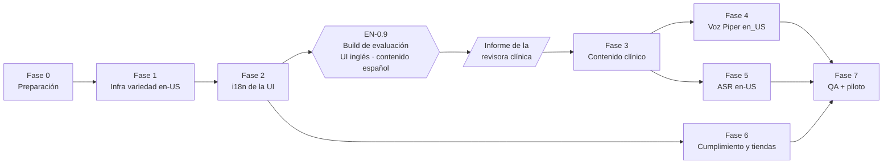

# Plan de integración · Inglés de Estados Unidos (`en-US`) → Valeria+

> **Documento de planificación y plan de trabajo.** Define cómo incorporar el
> **inglés estadounidense** a Valeria+ avanzando por **fases modulares e
> independientes**: cada fase deja la app compilando, publicable y con regresión
> cero en las cuatro variedades actuales (`es`, `gl`, `es-DO`, `eu`).
>
> Es el cuarto plan de idioma de la casa, después de
> [Proxecto Nós (gallego)](./plan-integracion-proxecto-nos.md),
> [Quisqueya Habla (dominicano)](./plan-integracion-quisqueya-habla.md) e
> [ILENIA/NEL-GAITU (euskera)](./plan-integracion-euskera.md), y **el primero
> que rompe el molde de los tres anteriores**: hasta ahora todas las variedades
> compartían familia lingüística iberorrománica (o convivían con ella) y, sobre
> todo, **compartían la interfaz en castellano**. El inglés no puede: una
> familia de Ohio no va a navegar una app cuyos botones dicen «Continuar».
>
> Estado: 🟡 **Fase 0 en curso** · Decisiones ya cerradas: **revisión clínica
> confirmada** (profesora SLP con licencia, *Howard University* — EN-0.3),
> **separación de ejes UI/terapia aprobada** (§5.1) y **guía dialectal como
> regla bloqueante** (EN-0.5). Rama de trabajo:
> `claude/us-english-integration-plan-pne3ge`

---

## Índice

- [1. Objetivo y alcance](#1-objetivo-y-alcance)
- [2. Qué cambia respecto a los planes anteriores](#2-qué-cambia-respecto-a-los-planes-anteriores)
- [3. Recursos a integrar](#3-recursos-a-integrar)
- [4. Principios de diseño](#4-principios-de-diseño)
- [5. Arquitectura objetivo](#5-arquitectura-objetivo)
- [6. Plan de trabajo por fases](#6-plan-de-trabajo-por-fases)
  - [Fase 0 · Preparación y decisiones](#fase-0--preparación-y-decisiones)
  - [Fase 1 · Infraestructura de variedad](#fase-1--infraestructura-de-variedad)
  - [Fase 2 · i18n de la interfaz](#fase-2--i18n-de-la-interfaz-el-eje-nuevo)
  - [Fase 3 · Contenido clínico en inglés](#fase-3--contenido-clínico-en-inglés)
  - [Fase 4 · Voz neuronal Piper en_US](#fase-4--voz-neuronal-piper-en_us)
  - [Fase 5 · ASR en-US](#fase-5--asr-en-us)
  - [Fase 6 · Cumplimiento y tiendas de EE. UU.](#fase-6--cumplimiento-y-tiendas-de-ee-uu)
  - [Fase 7 · QA, piloto y cierre](#fase-7--qa-piloto-y-cierre)
- [7. Roadmap resumido](#7-roadmap-resumido)
- [8. Riesgos y mitigaciones](#8-riesgos-y-mitigaciones)
- [9. Decisiones abiertas](#9-decisiones-abiertas-para-frank)
- [10. Seguimiento](#10-seguimiento)

---

## 1. Objetivo y alcance

Crear una **versión en inglés estadounidense de Valeria+** —contenido
terapéutico **e interfaz**— apoyada en la infraestructura de variedad que ya
está en producción, sin romper la experiencia castellana, gallega, dominicana ni
vasca, y sin renunciar al principio *offline-first*.

**Dentro del alcance**

- Alta de la variedad `en-US` en `src/valeriaLocale.ts` (banco de assets,
  locale BCP-47 `en-US`, selector de «Voz de la app» y refinamiento por
  paciente).
- **Internacionalización de la interfaz** (menús, botones, tarjetas, panel del
  adulto, notificaciones, informes exportados) con catálogo `es`/`en`. Es una
  fase propia porque hoy no existe **ninguna** infraestructura de i18n de UI:
  todas las cadenas están literales en los 27 `.tsx` de `src/`.
- Contenido terapéutico en inglés **diseñado ad hoc, no traducido**: banco de
  pares mínimos del inglés americano, expansión semántica, cápsulas TPR, rutas
  de rutina, frases portadoras, Audición, Lenguaje, TEA, Dislexia y Test de
  Ling.
- Locución con voz neuronal **Piper `en_US`** pre-generada en CI y empaquetada
  (mismo motor `piper` que ya usa Sharvard en castellano).
- Reconocimiento de voz `en-US`, la variedad **más favorable de todo el
  proyecto** para la promesa de reconocimiento local.
- **Guía dialectal `en-US`** (diferencia vs. trastorno) con la misma fuerza de
  regla bloqueante que tiene hoy [`guia-dialectal-es-DO.md`](./guia-dialectal-es-DO.md).
- Cumplimiento y publicación para el mercado estadounidense: COPPA, declaración
  de público objetivo en Play Console, categoría Kids de App Store, ficha de
  tienda en inglés, política de privacidad y página de eliminación de datos en
  inglés.

**Fuera del alcance (por ahora)**

- **Valeria Academy** (`src/ValeriaAcademy/academyContent.ts`, ~1.500 líneas de
  formación para profesionales): se queda en castellano en esta iteración y se
  aborda como fase propia cuando el resto esté cerrado. La pantalla debe
  ocultarse o marcarse «Spanish only» cuando la UI está en inglés (EN-2.7).
- Otras variedades del inglés (`en-GB`, `en-AU`, inglés caribeño). La
  arquitectura las deja preparadas —`en-US` entra ya con sufijo de región,
  igual que `es-DO`— pero no se implementan aquí.
- Bloque de **Realidad Aumentada** en inglés: depende del port nativo
  (`android-native/valeria-ar/`) y de su propio muro MDR; entra en el catálogo
  de UI (Fase 2) pero su contenido clínico se pospone.
- Traducción del manual de casos de uso y de los protocolos internos de `docs/`.

## 2. Qué cambia respecto a los planes anteriores

Los tres planes previos pudieron declarar «la UI sigue en castellano; solo el
contenido terapéutico cambia de lengua». Con el inglés esa frase deja de ser
sostenible, y de ahí salen las tres diferencias estructurales del plan:

| | Gallego / Euskera / Dominicano | **Inglés `en-US`** |
| --- | --- | --- |
| **Interfaz** | Castellano, sin tocar | **Debe traducirse entera** → fase nueva (Fase 2) |
| **Naturaleza del proyecto** | Nueva variedad clínica en el mismo mercado | **Nuevo mercado**: tiendas, legal y soporte propios (Fase 6) |
| **Distancia lingüística** | Fonología y morfosintaxis próximas o vecinas | Sistema vocálico ~14 vocales, grupos consonánticos, ortografía opaca → **rediseño clínico completo**, no adaptación |
| **Voz TTS** | Motor nuevo por idioma (coqui, AhoTTS) | Motor **ya implementado** (`piper`): la fase de voz es la más barata hasta la fecha |
| **ASR del sistema** | `gl-ES`/`eu-ES` rara vez tienen paquete local | `en-US` es **el locale mejor soportado** en Android e iOS: el reconocimiento local es aquí realista |
| **Riesgo dialectal** | Alto en `es-DO` (seseo, codas líquidas) | **Alto y con más carga**: inglés afroamericano (AAE), inglés sureño e inglés con influencia del español coexisten en el mismo mercado |

La consecuencia práctica: **la Fase 2 (i18n de UI) es la que decide el
calendario**, no la de contenido ni la de voz. Es también la única fase cuyo
beneficio va más allá del inglés: deja el proyecto listo para cualquier idioma
futuro de interfaz.

## 3. Recursos a integrar

| Recurso | Qué es | Uso en Valeria+ | Licencia |
| --- | --- | --- | --- |
| **Piper `en_US`** (`rhasspy/piper-voices`: `en_US-lessac-medium`, `en_US-hfc_female-medium`, `en_US-amy-medium`, `en_US-ryan-high`) | Voces VITS abiertas en inglés americano | Pre-generar en CI el audio de todas las consignas inglesas y empaquetarlo como assets | **Varía por voz** (CC0 / CC BY / MIT según dataset): verificar la `MODEL_CARD` de cada una en EN-0.1 |
| **ASR del sistema** (`expo-speech-recognition`, `en-US`) | Reconocimiento nativo Android/iOS | Juegos de micrófono; primera variedad donde `requiresOnDeviceRecognition` debería resolver en local de forma habitual | Plataforma |
| **CMUdict** (Carnegie Mellon Pronouncing Dictionary) | Diccionario fonético de ~134k palabras del inglés americano | Validar que cada par mínimo candidato **contrasta exactamente un fonema** y generar los `stt_expected` a partir de la transcripción real, no de la intuición | BSD-like (libre) |
| **SUBTLEX-US** / **Wordbank–CDI (MacArthur-Bates)** | Normas de frecuencia léxica y de edad de adquisición del inglés americano infantil | Ordenar el vocabulario por **familiaridad**, que es el criterio declarado del campo `difficulty` (ver [`criterio-dificultad-lexica.md`](./criterio-dificultad-lexica.md)) | Académica / CC |
| **Crowe & McLeod (2020)** y normas equivalentes de adquisición consonántica del inglés americano | Edades de adquisición por fonema | Secuenciar los objetivos del banco de pares mínimos por edad, no por parecido con el banco castellano | Publicación científica (se cita, no se copia) |
| **Common Voice `en`** | Corpus abierto de voz | Material de referencia y validación léxica | CC0 |

> ⚠️ **Lo que NO se puede usar.** Los ítems de las pruebas estandarizadas
> estadounidenses (GFTA-3, PPVT-5, CELF-5, KLPA-3…) están protegidos por
> copyright y su reproducción —aunque sea parcial o «inspirada»— es un riesgo
> legal real y un problema de validez clínica. El banco inglés se **diseña**,
> como se diseñaron el vasco y el dominicano. Las normas publicadas de
> adquisición fonética sí se pueden citar y usar como criterio.

## 4. Principios de diseño

1. **Offline-first se mantiene.** Nada de servidores en tiempo de sesión. Piper
   corre en CI (build-time), nunca en el dispositivo.
2. **El adulto sigue siendo el juez final.** Si el ASR no está disponible o
   falla, la pantalla oculta el juego de micrófono y el adulto valora con
   botones. Ninguna fase puede romper esta degradación.
3. **Traducir no es adaptar.** Es la regla de siempre, y en inglés aprieta más:
   un par mínimo castellano traducido produce material clínicamente inútil
   (*perro/cerro* → *dog/hill* no contrasta nada). El material clínico se
   rediseña desde la fonología del inglés americano.
4. **Diferencia dialectal ≠ trastorno.** ✅ *Aprobado como regla bloqueante.*
   Heredada de `es-DO` y ampliada: en el mercado estadounidense conviven el
   **inglés afroamericano** (AAE, también llamado AAVE, donde *mouth*→[maʊf],
   la reducción de grupos consonánticos finales y la pérdida de /r/
   postvocálica son rasgos regulares y reglados de la variedad, no errores), el
   inglés sureño y el inglés con influencia del español. Un banco que puntúe
   esos rasgos como fallo convierte la app en un instrumento de discriminación
   lingüística. **Ningún dataset `en` entra en `main` sin veredicto dialectal**
   (EN-0.5), y ese apartado lo firma la revisora clínica de EN-0.3.
5. **Modularidad real.** Cada fase termina con la app compilando, las cinco
   variedades funcionando y un entregable demostrable. El proyecto se puede
   pausar al final de cualquier fase.
6. **Fuente única por idioma.** El contenido vive en ficheros paralelos con la
   **misma interfaz TypeScript** (patrón `…Gl.ts` / `…Eu.ts`); las pantallas no
   saben en qué idioma trabajan, solo consumen lo que les inyecta la capa de
   variedad.
7. **Idioma de interfaz e idioma de terapia son ejes distintos.** ✅ *Aprobado.*
   Ver §5.1: es la decisión de arquitectura más importante del plan.

### 4.1 La fonología del inglés americano: por qué el banco se diseña de cero

El inglés abre contrastes que ninguna de las cuatro variedades actuales puede
ofrecer, y cierra otros que en castellano son el pan de cada día:

- **Grupos consonánticos** (`st-`, `sp-`, `sl-`, `sn-`, `tr-`, `-nd`, `-st`):
  inexistentes en posición inicial en castellano. La **reducción de grupos** es
  el proceso fonológico más frecuente del inglés infantil y no tiene banco
  equivalente en el resto del proyecto.
- **Sistema vocálico**: ~14 vocales frente a las 5 del castellano. El par
  tenso/laxo /i/–/ɪ/ (*sheep/ship*) y /æ/–/ɛ/ (*bat/bet*) son objetivos
  centrales, especialmente en la población hispanohablante de EE. UU.
- **Interdentales** /θ/ y /ð/, ausentes del castellano latinoamericano y del
  gallego, y su *fronting* a [f]/[d] (*thin→fin*, *they→day*).
- **Deslizamiento de líquidas** (*gliding*): /r/→[w] (*rake→wake*) y /l/→[w],
  el proceso más característico del habla infantil angloamericana.
- **/r/ rótica vocálica** (*bird*, *car*): un sonido que no existe en ninguna de
  las variedades actuales y que se adquiere tarde.
- **Consonante final**: el inglés la lleva constantemente, así que la **omisión
  de consonante final** (*boat→bow*) es un objetivo productivo. En dominicano
  es justo al revés: allí la elisión es rasgo dialectal normal.

Candidatos de pares mínimos (a validar contra CMUdict y a cerrar por la persona
revisora en EN-3.2):

| Par | Contraste | Proceso detectado |
| --- | --- | --- |
| **rake** 🍂 / **wake** ⏰ | /r/ vs /w/ | *Gliding* de /r/ |
| **lock** 🔒 / **rock** 🪨 | /l/ vs /r/ | Sustitución de líquidas |
| **thin** / **fin** 🐟 | /θ/ vs /f/ | *Fronting* interdental |
| **sip** / **ship** 🚢 | /s/ vs /ʃ/ | Palatalización / despalatalización |
| **key** 🔑 / **tea** 🍵 | /k/ vs /t/ | *Fronting* velar (universal infantil) |
| **pig** 🐷 / **big** | /p/ vs /b/ | Sonorización / ensordecimiento |
| **stop** 🛑 / **top** 🔝 | /st-/ vs /t-/ | **Reducción de grupo inicial** |
| **snail** 🐌 / **nail** | /sn-/ vs /n-/ | **Reducción de grupo inicial** |
| **boat** ⛵ / **bow** 🎀 | /-t/ vs ∅ | **Omisión de consonante final** |
| **sheep** 🐑 / **ship** 🚢 | /i/ vs /ɪ/ | **Contraste vocálico tenso/laxo** |

Se mantiene el **principio detector**: el error de sustitución habitual del niño
produce exactamente la otra palabra del par. Y se mantiene el hallazgo que
obligó a auditar los bancos existentes —**25 de 35 pares puntuaban como acierto
que el niño dijera el distractor**, §4.0 de
[`plan-asr-privacidad-y-motor-local.md`](./plan-asr-privacidad-y-motor-local.md)—:
el banco inglés no se da por cerrado hasta pasar `npm run asr:audit-pairs`
(EN-3.2).

### 4.2 Morfosintaxis y lectura: dos bloques que se rehacen, no se traducen

- **Bloque «Lenguaje».** El inglés no tiene género gramatical, pero sí
  alomorfía de plural (/s/ · /z/ · /ɪz/), plurales irregulares (*foot/feet*,
  *mouse/mice* — objetivo clásico de la logopedia angloamericana), pasado en
  `-ed` con tres realizaciones, tercera persona `-s`, artículos *a/an* regidos
  por el **sonido** siguiente (no por la letra) y pronombres sujeto
  obligatorios, que son un error de transferencia típico del hispanohablante.
  El campo `plural` del banco ya está parametrizado por variedad
  (`pluralOneLabelFor` / `pluralManyLabelFor` en `valeriaExerciseBank.ts`), así
  que la infraestructura aguanta; lo que cambia es el contenido.
- **Bloque «Dislexia».** El castellano es ortográficamente transparente y el
  bloque actual trabaja sílaba y velocidad. El inglés es opaco: el bloque
  inglés trabaja **familias de rimas** (*-at*, *-op*, *-ight*), dígrafos
  (`sh`, `ch`, `th`, `ck`), la *silent e* y la lectura de pseudopalabras. Es
  contenido nuevo con la misma interfaz, no una traducción.
- **Test de Ling.** Los seis sonidos (/a/ /u/ /i/ /ʃ/ /s/ /m/) son universales:
  aquí sí basta con reescribir las consignas.

## 5. Arquitectura objetivo

Convención: ◆ extender lo existente · ✚ crear nuevo.

```
src/
  valeriaLocale.ts              ◆ Locale += 'en-US'; ALL_LOCALES; isLocale;
                                   assetLang('en-US')='en'; speechLocale='en-US'
  valeriaUiLang.ts              ✚ EJE NUEVO: idioma de INTERFAZ ('es'|'en'),
                                   independiente de la variedad de terapia
  i18n/
    strings.es.ts               ✚ catálogo castellano (clave → cadena)
    strings.en.ts               ✚ catálogo inglés (mismas claves, tipadas)
    index.ts                    ✚ t(key, params) + useUiLang()
  valeriaVoiceCorpus.ts         ◆ VoiceLang += 'en'; buildVoiceCorpus() enumera
                                   el bloque inglés (espejo del bloque eu)
  valeriaCarrierPhrases.ts      ◆ CarrierLang += 'en'; BANKS.en (SVO, artículo
                                   a/an por sonido, verbos en pasado irregular)
  valeriaMinimalPairsEn.ts      ✚ banco de pares ad hoc (interfaz MinimalPair)
  valeriaContentEn.ts           ✚ TPR, rutas de rutina, bancos de refuerzo,
                                   frases fijas y builders (espejo de …Eu.ts)
  valeriaSemanticExpansionEn.ts ✚ escenarios, categorías, progresiones, cápsulas
  valeriaExerciseEn.ts          ✚ Audición · Lenguaje · TEA · Dislexia
  valeriaLingContent.ts         ◆ consignas del Test de Ling en inglés
  valeriaPairBanks.ts           ◆ pairsForLocale('en-US')
  valeriaSemanticBanks.ts       ◆ semanticForLocale('en-US')
  valeriaExerciseBank.ts        ◆ dbForLocale · variantsForLocale · emoForLocale
                                   · pluralOneLabelFor · pluralManyLabelFor
  valeriaNotifications.ts       ◆ avisos y los 20 consejos del adulto en inglés
  ValeriaCreditsScreen.tsx      ◆ atribución de la voz Piper en_US
assets/voice/…                  ✚ .m4a en inglés generados en CI (Piper)
voice-assets-manifest.en.json   ✚ manifiesto id→asset de la variedad en
scripts/
  generate-voice-assets.py      ◆ VOICES['en'] (engine 'piper', ya implementado)
  check-content-rules.js        ◆ de cuatro bancos a cinco
  check-lexical-difficulty.js   ◆ incluir categorías en
  check-pictogram-coverage.js   ◆ incluir cápsulas en
  check-voice-corpus-coverage.js ◆ incluir locuciones en
  check-ui-strings.js           ✚ gate: ninguna cadena visible fuera del catálogo
.github/workflows/voice-assets.yml ◆ matriz de idioma += en
app.json / plugins/             ◆ permisos de micrófono y cámara localizados
site/                           ◆ privacy.html alineada + data-deletion.html (EN)
```

### 5.1 Decisión de arquitectura: dos ejes, no uno ✅

> **Decidido (ago 2026).** Se implementa la separación de ejes descrita abajo.

Hoy `Locale` significa **variedad de terapia** y la UI es siempre castellana.
La tentación es hacer que `en-US` cambie las dos cosas a la vez. **No conviene**,
por una razón de mercado muy concreta: en EE. UU. una parte enorme de los
logopedas trabaja con **caseload bilingüe español-inglés**, y una familia
hispanohablante en Miami o en Los Ángeles puede querer la interfaz en español
mientras el niño trabaja objetivos en inglés (o al revés, cuando el objetivo es
mantener el español en casa).

Por eso:

```ts
// src/valeriaUiLang.ts (nuevo)
export type UiLang = 'es' | 'en';

// Defecto derivado de la variedad de terapia; el adulto puede desacoplarlo.
export const defaultUiLangFor = (loc: Locale): UiLang =>
  loc === 'en-US' ? 'en' : 'es';
```

- `Locale` sigue decidiendo **qué se locuta, se muestra y se evalúa**.
- `UiLang` decide **qué idioma leen los adultos** (menús, panel, informes,
  notificaciones).
- Por defecto, elegir la variedad `en-US` pone la UI en inglés; una preferencia
  explícita del adulto la desacopla y persiste en `AsyncStorage` con su propia
  clave.
- Los usuarios actuales no notan nada: sin variedad `en-US`, `UiLang` es `'es'`
  siempre.

Es un eje más y no una complicación gratuita: sin él, el bilingüismo —que es
justo el caso de uso más valioso del mercado estadounidense— quedaría fuera.

## 6. Plan de trabajo por fases

Convención de tareas: `EN-<fase>.<n>`. Cada tarea indica **Entregable** y
**Criterio de aceptación (CA)**. Regla transversal en todas las fases:
**regresión cero en `es`, `gl`, `es-DO` y `eu`**.

---

### Fase 0 · Preparación y decisiones

*Objetivo: cerrar decisiones y dejar el terreno listo. Sin código de producto.*

| Tarea | Descripción | Entregable / CA |
| --- | --- | --- |
| **EN-0.1** | Auditar licencias de las voces Piper `en_US` candidatas (leer la `MODEL_CARD` de cada una: las licencias **no son uniformes** dentro de `rhasspy/piper-voices`) y redactar la atribución | Texto legal para `ValeriaCreditsScreen`; CA: licencia compatible con uso comercial confirmada por escrito |
| **EN-0.2** | Elegir la voz escuchando muestras con consignas reales de la app (propuesta: femenina y cálida, homóloga de Sharvard/Celtia/Maider; candidatas `en_US-hfc_female-medium` y `en_US-lessac-medium`) | Decisión registrada aquí; CA: audio de muestra aprobado |
| **EN-0.3** ✅ | Confirmar persona revisora: **SLP con licencia en EE. UU.** para las Fases 3, 5 y 7 → **profesora SLP con licencia de *Howard University*** (asesoría confirmada, ago 2026) | CA: revisora confirmada ✅ · pendiente acordar el **flujo de revisión** (formato de entrega, tiempos y qué constituye «aprobado») antes de abrir la Fase 3 |
| **EN-0.4** | Verificar en dispositivos objetivo: voces TTS `en-US` del sistema, ASR `en-US` y —clave— disponibilidad real de **reconocimiento local** (`supportsOnDeviceRecognition`) | Tabla de soporte por plataforma en `docs/`; CA: sabemos si la promesa de audio-que-no-sale-del-móvil se sostiene en `en-US` |
| **EN-0.5** 🔴 | Redactar [`docs/guia-dialectal-en-US.md`](./guia-dialectal-en-US.md): qué es rasgo dialectal normal (**AAE**, inglés sureño, inglés con influencia del español) y qué es objetivo terapéutico. **Regla bloqueante para todo dataset `en`.** Es la tarea de más riesgo del plan (§8) y la primera que se pone sobre la mesa de la revisora de EN-0.3 | Guía firmada por EN-0.3; CA: cada par mínimo candidato lleva veredicto dialectal explícito |
| **EN-0.6** | Decidir el **modelo de publicación**: misma ficha de app con idiomas añadidos vs. ficha/listing separado para EE. UU.; y si `en-US` viaja en el mismo binario (impacto de tamaño, EN-4.4) | Decisión registrada; CA: elección con su justificación de coste/tamaño |
| **EN-0.7** | Fijar el alcance de i18n de UI: qué pantallas entran en la Fase 2 y en qué orden (propuesta en EN-2.3) | Lista ordenada de pantallas; CA: alcance cerrado y estimado |
| **EN-0.8** | **Hoja de revisión clínica**: script que exporta los datasets `en` a una tabla legible (Markdown/CSV) con columnas *ítem · objetivo fonológico · veredicto dialectal · aprobado/cambios*. Los bancos son TypeScript; nadie revisa clínica leyendo un `.ts`. *Se necesita a partir de la Fase 3, no antes: la primera vuelta de revisión es con la app en la mano* | `scripts/export-review-sheet.js`; CA: la revisora de EN-0.3 puede anotar y devolver el fichero sin tocar el repositorio |
| **EN-0.9** 🔴 | **Build de evaluación para la revisora** (Android APK firmado del CI) con la **interfaz en inglés y el contenido aún en castellano**, más el [protocolo de evaluación](./protocolo-evaluacion-clinica-en-US.md) que estructura su informe. **Bloquea la Fase 3**: su criterio vale más antes de escribir los bancos que después | APK + protocolo enviados; CA: la revisora completa el recorrido de las 16 pantallas y devuelve el informe en el formato acordado |

**Salida de fase:** decisiones cerradas; ningún cambio de comportamiento.

> **Sobre la revisión clínica (EN-0.3).** La asesoría corre a cargo de una
> **profesora SLP con licencia de Howard University**. Dos consecuencias
> prácticas para el plan:
>
> 1. **EN-0.5 deja de ser el punto ciego del proyecto.** El riesgo nº 1 (§8) era
>    que un banco escrito desde fuera penalizara rasgos del inglés
>    afroamericano como si fueran errores articulatorios. Howard es una HBCU y
>    el perfil encaja de lleno con esa cuestión, así que la guía dialectal se
>    escribe **con** la revisora desde el principio, no se le manda a validar
>    después. Conviene confirmarle explícitamente que asume ese apartado y con
>    qué marco de referencia lo aborda (p. ej. la distinción
>    *dialectal difference vs. disorder* de ASHA), y dejarlo escrito en la guía.
> 2. **Perfil académico ⇒ vía natural para el piloto.** Una profesora en
>    activo da acceso a supervisión clínica y, potencialmente, a estudiantes de
>    prácticas para EN-7.3. Merece la pena preguntarlo pronto: el piloto
>    estadounidense era el otro punto sin resolver del plan.
>
> Queda pendiente de EN-0.3 únicamente el **flujo de revisión**: en qué formato
> se le entrega el material (los bancos son ficheros TypeScript; para revisar
> hace falta una vista legible, tipo tabla exportada), qué plazos maneja y qué
> significa exactamente «aprobado» para poder cerrar una fase. Sin eso escrito,
> la Fase 3 se atasca en la primera entrega.

---

### Fase 1 · Infraestructura de variedad

*Objetivo: la app soporta `en-US` de extremo a extremo con contenido inglés aún
mínimo (placeholder). Es la fase más corta: la capa de variedad ya existe y solo
se extiende.*

| Tarea | Descripción | Entregable / CA |
| --- | --- | --- |
| **EN-1.1** | Extender `valeriaLocale.ts`: `Locale += 'en-US'`, `ALL_LOCALES`, `isLocale`, `assetLang('en-US')='en'`, `speechLocale('en-US')='en-US'`, `prefersLatinVoice` sin cambios | CA: la variedad se selecciona y persiste en `AsyncStorage` y en la ficha del paciente |
| **EN-1.2** | Extender `VoiceLang` en `valeriaVoiceCorpus.ts` a `'es'\|'gl'\|'eu'\|'en'`; el prefijo de id ya lo aplica `voiceCorpusId` a todo `lang ≠ es` | CA: `buildVoiceCorpus()` compila y acepta entradas `en` sin colisión de ids |
| **EN-1.3** | Añadir **«English (US)»** al selector «Voz de la app» (`ValeriaVoiceUI`) y al refinamiento por paciente, con su muestra de voz | CA: con `en-US` activa, la app enruta a los bancos ingleses |
| **EN-1.4** | Crear los módulos `*En.ts` con contenido provisional mínimo (1 par mínimo, 1 cápsula TPR, frases fijas) para probar el cableado extremo a extremo | CA: una sesión en `en-US` muestra y locuta el contenido provisional con la voz del sistema `en-US` |
| **EN-1.5** | Verificar que ninguna pantalla de terapia asume castellano: todo pasa por `pairsForLocale`, `semanticForLocale`, `dbForLocale`, `emoForLocale` | CA: recorrido completo en `en-US` sin caer a datos de otra variedad |

**Salida de fase:** app con cinco variedades funcional e inglés de muestra.
**Depende de:** Fase 0 (EN-0.4).

---

### Fase 2 · i18n de la interfaz (el eje nuevo)

*Objetivo: la app entera se puede leer en inglés. Es la fase más larga y la que
más valor deja para el futuro: cualquier idioma posterior la reutiliza.*

Estado de partida: **cero infraestructura**. Las cadenas están literales en 27
pantallas `.tsx` (~34.500 líneas en `src/`). Por eso la fase se ejecuta
**pantalla a pantalla**: cada PR migra una pantalla a `t()` y la app sigue
funcionando en castellano exactamente igual.

| Tarea | Descripción | Entregable / CA |
| --- | --- | --- |
| **EN-2.1** | Crear `src/valeriaUiLang.ts` (tipo `UiLang`, persistencia, `defaultUiLangFor`) y `src/i18n/` (`strings.es.ts`, `strings.en.ts`, `t()` con claves **tipadas**: una clave que falte en un catálogo debe romper el `typecheck`, no aparecer en blanco en pantalla) | CA: `npm run typecheck` falla si un catálogo pierde una clave |
| **EN-2.2** | Selector de **idioma de la interfaz** en ajustes, separado del selector de variedad, con la relación por defecto de §5.1 explicada al adulto | CA: se puede tener UI en español con terapia en inglés y al revés |
| **EN-2.3** | Migrar las pantallas al catálogo por **tramos**, en orden de recorrido del usuario. **1** Welcome · Credits · PatientSelect ✅ — **2** FichaRegistro · ExerciseSelection · Auth — **3** ExercisePlayer · MinimalPairs · SemanticExpansion · LingTest — **4** AdultChaosPanel · PatientResultsDashboard · ProExport · modales (SUS, PragmaticBreak, SessionBreak, ProPin, TPRCapsule) — **5** notificaciones y permisos | Una PR por tramo; CA por pantalla: idéntica en castellano, íntegra en inglés. **La build de EN-0.9 sale al cerrar el tramo 4** |
| **EN-2.4** | Localizar **notificaciones**: los 12 avisos y los 20 consejos largos del adulto (`valeriaNotifications.ts`), más el nombre del canal Android (hoy `valeria-recordatorios`) | CA: `check-reminder-slots.js` pasa con los dos catálogos |
| **EN-2.5** | Localizar los **permisos del sistema**: las cadenas de micrófono/reconocimiento de voz de `app.json` y de cámara (AR) están hoy en castellano y son lo primero que lee un usuario estadounidense. Requiere `InfoPlist.strings` por idioma en iOS y `strings.xml` por locale en Android, vía config plugin (hay precedente: `plugins/withValeriaAR.js`) | CA: en un dispositivo con el sistema en inglés, el diálogo de permiso sale en inglés |
| **EN-2.6** | Localizar el **informe exportado** (`ValeriaProExport`) y las etiquetas del panel de resultados: es lo que el clínico enseña a la familia | CA: informe generado íntegramente en inglés |
| **EN-2.7** | Decidir y aplicar el tratamiento de **Valeria Academy** con UI en inglés (ocultar o marcar «Spanish only»), según §1 | CA: no hay pantallas medio traducidas visibles |
| **EN-2.8** | Gate `scripts/check-ui-strings.js`: falla si aparece una cadena visible literal en un `.tsx` ya migrado. Sin gate, la UI se «des-traduce» sola en tres PRs | CA: el gate corre en CI y detecta una regresión introducida a propósito |

**Salida de fase:** app completamente usable en inglés (con contenido
terapéutico todavía castellano si se para aquí) → **es exactamente la build de
evaluación de EN-0.9**.
**Depende de:** Fase 1 (solo de EN-1.1).

> **Reordenación (ago 2026).** Esta fase deja de poder paralelizarse con la
> Fase 3 y pasa a **precederla**: la revisora clínica evalúa con la app en la
> mano, no con hojas de datos, y la versión acordada es «UI en inglés, contenido
> en castellano». Sin los tramos 1–4 de EN-2.3 no hay build que enviarle, así
> que la i18n es ahora el **camino crítico** del proyecto entero.
>
> **Estado:** ⏳ EN-2.1 ✅ · EN-2.2 ✅ · EN-2.3 en curso (tramo 1 de 5).

---

### Fase 3 · Contenido clínico en inglés

*Objetivo: todo el contenido terapéutico existe en inglés, diseñado y revisado.
Se subdivide por bloque para poder publicar por partes.*

| Tarea | Descripción | Entregable / CA |
| --- | --- | --- |
| **EN-3.1** | Utilidad de validación fonética: script que cruza los pares candidatos con **CMUdict** y comprueba que contrastan **exactamente un fonema** y que ambos miembros son palabras reales y frecuentes | `scripts/check-minimal-pairs-en.js`; CA: rechaza un par falso introducido a propósito |
| **EN-3.2** | **Banco de pares mínimos** (`valeriaMinimalPairsEn.ts`): ~10 pares cubriendo *gliding*, *fronting* velar e interdental, reducción de grupos, omisión de consonante final, sonorización y contraste vocálico tenso/laxo. Cada par con veredicto dialectal de EN-0.5 | `valeriaMinimalPairsEn.ts` + `docs/protocolo-pares-minimos-en-US.md`; CA: revisión SLP aprobada **y** `npm run asr:audit-pairs` sin pares que premien el distractor |
| **EN-3.3** | **Frases portadoras**: `BANKS.en` en `valeriaCarrierPhrases.ts` (SVO, artículo *a/an* elegido por **sonido** inicial, pasados irregulares, elicitación natural: *"Now you say it"*) | CA: `enumerateAllCarrierPrompts('en')` produce frases gramaticales revisadas |
| **EN-3.4** | **TPR, rutas de rutina y bancos de refuerzo** (`valeriaContentEn.ts`): el refuerzo inglés no es un calco (*"Nice job!"*, *"You got it!"*), y las misiones físicas se adaptan al hogar estadounidense | CA: revisión SLP aprobada |
| **EN-3.5** | **Expansión semántica** (`valeriaSemanticExpansionEn.ts`): escenarios, categorías léxicas ordenadas por familiaridad según SUBTLEX-US/CDI, progresiones y cápsulas de contraste con sus pictogramas | CA: `check-content-rules.js`, `check-lexical-difficulty.js` y `check-pictogram-coverage.js` verdes sobre el banco `en` |
| **EN-3.6** | **Audición, Lenguaje, TEA y Dislexia** (`valeriaExerciseEn.ts`) con la morfología inglesa de §4.2 (alomorfía de plural, irregulares, pasado `-ed`, pronombres) y el bloque de Dislexia **rediseñado** para ortografía opaca | CA: revisión SLP aprobada; player localizado por variedad (emociones, plural, cierre de sesión) |
| **EN-3.7** | **Test de Ling** en inglés: consignas y pistas (los seis sonidos son universales) | CA: revisión aprobada |
| **EN-3.8** | Cablear el bloque inglés en `buildVoiceCorpus()` (espejo exacto del bloque `eu`) | CA: `voice-corpus.json` incluye las locuciones `en`; el corpus enumera el **100 %** de lo que la app dice en `en-US` |

**Salida de fase:** app completa en inglés locutada por el TTS del sistema.
**Depende de:** Fase 1. EN-3.2 depende de EN-0.5 y EN-3.1.

---

### Fase 4 · Voz neuronal Piper en_US

*Objetivo: el inglés suena con voz neuronal empaquetada, sin servidor. La fase
más barata de todas las de voz: el motor `piper` ya está implementado para
Sharvard, así que es configuración y CI, no ingeniería nueva.*

| Tarea | Descripción | Entregable / CA |
| --- | --- | --- |
| **EN-4.1** | Añadir `VOICES['en']` en `scripts/generate-voice-assets.py` (engine `piper`, voz de EN-0.2, URLs `.onnx` + `.onnx.json`) y soportar `--lang en` | CA: `python3 scripts/generate-voice-assets.py --lang en` sintetiza de forma incremental y escribe `assets/voice/*.m4a` + `voice-assets-manifest.en.json` |
| **EN-4.2** | Extender `.github/workflows/voice-assets.yml` (matriz de idioma += `en`) y commitear los assets | CA: un push que cambie el corpus `en` regenera **solo** los assets `en` afectados |
| **EN-4.3** | Verificar la integración runtime: `valeriaVoicePlayback` + `valeriaVoice` resuelven el asset `en` por id; orden audio empaquetado → voz del sistema `en-US` → nada de salto a otra variedad (la regla «cada variedad reproduce solo assets de su propia voz» ya está en producción) | CA: sesión completa en inglés con voz Piper; sin asset, degrada sin silencio y sin acento cruzado |
| **EN-4.4** | Medir el impacto en tamaño (referencia: ~10 MB AAC por variedad; con `en` serían cinco bancos) y decidir según EN-0.6 si todo viaja en el mismo binario o se descarga bajo demanda | Nota de tamaño en este documento; CA: build EAS dentro del presupuesto acordado |
| **EN-4.5** | Añadir los créditos de la voz Piper `en_US` a `ValeriaCreditsScreen` junto a Sharvard, Celtia y HiTZ | CA: atribución visible en la app |

**Salida de fase:** experiencia inglesa con voz neuronal, offline.
**Depende de:** Fase 3 (necesita las cadenas finales y EN-3.8).

---

### Fase 5 · ASR en-US

*Objetivo: los juegos de micrófono funcionan en inglés con la degradación
elegante de siempre. Es la variedad con mejor pronóstico del proyecto.*

| Tarea | Descripción | Entregable / CA |
| --- | --- | --- |
| **EN-5.1** | Pasar `en-US` al reconocedor del sistema pidiendo **reconocimiento local** (`requiresOnDeviceRecognition`), y comprobar con telemetría (`trackAsrMode`) qué modo toca de verdad | CA: en dispositivos de la tabla EN-0.4, el modo local es el habitual; el dato queda registrado, no supuesto |
| **EN-5.2** | Ajustar los `stt_expected` ingleses en dispositivo real. Aviso concreto: el modelo de lenguaje inglés del reconocedor es **agresivo** y «corrige» hacia palabras frecuentes, así que hay que listar las confusiones reales observadas, no las teóricas | CA: tasa de captura medida y registrada en `docs/`, con hablante infantil real |
| **EN-5.3** | Revisar la **normalización/pliegue** para el inglés (hoy hay `foldBasque` para la ⟨h⟩ muda): homófonos (*wake/wake*, *ate/eight*), contracciones y plurales que el reconocedor devuelve inflados | CA: `check-asr-listen-options.js` y `check-asr-capture-guard.js` verdes con la variedad `en` |
| **EN-5.4** | Verificar la degradación: sin permiso, sin paquete de idioma o con error, la pantalla oculta el juego de micrófono y el adulto puntúa con botones | CA: los tres caminos de fallo probados en dispositivo |

**Salida de fase:** micrófono en inglés operativo.
**Depende de:** Fase 3 (los `stt_expected` finales); independiente de la Fase 4.

---

### Fase 6 · Cumplimiento y tiendas de EE. UU.

*Objetivo: poder publicar legalmente en EE. UU. una app dirigida a menores. Esta
fase no es opcional ni se puede dejar para el final del final: sus decisiones
condicionan qué datos puede recoger la app.*

| Tarea | Descripción | Entregable / CA |
| --- | --- | --- |
| **EN-6.1** | Análisis **COPPA**: qué datos personales de menores de 13 años toca la app (cuenta Firebase, ficha del paciente, telemetría, audio del turno de habla) y qué exige de consentimiento parental verificable. Cruzar con que el ASR local (EN-5.1) mantiene el audio en el dispositivo | Informe de cumplimiento en `docs/`; CA: lista cerrada de datos y base legal de cada uno |
| **EN-6.2** | Declaración de **público objetivo y contenido** en Play Console (programa *Designed for Families* si procede) y revisión de la **Kids Category** de App Store, que restringe analítica y terceros | CA: formularios cumplimentados de forma coherente con EN-6.1 |
| **EN-6.3** | Actualizar el formulario de **Seguridad de los datos** de Play Console **y** la política de `site/` en el mismo cambio —Google contrasta ambas declaraciones entre sí (regla de `CLAUDE.md`)—, alineando `site/privacy.html` (ya existe en inglés) con lo que la app hace de verdad | CA: ambas declaraciones coinciden ítem por ítem |
| **EN-6.4** | Crear la **página de eliminación de datos en inglés** (hoy solo existe `eliminacion-de-datos.html` en castellano) y enlazarla desde `site/index.html` y el `sitemap.xml`. Correo de contacto: el fijo del proyecto, sin excepción | `site/data-deletion.html`; CA: URL publicada por GitHub Pages y declarada en Play Console |
| **EN-6.5** | **Ficha de tienda en inglés** (título, descripción corta y larga, capturas con UI inglesa, texto promocional) para Google Play y App Store | CA: listing `en-US` completo y coherente con la app real |
| **EN-6.6** | Revisar el **encuadre regulatorio** de las afirmaciones en EE. UU.: la app se posiciona como herramienta educativa y de apoyo a la terapia, no como dispositivo médico. Contrastar el lenguaje del listing y de la app con ese encuadre (en la UE el proyecto ya trabaja con el muro MDR del bloque AR) | CA: revisión de textos hecha; afirmaciones clínicas acotadas por escrito |

**Salida de fase:** app publicable en EE. UU.
**Depende de:** Fase 2 (capturas y textos en inglés). EN-6.1 conviene arrancarlo
en paralelo desde la Fase 0: puede cambiar decisiones de producto.

---

### Fase 7 · QA, piloto y cierre

| Tarea | Descripción | Entregable / CA |
| --- | --- | --- |
| **EN-7.1** | Pasada QA multivariedad: matriz pantalla × variedad (`es`/`gl`/`es-DO`/`eu`/`en-US`) × idioma de UI (`es`/`en`) × plataforma (Android, iOS, Expo Go, web), incluidas las degradaciones sin micrófono y sin assets | Checklist QA en `docs/`; CA: sin regresiones en las cuatro variedades previas |
| **EN-7.2** | Telemetría: etiquetar sesiones con la variedad `en-US` **y** con el idioma de UI, para poder leer el bilingüismo en el panel | CA: el dashboard distingue `en-US` y el eje de UI |
| **EN-7.3** | Mini-piloto con 2–3 familias angloparlantes y la revisora SLP de EN-0.3; SUS (`ValeriaSUSModal`) en inglés. Explorar con ella la vía **universitaria** (supervisión clínica y estudiantes en prácticas), que da una muestra mejor que el boca a boca | Informe de piloto; CA: feedback triado en tareas |
| **EN-7.4** | Revisión de **calidad de la traducción de UI** por hablante nativo: no basta con que sea correcta, tiene que sonar a app estadounidense (*caregiver* y no *tutor*, *speech-language pathologist* y no *speech therapist* en contexto clínico) | CA: pasada nativa aplicada |
| **EN-7.5** | Actualizar README (tabla de idiomas y variedades, badges), protocolos e historial de versiones | CA: documentación al día |

**Depende de:** Fases 4, 5 y 6.

## 7. Roadmap resumido



La Fase 2 ya no corre en paralelo a la Fase 3: **es su requisito**. El informe
de la revisora se recoge con la app en la mano y antes de escribir los bancos
ingleses, que es donde su criterio ahorra más retrabajo.

| Fase | Recurso protagonista | Tamaño relativo | Publicable al terminar |
| --- | --- | --- | --- |
| 0 · Preparación | — (licencias, decisiones, guía dialectal) | S | Sí (sin cambios) |
| 1 · Infra variedad | — (extiende la capa existente) | S | Sí |
| 2 · **i18n de UI** | Catálogo `es`/`en` + gate | **XL** (27 pantallas) | Sí, tramo a tramo · **camino crítico** |
| — · Evaluación clínica | Build Android + protocolo (EN-0.9) | S | — (puerta de entrada a la Fase 3) |
| 3 · Contenido clínico | CMUdict · SUBTLEX-US · CDI | L (por bloques) | Sí, bloque a bloque |
| 4 · Voz | **Piper `en_US`** (motor ya existente) | S–M | Sí |
| 5 · Micrófono | ASR del sistema `en-US` | M | Sí |
| 6 · Cumplimiento | COPPA · Play/App Store · `site/` | M | **Requisito para publicar** |
| 7 · QA/piloto | — | M | Sí (cierre) |

Las Fases 2 y 3 son independientes entre sí: se pueden llevar en paralelo, y ese
es el camino más corto al lanzamiento.

## 8. Riesgos y mitigaciones

| Riesgo | Impacto | Mitigación |
| --- | --- | --- |
| El banco inglés penaliza rasgos del **inglés afroamericano (AAE)** o del inglés sureño como si fueran errores | **Muy alto** (clínico y reputacional: convierte la app en un instrumento de discriminación lingüística) | Guía dialectal bloqueante (EN-0.5) **coescrita** con la revisora de EN-0.3 —profesora SLP de Howard, perfil que ataca este riesgo de frente—, veredicto dialectal por par y posibilidad de marcar el par con `region` cuando dependa de variedad, patrón que ya existe. **Sigue siendo el riesgo nº 1**: tener a la persona adecuada lo reduce, no lo elimina |
| La Fase 2 (i18n) se desborda y bloquea todo lo demás | Alto (calendario) | Migración **pantalla a pantalla**, cada PR publicable; gate `check-ui-strings.js` para que no retroceda; la Fase 3 avanza en paralelo |
| Traducir la UI a medias: pantallas mezcladas español/inglés | Alto (percepción de calidad) | El gate + la regla de EN-2.7: una pantalla no se marca migrada hasta que **ninguna** cadena visible queda fuera del catálogo |
| Traducción literal del contenido clínico (pares que no contrastan nada) | Alto | Regla dura: el banco se diseña; validación mecánica con CMUdict (EN-3.1) + revisión SLP (EN-3.2) |
| Copiar ítems de pruebas estandarizadas estadounidenses (GFTA, PPVT…) | Alto (legal) | Prohibido explícitamente en §3; se usan normas publicadas de adquisición, no ítems de test |
| El ASR falla con habla infantil inglesa y el reconocedor «corrige» hacia palabras frecuentes | Medio-alto | El adulto sigue siendo juez final; `stt_expected` ajustados en dispositivo real (EN-5.2); auditoría `asr:audit-pairs` para que el distractor nunca puntúe como acierto |
| Tamaño de la app con cinco bancos de audio | Medio | Hash por contenido (regenera solo lo cambiado), AAC a 40 kbps, y decisión de empaquetado en EN-0.6 / EN-4.4 (binario único vs. descarga bajo demanda) |
| **COPPA** obliga a cambiar lo que la app recoge de menores | Medio-alto (producto) | Arrancar EN-6.1 desde la Fase 0, no al final: si obliga a recortar telemetría o cuentas, mejor saberlo antes de construir |
| Licencia de la voz Piper elegida resulta no ser apta para uso comercial | Medio | EN-0.1 verifica la `MODEL_CARD` **voz por voz** antes de sintetizar nada; hay varias candidatas |
| Soporte y atención en inglés (correo de contacto, respuestas de tienda) | Bajo-medio | El correo de contacto es el fijo del proyecto; prever plantillas de respuesta en inglés en la Fase 6 |

## 9. Decisiones

### 9.1 Cerradas

| Decisión | Resolución | Fecha |
| --- | --- | --- |
| **Revisión clínica** (EN-0.3) | **Profesora SLP con licencia de *Howard University***. Era el cuello de botella real del plan, como lo fueron ACOPROS, la revisora gallegohablante y Ulertuz | ago 2026 |
| **Ejes UI / terapia** (§5.1) | Se **separan**: `UiLang` (`es`\|`en`) independiente de `Locale`, con defecto derivado y desacople explícito por el adulto | ago 2026 |
| **Guía dialectal** (EN-0.5) | **Regla bloqueante**: ningún dataset `en` entra en `main` sin veredicto dialectal firmado | ago 2026 |

### 9.2 Abiertas (para Frank)

Estas cuatro no las puede cerrar el plan; condicionan fases enteras:

1. **¿Ficha de tienda única o separada para EE. UU.?** (EN-0.6) Afecta a
   marketing, a las capturas y a si el inglés viaja en el mismo binario.
2. **¿Se acomete la i18n de UI completa o se lanza primero como «contenido en
   inglés con UI en español»?** La segunda opción es más rápida pero,
   honestamente, no vende en el mercado estadounidense: es media app.
   *Recomendación: i18n completa, en paralelo con la Fase 3.*
3. **¿Entra Valeria Academy en inglés?** Son ~1.500 líneas de formación
   profesional; puede duplicar la Fase 2. *Recomendación: no en esta iteración*
   —aunque con una profesora universitaria en el equipo asesor, Academy en
   inglés gana sentido como fase posterior con contenido propio, no traducido.
4. **¿Se declara la app como *Designed for Families* / Kids Category?** (EN-6.2)
   Da visibilidad, pero restringe analítica y SDK de terceros para siempre.

## 10. Seguimiento

Checklist maestro (marcar al completar; una PR por tarea o grupo pequeño):

- [~] **Fase 0**: EN-0.1 · EN-0.2 · **EN-0.3 ✅** (revisora confirmada; falta acordar el flujo de revisión) · EN-0.4 · EN-0.5 🔴 · EN-0.6 · EN-0.7 · EN-0.8 · **EN-0.9 🔴** (protocolo ✅, build pendiente del tramo 4 de EN-2.3)
- [~] **Fase 1**: **EN-1.1 ✅** (`Locale += 'en-US'`) · **EN-1.2 ✅** (`VoiceLang += 'en'`) · EN-1.3 · EN-1.4 · EN-1.5
- [~] **Fase 2**: **EN-2.1 ✅** (catálogo tipado + `useT`) · **EN-2.2 ✅** (selector con modo automático) · EN-2.3 ⏳ (tramo 1/5) · EN-2.4 · EN-2.5 · EN-2.6 · EN-2.7 · EN-2.8
- [ ] **Fase 3**: EN-3.1 · EN-3.2 · EN-3.3 · EN-3.4 · EN-3.5 · EN-3.6 · EN-3.7 · EN-3.8
- [ ] **Fase 4**: EN-4.1 · EN-4.2 · EN-4.3 · EN-4.4 · EN-4.5
- [ ] **Fase 5**: EN-5.1 · EN-5.2 · EN-5.3 · EN-5.4
- [ ] **Fase 6**: EN-6.1 · EN-6.2 · EN-6.3 · EN-6.4 · EN-6.5 · EN-6.6
- [ ] **Fase 7**: EN-7.1 · EN-7.2 · EN-7.3 · EN-7.4 · EN-7.5

Reglas de trabajo:

1. Cada tarea referencia su código `EN-x.y` en el mensaje de commit.
2. Una fase no se cierra hasta pasar su criterio de aceptación y comprobar
   **regresión cero en `es`, `gl`, `es-DO` y `eu`**.
3. Ningún dataset `en` entra en `main` sin el veredicto dialectal de EN-0.5.
4. Este documento es la fuente única del plan: cualquier cambio de alcance se
   edita aquí en la misma PR que lo introduce.
