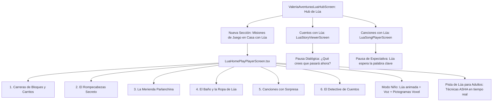

# Plan: Integración de Ideas de Juego y Estimulación ASHA dentro de «Juega con Lúa» (Aventuras con Lúa)

## Descripción del Objetivo
Integrar las actividades prácticas de estimulación del habla y el lenguaje (ASHA) **directamente en el flujo de juego pediátrico de Valeria+**, a través de **Lúa la gata** en el módulo **«Aventuras con Lúa»**, en lugar de relegarlas a un módulo teórico aislado en Academy.

Lúa se convierte en la mediadora lúdica entre la tableta y el mundo real: propone juegos con objetos cotidianos (pelotas, bloques, rompecabezas, comida, baño y libros), guía la interacción en voz alta al niño con su personalidad cercana y proporciona a la familia las técnicas clínicas exactas (espera de 5 segundos, tentaciones comunicativas, modelado sin examen y expansión) en el momento preciso en que están jugando.

---

## Decisiones de Diseño Clínico y Técnico

> [!NOTE]
> **Filosofía «Cero Pantallas Aisladas» (Zero-Screen Isolation):**
> - La app no absorbe al niño en una pantalla solitaria: **Lúa invita a jugar con el adulto en el salón o la cocina**. La tableta actúa como tablero de inspiración y temporizador lúdico, mientras la interacción humana real ocurre cara a cara.
> - Se integran las técnicas clínicas de ASHA (ingeniería ambiental, sabotaje positivo, espera de 5s, ratio comentarios/preguntas) como **«Pistas de Lúa para Jugar Juntos»**, visibles de forma accesible para el adulto sin romper la magia infantil.
> - Cumplimiento MDR Clase I y Zero-Backend: 100% offline, control humano final y refuerzo positivo inmediato.

---

## Arquitectura de la Integración en «Aventuras con Lúa»

---

## Propuesta de Contenido

### Sección: «Misiones de Juego en Casa con Lúa» (Juegos en Familia)

1. 🏎️ **Carreras de Bloques y Carritos** (Turnos rodando, rampa de cartón, torre que cae, pausa de expectativa para pedir «más»).
2. 🧩 **El Rompecabezas Secreto** (Piezas en bolsa/calcetín, esconder piezas a la vista, sostener cerca de la cara, ofrecer opciones «¿perro o gato?»).
3. 🍎 **La Merienda Parlanchina** (Nombrar alimentos/cubiertos, texturas/sabores, tentación comunicativa: «olvidar» la cuchara).
4. 🛁 **El Baño y la Ropa de Lúa** (Partes del cuerpo, prendas de color, «olvidar» abrir la llave del agua, repetición contextualizada).
5. 🎶 **Canciones con Sorpresa** (Pausa antes de la palabra/gesto clave, elegir canción con objeto, canciones motoras).
6. 📖 **El Detective de Cuentos** (Nombrar y señalar dibujos, comentar más allá del texto, adivinar qué pasará).

**Cada misión contiene:**
- **Para el niño**: Lúa en píxel art animada, locución corta y alegre en voz de Lúa (*«¡Vamos a construir una torre gigante! ¿Listo? ¡Pon un bloque!»*), y pictogramas visuales interactivos.
- **Para el adulto («Pistas de Lúa»)**: Desplegable rápido con las técnicas de modelado ASHA (comenta en vez de evaluar, espera 5 segundos, expande añadiendo una palabra).

---

## Mejoras en Módulos Existentes de Lúa

### 1. En «Cuentos con Lúa» (`LuaStoryViewerScreen.tsx`)
- Incorporar la técnica de **Lectura Dialógica Interactiva**: a mitad del cuento o antes del desenlace, Lúa hace una pausa animada con el mensaje:
  *«¿Qué crees que pasará ahora?»* con opciones visuales o botón de continuar para incentivar que el niño anticipe y converse con el adulto antes de seguir.

### 2. En «Canciones con Lúa» (`LuaSongPlayerScreen.tsx`)
- Añadir el botón/modo **«Pausa de Expectativa»**: Lúa se detiene con mirada expectante justo antes de la última palabra o rima del verso, dando tiempo a que el niño la complete con voz o gesto antes de que continúe la música.

---

## Cambios Propuestos por Componente

### Componente 1: Catálogos de Juego de Lúa (`src/AventurasLua/Catalog/`)
- `src/AventurasLua/Catalog/LuaHomePlayCatalog.ts`: Catálogo tipado con las 6 misiones cotidianas, materiales del hogar, pistas clínicas ASHA y pictogramas asociados.
- `src/AventurasLua/index.ts`: Exportación del catálogo y actualización del contador global `LUA_ACTIVITY_COUNT`.

### Componente 2: Pantallas de Aventuras con Lúa (`src/AventurasLua/Screens/`)
- `src/AventurasLua/Screens/LuaHomePlayPlayerScreen.tsx`: Pantalla interactiva pediátrica (>= 56 dp) con Lúa animada, locución, tarjetas de retos y tarjeta para padres.
- `src/AventurasLua/Screens/ValeriaAventurasLuaHubScreen.tsx`: Tarjeta y sección destacada de «Juega en Casa con Lúa» conectada al selector de edad.
- `src/AventurasLua/Screens/LuaStoryViewerScreen.tsx`: Pausa dialógica interactiva en cuentos.
- `src/AventurasLua/Screens/LuaSongPlayerScreen.tsx`: Pausa de expectativa en canciones.

### Componente 3: Internacionalización (`src/i18n/`)
- Cadenas en `strings.es.ts` y `strings.en.ts` para títulos, consignas y pistas de Lúa.

### Componente 4: Documentación Clínica (`docs/`)
- `docs/guia-asha-juegos-con-lua-en-casa.md`: Guía canónica de referencia para el equipo médico y auditorías.

---

## Plan de Verificación

### Pruebas Automatizadas
1. `npm run typecheck`: 0 errores de TypeScript.
2. `node scripts/check-ui-strings.js` y `node scripts/check-ui-lang-fallback.js`: 0 errores.
3. `node scripts/verify-aventuras-lua.js`: Integridad del catálogo de Lúa.

### Verificación Manual
1. Hub de Lúa: Comprobar la nueva sección «Juega en Casa con Lúa» y el filtrado por edad.
2. Misión de Juego: Comprobar locución de Lúa, animación y pistas clínicas para adultos.
3. Cuentos y Canciones: Comprobar la pausa dialógica y la pausa de expectativa.
