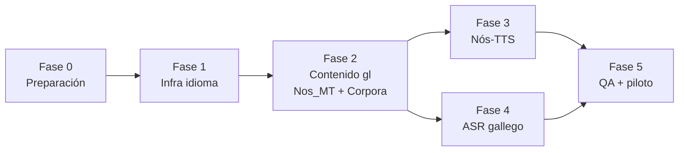

# Plan de integración · Proxecto Nós → Valeria+ (versión en gallego)

> **Documento de planificación y plan de trabajo.** Define cómo incorporar los
> recursos abiertos del [Proxecto Nós](https://github.com/proxectonos) para crear
> una versión en gallego de los ejercicios de Valeria+, avanzando por **fases
> modulares e independientes**: cada fase deja la app funcional y publicable.
>
> Estado: 📋 planificación · Rama de trabajo: `claude/proxecto-nos-gallego-h78v0y`

---

## Índice

- [1. Objetivo y alcance](#1-objetivo-y-alcance)
- [2. Recursos del Proxecto Nós a integrar](#2-recursos-del-proxecto-nós-a-integrar)
- [3. Principios de diseño](#3-principios-de-diseño)
- [4. Arquitectura objetivo](#4-arquitectura-objetivo)
- [5. Plan de trabajo por fases](#5-plan-de-trabajo-por-fases)
  - [Fase 0 · Preparación y decisiones](#fase-0--preparación-y-decisiones)
  - [Fase 1 · Infraestructura de idioma](#fase-1--infraestructura-de-idioma)
  - [Fase 2 · Contenido en gallego (Nos_MT + Corpora)](#fase-2--contenido-en-gallego-nos_mt--corpora)
  - [Fase 3 · Voces Nós-TTS](#fase-3--voces-nós-tts)
  - [Fase 4 · ASR en gallego](#fase-4--asr-en-gallego)
  - [Fase 5 · QA, piloto y cierre](#fase-5--qa-piloto-y-cierre)
- [6. Roadmap resumido](#6-roadmap-resumido)
- [7. Riesgos y mitigaciones](#7-riesgos-y-mitigaciones)
- [8. Seguimiento](#8-seguimiento)

---

## 1. Objetivo y alcance

Crear una **versión en gallego de los cuatro bloques de terapia** de Valeria+
(Pares Mínimos, Expansión Semántica, Audición y Lenguaje) apoyándose en los
recursos abiertos del Proxecto Nós, sin romper la experiencia castellana actual
ni el principio offline-first de la app.

**Dentro del alcance**

- Ajuste de idioma por paciente (`es` / `gl`) en la ficha de registro.
- Contenido de ejercicios en gallego: banco de pares mínimos gallego diseñado
  ad hoc, expansión semántica, consignas de Audición/Lenguaje y Test de Ling.
- Locución en gallego con las voces neuronales de **Nós-TTS** (audio
  pre-generado y empaquetado).
- Reconocimiento de voz en gallego (nativo del sistema donde exista;
  **Wav2Vec2 + modelo de lengua de Nós** como vía avanzada).
- Uso de **Nos_MT** (es↔gl) como acelerador de traducción con revisión humana.
- Uso de **Corpora y frases CC0** como material de apoyo léxico.

**Fuera del alcance (por ahora)**

- Interfaz de la app (menús, botones) en gallego: la UI sigue en castellano;
  solo el **contenido terapéutico** (lo que se locuta, muestra y evalúa) pasa a
  gallego. Se puede abordar después como fase propia de i18n de UI.
- Otras lenguas (catalán, euskera…): la arquitectura de la Fase 1 las deja
  preparadas, pero no se implementan.

## 2. Recursos del Proxecto Nós a integrar

| Recurso | Qué es | Uso en Valeria+ | Licencia |
| --- | --- | --- | --- |
| **Nós-TTS** ([tts.nos.gal](https://tts.nos.gal), modelos VITS en [Hugging Face](https://huggingface.co/proxectonos): Celtia, Sabela, Icía, Paulo, Iago) | Síntesis de voz neural en gallego | Generar en build-time los audios de todas las consignas gallegas y empaquetarlos como assets | Abiertas (ver ficha de cada modelo) |
| **ASR gallego** (Wav2Vec2 + modelo de lengua, en Hugging Face) | Reconocimiento de voz en gallego | Juegos de micrófono cuando el reconocedor del sistema no soporte gl-ES | Abierta |
| **Nos_MT** (OpenNMT es↔gl) | Traducción automática neural | Primera pasada de traducción de consignas, misiones y cápsulas TPR; siempre con revisión humana | Abierta |
| **Corpora + frases CC0** ([proxectonos/corpora](https://github.com/proxectonos/corpora), `nos_gl_CC0`) | Corpus de texto y voz en gallego | Material de referencia léxica para redactar contenido nuevo y validar frecuencia/naturalidad de las palabras elegidas | CC / CC0 |

Todas las licencias son compatibles con el uso en Valeria+. La Fase 0 incluye
la tarea de documentar los créditos exigidos por cada modelo (p. ej. atribución
de la voz utilizada) en la pantalla de créditos.

## 3. Principios de diseño

1. **Offline-first se mantiene.** Ningún ejercicio puede depender de un
   servidor en tiempo de sesión. Los modelos de Nós (Python/servidor) se usan
   en **build-time** (generación de audio, traducción) o se portan a
   on-device; nunca como dependencia en vivo, salvo módulos opcionales
   claramente degradables.
2. **El adulto sigue siendo el juez final.** Igual que hoy: si el ASR gallego
   no está disponible, la pantalla oculta el juego de micrófono y el adulto
   valora con botones. Ninguna fase puede romper esta degradación.
3. **Traducir no es adaptar.** El material clínico (pares mínimos,
   aproximaciones fonéticas de `stt_expected_array`) se **rediseña** para la
   fonología gallega (gheada, seseo, sistema de sibilantes, vocales medias);
   Nos_MT solo acelera el texto narrativo. Toda salida de MT pasa por revisión
   de una persona logopeda gallegohablante antes de entrar en `main`.
4. **Modularidad real.** Cada fase termina con la app compilando, los dos
   idiomas funcionando y un entregable demostrable. Se puede pausar el
   proyecto al final de cualquier fase sin dejar nada a medias.
5. **Fuente única por idioma.** El contenido vive en ficheros de datos
   paralelos por idioma con la **misma interfaz TypeScript**; las pantallas no
   saben en qué idioma trabajan, solo consumen el dataset que les inyecta la
   capa de idioma.

## 4. Arquitectura objetivo

```
src/
  valeriaLocale.ts            ← NUEVO: tipo Lang ('es'|'gl'), contexto/selector
  data/
    es/                       ← datos actuales, movidos sin cambios
      minimalPairs.ts           (hoy src/valeriaMinimalPairs.ts)
      semanticExpansion.ts      (hoy src/valeriaSemanticExpansion.ts)
      exerciseMeta.ts           (hoy src/valeriaExerciseMeta.ts)
      lingTest.ts               (consignas del Test de Ling)
    gl/                       ← NUEVO: mismas interfaces, contenido gallego
      minimalPairs.ts           (banco ad hoc, no traducido)
      semanticExpansion.ts
      exerciseMeta.ts
      lingTest.ts
    index.ts                  ← getContent(lang) → dataset tipado
  valeriaVoice.ts             ← speak/listen reciben lang; puntuación de voces
                                gl-* además de es-*; fallback a audio empaquetado
  valeriaAudioBank.ts         ← NUEVO (Fase 3): reproduce mp3 pregenerados
                                (expo-av) indexados por id de consigna
assets/
  audio/gl/…                  ← NUEVO (Fase 3): mp3 generados con Nós-TTS
scripts/
  nos-tts-generate.py         ← NUEVO (Fase 3): recorre los datasets gl,
                                sintetiza cada tts_string con Nós-TTS y
                                escribe assets/audio/gl + manifiesto JSON
  nos-mt-translate.py         ← NUEVO (Fase 2): pasada inicial es→gl con
                                Nos_MT para el texto narrativo (salida a
                                revisión, nunca directa al repo)
```

Decisiones de arquitectura clave:

- **Idioma por paciente, no global**: el campo `language` se guarda en la
  ficha del paciente (y en Firestore si hay backend), porque un mismo
  dispositivo puede atender pacientes en distintas lenguas.
- **Audio pregenerado antes que TTS on-device para gallego**: todo lo que la
  app locuta es un conjunto **finito y fijo** de cadenas, así que la voz
  Celtia de Nós-TTS se ejecuta una sola vez por release en un script de
  build. Calidad máxima, cero servidor, funciona en Expo Go y web. El TTS del
  sistema (`expo-speech` con voz gl-ES si existe) queda como fallback para
  cadenas dinámicas.
- **ASR por capas**: (1) reconocedor del sistema con `gl-ES` donde exista
  (Android/Google); (2) aproximación con `es-ES` + `stt_expected_array`
  gallego adaptado al reconocedor castellano (iOS); (3) Wav2Vec2 de Nós
  on-device como módulo opcional avanzado.

## 5. Plan de trabajo por fases

Convención de tareas: `GL-<fase>.<n>`. Cada tarea indica **Entregable** y
**Criterio de aceptación (CA)**. Las fases son secuenciales; las tareas dentro
de una fase pueden paralelizarse salvo dependencia indicada.

---

### Fase 0 · Preparación y decisiones

*Objetivo: cerrar decisiones y dejar el terreno listo. Sin código de producto.*

| Tarea | Descripción | Entregable / CA |
| --- | --- | --- |
| **GL-0.1** | Auditar licencias y créditos de los modelos Nós que usaremos (voz TTS elegida, ASR, MT, corpora) y documentar la atribución requerida | Sección de créditos redactada; CA: sabemos qué texto legal va en `ValeriaCreditsScreen` |
| **GL-0.2** | Elegir la voz Nós-TTS (propuesta: **Celtia**, la de mayor corpus) escuchando muestras con consignas reales de la app | Decisión registrada en este documento; CA: audio de muestra aprobado |
| **GL-0.3** | Contactar/confirmar persona revisora logopeda gallegohablante para las Fases 2–5 | CA: revisor confirmado y flujo de revisión acordado (documento compartido o PRs) |
| **GL-0.4** | Verificar soporte real de `gl-ES` en dispositivos objetivo: voces TTS del sistema (Android/iOS) y ASR del sistema (`@react-native-voice`) | Tabla de soporte por plataforma en `docs/`; CA: sabemos qué capa de ASR toca a cada plataforma |

**Salida de fase:** decisiones cerradas; ningún cambio de comportamiento en la app.

---

### Fase 1 · Infraestructura de idioma

*Objetivo: la app soporta `es`/`gl` de extremo a extremo con el contenido
gallego aún vacío (placeholder). Es la fase que desbloquea todas las demás.*

| Tarea | Descripción | Entregable / CA |
| --- | --- | --- |
| **GL-1.1** | Crear `src/valeriaLocale.ts` (tipo `Lang`, contexto React, persistencia) y añadir el selector de idioma a `ValeriaFichaRegistroScreen` + campo en Firestore (`firestoreService`) | CA: se crea un paciente `gl` y el ajuste persiste y viaja con la ficha |
| **GL-1.2** | Mover los datos actuales a `src/data/es/` sin cambios de contenido y crear `src/data/index.ts` con `getContent(lang)` tipado | CA: la app en castellano funciona exactamente igual (regresión cero) |
| **GL-1.3** | Crear `src/data/gl/` con las mismas interfaces y contenido provisional mínimo (1 par mínimo, 1 escenario) para probar el cableado | CA: con paciente `gl` la app muestra el contenido gallego provisional |
| **GL-1.4** | Parametrizar `valeriaVoice.ts`: `LANG` deja de ser constante; `speakToChild`/ASR reciben el idioma; `scoreVoice` puntúa también voces `gl-*` (prioridad `gl-ES` > es-ES como fallback) | CA: con paciente `gl` y una voz gl-ES instalada, la app la usa; sin ella, cae a es-ES sin errores |
| **GL-1.5** | Propagar el idioma del paciente a todas las pantallas de terapia (pares, expansión, audición, lenguaje, Ling) vía la capa de idioma | CA: ninguna pantalla importa datos `es` directamente; todo pasa por `getContent(lang)` |

**Salida de fase:** app bilingüe funcional con contenido gallego de muestra.
**Depende de:** Fase 0 (GL-0.4 para GL-1.4).

---

### Fase 2 · Contenido en gallego (Nos_MT + Corpora)

*Objetivo: todo el contenido terapéutico existe en gallego revisado. Es la fase
más larga; se subdivide por bloque de terapia para poder publicar por partes.*

| Tarea | Descripción | Entregable / CA |
| --- | --- | --- |
| **GL-2.1** | Script `scripts/nos-mt-translate.py`: extrae las cadenas narrativas de los datasets `es` (prompts, celebraciones, misiones, `parent_tpr_action`) y produce una pasada es→gl con Nos_MT en un fichero de revisión (CSV/MD), nunca directo al repo | CA: fichero de revisión generado con original + propuesta MT + columna de revisión |
| **GL-2.2** | **Banco de pares mínimos gallego (ad hoc, NO traducido)**: diseñar ~10 pares para los errores frecuentes en gallego (rotacismo *ra/lá*, gheada, seseo/sibilantes, velares), con el mismo principio detector (el error habitual produce la otra palabra del par) | `src/data/gl/minimalPairs.ts` + `docs/protocolo-pares-minimos-gl.md`; CA: revisión logopédica aprobada |
| **GL-2.3** | Expansión semántica en gallego: escenarios, progresiones y cápsulas TPR. Texto narrativo vía GL-2.1 revisado; `stt_expected_array` **rediseñado** con aproximaciones fonéticas propias del gallego infantil; léxico validado contra los corpora Nós (frecuencia/naturalidad) | `src/data/gl/semanticExpansion.ts`; CA: revisión logopédica aprobada |
| **GL-2.4** | Audición (13 terapias) y Lenguaje (7 terapias): metadatos y consignas en gallego (los ejercicios de morfosintaxis —plural, género— se adaptan a la gramática gallega, no se traducen literalmente) | `src/data/gl/exerciseMeta.ts` + consignas; CA: revisión aprobada |
| **GL-2.5** | Test de Ling en gallego (consignas alrededor de los 6 sonidos) | `src/data/gl/lingTest.ts`; CA: revisión aprobada |
| **GL-2.6** | Incorporar frases CC0 de `nos_gl_CC0` como banco auxiliar donde el ejercicio pida frases modelo | CA: origen CC0 documentado en el fichero de datos |

**Salida de fase:** app completa en gallego locutada por el TTS del sistema
(voz gl si existe). **Depende de:** Fase 1. GL-2.2 no depende de GL-2.1.

---

### Fase 3 · Voces Nós-TTS

*Objetivo: el gallego suena con la voz neural de Nós, empaquetada, sin servidor.*

| Tarea | Descripción | Entregable / CA |
| --- | --- | --- |
| **GL-3.1** | Script `scripts/nos-tts-generate.py`: recorre los datasets `gl`, sintetiza cada cadena locutable con el modelo elegido (GL-0.2), normaliza volumen y escribe `assets/audio/gl/<hash>.mp3` + `manifest.json` (id de cadena → fichero) | CA: script reproducible documentado; regenerar solo produce diffs de las cadenas cambiadas (nombres por hash de contenido) |
| **GL-3.2** | Módulo `src/valeriaAudioBank.ts`: dado (lang, cadena/id) reproduce el mp3 del manifiesto con `expo-av`; API compatible con `speakToChild` | CA: prueba unitaria de resolución de manifiesto |
| **GL-3.3** | Integrar en `valeriaVoice.ts`: para `gl`, orden de preferencia audio empaquetado → voz sistema gl → voz sistema es. Cadenas dinámicas (nombre del niño, etc.) siguen por TTS del sistema | CA: sesión completa en gallego suena con la voz Nós; sin el asset, degrada sin silencio |
| **GL-3.4** | Medir impacto en el tamaño de la app y, si excede el presupuesto (~orientativo: >25 MB de audio), evaluar OPUS/AAC a menor bitrate o assets descargables de EAS | Nota de tamaño en este documento; CA: build EAS dentro del presupuesto |
| **GL-3.5** | Añadir créditos de la voz Nós-TTS a `ValeriaCreditsScreen` (según GL-0.1) | CA: atribución visible en la app |

**Salida de fase:** experiencia gallega con voz de calidad neural, offline.
**Depende de:** Fase 2 (necesita las cadenas finales revisadas).

---

### Fase 4 · ASR en gallego

*Objetivo: los juegos de micrófono funcionan en gallego en el máximo de
dispositivos, con la degradación elegante de siempre.*

| Tarea | Descripción | Entregable / CA |
| --- | --- | --- |
| **GL-4.1** | Capa 1 — ASR del sistema: pasar `gl-ES` a `@react-native-voice` donde el sistema lo soporte (según tabla GL-0.4) | CA: en un Android con gl-ES, el juego de voz reconoce en gallego |
| **GL-4.2** | Capa 2 — aproximación es-ES (iOS y equipos sin gl): validar por dispositivo real que los `stt_expected_array` gallegos incluyen lo que el reconocedor castellano devuelve al oír gallego, y ajustarlos | CA: tasa de captura aceptable en pruebas con hablante gallego (registro de pruebas en docs) |
| **GL-4.3** | *Spike* (investigación acotada): viabilidad del **Wav2Vec2 + LM de Nós** on-device (export a ONNX/CTC + sherpa-onnx o whisper.cpp equivalente): tamaño, latencia en gama media, esfuerzo de integración en Expo (módulo nativo) | Informe corto con recomendación go/no-go; CA: decisión tomada y registrada |
| **GL-4.4** | (Solo si GL-4.3 = go) Integrar el ASR Nós on-device como módulo nativo opcional, detrás de `asrSupported()` | CA: reconocimiento gallego nativo en iOS/Android sin conexión |

**Salida de fase:** micrófono en gallego operativo por capas.
**Depende de:** Fase 2 (los `stt_expected_array` finales); independiente de la Fase 3.

---

### Fase 5 · QA, piloto y cierre

| Tarea | Descripción | Entregable / CA |
| --- | --- | --- |
| **GL-5.1** | Pasada QA bilingüe completa: matriz pantalla × idioma × plataforma (Android, iOS, Expo Go, web), incluidas degradaciones sin micrófono y sin assets | Checklist QA en docs; CA: sin regresiones en castellano |
| **GL-5.2** | Telemetría: etiquetar sesiones con el idioma para poder comparar resultados es/gl en el panel | CA: el dashboard filtra o distingue por idioma |
| **GL-5.3** | Mini-piloto con 2–3 familias gallegohablantes y la persona logopeda revisora | Informe de piloto; CA: feedback triado en tareas |
| **GL-5.4** | Actualizar README (sección bilingüe), protocolos en docs y historial de versiones | CA: documentación al día |

**Depende de:** Fases 3 y 4.

## 6. Roadmap resumido



| Fase | Recurso Nós protagonista | Tamaño relativo | Publicable al terminar |
| --- | --- | --- | --- |
| 0 · Preparación | — (licencias, decisiones) | S | Sí (sin cambios) |
| 1 · Infra idioma | — | M | Sí |
| 2 · Contenido | **Nos_MT + Corpora/CC0** | L (por bloques) | Sí, bloque a bloque |
| 3 · Voz | **Nós-TTS** | M | Sí |
| 4 · Micrófono | **ASR Wav2Vec2 + LM** | M (L si GL-4.4) | Sí |
| 5 · QA/piloto | — | M | Sí (cierre) |

## 7. Riesgos y mitigaciones

| Riesgo | Impacto | Mitigación |
| --- | --- | --- |
| MT sin revisión introduce gallego artificial o castellanismos en material clínico | Alto | Regla dura: nada de Nos_MT entra al repo sin revisión logopédica (GL-0.3); los pares mínimos ni siquiera pasan por MT (GL-2.2) |
| iOS sin ASR ni TTS de sistema en gallego | Medio | TTS: resuelto con audio pregenerado (F3). ASR: capa es-ES (GL-4.2) + spike on-device (GL-4.3); mientras tanto, valoración por botones del adulto |
| Peso de los assets de audio | Medio | Hash por contenido para regenerar solo lo cambiado; compresión OPUS/AAC; presupuesto y plan B en GL-3.4 |
| Variación dialectal (gheada, seseo) hace que un par "correcto" penalice la variedad del niño | Alto (clínico) | Marcar pares dependientes de variedad con un campo `region` (ya existe el patrón en el banco castellano) y dejar seleccionar la variedad en la ficha |
| Cambios upstream en los modelos Nós (HF) | Bajo | Fijar revisiones/commits concretos de los modelos en los scripts; los assets generados viven en el repo/EAS, no se regeneran en cada build |

## 8. Seguimiento

Checklist maestro (marcar al completar; una PR por tarea o grupo pequeño):

- [ ] **Fase 0**: GL-0.1 · GL-0.2 · GL-0.3 · GL-0.4
- [ ] **Fase 1**: GL-1.1 · GL-1.2 · GL-1.3 · GL-1.4 · GL-1.5
- [ ] **Fase 2**: GL-2.1 · GL-2.2 · GL-2.3 · GL-2.4 · GL-2.5 · GL-2.6
- [ ] **Fase 3**: GL-3.1 · GL-3.2 · GL-3.3 · GL-3.4 · GL-3.5
- [ ] **Fase 4**: GL-4.1 · GL-4.2 · GL-4.3 · GL-4.4 (condicional)
- [ ] **Fase 5**: GL-5.1 · GL-5.2 · GL-5.3 · GL-5.4

Reglas de trabajo:

1. Cada tarea referencia su código `GL-x.y` en el mensaje de commit.
2. Una fase no se da por cerrada hasta pasar su criterio de aceptación y
   comprobar **regresión cero en castellano**.
3. Este documento es la fuente única del plan: cualquier cambio de alcance se
   edita aquí en la misma PR que lo introduce.
