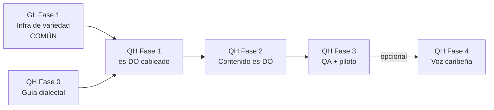

# Plan de integración · Quisqueya Habla (español dominicano, es-DO)

> **Documento de planificación y plan de trabajo.** Define cómo crear la
> variante **dominicana** de los ejercicios de Valeria+ (proyecto *Quisqueya
> Habla*), reutilizando la infraestructura de idioma del
> [plan gallego / Proxecto Nós](./plan-integracion-proxecto-nos.md) y recursos
> abiertos del ecosistema del español latinoamericano.
>
> Estado: 📋 planificación · Rama de trabajo: `claude/proxecto-nos-gallego-h78v0y`

---

## Índice

- [1. Objetivo y enfoque](#1-objetivo-y-enfoque)
- [2. Diferencia clave con el plan gallego](#2-diferencia-clave-con-el-plan-gallego)
- [3. Recursos externos a utilizar](#3-recursos-externos-a-utilizar)
- [4. Fundamento clínico-dialectal](#4-fundamento-clínico-dialectal)
- [5. Arquitectura objetivo](#5-arquitectura-objetivo)
- [6. Plan de trabajo por fases](#6-plan-de-trabajo-por-fases)
- [7. Roadmap y coordinación con el plan gallego](#7-roadmap-y-coordinación-con-el-plan-gallego)
- [8. Riesgos y mitigaciones](#8-riesgos-y-mitigaciones)
- [9. Seguimiento](#9-seguimiento)

---

## 1. Objetivo y enfoque

Crear la variante **es-DO (español dominicano)** de los cuatro bloques de
terapia de Valeria+ (Pares Mínimos, Expansión Semántica, Audición y Lenguaje)
bajo la marca *Quisqueya Habla*, de forma que:

- El contenido use el **léxico y registro dominicanos** (guagua, chichigua,
  funda…) y consignas naturales para las familias de RD.
- La evaluación fonológica **no penalice como trastorno los rasgos
  dialectales normales** del español caribeño (seseo, aspiración de /s/,
  neutralización de líquidas).
- Se reutilice al máximo lo ya construido: misma app, misma arquitectura de
  datos por variedad, mismos principios (offline-first, el adulto como juez
  final).

**Dentro del alcance:** datasets `es-DO` completos, ajuste de variedad en la
ficha del paciente, validación del ASR/TTS del sistema con locale dominicano,
y (opcional, fase final) una voz caribeña pregenerada.

**Fuera del alcance:** cambios de UI/marca (pantallas propias de Quisqueya
Habla, iconografía), otras variedades latinoamericanas (la arquitectura queda
preparada), y cualquier modelo servidor en tiempo de sesión.

## 2. Diferencia clave con el plan gallego

| | Gallego (Proxecto Nós) | Dominicano (Quisqueya Habla) |
| --- | --- | --- |
| Problema | **De idioma**: el sistema apenas trae TTS/ASR en gallego | **De variedad**: TTS/ASR en español ya existen y son buenos |
| TTS | Hay que pregenerar audio con Nós-TTS (Fase 3 GL) | Voces del sistema es-US/es-MX sirven desde el día 1; voz caribeña propia es *opcional* |
| ASR | Por capas, con spike on-device | El reconocedor de Android soporta **es-DO** nativo; iOS con es-MX/es-US capta bien el habla caribeña |
| MT | Nos_MT como acelerador es→gl | No aplica: el trabajo es **editorial** (adaptación léxica), no de traducción |
| Esfuerzo dominante | Modelos + contenido | **Casi todo contenido y revisión logopédica** |

Conclusión: Quisqueya Habla es un proyecto **más ligero** — no necesita
equivalentes de las Fases 3 y 4 gallegas para lanzar. Su camino crítico es el
diseño clínico del contenido.

## 3. Recursos externos a utilizar

| Recurso | Qué aporta | Uso |
| --- | --- | --- |
| **Locales del sistema** (`es-DO` en Android, es-MX/es-US en iOS) | ASR y TTS neurales gratuitos y offline | Base de voz y micrófono desde la Fase 1 |
| **Corpus puertorriqueño de Google** ([OpenSLR 74](https://www.openslr.org/74/)) y [colección LatAm de Google](https://aclanthology.org/2020.lrec-1.801.pdf) | El corpus abierto de voz más cercano al acento dominicano | Referencia acústica; material de entrenamiento si en la Fase 4 se construye voz propia |
| **CORPES XXI (RAE) / Common Voice es** | Frecuencia léxica y naturalidad | Validar la selección de palabras del contenido es-DO |
| **F5-Spanish / Piper / MeloTTS** (Hugging Face) | TTS abierto en español; F5 permite clonación con pocos minutos de audio | Fase 4 opcional: voz con acento dominicano pregenerada (misma mecánica que la Fase 3 gallega) |
| **Diccionario del español dominicano (ACADOM)** y bibliografía de fonología caribeña | Autoridad léxica y dialectal | Guía editorial y clínica del contenido |

No existe corpus abierto específicamente dominicano: es un hueco real. Si el
piloto genera grabaciones con consentimiento, evaluar aportarlas a Common
Voice (misma filosofía que las frases CC0 del Proxecto Nós).

## 4. Fundamento clínico-dialectal

Regla de oro del proyecto: **rasgo dialectal ≠ error terapéutico**. Los
fenómenos del español dominicano que condicionan el diseño:

1. **Seseo universal**: no existe contraste /s/–/θ/. El par `casa/caza`
   (PM-5, marcado `region: 'distincion'`) queda excluido; el mecanismo de
   campo `region` ya existente en `valeriaMinimalPairs.ts` es el que se
   reutiliza y amplía.
2. **Neutralización de líquidas r→l** ("puelta", "señol") en coda silábica:
   es rasgo dialectal normal. Los pares de rotacismo deben construirse sobre
   posiciones donde la distinción sí es estable en RD (ataque silábico:
   *rana/lana* sigue siendo válido) y **nunca** sobre codas.
3. **Aspiración/elisión de /s/ final** ("lo niño"): los
   `stt_expected_array` deben aceptar las realizaciones sin /s/ como válidas;
   los ejercicios de plural (MS-1) se evalúan por el artículo/determinante,
   no por la -s final.
4. **Elisión de /d/ intervocálica** ("dedo→deo", "helado→helao"): añadir las
   aproximaciones a los arrays de aceptación.
5. **Léxico**: sustituir las entradas peninsulares por las dominicanas
   naturales en los escenarios de vida diaria (guagua, chichigua, funda,
   colmado…), validando frecuencia infantil con el revisor.

Cada dataset es-DO documenta en cabecera qué decisión dialectal aplica, igual
que hace el banco castellano con sus comentarios clínicos.

## 5. Arquitectura objetivo

Se apoya en la infraestructura de la **Fase 1 gallega** (GL-1.x), generalizada
de "idioma" a "variedad":

```
src/
  valeriaLocale.ts            ← Lang pasa a variedad: 'es' | 'gl' | 'es-DO'
                                (el tipo y getContent() se diseñan abiertos
                                en GL-1.x para que añadir 'es-DO' sea trivial)
  data/
    es/                       ← castellano peninsular (actual)
    gl/                       ← gallego (plan Nós)
    es-DO/                    ← NUEVO: Quisqueya Habla
      minimalPairs.ts           (banco rediseñado, ver §4)
      semanticExpansion.ts      (léxico dominicano)
      exerciseMeta.ts           (consignas adaptadas)
      lingTest.ts
  valeriaVoice.ts             ← ya parametrizado en GL-1.4; para es-DO se
                                pasa locale es-DO al ASR y se ajusta el
                                scoring de voces (es-US/es-MX ≥ es-ES)
assets/
  audio/es-DO/…               ← SOLO Fase 4 opcional (voz caribeña propia)
```

Decisiones clave:

- **es-DO es una variedad hermana, no un fork**: mismas interfaces
  TypeScript, mismas pantallas, cero duplicación de lógica.
- **Voz del sistema primero**: a diferencia del gallego, no se pregenera
  audio para lanzar; `scoreVoice` con preferencia es-US/es-MX cuando la
  variedad del paciente es es-DO.
- **ASR del sistema primero**: locale `es-DO` en Android; es-MX/es-US en
  iOS. La tolerancia dialectal vive en los `stt_expected_array`, donde ya
  vive hoy la tolerancia evolutiva.

## 6. Plan de trabajo por fases

Convención de tareas: `QH-<fase>.<n>`. Mismas reglas que el plan gallego
(entregable + criterio de aceptación, fases publicables, regresión cero en
las variedades ya existentes).

---

### Fase 0 · Preparación y fundamento clínico

| Tarea | Descripción | Entregable / CA |
| --- | --- | --- |
| **QH-0.1** | Confirmar persona revisora logopeda dominicana (o con experiencia en español caribeño) y flujo de revisión | CA: revisor confirmado |
| **QH-0.2** | Redactar la **guía dialectal clínica** (§4 ampliado): qué es rasgo y qué es error por fonema/posición, con bibliografía | `docs/guia-dialectal-es-DO.md`; CA: aprobada por el revisor |
| **QH-0.3** | Verificar en dispositivos reales el soporte `es-DO`: ASR de Android con hablantes dominicanos, comportamiento de iOS con es-MX/es-US, calidad de voces TTS del sistema | Tabla de soporte en docs; CA: sabemos qué locale usar por plataforma |
| **QH-0.4** | Decidir alcance de marca: ¿Quisqueya Habla es una variedad dentro de Valeria+ o una app aparte (mismo código, otro `app.json`/EAS profile)? | Decisión registrada aquí; CA: implicaciones de build documentadas |

**Salida de fase:** criterios clínicos y técnicos cerrados; sin cambios en la app.

---

### Fase 1 · Variedad es-DO cableada en la app

*Depende de la **Fase 1 gallega (GL-1.x)**, que construye la infraestructura.
Si Quisqueya Habla se prioriza antes que el contenido gallego, GL-1.x se
ejecuta igualmente (es infraestructura común) y solo cambia el orden del
contenido.*

| Tarea | Descripción | Entregable / CA |
| --- | --- | --- |
| **QH-1.1** | Ampliar el tipo de variedad con `'es-DO'` en `valeriaLocale.ts`, selector de la ficha y persistencia (Firestore incluido) | CA: se crea un paciente es-DO y persiste |
| **QH-1.2** | Crear `src/data/es-DO/` con contenido provisional mínimo (1 par, 1 escenario) para probar el cableado | CA: paciente es-DO ve el contenido provisional |
| **QH-1.3** | Voz y micrófono: pasar locale es-DO al ASR (Android) con fallback es-MX/es-US (iOS), y ajustar `scoreVoice` para que con variedad es-DO priorice voces es-US/es-MX sobre es-ES | CA: sesión es-DO usa voz latina y el micrófono reconoce con locale correcto |

**Salida de fase:** app tri-variedad funcional con es-DO de muestra.

> **Estado (jul 2026): Fase 1 IMPLEMENTADA.** `valeriaLocale.ts` generaliza el
> antiguo idioma de voz a variedad `'es' | 'gl' | 'es-DO'` (con migración de la
> clave anterior). La voz y el micrófono se cablean por locale: `speechLocale()`
> pasa `es-DO` al ASR/TTS del sistema y `scoreVoice` prioriza voces latinas
> (es-US/es-MX) cuando la variedad es dominicana; es-DO no usa audio
> pregenerado (`assetLang('es-DO') === null` → voz del sistema). El selector de
> la tarjeta «Voz de la app» ofrece ya las tres variedades. Pendiente el
> selector **por paciente** en la ficha con persistencia en Firestore (hoy es un
> ajuste global de dispositivo).

---

### Fase 2 · Contenido dominicano (el camino crítico)

| Tarea | Descripción | Entregable / CA |
| --- | --- | --- |
| **QH-2.1** | **Banco de pares mínimos es-DO**: partir del banco castellano, excluir pares inválidos (seseo), evitar codas líquidas, y completar hasta ~10 pares con los errores frecuentes en población infantil dominicana según la guía QH-0.2 | `src/data/es-DO/minimalPairs.ts` + `docs/protocolo-pares-minimos-es-DO.md`; CA: revisión logopédica aprobada |
| **QH-2.2** | **Expansión semántica es-DO**: escenarios con léxico dominicano (colmado, guagua…), `tts_string` en registro local y `stt_expected_array` con realizaciones caribeñas (elisión de /s/ y /d/) además de las evolutivas | `src/data/es-DO/semanticExpansion.ts`; CA: revisión aprobada |
| **QH-2.3** | Audición (13) y Lenguaje (7): consignas adaptadas; MS-1 (plural) reevaluado por determinante según §4.3 | `src/data/es-DO/exerciseMeta.ts` + consignas; CA: revisión aprobada |
| **QH-2.4** | Test de Ling con consignas es-DO | `src/data/es-DO/lingTest.ts`; CA: revisión aprobada |
| **QH-2.5** | Validación léxica: contrastar el vocabulario elegido con CORPES/Diccionario del español dominicano y registrar las fuentes en los ficheros | CA: fuentes documentadas |

**Salida de fase:** Quisqueya Habla completo con voz y ASR del sistema.
**Esta fase es publicable: con ella termina el MVP.**

> **Estado (jul 2026): QH-2.1 IMPLEMENTADA (borrador).** Banco de pares mínimos
> es-DO (`valeriaMinimalPairsEsDO.ts`, 8 pares) diseñado bajo la guía dialectal
> (`docs/guia-dialectal-es-DO.md`): sin distinción /s/–/θ/ (seseo), sin codas
> líquidas, solo procesos infantiles universales, con consignas y misiones en
> registro dominicano. Cableado por variedad (`valeriaPairBanks.pairsForLocale`)
> → un paciente en es-DO ya ve y practica su banco. Protocolo en
> `docs/protocolo-pares-minimos-es-DO.md`. **⚠️ Todo pendiente de validación
> logopédica dominicana antes del piloto.** Restan QH-2.2 (expansión semántica),
> QH-2.3 (Audición/Lenguaje), QH-2.4 (Test de Ling) y QH-2.5 (validación léxica)
> — el grueso editorial de la fase.

---

### Fase 3 · QA y piloto dominicano

| Tarea | Descripción | Entregable / CA |
| --- | --- | --- |
| **QH-3.1** | QA de la matriz pantalla × variedad × plataforma (incluye regresión de es y gl) | Checklist en docs; CA: sin regresiones |
| **QH-3.2** | Validación ASR con hablantes reales: sesión de pruebas con niños/familias dominicanas midiendo tasa de captura de los `stt_expected_array` | Registro de pruebas; CA: ajustes aplicados |
| **QH-3.3** | Telemetría etiquetada por variedad (comparte mecánica con GL-5.2) | CA: el panel distingue es/gl/es-DO |
| **QH-3.4** | Mini-piloto con 2–3 familias en RD y el revisor | Informe; CA: feedback triado |

---

### Fase 4 · Voz caribeña propia (opcional)

*Solo si el piloto muestra que la voz es-MX/es-US genera rechazo o confusión.*

| Tarea | Descripción | Entregable / CA |
| --- | --- | --- |
| **QH-4.1** | *Spike*: evaluar F5-Spanish (clonación con locutora dominicana con consentimiento y cesión), Piper y fine-tuning con OpenSLR 74; comparar calidad/esfuerzo/licencias | Informe go/no-go |
| **QH-4.2** | (Si go) Reutilizar el pipeline de la Fase 3 gallega (`nos-tts-generate.py` generalizado) para pregenerar `assets/audio/es-DO/` + manifiesto | CA: sesión es-DO suena con la voz caribeña, offline |
| **QH-4.3** | Créditos/consentimientos de la voz en `ValeriaCreditsScreen` | CA: atribución visible |

## 7. Roadmap y coordinación con el plan gallego



- La **única dependencia dura** con el plan gallego es GL-1.x (infraestructura
  común de variedad). El contenido gallego (GL-2+) y el dominicano (QH-2)
  son independientes y pueden avanzar en paralelo o en el orden que se
  priorice.
- El pipeline de audio pregenerado (GL-3.1) se diseña **generalizado por
  variedad** para que QH-4.2 lo reutilice sin reescribirlo.
- MVP de Quisqueya Habla = QH-0 + QH-1 + QH-2 (+ QA de QH-3). Sin fases de
  modelos: es el proyecto corto de los dos.

| Fase | Tamaño relativo | Publicable al terminar |
| --- | --- | --- |
| 0 · Preparación | S | Sí (sin cambios) |
| 1 · Cableado es-DO | S (la infra la pone GL-1) | Sí |
| 2 · Contenido | L | **Sí — MVP** |
| 3 · QA + piloto | M | Sí |
| 4 · Voz propia | M (opcional) | Sí |

## 8. Riesgos y mitigaciones

| Riesgo | Impacto | Mitigación |
| --- | --- | --- |
| Confundir rasgo dialectal con error clínico (falsos positivos terapéuticos) | **Alto (clínico)** | La guía dialectal QH-0.2 es bloqueante: ningún contenido es-DO entra sin ella aprobada; pares nunca sobre codas líquidas ni contraste /s/–/θ/ |
| El ASR del sistema rinde peor con habla infantil caribeña | Medio | QH-0.3 y QH-3.2 lo miden con hablantes reales; la degradación a botones del adulto ya existe |
| No hay corpus dominicano abierto para una voz propia | Medio (solo Fase 4) | OpenSLR 74 (puertorriqueño) como base + clonación F5 con locutora local; la Fase 4 es opcional y posterior al piloto |
| Deriva de alcance con la marca (¿app aparte?) | Medio | QH-0.4 fija la decisión antes de tocar código; el código de terapia es común pase lo que pase |
| Léxico "dominicano de diccionario" que las familias no usan | Medio | Validación con revisor local (QH-2.5) y piloto (QH-3.4) |

## 9. Seguimiento

- [ ] **Fase 0**: QH-0.1 · QH-0.2 · QH-0.3 · QH-0.4
- [ ] **Fase 1**: QH-1.1 · QH-1.2 · QH-1.3 *(requiere GL-1.x)*
- [ ] **Fase 2**: QH-2.1 · QH-2.2 · QH-2.3 · QH-2.4 · QH-2.5
- [ ] **Fase 3**: QH-3.1 · QH-3.2 · QH-3.3 · QH-3.4
- [ ] **Fase 4** (opcional): QH-4.1 · QH-4.2 · QH-4.3

Mismas reglas de trabajo que el plan gallego: código `QH-x.y` en los commits,
fase cerrada solo con su criterio de aceptación cumplido y regresión cero en
las demás variedades, y este documento como fuente única del plan.
